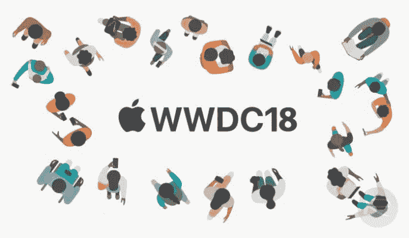

# iOS 12:移动操作系统的新革命

> 原文：<https://medium.com/hackernoon/ios-12-the-new-revolution-in-mobile-os-293c148c4bb4>

6 月 4 日，苹果公司召开了备受期待的 2018 年全球开发者大会。WWDC 充斥着关于新版 tvOS、watchOS、macOS 和最令人期待的 iOS 12 的重大公告。

**兼容性**

iOS 12 将在所有支持 iOS 11 的设备上兼容。苹果表示，将获得 iOS 12 更新的旧设备将获得巨大的性能优势，关键功能的速度提升高达 70%。这表明苹果已经从去年关于降低旧 iPhones 速度的话题中吸取了教训。

**增强现实**

苹果(和 Pixer 一起)设计了新的 USDZ 文件格式，使得与世界分享 3D 对象更加简单。还推出了 ARKit2，它为开发人员提供了出色的工具来创建出色的 AR 应用程序。它甚至包括让多个设备从不同角度看到 AR 中相同的 3D 虚拟对象的能力。

**屏幕时间**

苹果已经努力减少数字成瘾。屏幕时间会给你每周更新，告诉你如何使用你的 iPhone 或 iPad，以及你在每个应用上花了多少时间。你现在还可以为特定的应用程序设置计时器，当计时器结束时，设备会提醒你。它还有一个家长控制选项，可以帮助家长控制孩子接触屏幕的时间。

**Animoji & Memoji**

苹果的动画表情符号功能现在还可以检测舌头的运动，以便创建更真实的表情符号。现在你也可以使用 memoji 创建自己的 animoji。

**FaceTime**

FaceTime 也有了重大更新，即支持多达 32 名成员的 group FaceTime。您也可以直接从“信息”中的群组聊天创建群组 FaceTime，并将所有聊天参与者添加到群组视频通话中。最激动人心的是…现在也支持 animoji 和 memoji 直播了。

**来自#WWDC2018 主题演讲的收获**

1.  苹果 AI 还在竞争中，不会很快死掉。随着 Siri 中“快捷方式”的发布，用户可以使用它们创建自己的语音命令，苹果已经清楚地表明，即使谷歌和亚马逊遥遥领先，它仍然可以赢得人工智能竞赛。
2.  用于存储 3D 对象的新 USDZ 文件格式可以使增强现实成为市场上一个新的热门话题，并可以大大推动 AR 领域。
3.  macOS 上的 iOs 应用程序:没有。苹果仍未计划合并 macOs 和 iOS，但有了 macOS Mojave，你现在可以在 macOS 上运行一些 iOS 应用程序。
4.  macOS 不会去任何地方:最近几次 macOS 更新在新功能方面表现平平，但 macOS Mojave 改变了这一点。macOS Mojave 看起来更好，并带来了大量你会喜欢的简单而有用的功能，如黑暗模式和动态桌面。
5.  今年，苹果没有宣布任何重大的硬件改进，而是专注于软件。不能说这是一个明智的举动，因为苹果可能会在硬件竞赛中落后，就像在人工智能竞赛中一样。

开发人员和客户满意吗？？

ARKit 是一个很好的更新，将会大大推动 AR 行业的发展。但人工智能和硬件领域令人失望。当像谷歌这样的大公司宣布像谷歌双工这样的雄心勃勃的项目时，苹果没有做出任何开创性的宣布，也没有对 Siri 的[未来](https://hackernoon.com/tagged/future)展示出示范性的愿景。苹果粉丝期待一款新的更好的 MacBook Pro，但苹果让他们失望了，MacBook 现在已经变得更加引人注目，价格也比同类产品(硬件更好)高得多。但是苹果在吸取教训方面很快，并且肯定会赶上顾客的期望。