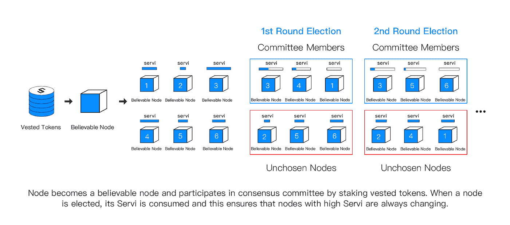
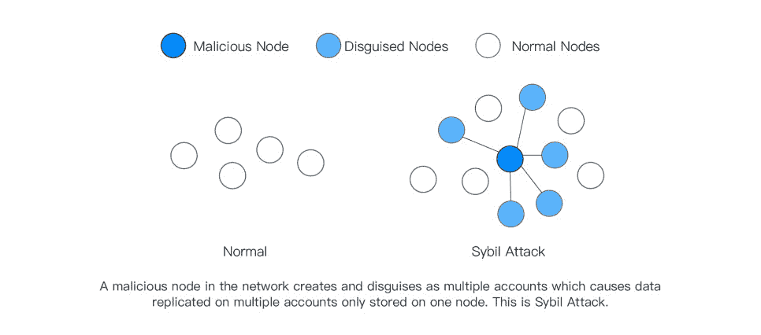
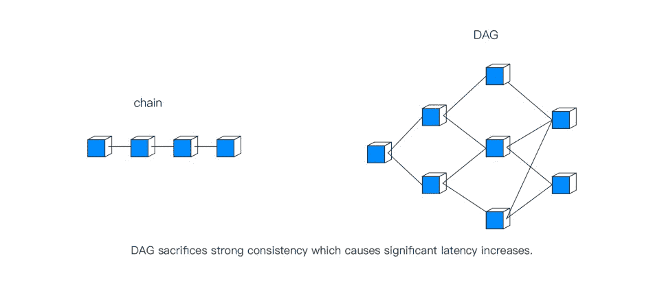
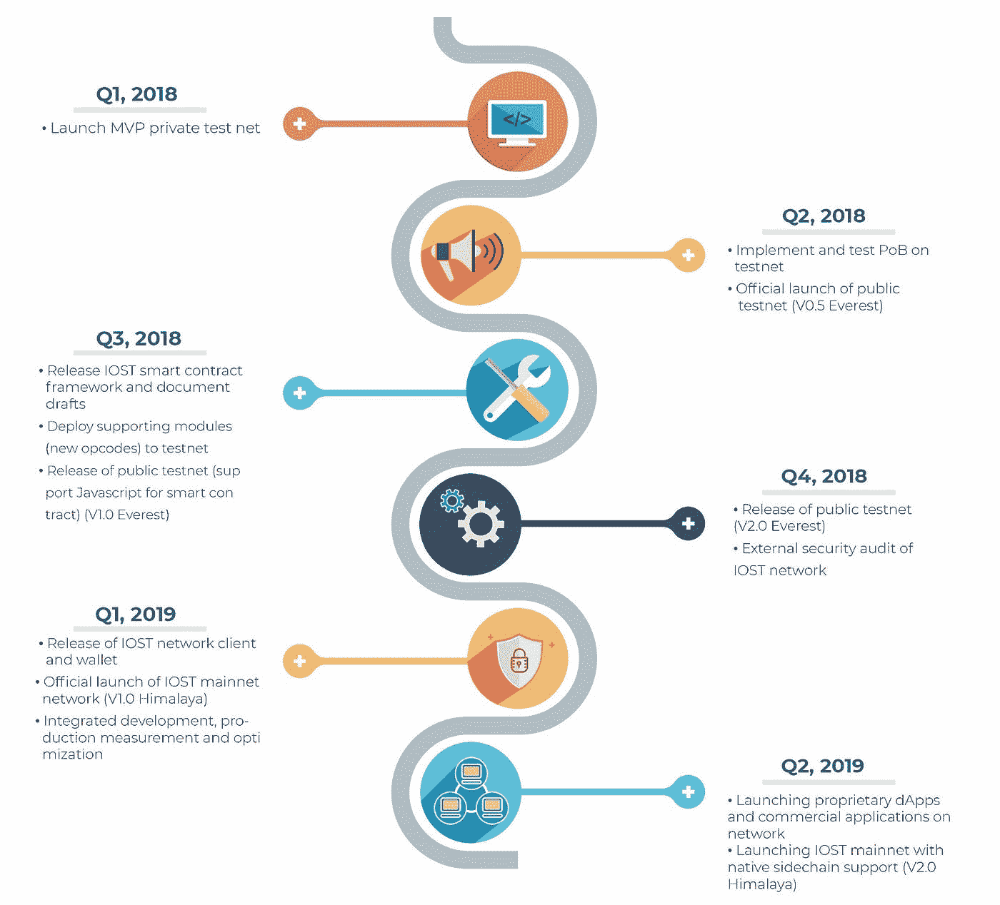

# IOST:构建更好的区块链

> 原文：<https://medium.com/hackernoon/iost-building-a-better-blockchain-d9d934c81c8d>

最近，很多人问我: [IOST](https://hackernoon.com/tagged/iost) 想实现什么

很简单——R&D 团队的目标是创建一个*更好的* [区块链](https://hackernoon.com/tagged/blockchain)应用平台。

我们希望专注于解决当前区块链技术中存在的问题，并在此过程中实施我们自己的解决方案，我们认为这是成功的区块链应用平台所必需的。

我想让大家了解一下我们在建设 IOST 时会考虑什么，谈谈我们会对他们做些什么，以及我们为什么要做这些事情。

# **1。我们选择开发的技术以及原因**

自然，第一个问题是为什么我们选择 PoB 作为我们的扩展解决方案，为什么我们要以目前的速度发展。对于所有当前的项目和研究，我们经常看到 4 种常见的可伸缩性解决方案:投票、分片、DAG 和第 2 层(通常称为“链外”)。

**什么是 PoB，为什么我们选择了 PoB**

PoB 是投票的一个分支，也是利害关系的证明。未来，我们将使用分片和离线解决方案来进一步提高我们系统的吞吐率。

值得一提的是，虽然 EOS DPoS 是相对集中的，但并不一定意味着投票是集中的，至于一些传统的共识机制，只有单个领导人才有权力在一个时间周期内产生数据。

DPoS 只是通用投票可伸缩性分支下的解决方案之一，因此我们可以在一定程度上将去中心化的程度定义为特定时间单位内块生产者的分布。我们在当前内部测试中选择的解决方案使用了第 2 层扩展解决方案。

尽管我们选择了 PoB，但是为了避免 Sybil 攻击，我们仍然在第一层使用了承诺加投票模型。实现的和安全的公共区块链是 PoW 或 PoS 的分支，哈希幂或令牌仍然是安全区块链的唯一访问机制。所有其他形式的共识仍然面临安全问题。

PoB 是 PoS 的一个分支，第一层入口需要基于令牌的认证，在成为“可信节点”并被授权参与共识之前，需要承诺令牌并积累一定数量的认证令牌。

第二层是 PoB 的核心，因为正是在这一层选举产生了生产区块委员会。在这一层，我们将实现两个目标:

1.  委员会将强制实施快速转型，以实现更好的分权。
2.  我们将鼓励节点通过友好竞争为网络做出贡献。

为了实现这些目标，每个可信节点都将获得一个信誉分数——“Servi”。Servi 只能通过验证交易、打包交易和其他网络操作来累积。

同时，授权的令牌将在每个时间周期内按照相应的比例被交换成 Servi。只有通过 Servi 消费所产生的竞争，节点才能竞争成为委员会成员并参与共识。被选入委员会的节点将从基金获得奖励代币。

我们将经常举行委员会选举，这将产生:

1.  当选的委员会成员将不得不消耗 Servi，以便未当选的节点获得更多积分，并获得下次当选的机会。
2.  所有成员都必须对网络做出贡献才能获得更多的服务，这样被分配节点激励的机会就增加了。
3.  与 EOS DPoS 不同，超级节点不会因为不活动而受到惩罚。

对于大规模商业应用区块链来说，投票是最直接的，也是目前唯一合适的缩放解决方案。一个节点是否达到“超级节点”的状态并不是最重要的因素。收缩网络规模以达到更快的共识，鼓励节点提高计算性能以获得更好的激励是有效的。

**链外解决方案，分片**

无论是闪电网络，以太坊等离子体，还是其他新兴的新技术，一般的重点都是从在区块链上存储所有数据转移到逐步解决链外问题。

离线扩展解决方案将能够解决某些情况下的可扩展性问题，例如处理低安全性数据或小型交易。值得注意的是，链外伸缩并不是万能的；数据丢失可能会导致严重后果，因此仍应在主区块链上进行处理。

在编码层面，简单的质押模型无法补偿遭受真实损失的用户，也无法匹配数据的真实价值。我们将外链解决方案视为完善我们主要区块链的“第二层扩展解决方案”。

分片也是一种基于 PoB 的协议扩展解决方案。按照我们目前的开发速度，我们也将分片视为第二层解决方案。我们已经对分片技术进行了大量的研究和测试，无论解决方案是什么，一个不可避免的问题是我们必须对网络进行分片。虽然这导致了令人印象深刻的数字，但它将大大降低安全性。

区块链网络用户必须不断积累。在我们推出的早期，我们希望 IOST 保持纯净和简单，同时保持安全和稳定。PoB 本身对于这个初始阶段是足够的，而分片技术将在我们的测试网络上开发和不断更新。

**为什么我们不用有向无环图(DAG)**

我们已经对所有当前 DAG 相关技术进行了大量研究，但是到目前为止，还没有成熟且可实施的解决方案。

我们没有选择 DAG 结构还有两个原因:

1.  DAG 牺牲了一致性，导致不可避免的高延迟，不符合我们的目标要求。
2.  最终一致性下的 DAG 序列，这在极端情况下会导致节点的计算过载。

# 2.建造 IOST 时的考虑因素

我们正在建设一个支持智能合约的区块链，智能合约创建了一个拥有可信和可验证数据的去中心化计算机。“计算机”只受其性能的限制，因此性能越高，我们就越擅长托管多样化的应用程序生态系统。具体来说，我们用于评估绩效的 3 个类别如下:

**高吞吐率**

这是迄今为止提及最多的指标，也是新一代区块链最广泛使用的测量标准之一。然而，我们的 R&D 团队不仅仅关注最大化吞吐率，我们还确保在各种情况下优化所有任务的性能，包括网络攻击或不稳定的互联网连接等。

与此同时，我们优先考虑单个合同的吞吐率，而不是区块链每秒可以处理多少笔交易。例如，我们可以同时运行两个以太坊网络，从而使网络的吞吐率是以太坊的两倍。然而，由于网络是分离的，当涉及到单个合同时，实施仍然只能在单个网络上进行。从这个意义上说，吞吐率并没有提高。

**低延迟**

低延迟通常指的是交易发起和确认之间的时间。经常被忽视的是，它是一个与绩效相关的重要指标。在基于交易的区块链网络上，较高的延迟是可以接受的，但对于 IOST，我们的目标是降低延迟，并最大限度地提高反馈速度。

**高性能虚拟机**

不同的虚拟化技术执行相同任务所需的时间可能会有很大差异。我们对区块链应用平台的期望不仅限于执行简单的交易，我们不可避免地会遇到许多复杂的合同。因此，我们选择能够处理大规模应用程序负载的虚拟机，而不仅仅是拥有相当数量的简单事务。

# **IOST:比以太坊更快比 EOS 更分散**

权力下放是区块链信誉的基础，因此我们也在努力确保一定程度的权力下放。EOS 是区块链应用平台的起点，EOS DPoS 机制努力维护节点的稳定性。然而，由于没有对选民的奖励，反贿赂工作降低了参与选举和投票的积极性。由于委员会内部几乎没有变动的空间，EOS 仍然高度集中。同时，一些问题也可以在 EOS 的有力治理下得到解决。由于区块链上的数据可以在任何时间被任何组织截获，“区块链”的概念失去了它的一些纯粹性和简单性。

IOST 的建造是为了让它保持最纯粹的区块链风格，保持区块链科技的精髓。以下是实现这一目标的注意事项:

**安全至上**

安全是区块链的基础。腐败和数据丢失是我们区块链最不希望看到的事情。这就是为什么我们将确保 IOST 的安全达到或超过其他主流公共区块链。

以太坊的合同已经出现了多个导致严重后果的问题。虽然我们可以将此归咎于开发人员的疏忽，但我们认为更重要的是进行更严格的检查，并拥有更直观的界面来降低开发人员出错的可能性。

**灵活的访问和更新机制**

一个好的公共区块链就像一个操作系统:除了高性能之外，它还必须对用户和开发人员开放。

对账户和合同的访问由灵活的功能定义。例如，您可以为开发人员在前 3 天提议的更新集定义一个选举，以衡量它是否会被接受。IOST 在契约层面为开发者创造了一种达成共识的可能性，这使得契约变得疯狂霸道(*读作:*极其强大)。

**对用户低收费或免费**

在一定程度上，EOS 已经实现了免费的目标，然而我们可以看到，在某些时候，开发或使用 EOS 比以太坊更昂贵。注册门槛更高，导致区块链生态表现不佳。归结到本质上，这是由于 EOS RAM 机制。

高吞吐量的区块链自然会降低成本，我们建立的机制将使资源落入真正需要它们的人手中。我们希望确保付费使用、付费开发和其他机制可以应用于不同的区块链。

**开发者友好型**

健康的开发者生态对我们来说尤其重要，因此实现一个易于开发者构建的平台是重中之重。

**编程语言**

我们希望使用开发者最流行、最容易理解的语言，所以 C++、Haskell 之类的不会是我们的目标语言。

# **3。我们的发展路线图**

随着我们的第一个 IOST 公开测试版——珠穆朗玛峰 v 0.5——在 6 月份发布，我们实现了一个全面的区块链框架和一个可信度证明的初步验证(PoB)。

目前，我们的团队正在快速开发第二个公测版。在我们第一个测试版的基础上，我们将推出另外两个版本的公共测试版，并继续专注于优化 PoB、稳定性、新功能、经济模型和其他机制的确认。

换句话说，在今年到 2019 年 Q1 的剩余时间里，我们将专注于完善各个分散的内部链上的协议栈。在接下来的一年中，我们将研究链外扩展解决方案和分片解决方案的实施。

更具体地说，下一个公开测试版中的实现包括:

1.  完善了代码模块，提高了基本性能和稳定性
2.  灵活的功能访问系统
3.  更多 PoB 的确认细节
4.  第一个经济模型提案
5.  将虚拟机迁移到 V8
6.  解决了恶意节点和其他安全增强的问题
7.  一种重构的 P2P 网络模块
8.  实现缺失的基本功能，如事件机制、更多 RPC 端口等。

**4。结论**

区块链技术仍处于早期阶段，除了围绕共识的不断讨论，还有许多领域仍需要研究、测试和开发。

写这篇文章是为了让那些对 IOST 和区块链技术感兴趣的人知道我们正在努力的方向。我们相信 IOST 可以成为一个区块链应用平台，真正实现区块链技术的大规模应用。

还有许多技术细节有待证实，我们所做的许多改进和创新也无法在本文中充分展示。在接下来的几个月里，我们将继续详细介绍我们的具体设计和解决方案，以及我们对 IOST 网络和区块链生态系统整体发展的深入考虑。