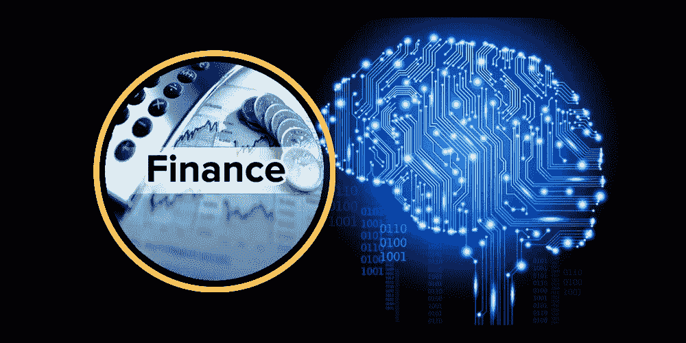
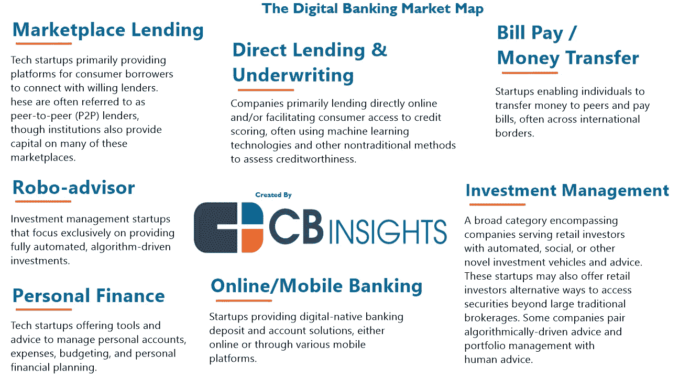
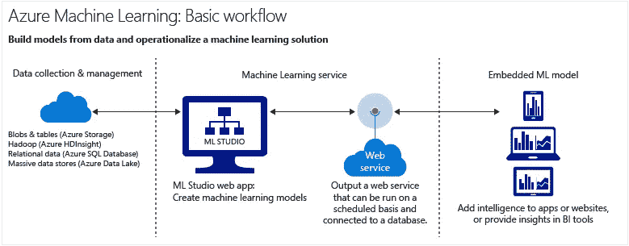
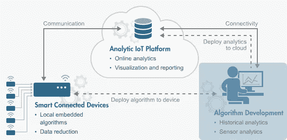
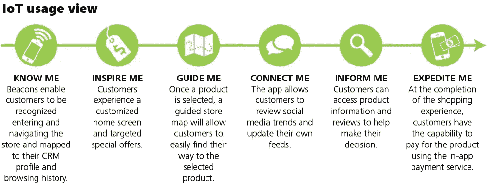
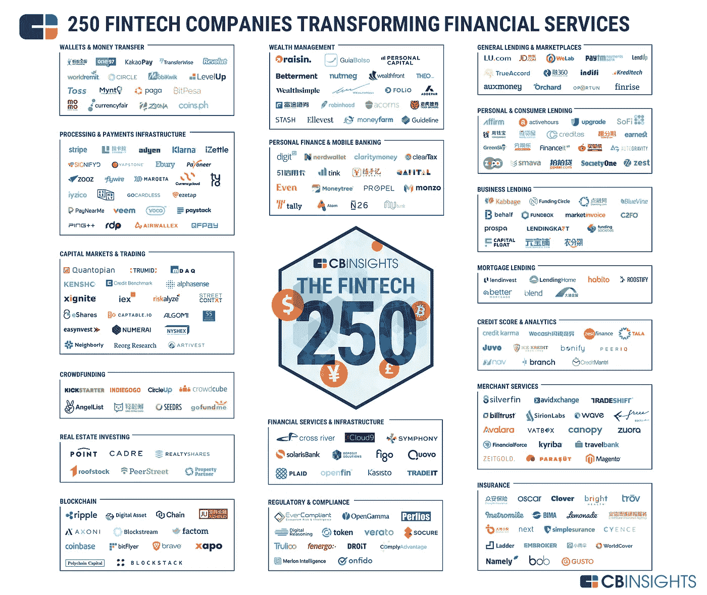

# 物联网和人工智能与金融:现代技术如何影响世界上最强的行业之一

> 原文：<https://medium.com/hackernoon/iot-ai-and-finances-how-modern-technologies-affect-one-of-the-strongest-industries-in-the-world-3afb047da9d3>

我们将继续一系列致力于 [**IoT & AI**](https://dashbouquet.com/blog/artificial-intelligence/machine-learning-and-ai-trends-for-2018-what-to-expect) 的帖子，这次我们将看看金融领域。这个行业的要求非常高，因为它每天都要处理大量重要的数据，因此需要仔细分析和处理所有传入的数据。物联网和人工智能的实施为金融行业提供了新的可能性，其中一些变化已经实现。因此， [**麦肯锡**](https://www.mckinsey.com/business-functions/digital-mckinsey/our-insights/the-internet-of-things-the-value-of-digitizing-the-physical-world) 估计，到 2025 年，物联网每年的潜在经济影响总额为 3.9 万亿至 11.1 万亿美元。

# 提高工作的准确性

数字可能很难，尤其是复杂的数字。因此，当一个人与他们一起工作时，这个人不犯错误是至关重要的，因为即使是最轻微的错误也会严重影响整个业务。由于物联网和机器学习，数据处理现在可以由机器来完成，因此出错的可能性很小。来自各种设备的所有信息现在都安全地存储在一个地方(再见，文书工作)，并将由人工智能进一步分析和处理。这对大公司和小企业都非常有用:你犯的错误越少，你的企业就越稳定。

# 对未来的预测分析和预测

机器学习允许企业进行预测性分析，这意味着企业所有者可以根据当前的数据和业务表现，收到关于未来预期的详细报告。当然，有些事情是无法预测的，但整体预测分析现在被许多公司广泛使用，因为它有助于战略规划，并提供对未来业务发展的看法。

# 更吸引人的支付流程

首先，有了物联网，支付变得更加容易，这是事实。你的智能手机已经是一个销售点，这为企业打开了许多新的可能性。

其次，零售商可以在各种物体上放置传感器，只要你靠近它们，它们就会与你的智能手机互动。许多研究人员表明，那些收到个性化信息的人更有可能完成购买。

增强现实等等——由于物联网，企业主和零售商正在使用你的智能手机，以便为你提供体验，而不是简单的购买过程。总的来说，我们可以看到整个支付系统的转变，从复杂的东西变得更加有趣和个性化。当然，随时随地支付任何东西的可能性对客户和企业来说都是金矿，因为它减少了人们在怀疑是否完成购买时通常表现出的犹豫。

综上所述，为什么金融行业对物联网等现代技术投入这么大？因为这种技术将允许金融机构(例如银行)及时响应任何客户请求或需求，并根据这些需求定制产品/服务。现在，任何行业的用户都期望个性化服务，因此对于金融行业而言，物联网是一种超越竞争并与其他领先者并驾齐驱的方式。

反叛的初创公司正在改变金融服务业，自 2013 年以来，它们通过 766 笔交易筹集了 320 亿美元的早期资金。查看由 CBInsight 举办的 2017 年 Fintech 250。

[作者:德米特里·布德科](https://www.linkedin.com/in/dmitrybudko/%5C)