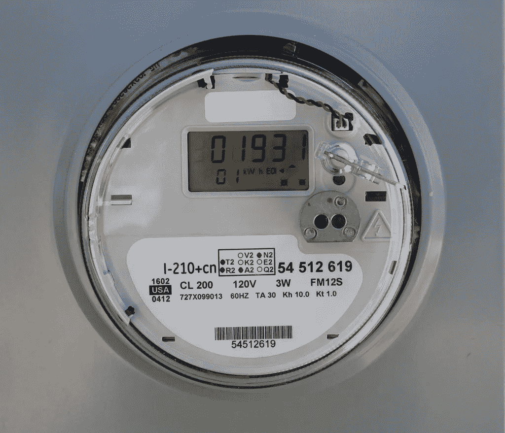
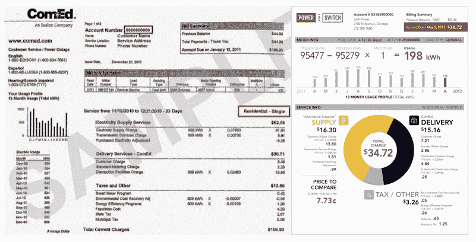
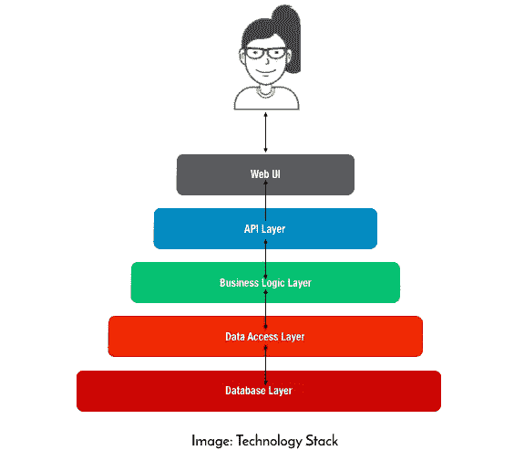

# 物联网/物联网设备公司正在犯“智能电表错误”。

> 原文：<https://medium.com/hackernoon/iot-iiot-device-companies-are-making-the-smart-meter-mistake-2ab1471ff078>

在三个人在一个房间里运行 [Power2Switch](http://www.chicagobusiness.com/article/20130930/NEWS08/130939998/power2switch-acquired-by-rival) 的早期，我们决定接听我们接到的每一个客户电话。在早期，这很容易，电话直接打到我的手机上！随着我们在美国几个州的发展和推出，我们保持了这种文化，但只有一个人接听电话。你可以想象，当我们接触到成千上万的住宅和小型[企业](https://hackernoon.com/tagged/business)客户时，Victoria H(我们的全能卓越运营人员)压力很大。所以我们回到了团队，每个人都接了一个电话，感觉很棒。很好，因为它让团队中的每个人都充分了解我们的客户发生了什么。

[我们的大多数客户不理解他们的电费账单](https://www.fastcodesign.com/1669931/how-a-redesigned-electricity-bill-could-make-you-smarter-and-save-cash)，我们接到很多电话询问账单上的东西是什么意思。有一天，一个顾客打电话进来，它转到了我的手机上。客户打电话来是因为他收到了电力公司的“智能电表安装”通知，他想知道智能电表给他带来了什么好处。我给了他一个典型的回答，电表有助于电力公司获得更好的使用数据，这将使他的电力公司提供更好的客户服务。他笑着说(我在这里转述一下)

> “公用事业公司从未为我做过任何事情，我确信智能电表的事情实际上会一如既往地让他们受益”

Old Bill -> Redesigned Bill (2012)

那个顾客是对的。他击中了部署智能产品的核心问题，这些产品为部署的公司提供了比接收产品的客户更多的价值。这是许多物联网/物联网设备落入的陷阱。这将是一个巨大的问题，因为 [Gartner 预测，到 2020 年，95%设计并投放市场的新产品将是物联网设备](https://www.gartner.com/smarterwithgartner/gartner-top-strategic-predictions-for-2018-and-beyond/)。

## 谁真正得到了价值？

德州 700 万客户拥有智能电表。伊利诺伊州 Comed 覆盖区域的 488 个邮政编码中，已有 271 个完成了智能电表部署。这些客户大多不关心这些智能电表，他们发现了哪些好处？

1.  **封闭网络、安全性、基础设施限制和技术过时**:就数据通信标准、硬件和网络安全功能而言，过去 1-3 年部署的智能电表已经过时。对于依赖于公用事业公司提供的智能电表的客户来说，他们会遇到这些问题，直到公用事业公司决定升级电表。这不会很快发生。
2.  从智能电表获取的**数据**通过提供对使用和需求概况的更多可见性，为公用事业服务。这使得电力公司能够更好地规划和管理他们自己的发电资产。受益的客户是那些在获得智能电表之前就已经关心能源使用的客户。当时我遇到一位客户，在安装智能电表之前，他已经用 Excel 跟踪了大约 10 年的能源使用情况。他是一个忙碌的顾客，甚至他也只能从仪表中获得边际收益。
3.  智能电表从未解决与电力公司互动时存在的**客户体验问题**。上面提到的账单和信息显示问题？情况依然如此，因为[向客户传达深奥信息的术语和方法](http://powerbot.co)并没有因为智能电表而真正改变。

可以说，这些智能电表部署被视为成功的唯一指标是*部署的电表数量*。这只是因为他们本质上是被授权的。

## 可以吸取哪些教训？

部署物联网设备(也就是智能电表)的公司能够从一次被认为是失败的与客户互动的尝试中吸取什么？虽然部署进展顺利，但由于强制采用，任何将硬件部署到客户家中的公司都可以从问题中吸取经验教训。这些问题并不详尽，只是一些需要长期深入思考和明确的问题。[在我自己的水物联网设备启动失败之前，我应该回答的问题](https://www.linkedin.com/pulse/4-lessons-from-building-iot-device-months-seyi-fabode):

1.  **产品是为客户服务还是为开发产品的公司服务**？很容易让你自己相信你的小发明为顾客提供了价值。我们都这样做。但是，**如果你不能在不提及你的产品的情况下清楚地说明好处是什么**，那么你实际上并没有解决客户的问题。
2.  **你的“避免产品过时”计划是什么**？随着技术变革的步伐，不可避免的是，你的产品会很快过时，除非你有意避免这种情况。你如何开发你的产品来保持相关性，而不管你的行业中必然会发生的持续创新？你如何确保不可避免的颠覆性创新来自你的公司？有计划。我们知道，当橡胶上路时，很少有计划符合现实，但有一个作为指南。
3.  **在产品组的(新)生态系统中，您的产品如何服务于客户？认为你的产品只是顾客购买的一件东西的时代已经结束。在消费者在家庭、城市和其他环境中体验和参与的整体背景下思考这个问题，这些环境现在受到无处不在的技术[如我们的智能手机](https://hackernoon.com/tagged/technology)的指导。简而言之，你的产品不再存在于真空中。记住这一点。**

产品开发人员/物联网公司或部署人员还需要考虑哪些事项？

*评论、点赞、分享并注册* [*Joulez 简讯*](https://www.getrevue.co/profile/ashalabs)*——如果你已经读到这里，我打赌你会爱上它。*