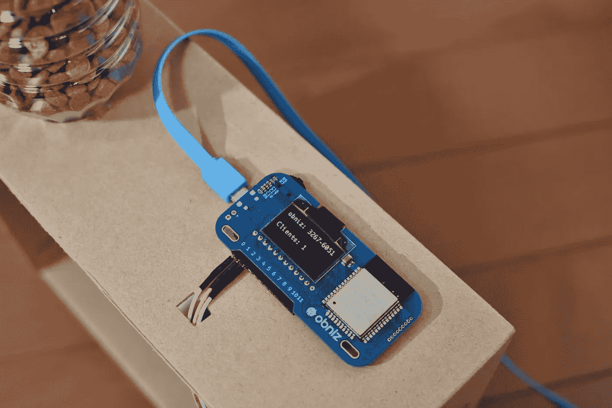
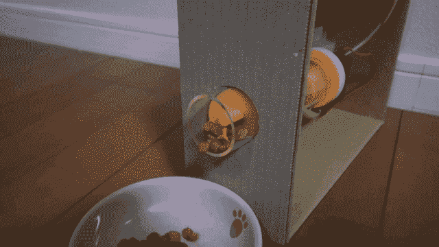

# 物联网智能家居-使用智能手机远程喂养宠物

> 原文：<https://medium.com/hackernoon/iot-smart-home-feeding-pets-remotely-using-smartphone-a42cd6ede2cb>

不在家的时候要喂宠物吗？这种喂料机可以在任何地方使用智能手机通过网络浏览器进行控制。

Feeding cat with obniz

# 这个项目中使用的东西

*   [奥布尼兹](https://obniz.io/)
*   电池或 USB 适配器和电缆
*   螺杆和管道
*   伺服电机(无限制旋转)
*   宠物食品——越多越好

# 步骤 1 —设置 obniz

你只需要遵循三个步骤来设置你的 [obniz](https://obniz.io/) 。

1.  将 obniz 连接到 wifi
2.  将 LED 或电机等设备连接到 obniz
3.  扫描 obniz 的二维码，开始编程。你不需要安装任何软件。

# 第二步

切割管道并准备好螺丝。我用 3D 打印机做的螺丝。然后，将螺丝连接到马达上，并将它们放入一个盒子中。

# 第三步

现在你需要连接伺服电机到 obniz 如下。

io0: GND，

io1: VCC，

io2:信号

然后启动你的 obniz。



# 第四步

在下面写代码，把食物放进瓶子里。食物会从管子里出来。



# 喂你的宠物！

你只需要用智能手机在浏览器上打开 HTML。现在你可以随时随地喂养你的宠物了！

# 程序

```
<!-- HTML Example -->
<!DOCTYPE html>
<html>
<head> 
  <script src="[https://code.jquery.com/jquery-3.2.1.min.js](https://code.jquery.com/jquery-3.2.1.min.js)" crossorigin="anonymous"></script>

  <script src="[https://unpkg.com/obniz@1.9.1/obniz.js](https://unpkg.com/obniz@1.9.1/obniz.js)"></script>
</head>

<body>
  <div id="obniz-debug"></div>
  <br>
  <div class="text-center">
    <h1> Pet Feeder </h1>
  </div>

  <button id="meal">Feeding</button>
  <div id="dispMeal"></div>

<script>

function getTime(){
  var dateTime=new Date();
  var hour = dateTime.getHours();
  var minute = dateTime.getMinutes();
  return hour + ":" + minute;
}

/* This will be over written on obniz.io webapp page */
var obniz = new Obniz("OBNIZ_ID_HERE");

obniz.onconnect = async function () {
  var numberOfMeal = 0;
  var lastTimeMeal;
  $("#dispMeal").text("Number of feeding : "+numberOfMeal)
  var servo = obniz.wired("ServoMotor", {gnd:0, vcc:1, signal:2});

  $("#meal").click(async function(){
    numberOfMeal++;
    lastTimeMeal = getTime();
    $("#dispMeal").text("Number of feeding : "+numberOfMeal+", The last time : "+lastTimeMeal)
    servo.angle(0.0);
    await obniz.wait(10000);
    servo.angle(6.9);
  })
}

</script>
</body>
</html>
```

有关该项目的更多信息，请访问[此处](https://obniz.io/explore/4)