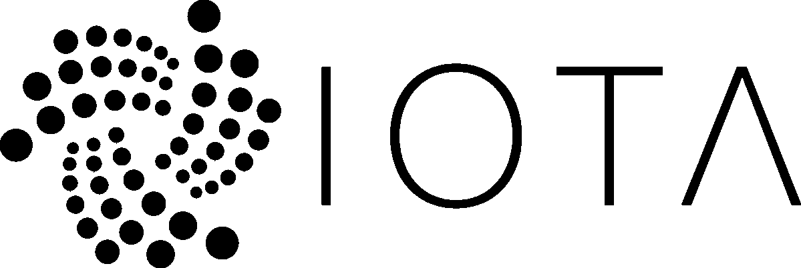
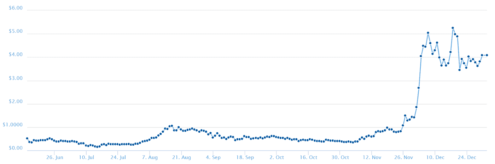

# IOTA 硬币评论

> 原文：<https://medium.com/hackernoon/iota-coin-review-6a1c73c5cfa3>

Before reading this review, please read our disclaimer at the bottom of the article or [here](https://thebestoficos.com/disclaimer.html).

## 无交易费用的物联网令牌

# 介绍

IOTA 目前以 110 亿美元的市值排名第七大加密货币(是目前推出的所有 ico 的两倍)，使 IOTA 成为 2018 年最令人兴奋的平台之一。本文将解释是什么让 IOTA 如此特别，并描述它的市场、价值主张及其令牌的细节。

2018 年将是加密货币迄今为止最重要的一年。许多最新的平台都试图用区块链技术解决最大的问题，IOTA 就是其中之一。他们的 ICO 发生在 2015 年 11 月。IOTA 的团队决定**创建自己的**加密货币技术，而不是使用或修补区块链。

# 这个想法

IOTA 是一种加密货币，没有**的交易费**，也不需要**的矿工**来处理交易。然而，它确实需要一些计算能力来提交交易，这使得它非常适合机器用作**物联网“** IoT”的货币和分布式通信协议。

IOTA 的主要目的是解决区块链技术的一些主要问题，其中一个主要问题是，区块链(如比特币)越大，实际转移资金的速度越慢，成本越高，也越受限制。

区块链的另一个问题是大小，随着越来越多的区块被添加，区块链变得越来越长，因此越来越少的计算机能够挖掘它。现在 BTC 超过 150GB 长，ETH 也是。如果这个大小增加十倍，很少有计算机能够挖掘它。使它们相对集中(前 2 大比特币矿池拥有约 56%的哈希能力)。

# 纠结

## 区块链 vs IOTA

这项技术与区块链的主要区别之一是 IOTA 所谓的“纠结”。这是一种通过一种叫做**有向无环图**或“DAG”的机制来存储事务的新方法。

随着区块链网络的增长，每秒的交易量不会增加。这导致了拥塞。另一个问题是，网络上的矿工(计算机)越多，支付与这些矿工的电费账单相关的交易费用就越昂贵。

这意味着，如果有 1000 万或 100 万人在 BTC 或瑞士联邦交易所交易，网络将只能处理特定数量的交易。这是一个自然的限制，因为 BTC 的基本属性是，解决一个区块的难度必须保持稳定在 10 分钟/区块(在原始 BTC 白皮书中为 1 小时)。如果你在系统中添加更多的计算机，算法会使问题变得更加困难，从而使完整的计算能力能够在 10 分钟内解决它。这样做的原因是，如果阻塞解决得太快，它就容易受到攻击和黑客攻击，如果解决得太慢，那么每分钟或每小时授权的交易就很少。

随着越来越多的电脑在 BTC 挖矿，转账变得越来越昂贵，因为电脑需要得到比电费更多的回报。每笔 BTC 交易目前消耗超过 25 万千瓦小时，整个网络消耗多达 32 千瓦小时，足以每天为 500 多万人的家庭供电。

比特币通过交易费解决了这一点。由于比特币消耗的计算机能力，交易费用大幅增长。目前比特币的平均交易费为 25 美元。因此，如果你打算在 BTC 给朋友汇 50 美元，你的朋友可能会收到不到一半的 BTC。这些费用是保持网络发展和矿工诚实的激励。

## IOTA——理论上

在 IOTA 中，每个用户都提交和验证交易。因此，每个用户都对验证和安全性做出了贡献。不同的用户会对交易进行多次验证，随着 it 部门不断获得批准，该交易的可信度也会增加。

IOTA’s Tangle vs. Bitcoin’s / Ethereum’s Blockchain. From IOTA’s Support website found [here](https://iotasupport.com/whatisiota.shtml).

这场纠纷的另一个有趣的方面是，它不像区块链(每秒 X 笔交易量)那样是确定性的，而是概率性的。这意味着一些交易可能比其他交易被更快地确认，因为网络挑选两个随机交易进行验证。而不是比特币，总要花~10 分钟(加上拥堵)。

## 实际上

没有一种加密货币能完美兑现它的承诺。IOTA 也不例外。为了让 IOTA 成为一种分散的加密货币，它仍然需要解决许多挑战和技术困难，这些挑战和困难仍然有待于证明是否可行。

IOTA 目前面临以下方面的批评:

*   冲突解决漏洞
*   恶意攻击者(多数攻击)
*   协调员
*   寄生链
*   加密最佳实践
*   三元处理器问题

**注**:我们在结论之后的“技术细节”部分详细阐述了所有这些问题。

# 令牌

IOTA 的所有令牌都是通过“起源”地址同时生成的。这些代币最初是给一个创始人地址的。未来将不会产生代币，也不会通过采矿给予奖励(详情见上面我们的**纠结**部分)。在某种意义上，所有 IOTA 令牌都已经生成(它们的所有 2.779 x 10 ⁵)。许多交易所交易 IOTA，截至 2018 年 1 月 2 日，IOTA 的价值约为每令牌 4 美元。

**在过去的 4 个月里，价格上涨了 10 倍。**

Price IOTA over time found on Coin Gecko: [https://www.coingecko.com/en/price_charts/iota/usd](https://www.coingecko.com/en/price_charts/iota/usd)

# 物联网

IOTA 的设计不像 ETH 那样配备图灵完整编程语言，因此没有智能合约，其他初创公司也不太可能完全基于他们的平台创建 ico。

其思想是，由于 IOTA 是“无交易的”(下面解释)，机器可以使用它们的计算能力+到互联网的连接，以便能够使用 IOTA 作为分散的通信系统。最重要的是，机器可以使用它作为货币，为它们分发的商品或服务转移资金，如传感器数据、机器的控制或管理。因此，IOTA 专门用于主要用于运行物联网硬件的低功耗 CPU。

# 自由交易

从节点的角度来看，事务如下所示:

1.  节点选择它将验证的另外 2 个事务(每个节点批准 2 个事务)
2.  该节点在证明没有冲突之后验证两个事务
3.  节点必须解决一个类似于 BTC 的加密问题，以便验证事务(找到一些随机数以获得正确的散列)

本质上，交易“费用”是验证其他交易，因此系统保证每个人都有验证的动机，因为它需要转移。该系统还确保总是有计算机验证交易，因为每个节点必须验证两倍于其请求的交易。所以验证的次数总是交易次数的两倍。

# ICO 详细信息

IOTA 在 2015 年 11 月 24 日至 2015 年 12 月 20 日的 ICO 期间筹集了 434，000 美元。尽管以今天的标准来看，43.4 万美元看起来是一个小数目，但这是一个令人印象深刻的成就。

到 2015 年底，ico 仍然相对较新，人们对它们的信心不如现在。也就是说，截至 2018 年 1 月 2 日，他们目前的上限超过 110 亿美元。在过去的 4 个月里几乎翻了一番，所以货币确实表现不错。按市值计算，它也是第七大加密货币，其计算方法是将代币的数量乘以每个代币的价值。这显示了购买该货币所花费的美元总额。

# 资金用途

他们的白皮书(1.3 版)没有提到资金的使用。这主要是因为在 2015 年，这是一种不太常见的做法，但作为交换，我们得到了 28 页更具技术性的白皮书。

然而，我们可以假设，从筹集的相对少量的资金(～42 万美元)来看，该平台分配的资金直接进入了 IOTA 基金会和 IOTA 加密货币的形成和发展。

# 令牌分发

如前所述，IOTA 令牌的总量总是稳定的。这意味着所有者可以选择出售多少代币，以及他们可以保留多少代币。

IOTA 的所有者被认为拥有所有可用令牌的大约 50%。这是一个有争议的话题，因为这意味着他们大约拥有 50 亿美元。这对于任何一组人来说都是一笔难以置信的高收入，因为他们使用的是一种相对来说未经证实的新技术。

# 牵引力

IOTA 已经由不同的交易所正式交易了一年多(取决于交易所，有些是最近才开始交易的)。自问世以来，人民币的价格和吸引力都呈指数级增长。网络上的交易已经超过了一亿次。预计该数量将继续呈指数级增长。

也就是说，在实践中部署 IOTA 会面临很多挑战。在 IOTA 可以开始考虑成功部署之前，它们如何从协调器转移以及减轻首先需要协调器的概率攻击的方式都是悬而未决的技术和社会问题。此外，IOTA 的成功与物联网行业对它的采用密切相关，这本身不是一个微不足道的业务挑战。

# 组

IOTA 由 IOTA 基金会设计和维护。它的创始人是大卫·索恩斯特博和数学家塞尔吉·波波夫。David 是挪威人，他在 2014 年创办了一家处理器制造公司，拥有物联网方面的经验。波波夫博士是莫斯科大学的数学家。IOTA 团队的其他成员在软件和投资方面拥有广泛的技能。基金会网站上的图片有很多一致性问题(分辨率、颜色、图片类型等。)这让它看起来不那么合法，特别是对于一个价值超过 60 亿美元的基金会。

IOTA 基金会的团队也有一系列自 2011 年以来一直致力于建设加密货币项目的退伍军人，他们也有一名哈佛教授，一些数学家，以及越来越多的知名教授为该网络担保。这个项目有一个非常强大的团队。

Image Caption: Some of the members of the IOTA Foundation [from their website](https://iotasupport.com/foundation.shtml).

# 如何购买 IOTA

不是所有的交易所都交易 IOTA，许多交易所只交易 BTC 或瑞士联邦理工学院，所以你可能需要使用多个交易所才能得到一些。以下是唯一需要 IOTA 的交换:

*   [Bitfinex](https://www.bitfinex.com/) (BTC，ETH 美元)
*   币安(BTC 联邦理工大学)
*   [硬币点](https://www.coinspot.com.au/)(澳元)
*   [bit520](https://www.bit520.com/) (CNY)

IOTA 的价格目前大约是每令牌 4 美元。不同的管辖区可能对在哪里以及如何购买令牌有不同的要求。比特币基地目前不支持购买 IOTA，同样，如果你在加拿大，它可能需要几个额外的步骤，这里有一篇关于这个的好文章。

# 如何抓住 IOTA

在 Github 上可以找到在冷钱包上保存 IOTA 的详细说明。

持有 IOTA 进行冷存储需要用户下载 NodeJS、电子框架和 Web 包管理器 Bower。

# 结论

IOTA 是一个令人难以置信的雄心勃勃和有趣的项目。如果它成功了，它将成为第一种不仅降低比特币价格，而且可能使其变得无用的加密货币。由于大量的问号，在**技术可行性，漏洞，以及缺乏一个开源协调**，这是一个很大的如果。

IOTA 的 IoT 方面也挺有意思的。使用无交易网络，让机器能够交易信息、服务和商品以获取收入是一个有趣的提议。

我们对 IOTA 的三进制处理器系统也有所保留。为什么不选择基于二进制的系统？这是否是因为他们的首席执行官 David snsteb 拥有开发这种处理器的经验，因此可能存在一些偏见？我们不确定。

这仍然是当今最有趣的加密货币之一，具有几乎无限的潜力。我们祝愿 IOTA token 和他们的团队好运，因为他们将继续主导竞争日益激烈的加密货币市场。

想帮忙吗？
**在 Bountey 上支持我们！**[**https://www.bountey.com/bestoficos**](https://www.bountey.com/bestoficos)

*想在 ICOs 中保持最新？* ***访问我们在***[***https://thebestoficos.com***](http://thebestoficos.com/)

*有一个有趣的故事？* ***写我们在 info@bestoficos.com***

# 技术细节

作为一种不基于区块链协议的较新的加密货币，它为 IOTA 带来了自己的一系列问题，其中许多问题是基于 DAG 的验证协议所特有的，有些完全是 IOTA 实施其白皮书所特有的。我们将首先讨论基于 DAG 的协议验证，以及我们如何使用它会遇到许多问题，然后具体讨论 IOTA。

**DAG 和事务的冲突解决**

在基于 tangle 的系统中，主要的攻击无疑是那些基于 tip 选择的攻击，以及在有冲突的情况下如何批准新节点的攻击。白皮书阐述了其中三种基于 DAG 的攻击，但是它们在许多方面缺乏细节，我们将对这些方面提供外行人的解释，这可能会失去一些技术准确性，但会使攻击背后的主要思想以及某些 IOTA 功能更容易受到攻击的原因更容易理解。

*   **恶意子交易生成:**不幸的是，这里 IOTA 遇到了与对简单区块链的 51%攻击相同的缓解问题。如果攻击者成功地部署了合理百分比的计算能力来生成子角(对于葛覃，这是 40%)，则整个 IOTA 网络将批准不诚实的交易
*   **寄生链攻击:** IOTA 试图通过使用一种叫做“MCMC”的提示选择算法来减轻这种攻击。然而，IOTA 仍有可能允许验证不诚实的交易(具有非常低的概率)。如果 IOTA 变得足够大，那么大量实质上是在骗取人们钱财的交易将会被批准！这是一个人绝对不希望在财务账本上看到的东西
*   **分裂攻击和 IOTA 的协调者:**最后一种基于 DAG 的攻击是恶意参与者将缠结分成两个子缠结。这是通过注入许多 tips 未批准的恶意交易，然后仔细平衡这两个子交易以最终批准其中一个恶意交易来实现的。因此允许攻击者加倍花费他们的资金。这也容易受到早期概率论证的影响，并且 IOTA 没有办法以 100%的确定性保证这些交易实际上是合法/非法的。

最后，为了防止所有这些攻击在网络较小时被有效利用(51%类型的攻击更容易部署)，IOTA 有一个称为**协调器**的东西，它本质上发布可信事务，而不具有与其他随机节点的可信事务相同的信任边界。它由 IOTA 基金会管理

**协调器的问题、糟糕的最佳实践和“集中”信任** 不幸的是，协调器的使用通过其本质上“有保证的”协调器事务在 IOTA 基础中放置了很多信任，并且充当了在网络中集中信任的方式。虽然这纯粹是一个社会问题，但 IOTA 对协调器和白皮书的具体实现存在一些更严重的技术问题，我们现在对此进行解释。

**永远不要推出自己的密码** 我们中的一些人在 [Best of ICOs](https://thebestoficos.com/) 从事过安全行业，特别是密码学。我们了解到，加密安全中最重要的原则之一是，在由客观的第三方对其安全性和准确性进行审查之前，绝不要编写**和**部署您自己的加密哈希函数。

不幸的是，IOTA 选择了这样做，并且他们的哈希函数 curl 被发现具有严重的漏洞(易受差分密码分析的攻击，即使是业余密码分析师也可以执行这种攻击),这使得更高级版本的分裂攻击非常容易部署。虽然 IOTA 团队声称协调员可以减轻这一点，但一般加密社区的共识是，它仍然可能造成重大损害。甚至协调员的引入也有其自身的问题。

**协调器是封闭源** 由于当前通过协调器发布的事务被保证验证，并且除非事务可以扩展来自协调器的事务，否则它们不能保证被验证，这在整个 IOTA 网络上提供了非常大的攻击媒介:泄露协调器的私钥。由于协调器是**闭源**的，因此没有办法验证其私钥的安全性，此外，上述违反“永远不要使用自己的密码”的行为导致 icos 的员工认为最佳实践对 IOTA 开发人员来说并不重要，从而导致严重的担忧，担心坏人会获得私钥，并能够接管整个网络，而无需积累大量的计算能力。

**网络哈希能力和聚焦攻击者** 最后，IOTA 的一个前提是，当网络变得足够大时，物联网行业的设备应该能够产生足够的哈希能力，以阻止任何攻击者。然而，这是一种非常危险的想法，因为在物联网网络上使用具有低 GHz 时钟速度并针对电池寿命进行了优化的设备进行的零星交易将无法超过使用专门攻击硬件的持续攻击者。可以肯定地说，一个资金充足的坚定攻击者可以轻松获得这些资源，在 2018 年超过整个物联网行业设备的计算能力，否则就是一厢情愿。

**三进制处理器** 出于一些数学简化的原因，IOTA 的创建者以一种针对三进制处理器优化的方式开发了该软件。而不是通常的 0 和 1。这些处理器有 3 个输入:0，1，-1。这让许多人感到困惑，因为与二进制处理器相比，这些处理器的数量微乎其微。

使用 IOTA，已经通过 IOTA 网络完成了一亿多笔交易。这表明加密货币开始占据相当可观的份额。如果一切按计划进行，随着网络的增加，它的速度也会增加。因此，当我们不断看到他们的交易量上升时，应该不会有积压问题。IOTA 的 Github 包括一系列关于如何为物联网使用和部署 IOTA 的说明。

# 放弃

本网站及其包含的信息无意成为投资、金融、技术、税务或法律建议的来源。本网站不能代替专业建议和独立的事实验证。在没有首先评估你自己的个人财务状况，也没有咨询财务专家的情况下，千万不要使用这个网站上的想法和策略。本网站的所有内容仅供参考，按“原样”提供，不保证完整性、准确性、及时性或使用本网站所获得的结果。这只是一个存根，您对本网站的访问和使用取决于您是否接受并遵守[全部免责声明。](https://thebestoficos.com/disclaimer.html)免责声明适用于所有希望访问或使用本网站的访问者、用户和其他人。