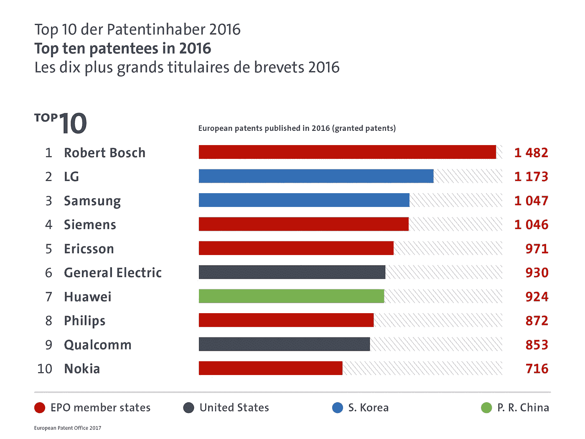
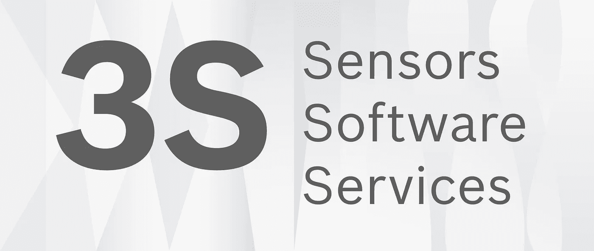
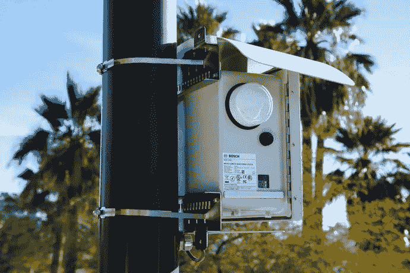
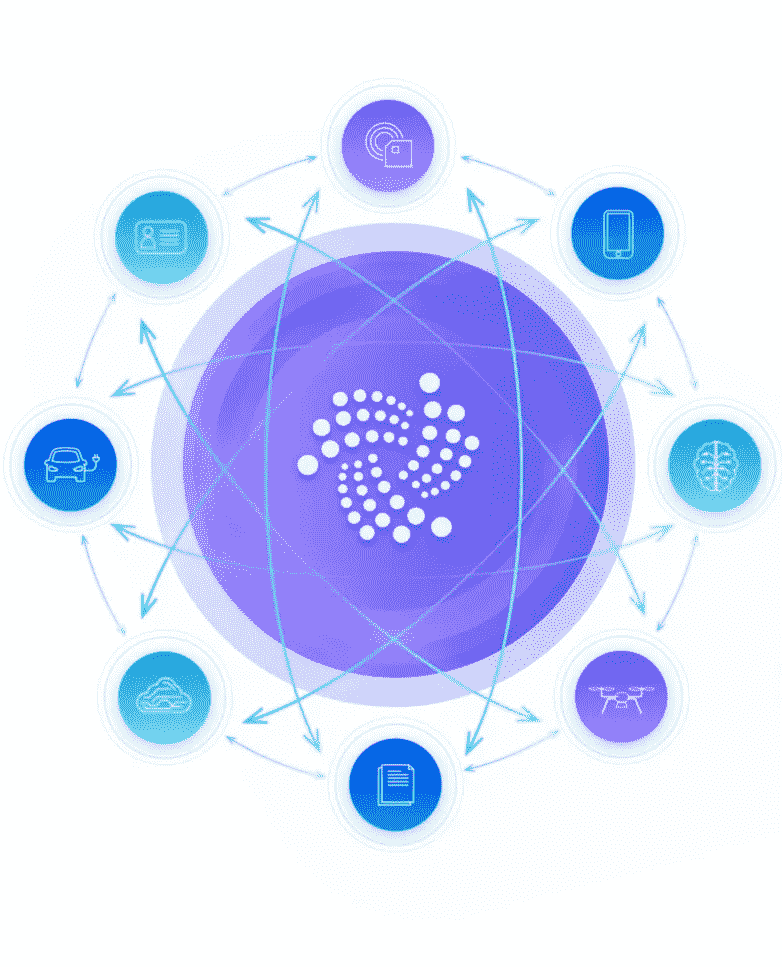
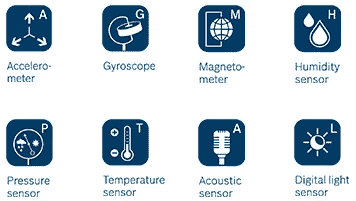

# IOTA:博世可能的用例

> 原文：<https://medium.com/hackernoon/iota-possible-bosch-usecases-bc0ebbce77d3>

[正如我们已经看到的](/@iotasuppoter/iota-the-bigger-picture-eb7092835dfc)，博世风险投资[购买了“大量 IOTA 代币”](http://www.bosch-presse.de/pressportal/de/en/robert-bosch-venture-capital-makes-first-investment-in-distributed-ledger-technology-137411.html)。虽然在 CES [上的“一个更大的发布会(IOTA 合作伙伴之一)”被推迟了](https://www.reddit.com/r/Iota/comments/7orp03/iota_foundation_ask_us_anything_january_7th/dsbpqag/)，但观看博世在新闻发布会上的推文仍然很有趣:这篇文章试图展示为什么 IOTA 的技术完全符合该公司的计划。

**注意:这没有得到 IOTA 基金会的证实，只是我自己的想法，所以请照此考虑。**

# 总体情况

博世是汽车零部件供应商和物联网领域最大、最先进的公司之一:

> 博世在九项关键声誉属性中的八项中排名第一，成为全球最受尊敬的汽车供应商。([链接](https://www.businesswire.com/news/home/20160321005988/en/Bosch-ranks-No.-1-motor-vehicle-parts))

正如欧洲专利组织在 2016 年确认的那样(在撰写本文时还没有更近的数据)，博世拥有所有欧洲专利权人中授权最多的专利:

博世目前关注的焦点是三个 S:

[https://twitter.com/boschusa/status/950404229897883648](https://twitter.com/boschusa/status/950404229897883648)

正如一位高管在拉斯维加斯消费电子展上所说:

> 在我们全球近 40 万名员工中，超过 2 万名是软件工程师，其中近 20%专门从事物联网工作。

有趣的是，这似乎是 IOTA 能力的完美匹配(当然，这也是博世投资 IOTA 的原因)。然而，问题仍然是博世能做什么？

# 智能城市

在不久的将来，智能城市将成为一个巨大的话题，博世的推文说明了一切:

仅拉斯维加斯就宣布了一项在未来七年投资 5 亿美元建设智能城市基础设施的计划。在湾区，一个灯塔项目已经启动，预计仅通过使用 5000 盏智能路灯就能在 15 年内节省 800 多万美元。

> 博世传感器是互联城市的眼睛和耳朵。在这种情况下，它的大脑就是我们的软件。(博世北美总裁 Mike Mansuetti)

此外，据称到 2020 年，所有电子产品[都将支持网络](https://twitter.com/BoschPresse/status/950400255182495745)。可以想象，这将导致大量数据被释放。IOTA 的扩展能力和速度使它成为所有这些信息事务的基础层。在下文中，我将给出一些用例的概述，这些用例在技术上可以使用 IOTA 基础设施来完成。

## 气候监测

这里的想法是分析空气质量、湿度和花粉浓度，以便在必要时通过采取措施来提高整体质量。收集信息的产品已经开始工作，[已经获得了 CES 2018 创新奖](https://www.businesswire.com/news/home/20180108006404/en/CES®-2018-Innovation-Award-Bosch-Smart-City):Climo。

Several of these Climo boxes were deployed in Las Vegas right before the CES in order to show the capabilities to the conference attendees.

当然，收集到的数据可能是“伪造的”，例如通过将盒子放在城市中非常“绿色/健康”的地方。然而，这个想法是从如此多的点收集数据，以至于信息源的总数将防止有偏见的结果。此外，您也可以只关注城市的特定区域，以便将数据与城市的其他部分进行比较。

IOTA’s network called “tangle” would be the link between all the sensors.

IOTA 的缠结将是所有这些信息片段交换的层。为了让这一点更清楚:想象一下在拉斯韦加斯的数百个 Climos 每秒钟向 [IOTA 市场](https://blog.iota.org/iota-data-marketplace-cb6be463ac7f) =实时信息发送他们的数据。我同意，一个老练的区块链也许能处理好这件事。这样的区块链可能会有一个市场，同意。但是，如果成千上万的居民为他们自己的屋顶购买这项技术，因为他们想通过向空气质量改善公司的研发分支机构出售数据来赚大钱，那该怎么办？没错，这是数百个小村庄+数十万个家庭每秒钟通过公共账本发送数据！这就是为什么 IOTA 是必需的，因为它提供了**速度**，可伸缩性**并且没有**交易费用**！**

> 公司、市政当局以及个人都可以很容易地收集空气质量的数据。激励措施是在市场上出售这些数据，而这些数据又可以被企业用来制造能够再次改善空气质量的产品。这是双赢的局面。

## 基于社区的停车

你有没有在城市里拼命寻找停车位的经历？博世思考了这个问题，他们的解决方案简直太棒了:

> 驶过停车位的汽车通过传感器识别停车位，连接硬件和司机实时接收停车位信息。然后，它们被快速而轻松地导向一个空的空间。([链接](https://www.bosch.com/explore-and-experience/smart-city-challenges/#Smart%20in%20Las%20Vegas)

观看这段简短的视频，了解这个想法:

同样，这是大量的数据:每辆车都可以感应可能的停车位，实时传输数据，同样的数据需要传输给所有寻找停车位的汽车。当然，这可以与自动驾驶汽车完美结合:你只需在你想去的商店下车，汽车就会找到一个地方等待(或在此期间用于其他目的)，并在你完成后回到你身边。

这听起来相当超前和乌托邦，但是博世[已经为 150 万辆汽车配备了他们的物联网软件](https://twitter.com/boschusa/status/950401712057073665)。2018 年，20 个美国城市(如迈阿密、洛杉矶和波斯顿)将提供这项令人惊叹的技术[！](https://twitter.com/BoschPresse/status/950401420708270081)

再说一次，光是一个城市就产生了如此多的数据，但是如果它成功了，全世界都将需要这项技术，这意味着需要处理的数据量惊人。

> 由于 IOTA 正是为这样的物联网案例量身定制的，所有数据都可以实时传输，无需任何费用！

人们也可以想象这样一个用例:在开车开始你的旅行之前，你预定了一个一定数量的免费停车位，并且可以确保得到这个停车位(例如，就在你的目的地前面)。可能性是无限的！

## 其他使用案例

我想到目前为止你已经掌握了要点:这是大量可以用来(如果实时处理的话)帮助个人拥有更好/更聪明/…生活的信息。以下只是该技术如何帮助我们的一些想法，使用 IOTA 的 tangle 作为基础层，每个用例都是完全可行的:

## XDK

你可能会问:很好，不错的技术——但是博世使用 IOTA 现在需要一个工作产品？你是对的，这个产品确实存在:XDK。这是一个小型开发套件，它收集各种数据(例如来自机器的数据)供以后分析:

IOTA 的联合创始人张秀坤·席纳介绍了 IOTA 的技术如何应用于该套件:

所以博世显然对 IOTA 的能力非常感兴趣。

当你读这篇文章的时候，这些想法正在变成现实。当然，博世并不是唯一这样做的公司。因为有许多其他人试图在无数行业建立这种技术来赚钱:然而消费者和公司都不希望每个行业都有不同的解决方案(想象一下电视之间的不同标准，每个生产商都必须遵循不同标准的不同规则；我们曾经在蓝光和 HD-DVD 之间遇到过这个问题；只能有一个…)。所以问题仍然是:物联网/工业 4.0 中传输和处理所有这些数据的标准协议将是什么？在我看来，只有一个候选人能满足所有的要求:

*   实时交易的速度
*   处理数百万和数十亿事务的可伸缩性
*   为了尽可能吸引人，没有成本
*   行业内的必要联系(合伙、合作等)。)

你猜怎么着？唯一能提供这些功能的现有技术是 IOTA，尽管它还处于开发的早期阶段。数以千计的加密货币的时代正在结束(其中 95%只是比特币的仿制品，没有真正的使用案例)——2018 年将是现实世界采用的一年，没有人比 IOTA 更好地为此做好准备(有关这方面的更多信息，请阅读[我以前的文章](/@iotasuppoter)(一周内超过 60，000 次浏览！).

如果你想的话，我很乐意捐一点。-):

IOTA:kgozyhjryvdbsxtusecyjvebldvyfkcakawtptckxmbnownvrdhrvsjnivoqufrodfpxfwysgrokrwzwjztjohsx