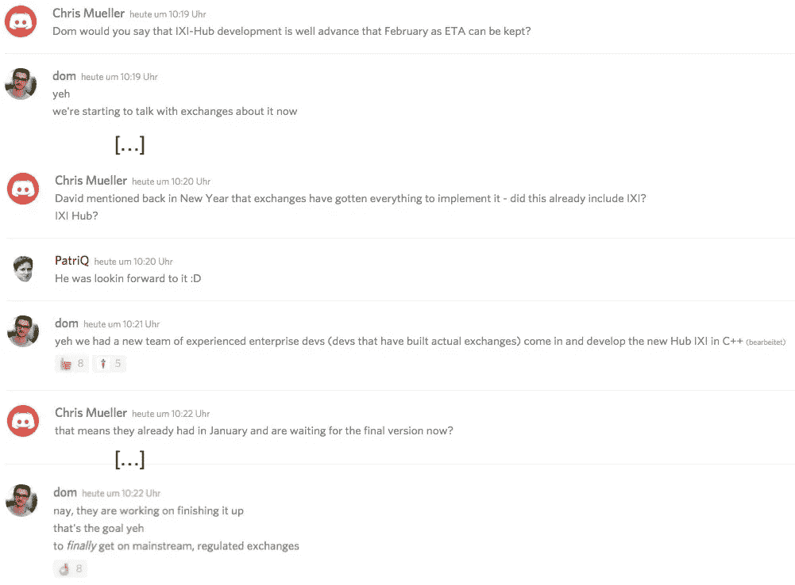
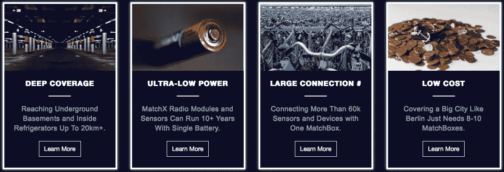
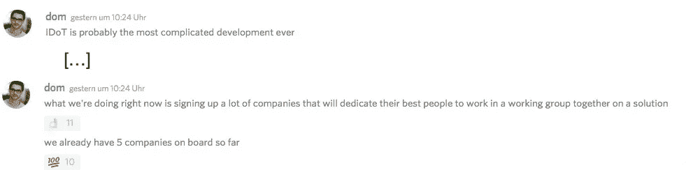

# IOTA:真实世界的用例来了

> 原文：<https://medium.com/hackernoon/iota-real-world-use-cases-are-coming-ab1d8240cf09>

首先:我不是 IOTA 基金会的成员，也不以任何方式受雇于他们——我只是 IOTA 的支持者；)

当许多人都在等待 IOTA 众多传闻中的合作伙伴的公告时，我想重点谈谈今天关于感兴趣的公司和项目的一些新闻，并解释为什么它们是/将会是 IOTA 事业的真正资产。但在此之前，我想向所有持有 IOTA 的人指出一些好消息:

## 交易所列表

IOTA 的两位联合创始人最近证实，基本上所有主要交易所都在排队等候加入 IOTA。今天，张秀坤·希纳通过谈论 IXI 中心(一个可以让交易所轻松添加 IOTA 的扩展)来缩小范围:

考虑到 IOTA 的联合创始人 David Sonstebo 在他的(太棒了！)采访 Ivan，IXI 中心将使添加 IOTA " [即插即用](https://youtu.be/GwhJQ67zxbg?t=4202)(即真正便于交易所)，**2 月可能是 IOTA** 交易所上市的好月份！此外，看看基金会的目标是什么交易所将是很有趣的(正如大卫提到的，哈勃-IXI 团队曾经为真正的股票交易所工作，张秀坤说目标是“最终进入主流的，受监管的交易所”)——很有趣，不是吗？

## 会见大玩家

1 月 30 日，出现了一些有趣的推文:

RBVC(=罗伯特·博世风险投资)在斯图加特和张秀坤·希内尔举办了一次聚会，Andreas Osowski 在那里向观众介绍 IOTA。

**这绝不是与图中提到的公司建立合作关系的证明**—然而，看看谁对这项技术感兴趣是很有趣的；张秀坤似乎也这么认为:

用 RBVC 自己的话说:

> 本周二下午/晚上，我们在斯图加特办公室举办了第一次 RBVC&Friends Meetup 活动。我们很高兴接待来自德国工业的朋友、合作伙伴和创新领袖，如**宝马、EnBW、安永、LBBW、马勒、保时捷、通快、Vector、大众和 Vito Ventures** 。活动的**主要话题**是 RBVC 最近的 IOTA 投资。来自 IOTA 基金会的张秀坤·希内尔和安德里亚斯·奥索夫斯基给了我们一些关于他们的 tangle 技术、用例及路线图的有趣见解和更新。博世分布式账本技术项目负责人 Nik Scharmann 谈到了**分布式账本将如何** **让整个行业更好地满足客户需求**。在正式的部分之后，有时间交流一些食物和饮料。

很高兴看到 IOTA 在接触大公司方面取得了什么进展。

但是现在让我们看看最近的一些发展:

# 1.MatchX

今天，一家名为“MatchX”的德国公司在推特上发布了以下消息:

显然已经有一个会议，可以看到张秀坤手里拿着某种天线。如果你深入了解这家公司的情况，你会得到一个叫 LPWAN 的术语，LPWAN 是低功率广域网的简称，根据维基百科的说法是“T0 ”,这是一种无线电信广域网，旨在允许以低的“T2”比特率进行长距离通信,“T4”事物中的“T3 ”(连接的物体),如电池供电的“T6”传感器。所以在某种程度上这是一个**宽的区域(几公里！)**功耗极小的 WiFi 网络**——您要付出的代价:**更小的数据范围**(每个通道 0.3 kbit/s 至 50 kbit/s)和更少的功耗。**

**听起来好得难以置信，不是吗？如果你对它是如何工作的感兴趣，我真的会推荐你看[这个视频](https://www.youtube.com/watch?v=hMOwbNUpDQA)。有趣的是，如果你看看 lora-alliance 的[成员，你会发现 IOTA 的合作伙伴在](https://www.lora-alliance.org/member-list)[可信物联网联盟](https://www.trusted-iot.org)中，比如思科、富士康，当然还有博世。此外，IOTA 的市场伙伴 Orange 也在那里上市。**

****这对 IOTA 有何帮助？****

**IOTA 的主要运营领域是物联网(IoT)。简而言之，数以百万计的大大小小的设备将在未来连接起来，不仅连接电脑，还连接从烤面包机到雨刮片的东西；目标是传递有趣的数据。但是雨刮片是如何连接到互联网的呢？这就是 LPWAN 发挥重要作用的地方，请看 MatchX 的主页:**

****

**www.matchx.io**

**因此，有了十个像张秀坤手里拿着的天线一样的天线，整个柏林市(350 万市民)都可以接入互联网(然而，在低数据范围内)。雨刮片现在可以连接到 tangle，并向感兴趣的各方提供数据。当然，由于数据吞吐量低，不可能一次传输大量数据(如电影等)，但这对于 IOTA 必须处理的数据类型来说不是问题。此外，你可能想知道为什么不使用 4G 或 LTE 来做到这一点——那么，你的雨刮片可能每周都需要新电池，这根本没有意义(特别是因为这基本上适用于你的所有设备，想想你的智能手机……)。所以，对于 IOTA 的经济来说，LPWAN 是有意义的。**

**因此 MatchX 提供了一种技术，让即使是最小的设备也能连接到互联网(至少是那些能够连接的设备)。看着上面提到的推文**，似乎很明显 MatchX 愿意合作使用 Tangle，即 IOTA 的网络**。他们在推特上发布的消息强调了许多人已经猜到的事情:“大事情正在进行中”…**

**这直接导致了下一个方面，IOTA 使用这项技术的一个可能的用例:**

# **2.台北**

**IOTA 基金会与台北市签署了谅解备忘录:**

> **在这笔交易中，IOTA 和台北将共同探索如何将 IOTA 的 Tangle(一种“无阻塞”协议，使机器能够安全地相互处理数据和资金)整合到智慧城市项目中。[……][正在进行的一个项目是 Airbox，它将使用**数据共享技术来安装在家庭或公共建筑中的手掌大小的传感器**。这些可以检测温度，光线和污染的变化，并可以在整个城市建立一个全面的环境网络。([链接](https://themarketmogul.com/iota-tangle-2/))**

**(当然，这些传感器必须连接到互联网，LPWAN 才有意义)。将近 300 万居民的台北(市区甚至有 850 万居民！)[正在努力](https://www.idc.com/getdoc.jsp?containerId=AP43138017)成为亚洲首批真正的智能城市之一，他们的一个项目涉及到市民的**身份**:**

**这个基于 IOTA 的项目将是内置 TangleID 的数字公民卡，防止他们被篡改。人们希望这将为公民提供安心，而不用担心身份盗窃或欺诈，无论是通过**投票，提供背景医疗记录信息，还是通过使用任何政府相关服务**。其他正在探索的领域包括**组织间和城市间数据交换**，以及**医疗保健**。([链接](https://coinjournal.net/city-taipei-use-iotas-blockless-tangle-smart-city-goals/))**

**因此，IOTA 在**现实世界采用**方面迈出了下一步(而其他项目在没有提供任何同行评审的研究论文或概念证明的情况下获得了数十亿的市值)。BiiLabs 的联合创始人 Lman Chu(他与 IOTA 在 Tapei 项目上合作)说:**

> ***“这里有* ***巨大的潜力*** *其他的机会有 IOTA 的 DLT 物联网，还有智慧城市。”(* [*链接*](https://coinjournal.net/city-taipei-use-iotas-blockless-tangle-smart-city-goals/) *)***

**台北市政府信息技术部专员李伟斌认为 IOTA 的技术至关重要:**

> **台北市总是超前思考，并利用 IOTA 的技术，此次合作是为台北市民开启智慧城市时代的一项战略举措。( [*链接*](https://coinjournal.net/city-taipei-use-iotas-blockless-tangle-smart-city-goals/) *)***

# **3.事物的同一性**

**物联网身份(IDoT)是物联网的一个组成部分。正如 IOTA 基金会几个月前所说，IOTA 还将覆盖这一重要的应用领域，坦率地说，就是给你日常生活中的每一件小事添加一个防篡改的“身份信息标签”:**

> **例如，传感器不仅应该有其唯一标识符，还应该有附带的**属性**，例如:谁制造了它，何时部署的，预期的生命周期是什么，现在谁拥有它，它正在收集什么类型的传感器数据，以什么粒度收集，它是否出售数据，如果出售，卖多少钱？这对于索引和启用机器经济性和工业 4.0 **预测性维护**的有效方式是必不可少的。IDoT 在确保互联世界的安全方面同样扮演着重要角色。当每个设备都有自己的 ID 时，还可以建立对异常和入侵检测至关重要的**信誉系统**。通过观察设备是否根据其 ID 进行操作，后者可以**指示恶意软件正在传播**，相邻设备可以隔离它。([链接](https://blog.iota.org/iota-development-roadmap-74741f37ed01))**

**这再次表明，IOTA 在考虑其市场可能性时必须考虑新的类别 IDoT 也是如此。再读一遍这篇文章，想一想这对公司和客户到底意味着什么。**

**如前所述，IDoT 的开发似乎已经秘密进行了将近一年。然而，张秀坤今天谈到了这件事:**

****

**Source: Discord**

**只是强调一下:**签约了很多公司…奉献他们最优秀的人…目前为止有 5 家公司。****

**将 IDoT 带给大众是一项艰巨的任务，但是 IOTA 基金会有能力(财力和人力)做到这一点。在现实世界中实现这一点肯定会是一个游戏改变者。**

# ****4。控制能源****

**昨天，加拿大控制能源公司[宣布](http://kontrolenergy.com/kontrol-energy-enters-into-agreement-to-acquire-strategic-blockchain-software-firm-enters-iota-cryptocurrency-sector-and-announces-10-million-financing/)将进入 IOTA 加密货币领域。你从他们的主页上得不到太多关于为什么 IOTA 会让他们感兴趣的信息。然而，如果你深入挖掘他们的历史，你会发现一些有趣的信息，为什么像 Kontrol 这样的公司首先关注区块链技术(现在又关注 IOTA):**

*   **2017 年 11 月，Kontrol 宣布，区块链技术将在未来成为他们不可或缺的一部分:**

> **Kontrol EMS 将包括完整的物联网(IOT)功能、智能学习算法和管理本地化分布式能源解决方案的能力。 ***通过区块链技术 Kontrol 计划为当地能源生产商和消费者提供一个点对点的能源市场*** *。*“区块链技术提供了一个独特的机会，可以促进整个北美地区对**分布式能源解决方案**不断增长的需求。购买和销售当地生产的可持续能源的能力对于稳定现有电网和降低能源成本都具有巨大的潜力。区块链技术还具有消除能源浪费、降低政府和公用事业基础设施成本的潜力。(Kontrol 能源公司首席执行官保罗·盖兹。 [*链接*](http://kontrolenergy.com/kontrol-energy-offer-distributed-energy-solutions-blockchain-technology/) )**

*   **2017 年 12 月，他们宣布碳抵消将是他们的重点:碳抵消是一方实现的温室气体减排的信用，可以购买并用于补偿(抵消)另一方的排放。碳补偿通常以二氧化碳当量吨来衡量，并通过各种国际经纪人和交易平台进行买卖。这些交易平台一般**不**透明、不流动、不高效。**

> **继巴黎气候协议之后，许多组织已经宣布他们打算在 2050 年实现碳中和。这就是为什么我们正在努力制定一个**高效、及时且经济高效的解决方案，将于 2018 年**推出。通过区块链技术，我们将寻求促进透明的碳测量和碳补偿市场。[……]通过区块链技术，我们将创造一个平台，公司可以在这里测量和验证他们的碳排放和碳补偿。此外，我们将为我们的客户提供构建他们自己的碳抵消项目的能力，并创建他们自己独特的忠诚度计划，该计划与**加速和实现他们的企业可持续发展目标**相关。(Kontrol 能源公司首席执行官保罗·盖兹。[链接](http://kontrolenergy.com/kontrol-energy-to-create-blockchain-technology-solutions-for-carbon-offsets/)**

*   **一周后，他们[成立了区块链顾问委员会](http://kontrolenergy.com/kontrol-energy-establishes-blockchain-advisory-board-and-appoints-mr-manie-eagar/)，这表明他们确实将这项技术作为优先事项。**

**有鉴于此，进入 IOTA 行业是合乎逻辑的一步:公司[已于 2018 年 1 月 31 日签订了一份有约束力的意向书(“LOI”)，以收购一家盈利且快速增长的区块链软件开发公司(“目标”)，该公司经营着一项成功的软件即服务(“SaaS”)业务，该业务已显示出 100%的经常性收入(“收购”)](http://markets.businessinsider.com/news/stocks/Kontrol-Energy-enters-into-Agreement-to-Acquire-Strategic-Blockchain-Software-Firm-Enters-IOTA-Cryptocurrency-Sector-and-announces-10-Million-Financing-1014906295)。更多关于“目标”的信息可以在[这里](http://kontrolenergy.com/kontrol-energy-enters-into-agreement-to-acquire-strategic-blockchain-software-firm-enters-iota-cryptocurrency-sector-and-announces-10-million-financing/)找到。**

> ****收购后，Kontrol 打算将目标整合到公司现有的分布式能源和碳减排解决方案中。**“这次变革性的收购将使 Kontrol 能够通过我们自己的物联网设备 Kontrol EMS，在我们的运营平台上垂直整合区块链和 DLT 技术解决方案，包括**我们的三个重点领域:分布式能源、碳信用和物联网**。虽然**许多区块链技术公司正在努力寻找现实世界中商业上可行的用例**来扩大他们的客户群和收入，但通过这次收购**我们将在加拿大处于独特的领导地位，拥有可观的收入和中短期内扩大规模的能力**。”Kontrol 能源公司首席执行官 Paul Ghezzi。 [*链接*](http://kontrolenergy.com/kontrol-energy-enters-into-agreement-to-acquire-strategic-blockchain-software-firm-enters-iota-cryptocurrency-sector-and-announces-10-million-financing/) *)***

**这是一个很好的例子，一家公司发现了区块链的优势，并在第二步意识到它可以通过 IOTA 获得更多优势— **而无需任何费用**！**

# **5.结论**

**从这些例子中可以看出(与大多数其他加密项目相比):**

*   **IOTA 有很多对其技术非常感兴趣的联系人**
*   **IOTA 已经准备好在现实世界的使用中迈出下一步**
*   **IOTA 的团队不仅仅致力于实现其承诺**

**直到现在，区块链充满了希望。2018 年是真实世界的采用将决定谁将进入下一个级别的一年，而 IOTA 正在引领这一领域…**

**一如既往，我会对捐款感到非常高兴(你也可以阅读[我的其他文章](/@iotasuppoter)):**

**kgozyhjryvdbsxtusecyjvebldvyfkcakawtptckxmbnownvrdhrvsjnivoqufrodfpxwysgrokrwkrzwjztjohsx**

****