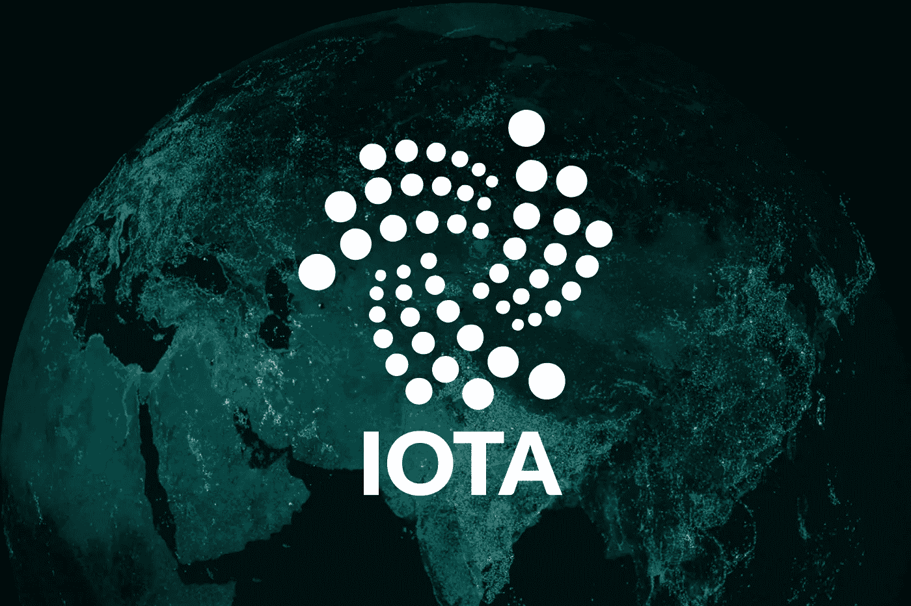
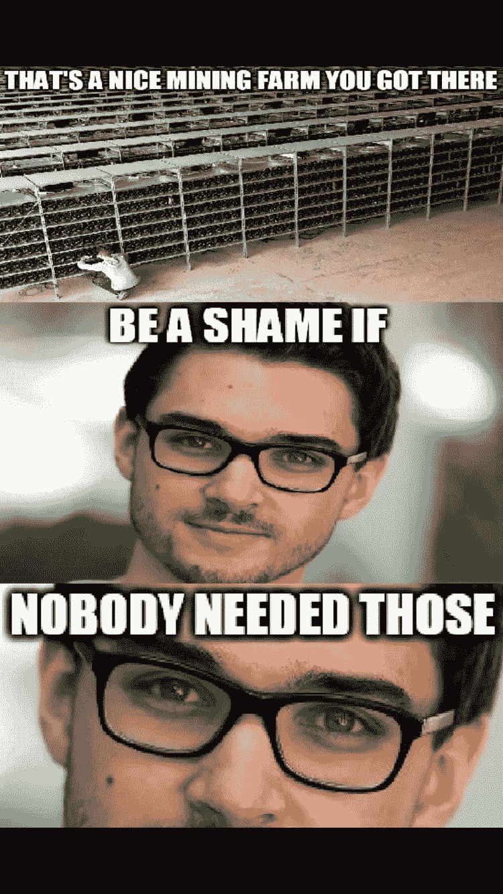
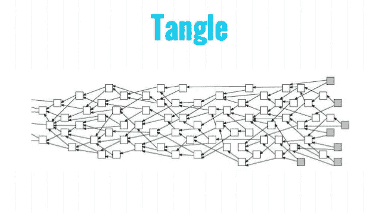
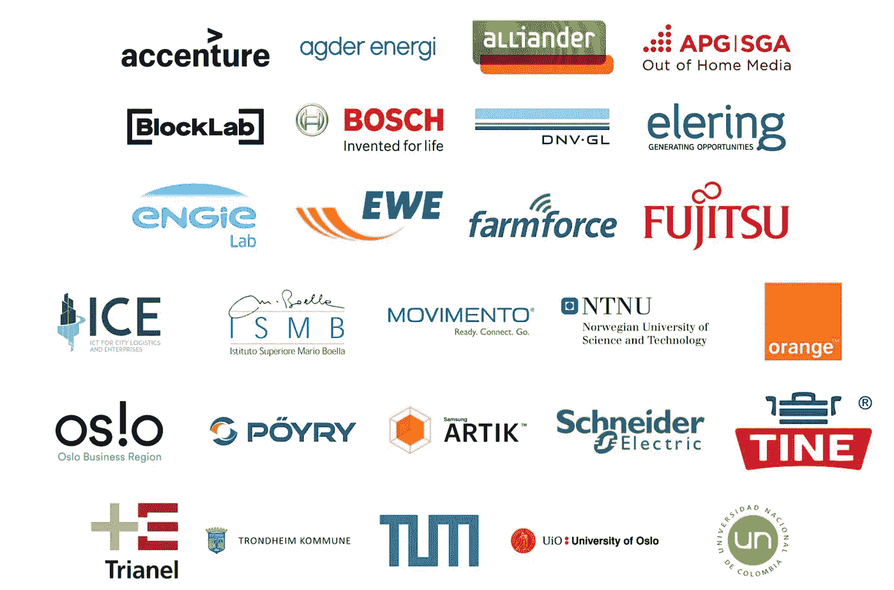
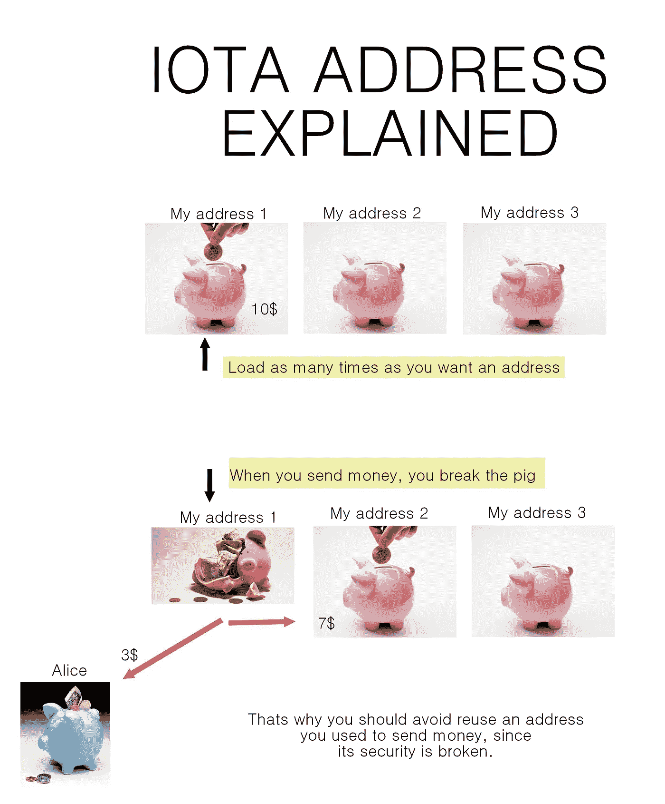

# IOTA:天网的货币

> 原文：<https://medium.com/hackernoon/iota-the-currency-of-skynet-281b6abaec5>

在接下来的几周里，我计划写一篇简短的摘要，总结一下我在当前加密领域最感兴趣的事情。这些文章将拆分回答两个问题:

*   *愿景:他们长期想要实现什么？他们有多大潜力？*
*   *顾虑:他们的项目有什么风险？为什么他们可能无法实现他们的愿景？*

此外，在最后，我还提供了一些要点和有用链接的简短总结。

最近 IOTA 不得不忍受强大的 FUD 浪潮(恐惧，不确定性和怀疑)，主要是因为他们与麻省理工学院媒体实验室的不满，但他们有愿景，他们有资金，最重要的是他们正在召集团队来交付。

# 视力

## 纠结

尽管 IOTA 确实有分布式账本和自己的货币，但它不是基于区块链的。相反，他们为交易创造了一种新的存储方式，他们称之为缠结。它实现了一个没有矿工的无感觉交易系统。

以太坊这个“终极平台”已经被密码猫摧毁了。发送一笔比特币交易要花你 40 块。如传言所说，比特币挖矿比爱尔兰还耗电。现在，加密界普遍接受的观点是，需要矿工和激励的工作证明共识(来自比特币的发明者中本聪)已经过时了。最终，这些区块链系统将转而采用股权证明协议，这使得交易更便宜、更快捷。

[Source](https://busy.org/iota/@goodmindset/iota-meme-20171029t175137372z)

很明显，利益证明协议将在 2018 年接管，但 IOTA 团队已经更进一步。他们把区块链扔进了垃圾桶，取而代之的是，他们把事务存储在一个他们称之为纠结的有向无环图中。跳过这里的细节，这实际上意味着为了发送您的令牌，您必须验证之前的两次交易。就像比特币一样，这相当于解决密码难题，但在计算上效率更高。同样在这种结构下，随着缠结越来越大，速度会越来越快。这与基于区块链的解决方案正好相反。

The Tangle ([Source](https://www.slideshare.net/DominikSchiener/iota-ledger-of-things))

## 机器经济

未来主义者演讲者很长时间以来一直在鹦鹉学舌地谈论物联网以及它将如何融入我们的日常生活。现在你可以在任何商店买到内置 Wi-Fi 的冰箱，甚至连灯具都变得智能，这不再是[未来](https://hackernoon.com/tagged/future)了。但仍在等待智能避孕套。

IOTA 基金会正在非常积极地推动成为即将到来的机器经济的平台。给你的电动汽车智能充电，[给你的智能家居供电](https://i.redd.it/us2eggt21y301.png)，从你的杂货店追踪可疑的中国食品…他们想成为天网的货币。

最近，在 Reddit AMA，他们透露，金融机构也有兴趣使用纠结。鉴于 Ripple 公司的货币 XRP 的价格如何从一些金融试点的公告中飙升，这本身就可能是巨大的。

## 数据市场

能货币化的，就货币化。[数据市场](https://www.youtube.com/watch?v=MQRDpaynuXo)是这里的游戏规则改变者概念。想象一下，有一家前景光明的医疗创业公司。他们想出售一项服务，为你提供建议，以保持讨厌的血压。不用说，基于机器学习算法。但是，如果他们没有数据来训练他们的算法，他们如何开始呢？他们可以去 IOTA 市场，从人们那里购买这些数据，这些人通过提供他们的健康测量来谋生。今天的发展是由数据驱动的。当你可以从中赚钱的时候，你为什么要免费赠送呢？

我认为这很重要，但更重要的是大公司也这样想。市场现在已经做好了测试的准备。根据博世、德国电信、富士通和微软等公司的反馈，他们将发布与数据市场相关的案例研究和概念验证应用。

Participants of IOTA Marketplace ([Source](https://blog.iota.org/iota-data-marketplace-cb6be463ac7f))

# 关系

IOTA 项目非常年轻，雄心勃勃，充满了伟大的概念，但他们还没有交付太多。混乱是功能性的，但它仍然是集中的，钱包是一个痛苦的屁股，团队还不习惯处于聚光灯下。

## 地址重用

许多人因为滥用这个系统而失去了他们的钱。IOTA 的设计方式是，当您进行外发交易时，您的地址会随时改变。在没有技术细节的情况下，这意味着如果你将*x*iota 发送到一个已经有传出交易的地址，这些*x*iota 容易受到暴力攻击。当 IOTA 基金会意识到这个问题时，他们不得不面对一个艰难的决定:

*   什么也不做，眼睁睁看着 IOTA 用户的钱被盗
*   通过将公开地址的内容从公开地址移动到自己的地址来冻结公开地址，并在以后将其交还给用户。

他们最终选择了第二种选择。

IOTA address usage explained ([Source](https://www.reddit.com/r/Iota/comments/7cze8u/iota_address_reuse_explained_for_laymen/))

虽然我认为他们的选择是明智的，但如果人们可以如此容易地把事情搞砸，这显然是一个严重缺陷的迹象。开发商承诺很快会解决这个问题，新的钱包也将在几天内推出。在那之前，我不会推荐使用 IOTA 钱包。

## IOTA 是集中式的

目前是这样。当攻击者拥有总处理能力的 34%时，可以发生 34%的攻击，允许她创建恶意事务。IOTA 依赖于一个协调器，直到它变得足够大，将 34%的攻击几率几乎降低到零。下面是一位开发人员[如何解释](https://www.reddit.com/r/Iota/comments/7c3qu8/coordinator_explained/)协调者的角色:

> 协调者每一分钟都进行一次有其签名的正常交易，我们称之为里程碑。[……]当您想知道交易是否得到验证时，您可以找到最新的里程碑，并查看它是否间接验证了您的交易(即，它验证了您的交易，或者它验证了验证您的交易的交易，或者它验证了验证您的交易的交易的交易，等等)。里程碑存在的原因是，如果您只是选择了任意一个随机事务，那么您所连接的节点有可能是恶意的，试图欺骗您来验证它的事务。

协调器不是开源的，所以我们不能确定它到底是如何做到这一点的。

## 麻省理工学院媒体实验室

这是一块脏东西。麻省理工学院媒体实验室[声称他们在 IOTA](/@neha/cryptographic-vulnerabilities-in-iota-9a6a9ddc4367) 中发现了加密漏洞。当[他们称赞 IOTA](https://www.technologyreview.com/s/609771/a-cryptocurrency-without-a-blockchain-has-been-built-to-outperform-bitcoin/) 时，他们还[与另一家麻省理工学院的衍生公司《麻省理工技术评论](https://www.media.mit.edu/posts/iota-response/)争论。那时 IOTA 基金会已经受够了，于是[发布了一个 4 部分的回应](https://blog.iota.org/official-iota-foundation-response-to-the-digital-currency-initiative-at-the-mit-media-lab-part-1-72434583a2)来解决麻省理工学院媒体实验室的担忧。很难跟上，这是肯定的。

简而言之，麻省理工学院媒体实验室在 Curl-P 哈希函数中发现了一个“实用”漏洞。据我所知，IOTA 有意将此漏洞作为复制保护机制放入函数中。这个“缺陷”然后由协调器来处理，这不是开源的，所以媒体实验室没有知识来衡量这个缺陷的影响。尽管 Curl-P 的创造者 Sergey 私下向他们解释了几次，但他们在未来的文章中坚持他们最初的说法。

## 复制保护

总而言之，IOTA 和麻省理工学院媒体实验室之间的争论最初是基于版权保护机制。就个人而言，我认为开发者知道他们在做什么，但我不得不同意 Etherum in one thing 的创始人 Vitalik Buterin 的观点([完整评论在此](https://www.reddit.com/r/Iota/comments/72org2/vitalik_buterins_response_to_iota_criticism/)):

> 我个人呼吁 IOTA 不要害怕模仿者。以太坊没有。你有机会围绕专门研究达格·区块链理工大学创建一个强大的品牌，特别是如果你能欢迎这类算法的现有研究人员。如果你有这个，那么抄袭者只会是你所能成就的一个影子。

## 有争议的人物

IOTA 的创始人在有人需要被烤的时候不会在社交媒体上退缩。不难发现这样的争斗，但我最喜欢的是[大卫·森斯特博&谢尔盖·伊万格洛与以太坊开发商尼克·约翰逊的冲突。](https://twitter.com/DavidSonstebo/status/912689488236879872)你现在可能已经发现以太坊和 IOTA 之间没有爱情。

张秀坤·席耐尔因在会议上说脏话而闻名。我其实一点也不在乎他们是否自大，只要他们想推动世界前进，但对一些人来说，这是一个红旗。

# TL；速度三角形定位法(dead reckoning)

IOTA 可能是最雄心勃勃的加密项目，这是一个巨大的要求，因为即使是最狗屎的硬币也想颠覆整个行业。

目前，有许多有效的技术问题，但是我们不要忘记，即使相对来说(！)以太坊这样的成熟平台有它的难处。我认为他们已经意识到他们想要的太多太快了:他们接受了 Vitalik 的建议，最近聘请了来自众多领域的数学专家来回答开放性问题。

大多数人忘记了这仍然是一个处于非常早期阶段的项目；没有人声称 IOTA 已经可以生产了。作为使用 DAG 作为分布式分类帐的先驱，预计他们将面临重大问题，就像以太坊已经有足够多的可伸缩性问题。问题可以回答，困难可以解决。

他们的承诺是巨大的，如果他们只能实现其中的一半，IOTA 就会留在这里。对于 IOTA 来说，这是决定性的一年。