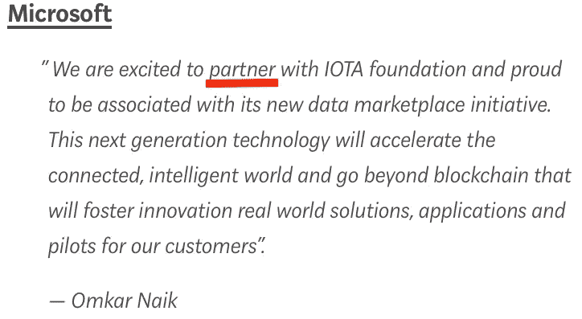
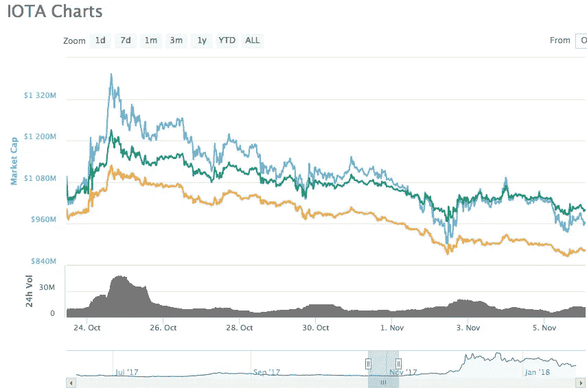

# 为什么 FUD 有意义

> 原文：<https://medium.com/hackernoon/iota-why-the-fud-makes-sense-82a2f1dc38d5>

做了关于 IOTA 的研究(**顺便感谢 1 月前三周** [**超过 10 万的浏览量我的文章**](https://medium.com/@iotasuppoter/latest) **！我认为有必要告知人们关于反对 IOTA 的 FUD(恐惧-不确定-怀疑)运动。**在下面，我将论证 FUD 反对 IOTA 是有道理的，因为 IOTA 本身就是 FUD** ！**

IOTA 是 FUD，因为它导致

*   在那些能抓住 IOTA 潜力的人中间恐惧；
*   有些人担心，如果 IOTA 承诺的只有一半成为现实，他们可能会处于一个非常糟糕的境地；
*   有些人认为他们的其他硬币是安全的投资，现在他们不确定是否还需要这些硬币。

IOTA 让很多人彻夜难眠；当然，以 IOTA 的方式尽可能多地拖动 FUD 对他们来说是有意义的。值得庆幸的是，这些人中的许多人已经为这一大胆的说法提供了足够的证据。我想向您介绍这些人试图阻止 IOTA 实现其目标的方式。

# 示例 1:DCI 攻击

*   像病毒一样传播开来并引起很多 FUD 的断言:

1.  IOTA 的合作关系是“模糊的”，尤其是微软不会成为合作伙伴。
2.  IOTA 不是防篡改的，因为它依赖于集中式协调器
3.  丝毫没有感觉
4.  IOTA 的散列函数容易受到攻击

*   简单解释:

ad 1。:媒体大肆宣传“合作伙伴”一词(尤其是关于微软)。**微软甚至澄清这不是 IOTA 的错**(见 Dom 的引用[此处](https://blog.iota.org/iotas-data-marketplace-setting-the-record-straight-576fbf0b4513))；**他们(！)自己使用了“伙伴”这个术语:**

[https://blog.iota.org/iota-data-marketplace-cb6be463ac7f](https://blog.iota.org/iota-data-marketplace-cb6be463ac7f)

ad 2。:IOTA 基金会的回答:

> 在 IOTA 网络的初期阶段，协调器的目的已经在 IOTA 的整个历史中被透明地传达。正如团队在[长度](https://blog.iota.org/the-transparency-compendium-26aa5bb8e260)中解释的那样，协调器是一种临时措施，用于帮助引导网络，并在网络初期对其进行保护。**一旦有足够的完整节点和事务来保护和维持 IOTA 网络，协调器将从网络中永久移除。** ( [点击](https://blog.iota.org/official-iota-foundation-response-to-the-digital-currency-initiative-at-the-mit-media-lab-part-3-6433b55c7d57))

公元 3 年。:关于“无感觉”一词的纯语义争论，因为需要工作证明。**如果你在世界各地发送 1 美分，接收者得到 1 美分，你会怎么称呼？一旦 [IOTA 硬件微处理器](/@iotasuppoter/iota-the-hardware-part-a6100b5bb4d5)投入使用，这种争论可能会失去基础。**

公元 4 年。:hashfunction 从来就不是一个加密函数。所谓的弱点是为了**的模仿保护**而故意实现的(CfB，IOTA 的 CTO，[在几年前](https://bitcointalk.org/index.php?topic=397183.0)就发明了这种保护，使用的 NXT 源代码是[他(又名 BCNext)自己](https://twitter.com/c___f___b/status/932561535322468352)当时写的)。

重要更新:在这篇文章发表 24 小时后，一个重要的信息被发布了:就漏洞而言，麻省理工学院的指控被揭穿。以下是对这种情况的简单解释，可以理解地解释了这一缺陷:

> 对于一般的外行人来说，这些指控被揭穿是很合乎逻辑的。他们制造漏洞的企图是不可能的，因为 DCI 集团描绘了一种受害者是:
> 
> (a)既足够天真地**遵循来自未知攻击者的明显恶意的指令，又足够有能力在代码编辑器**中手工编码 IOTA 事务，
> 
> 或者(b)天真到**将他们的种子输入到攻击者**提供的一个恶意软件中，此时最初描述的攻击不再存在，因为攻击者现在直接拥有了种子(并且可以访问所有地址上的资金)。
> 
> 当面对攻击的可行性时，DCI 没有解决这些问题，而是误导公众相信 IOTA 网络存在漏洞。
> 
> 更多细节:以下是场景 A 和 B 1 中所需的步骤。攻击者问受害者:“我可以有一个未使用的地址给你寄钱吗？”或者“您能给我发送一个使用您的种子生成的地址的交易吗？”2.攻击者生成一个新的包(事务)，并将其发送给受害者场景 A 3。受害者打开他们的代码编辑器，下载 IOTA 库，输入他们的种子和来自攻击者的交易信息，用代码签署交易，并将签署的信息发送回攻击者。
> 
> 场景 B 3。攻击者还向受害者发送或说服他下载“IOTA Transaction Booster.exe ”,这将提示用户输入他们的种子(即网络钓鱼攻击),此时攻击的其余部分毫无意义，因为种子已经被破坏。种子上所有地址的资金都会受到威胁。

(这就是导致这次揭穿的原因:[点击](https://twitter.com/c___f___b/status/956445618381246464))

任何传播这些错误消息的诚实记者都应该写一份公开道歉；包括麻省理工学院团队！

*   谁是幕后黑手？

[内哈·纳鲁拉](http://nehanarula.org/)

*   DCI 导演
*   在[积极支持](https://www.coindesk.com/bitcoin-lightning-creator-mit-digital-currency-initiative/)比特币闪电网络的开发，这是一个针对快速廉价的**非链交易的提议/实验性解决方案**，旨在解决比特币链上交易速度慢、成本高的问题。

[马达斯·维尔扎](https://madars.org/)

*   DCI 研究员，IOTA 漏洞报告的合著者
*   [零现金白皮书](http://zerocash-project.org/media/pdf/zerocash-extended-20140518.pdf)的合著者
*   加密货币协议 [Zcash](https://z.cash/) 背后的[领导层](http://zerocash-project.org/about_us)的一部分，在撰写本文时，这是一种市值 15 亿美元的加密货币。Zcash 通过[零知识证明](https://en.wikipedia.org/wiki/Zero-knowledge_proof)，声称解决了比特币中**真** **匿名**的问题。

伊森·海尔曼

*   DCI 的合伙人，IOTA 漏洞报告的主要作者
*   DAGLabs 的部分领导层，这是一家总部位于加州的盈利性公司，他们正在基于 SPECTRE 白皮书构建自己的基于 DAG 的协议。(SPECTRE 还声称能够实现**无限的事务可伸缩性**)

[伊藤穰一](https://en.wikipedia.org/wiki/Joi_Ito)

*   麻省理工学院媒体实验室主任(DCI 是其中的一个小部门)
*   撰写了 DCI 发表的关于 IOTA 的最新评论文章。
*   奇怪的是，Joichi 的个人 [COI 披露页面](https://joi.ito.com/coi.html)在他的文章发表后立即更新，该文章删除了氦系统公司的一个 for-proft 董事会职位，该公司的[网站](https://www.helium.com/solutions)称其“以我们竞争对手的一小部分成本提供强大而安全的**物联网设备连接”**

你可以从这些背景和链接中得出你自己的结论来反对 IOTA 有些人可能会称之为**严重的利益冲突**...除此之外，对于 IOTA 的官方回应和 David Sonstebo 关于公开讨论此事的提议都没有官方的答复(甚至得到了亚马逊的 Joanna Bickley 的支持，她自己也差点成为 FUD 的受害者)。邪恶的人是邪恶的。。。

# 例 2:“基金会偷了我们的资金”

10 月 20 日，协调器因为一次严重的攻击而关闭，因此无法再处理事务。此外，用户的资金不得不被“冻结”，因为他们面临着因网络受到攻击而被盗的风险。IOTA 基金会的话从一开始就很明确:

> [……]关闭的主要原因是为了**保护我们的用户**免受正在进行的网络攻击，由于一个错误被迅速处理，这可能会产生更严重的后果。([点击](https://blog.iota.org/gui-v2-5-2-latest-release-with-iota-reclaim-tool-32d364d6241a))

由于这种保护，资金处于风险中的人在打开他们的钱包/余额时只能看到 0 余额。正如基金会承诺的那样，人们收到了他们的资金——尽管比预期的晚了一点(1 月),但在攻击和回报之间的几个月里，IOTA 的价值从 0.42 美元上升到大约 4 美元，所以尽管一些人无法在此期间要求他们的 IOTA，但所有受影响的人都在某种程度上得到了补偿。

尽管如此，一场巨大的 FUD 风暴还是形成了，并在短期内导致了一次下跌:

The price dropped 30% from 50ct back to 35ct as a consequence of the FUD

此外，“IOTA 基金会窃取了我们的资金”作为一个论点一直存在到撰写本报告时，尽管资金早已归还。

# 例子 3:Bitcoin.com 的“新闻”

*   这引起了很多 FUD 的断言: [IOTA 的钱包不安全，这就是为什么人们损失了 400 多万美元](https://news.bitcoin.com/iota-attacked-for-subpar-wallet-security-following-4m-hack/)。
*   简单的解释:无论是钱包还是 Tangle (IOTA 的分类账)都没有任何风险——人们之所以会失去他们的钱，是因为他们使用了钓鱼网页来为钱包创建种子。更多信息请点击[。](/@ralf/what-happened-last-night-on-iota-b6157ade1e03)
*   谁是幕后黑手？

阿维·米兹拉希

*   bitcoin.com 的记者
*   从 2013 年开始报道比特币
*   在从伦敦到香港的世界各地的众多金融会议上，我都谈到了加密货币和区块链技术的前景。(注意 [IOTA 不是区块链而是 DLT](https://learn.iota.org/faq/how-is-iota-different-from-blockchain) )

问题不在于 Mizrahi 在 Twitter 上的 875 名粉丝，而是他在最大的加密货币网站之一(231，000 名 Twitter 粉丝)上传播这样的虚假 FUD。人们信任这样的大网站:

这是一个耻辱，这样的“记者”可以在这样一个高度尊重的网站上传播他们毫无根据的指控。

当然，对于 IOTA 这个最大的竞争对手之一来说，Bitcoin.com 对这样的消息并不感到不快。**顺便说一下:这是迄今为止关于 bitcoin.com 的唯一一篇关于 IOTA 的文章(好像只有这样的“负面新闻”)。。。**

# 例子 4:Coinmarketcap.com

几天前，coinmarketcap.com 决定将韩国价格排除在货币市场之外，这引发了全球抛售，因为价格突然发生了变化，人们认为末日即将到来。

然而，IOTA 几个月来一直是这项政策的受害者。IOTA 的价格被人为地保持在比其他公司低的水平，因为(较高的)[韩国价格被排除在外](https://twitter.com/RomanSemko/status/937997371522408448)从而导致 IOTA 的市值较低，这引发了一个问题[他们为什么要这样做](https://twitter.com/grobian1/status/944946282937901059)；在上述全球范围的价格效应出现之前，我曾亲自告诉 CMC:

如果考虑到 Coinone 的价格，IOTA 的市值会高得多…

# 例子 5: Reddit

Reddit 是互联网上最重要的信息服务之一。人们可以在那里发布(链接到)新闻，反过来，这些新闻可以被更多的人看到。所有的加密货币都利用这项服务来吸引人们对重大新闻的注意力。

然而，当谈到/CryptoCurrency subreddit 上的 IOTA 时，reddit 用户似乎在审查方面非常严格(至少可以这么说):评论立即被锁定，这立刻扼杀了任何讨论(只是最近的一些例子 [1](https://www.reddit.com/r/CryptoCurrency/comments/7scvui/so_what_is_going_on_with_iota_a_discussion_with/?ref=share&ref_source=link) 、 [2](https://www.reddit.com/r/CryptoCurrency/comments/7s9efl/explaining_directed_acylic_graph_dag_the_real/?ref=share&ref_source=link) 、 [3](https://www.reddit.com/r/CryptoCurrency/comments/7sa2ci/bosch_connected_devices_and_solutions_bosch_bcds/?ref=share&ref_source=link) )。

显然，人们报告 IOTA 新闻是“垃圾邮件”,所以自动模式锁定评论部分，直到人类模式再次打开它。或者(这种情况更常见)有几个人报告了一个新话题，这导致 automod 将该话题标记为“有争议”并禁用评论部分。结果，IOTA 主题被标记为“有争议的”,甚至被完全关闭——无论哪种情况，人们都无法真正了解这个好消息。

当然，**这不是 Reddit 的错**(尽管更多的工作人员肯定会有所帮助)，但这表明许多人在尽他们所能阻止传播 IOTA 的好消息。

# 结论

你可能会认为这听起来像一个阴谋论，我必须承认，确实如此。开发者们不止一次地表示，他们对 IOTA 遇到如此多的阻力感到非常惊讶。出现这种情况的原因是什么？

1.  可以看出，许多 coins(或者更确切地说是他们的开发团队)有理由认为 IOTA **对他们自己的应用领域**是一个真正的威胁(否则为什么一个 [BTC 开发者](https://twitter.com/peterktodd/status/942206322023587840)或 [LTC 创始人](https://twitter.com/SatoshiLite/status/939687612721250304)会发布这样的推文？)——FUD 是让利益相关方产生怀疑的有力手段。
2.  人们看到 IOTA 的潜力**想尽可能便宜的买**。为了做到这一点，他们想尽一切办法压低价格——包括 FUD。

不管怎样，捏造事实是有道理的。

好消息是，IOTA 只是在学习走路，所以猜猜一旦产品准备好生产([这是 2018](https://blog.iota.org/2017-in-review-2018-in-preview-704177484ef0) 的目标)，配备最新技术以确保资金安全，并由世界领先的轻量级加密和安全公司审计[，所有 FUD 会发生什么？](https://blog.iota.org/iota-foundation-hires-cybercrypt-615d2df79001)

[我们很快就会看到这一点](https://blog.goodaudience.com/why-keeping-your-iota-makes-sense-75e8a74cf2ee)——在那之前，每个人都应该比阅读随机的推文或相信 reddit 旗帜更深入地挖掘，以质疑其真实性和可信度。

如果你喜欢这篇文章或者我的其他文章，我会很乐意给你一点捐赠；-):

IOTA:kgozyhjryvdbsxtusecyjvebldvyfkcakawtptckxmbnownvrdhrvsjnivoqufrodfpxfwysgrokrwzwjztjohsx

**重要提示**:在 IOTA 运动中，不存在针对其他硬币、人、银行或任何东西的内在仇恨！相反，IOTA 的主要关注点之一是它与其他项目和技术的互操作性。写这篇文章是因为已经到了这样一个地步，你必须为“你的”项目辩护，反对未经证实的指控。

