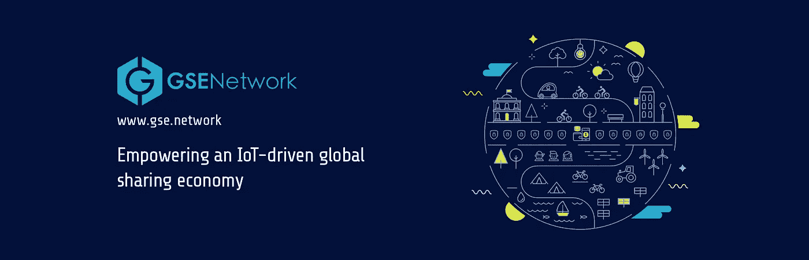
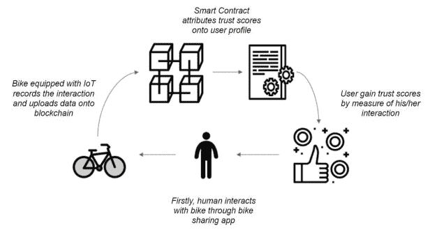
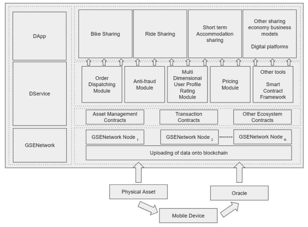
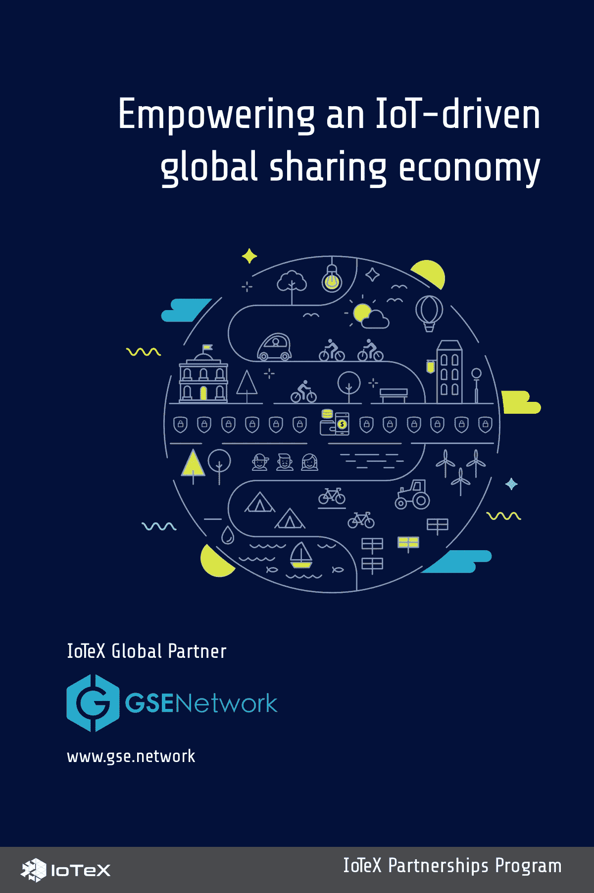

# IoTeX & GSENetwork:赋能物联网驱动的全球共享经济

> 原文：<https://medium.com/hackernoon/iotex-gsenetwork-empowering-an-iot-driven-global-sharing-economy-f2fe9afafcec>

资产所有权一直是全球成功的基准。纵观历史，富人买得起自己的“东西”，穷人不得不分享自己的“东西”。然而，今天我们看到了一个相反的新兴趋势，尤其是在千禧一代中，拥有*更少*和分享*更多*是首选。这种现象表现在共享经济中，它允许对等共享对各种商品/服务(例如，房子、汽车、工具)的访问，以换取金钱或其他商品/服务。在有效连接供应商和消费者的新技术(如优步、Airbnb、ofo)的推动下，全球共享经济目前估计到 2025 年将达到 3，350 亿美元。

共享经济已经为供应商和消费者带来了许多新的机会，最显著的是更便宜、更容易地获得商品/服务。然而，它也面临着许多阻碍增长的挑战，如欺诈、资产维护和缺乏通用标准/法规。今天，我们很高兴地宣布与 GSENetwork 的合作，GSENetwork 是一个用于共享经济的分散式信任网络，旨在解决这些挑战，并利用物联网和区块链技术释放共享经济的全部潜力。

> *“通过与 IoTeX 联手，我们希望通过创建一个分散的、相互依赖的用户和提供商网络，来支持全球共享经济的增长和转型。”*
> 
> ***——张俭，GSENetwork*** 联合创始人

# **什么是 GSENetwork？**

总部位于新加坡的 GSENetwork 正在建立一个分散的共享经济网络，其目标是消除对集中式中介的需求，并解决目前阻碍共享经济增长的信任问题。他们的团队由顶级工程师、共享经济专家和区块链资深人士组成，他们都相信区块链技术将实现共享经济的未来。GSENetwork 利用三大支柱技术解决方案(分散服务(d Service)平台、激励模型和信任网络)无缝连接世界任何地方的用户、资产和服务的交互。

GSENetwork 的愿景得到了全球共享经济创新者的认同，他们与全球领先的自行车共享平台 ofo 的战略合作伙伴关系就是明证。作为与 ofo 合作的一部分，两家公司推出了“Ride & Earn”活动，为在新加坡、日本和韩国完成 ofo 骑行的 ofo 用户奖励 GSE 代币。虽然这个最初的试点专注于自行车共享，但 GSENetwork 希望在 2019 年在几个不同的用例中推出额外的试点。

# 【GSENetwork 将如何使用 IoTeX 的区块链？

GSENetwork 目前正在构建他们的三支柱基础设施，以实现第二代共享经济。除了激励模型和信任网络支柱之外，第三个支柱是去中心化服务(d Service)平台，它作为“中间件”，将构建在 GSENetwork 上的共享经济 DApps 与基础“主链”基础架构层连接起来。DService 的核心组件包括订单调度模块、反欺诈模块、多维用户档案评级模块、透明定价系统，如下图所示。

GSENetwork 的数据服务层及其各种组件将与 IoTeX 区块链交互，后者将作为基础“主链”基础设施层，并满足任何物联网设备相关的要求。此外，IoTeX 将通过提供其他有用的构建模块来支持 GSENetwork，例如我们的 Roll-DPoS 共识机制、智能合同、隐私等。正如在他们的[白皮书](https://www.gse.network/static/media/whitepaper.pdf)中提到的，GSENetwork 将他们的理想基础设施层描述为具有 DPoS 共识机制、侧链支持和智能合约功能，所有这些都由 IoTeX 提供。在整个合作过程中，我们将探索 GSENetwork 平台的各种 IoTeX 特性的实现。

# **合作的目标是什么？**

我们合作的主要目的是通过整合智能物联网设备、区块链技术和象征性经济激励措施，扩展当今共享经济的能力。除了解决现有的共享经济问题，我们的长期目标是设计和推出可用于多个共享经济领域的全新功能，如增强的流程自动化(如智能锁)、资产可追溯性(如共享自行车、共享汽车)和用户数据隐私。

在近期，我们将与 GSENetwork 合作进行初步的概念验证，以将我们各自的技术应用到物联网设备上，从自行车共享智能锁开始。我们将合作设计一款智能锁，采用行业标准硬件、支持区块链的固件和服务器管理工具。这些智能锁将安装在自行车上，作为试运行的一部分，骑行时间、路线、用户信息等数据将由每个锁计算并存储在区块链上。展望未来，我们将在其他概念验证用例中实现这种智能锁，如汽车共享、家庭共享、按需包裹交付等。

# 关于 IoTeX

IoTeX 是物联网(IoT)的自动扩展和以隐私为中心的区块链基础设施。IoTeX 的全球团队由密码学、分布式系统和机器学习领域的博士、顶级工程师和经验丰富的生态系统构建者组成。IoTeX 正在开发几项内部创新，以推动区块链 3.0 的前沿，包括用于异构计算的区块链-区块链架构、闪电般快速的 Roll-DPoS 共识机制和轻量级隐私保护技术。IoTeX 通过“一个接一个地连接物理世界”，将自主设备协调带给大众。

> *网址:*[*https://iotex.io/*](https://iotex.io/) *推特:*[*https://twitter.com/iotex_io*](https://twitter.com/iotex_io) *电报通知渠道:*[*https://t.me/iotexchannel*](https://t.me/iotexchannel) *电报组:*[*https://t.me/IoTeXGroup*](https://t.me/IoTeXGroup) *中:*[*https://medium.com/@iotex*](/@iotex)