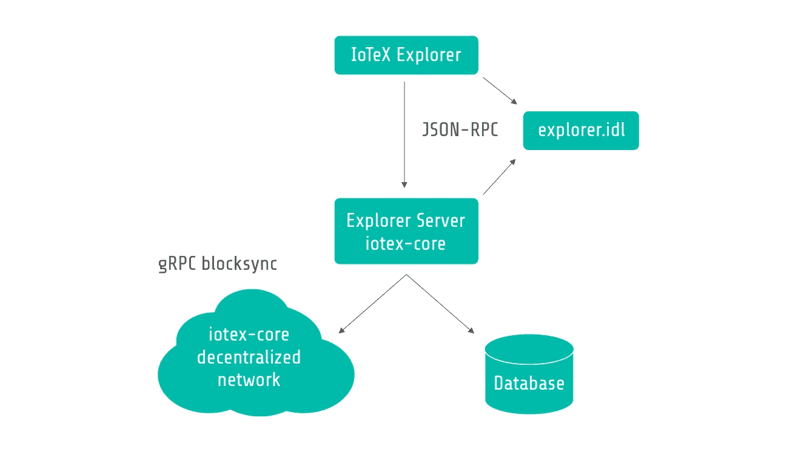

# IoTeX 网络浏览器已经开源！

> 原文：<https://medium.com/hackernoon/iotex-network-explorer-has-been-open-sourced-27479bd13101>

大家好！自从我们在 [Testnet Alpha:奋力发布](/iotex/iotex-testnet-alpha-strive-release-fbd83718f614)中发布我们的第一个版本 [IoTeX 网络浏览器](https://iotexscan.io/)已经过去了四个月。在测试和报告问题的我们亲爱的社区的帮助下，以及我们工程团队的辛勤工作，现在我们很高兴地宣布 IoTeX 网络浏览器已经在 GitHub 上**完全开源**！使用 iotex-core，这个 repo 允许每个人**将现有的节点/端口连接到一个自建的浏览器**和**在前端监控区块链活动**！

# 什么是 IoTeX Explorer？

IoTeX Explorer 是一个前端可视化工具，用于详细说明与 IoTeX Testnet 相关的关键指标，以及阐明 Roll-DPoS 共识机制和代表投票流程的运作方式。当前的代码库运行在部署在数字海洋上的 docker 容器中，在这里我们模拟令牌传输和每个时期候选人和代表之间的投票，通过 P2P 网络进行通信。我们还能够向测试网添加任意数量的全节点和轻节点，但是在这个可视化工具中，我们只关注候选节点和代表节点。简而言之 IoTeX Explorer 可视化了 IoTeX 的 Testnet 的阻塞、传输和表决历史。你可以在我们的[奋斗演示视频](https://youtu.be/KAw7_H71o7s)中看到 IoTeX Explorer 的详细演示。

 [## 区块链探索者- IoTeX

### 编辑描述

iotexscan.io](https://iotexscan.io/) 

# 为什么要开源？

当我们发布我们的 [Testnet Beta](/iotex/iotex-testnet-beta-epik-release-4d972efd9638) 版本时，我们已经听到许多人询问如何参与我们的技术开发，基于我们的平台构建&测试您自己的网络/应用。它完全符合我们之前在 [Testnet Beta](/iotex/iotex-testnet-beta-epik-release-4d972efd9638) 中的方法，将可用性作为用户、开发者和 IoTeX 之间的桥梁，并尽力为我们的社区提供更多的工具/资源来学习、测试和娱乐。

在过去的几个月里，我们在 GitHub 上保持活跃，并希望使 IoTeX Explorer 成为一个成功的开源项目，在那里您可以了解我们如何构建当前的 Explorer 门户并自己尝试——提供一种我们可以与社区合作的方式，使 IoTeX 网络惠及每个人。

# 怎么玩？

在我们之前的开源 repo: iotexproject/iotex-core 中，我们已经介绍了如何用我们开源的 repo 实现 iotex 协议。欢迎每个人在组件最低要求下运行代码，在 IoTeX 网络上构建自己的节点。

 [## iotexproject/iotex-core

### IoTeX 协议的正式实施。通过创建一个……

github.com](https://github.com/iotexproject/iotex-core) 

在 IoTeX 网络中，浏览器作为完整节点运行，这样它将与网络中的其他节点通信，以不断更新链数据库。然后，它从数据库中读取数据，并通过 JSON-RPC 回复客户端。

RFC iotex-explorer Architecture

现在，通过 GitHub 上的 Explorer repo，您可以构建自己的浏览器，并将其与现有的节点/端口连接，以监控区块链状态并检查前端网站的交易细节。也就是说，现在您能够以更直观的方式检查自己节点的活动了！请在自述文件中找到详细说明。

 [## iotexproject/iotex-explorer

### IoTeX 区块链官方探索者！通过在…上创建帐户，为 iotexproject/iotex-explorer 开发做出贡献

github.com](https://github.com/iotexproject/iotex-explorer) 

Explorer 只是第一步——我们将逐步开源更多的项目代码，以支持我们的社区测试和使用多种功能，并为区块链开发做出贡献。请继续关注我们未来的公告！

# 代码贡献—我们需要您的帮助！

目前，我们的回购仍处于 alpha 阶段，支持的功能有限，并且会发生快速变化。欢迎并非常感谢大家为帮助 IoTeX 发挥其全部潜力所做的贡献，包括样式/错误修复、功能推荐、方案/算法建议以及文档帮助。对于代码贡献，请参考我们的贡献指南了解更多信息。要报告问题，请在我们的 Github 页面上提交问题。

 [## iotexproject/iotex-explorer

### IoTeX 区块链官方探索者！通过在…上创建帐户，为 iotexproject/iotex-explorer 开发做出贡献

github.com](https://github.com/iotexproject/iotex-explorer/issues) 

随着我们进入 Mainnet 构建阶段，我们将很快开始我们的开发者奖金活动，共同构建和改进 IoTeX 网络。请确保您已经在我们的电报、Twitter 上关注了我们，并订阅了我们的时事通讯，以接收最新的公告！

# 关于 IoTeX

IoTeX 是物联网(IoT)的自动扩展和以隐私为中心的区块链平台。IoTeX 的全球团队由杰出的研究科学家、顶级工程师和经验丰富的生态系统建设者组成。IoTeX 正在开发几项内部创新，以推进区块链 3.0 的前沿，包括用于异构计算的区块链-区块链架构、用于高可扩展性的 Roll-DPoS 共识机制以及轻量级隐私保护技术。IoTeX 通过“一个接一个地连接物理世界”，将自主设备协调带给大众。

与我们保持联系！

> 网址:[https://iotex.io/](https://iotex.io/)
> 推特:[https://twitter.com/iotex_io](https://twitter.com/iotex_io)
> 电报公告频道:[https://t.me/iotexchannel](https://t.me/iotexchannel)
> 电报组:[https://t.me/IoTeXGroup](https://t.me/IoTeXGroup)
> 中:[https://medium.com/@iotex](/@iotex)
> Reddit:[https://www.reddit.com/r/IoTeX/](https://www.reddit.com/r/IoTeX/)
> 加入我们:[https://iotex.io/careers](https://iotex.io/careers)