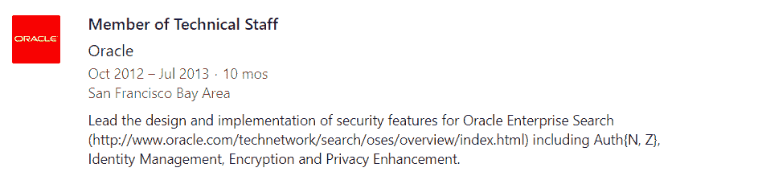
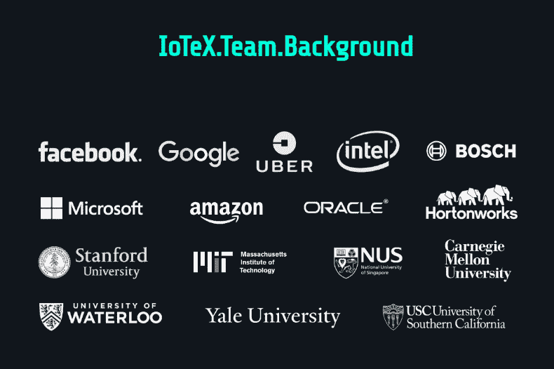
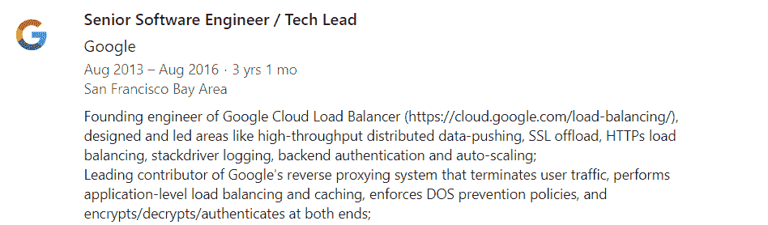
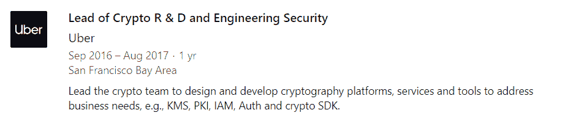
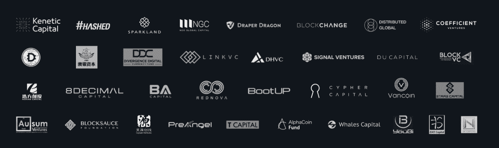

# IoTeX:项目背后的人

> 原文：<https://medium.com/hackernoon/iotex-the-people-behind-the-project-7f2a89c7f383>

我已经有一段时间没有写作了，因为，正如你们大多数人所知道的，我只喜欢写我真正感兴趣的事情，而让我感兴趣并愿意分享的项目少之又少。在过去的几个月中，我一直在谈论的一个项目是 IoTeX，本文将作为一系列文章中的第一部分，详细介绍其中的原因。先说团队。

粗略浏览一下 IoTeX 网站，你会有足够的时间偶然发现这张图片——团队背景。IoTeX 团队由一系列精英大学和 S 级公司组成，是我今年在任何新的区块链项目中见过的学术和工业专业知识的最完美结合之一。这些标志不仅代表短期的实习或研究伙伴关系，也代表充满影响力和成就的长期职业生涯。我从来都不是一个只看表面的人，所以我决定深入了解他们的背景，从四位创始人开始。他们的背景作为个人令人印象深刻，但作为一个整体更令人印象深刻。Raullen 在尖端安全和基础设施领域的经验、新新在物联网设备和密码学方面的丰富知识、Qevan 设计和制造数字消费产品的能力以及 Jing 在 VC+创业公司的过往记录——这个创始团队的深度是成功的秘诀。

## Raullen Chai(滑铁卢大学、甲骨文、谷歌、优步)

Raullen 于 2008 年在滑铁卢大学获得电子和计算机工程博士学位，开始了他的研究，对一些人来说，这是 Vitalik Buterin 研究计算机科学的地方。4 年后，他进入工业界，作为一名软件工程师在甲骨文公司工作，利用他的博士学位主要研究隐私和加密。

从那里他去了谷歌，担任高级软件工程师和技术主管，在那里他创建了[谷歌云负载平衡器](https://cloud.google.com/load-balancing/)，这基本上是一种允许非常大和要求高的网络大规模处理重负载的服务。Raullen 创建的 HTTP/S 负载平衡器实际上是允许 Pokemon Go 运行和处理尽可能多的 p2p 交易的系统的一部分。劳伦[在 2016 年发布了这一成功](https://plus.google.com/115064429194340738938/posts/VhJfRd9ebt9)，当时他还在谷歌工作。不仅从这样的角色中获得了大量的技术经验，而且显然工作关系和网络能力也将对 IoTeX 有很大的帮助，正如我们最近看到的由 [Kubernetes](/@iotex/76a2cc547459) 支持的 IoTeX 开发，这是一个集装箱化项目，来自与劳伦密切合作的谷歌团队。

在谷歌之后，劳伦走得更远，成为了拼车巨头优步的 R&D 加密部门主管。在这个职位上，Raullen 领导着一个由高级密码学家和工程师组成的团队开发工具，用于优步最先进的技术堆栈。

滑铁卢、甲骨文和优步对加密和隐私的关注，加上谷歌对可扩展性和负载平衡的关注，是实现 IoTeX 为物联网构建以隐私为中心的可扩展网络的目标所需的技术知识的完美结合。

## 范欣欣(滑铁卢大学博世分校)

虽然 Raullen 的研究和职责主要植根于大规模基础设施，但新新的专业知识是结合物联网硬件、连接和加密技术来设计和实施现实世界的物联网解决方案..像 Raullen 一样，Xinxin 从滑铁卢大学获得了博士学位，在那里他管理了为期 5 年、价值 170 万美元的安大略研究基金，用于开发下一代安全和隐私解决方案。他在该大学工作了 8 年多，在此期间完成了机器对机器(M2M)通信和物联网系统的应用研究，从光加密到 NFC 技术。

离开大学后，辛欣去了博世担任高级研究工程师，继续他在安全和隐私小组的应用物联网研究工作。对于那些不知道的人，博世是世界领先的跨国工程和电子公司，总部设在德国。他们是世界上最大的设备制造商之一，正在大力推动物联网创新行业向前发展。Xinxin 在大规模物联网实施方面的经验，以及他在博世 4 年的人脉，将极大地有助于确保与 IoTeX 企业的合作伙伴关系。除了在大学和行业取得的成就之外，Xinxin 还是通过私有 p2p 网络实现信息安全的 [7 项专利申请](https://www.freshpatents.com/Xinxin-Fan-Pittsburgh-invdxf.php)的发明人，他在顶级期刊、会议和研讨会上发表了 40 多篇参考论文，其中一些完全基于他为 IoTeX 所做的工作。

## Qevan Guo(新加坡国立大学，脸书)

与前面讨论过的两位创始人不同，Qevan Guo 没有隐私和密码学方面的研究背景，但他的背景仍然令人印象深刻。Qevan 在新加坡顶尖大学获得了计算机视觉博士学位，在那里他从事人工智能和机器学习的前沿工作。获得博士学位后，他于 2011 年加入脸书，在那里工作了 7 年。在脸书，Qevan 领导了几个团队，作为他们的 ads 平台和各种其他产品的研究科学家和工程主管。换句话说，Qevan 知道如何带领团队打造面向消费者的有效产品，这对任何区块链平台的成功都至关重要。做一些背景研究来证实，我们可以找到 Qevan 在这个研究领域发表的许多[论文](https://scholar.google.com/citations?user=em0P5ugAAAAJ&hl=en)，引用令人印象深刻。除了他的论文，他还在自己的专业领域拥有大量有效的[专利](https://patents.google.com/?inventor=Dong+Guo&assignee=Facebook%2c+Inc.)，其中一些是他在脸书任职期间提交的。

很明显，团队良好的软件开发实践不是巧合。我从来没有这么好地跟踪过一个坚持发布日期和截止日期的项目。在脸书、思科和优步等地，整个团队积累的不同经验肯定是部分原因。

## 孙静(斯帕克兰首都)

最后，我们有孙静。自 2014 年以来，景一直是风险投资公司 Sparkland Capital 的管理合伙人，该公司投资前沿技术，并多次成功退出。在此之前，Jing 在美国和海外担任记者、金融分析师和战略规划员，在淡马锡控股和瀚海投资等公司积累了丰富的经验。其他创始人可能缺乏的商业发展经验，景都提供了。她有着成功的职业生涯，在投资领域有着丰富的经验，并且非常清楚一家新的硅谷创业公司需要什么才能成长和繁荣。她是许多公司的董事会董事，在创业、投资和生态系统建设方面拥有丰富的经验。

[https://twitter.com/iotex_io/status/1063512043242713088](https://twitter.com/iotex_io/status/1063512043242713088)

*IoTeX’s private sale investors*

今年早些时候，IoTeX 在向大型机构投资公司(如 Kenetic、HASHED、NEO Global Capital 和 Tim Draper 的 DraperDragon)的私人代币销售中提高了 2500 万美元的硬上限。如果有人知道如何向这样的投资公司推销，那就是景，拥有这样的关系可以让 IoTeX 这样的小型动态初创公司进入房间，与、Delta、Siemens 和 Tata 这样的巨头进行一对一的会谈。这些机会的重要性不可低估，这是关系开始形成的地方，有一天会变成试点项目，并最终成为全面的合作伙伴关系。目前，这个领域有太多的项目过于专注于技术，或者过于专注于商业和“合作伙伴关系”，但这种创始人组合为 IoTeX 提供了一种奇妙的平衡，以获得两者的最佳效果。

除了联合创始人之外，技术团队中还有一个非常强大的工程师团队，他们负责 IoTeX 网络解决方案的底层实施。因为他们还没有在官方网站上，我不会在这里包括他们，但他们的背景一样令人印象深刻，他们有来自耶鲁大学，麻省理工学院，谷歌，微软，亚马逊和更多的经验。一旦新网站建立并运行，提供他们的完整资料，请留意一篇关于他们的文章。

*我的推特粉丝总是第一个知道我的最新选择，所以* [*关注我的推特*](http://twitter.com/cryptweeter) *保持领先。*