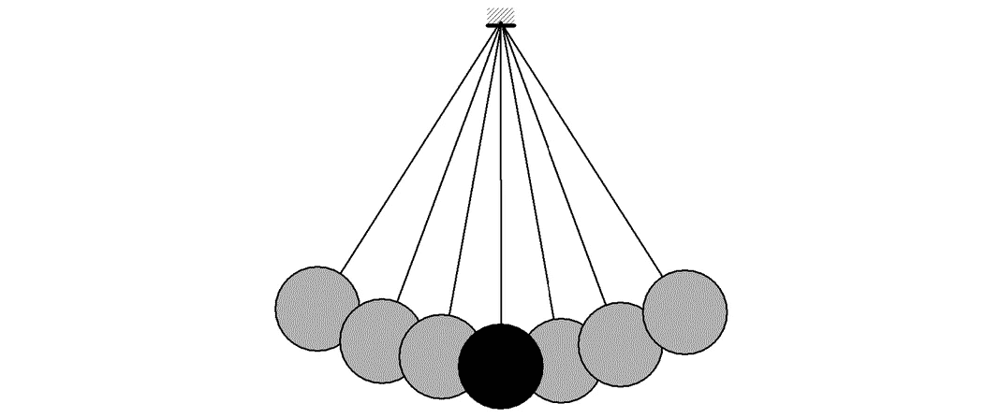
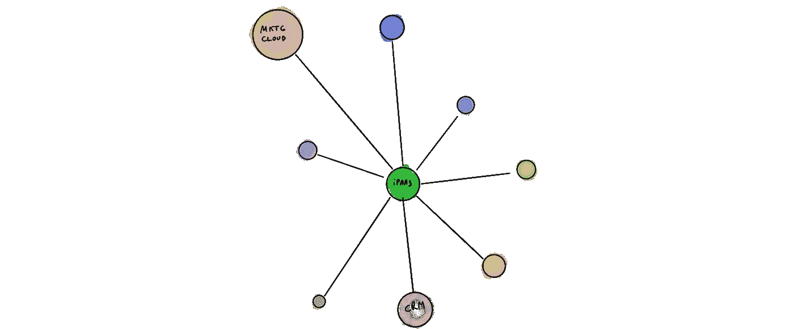
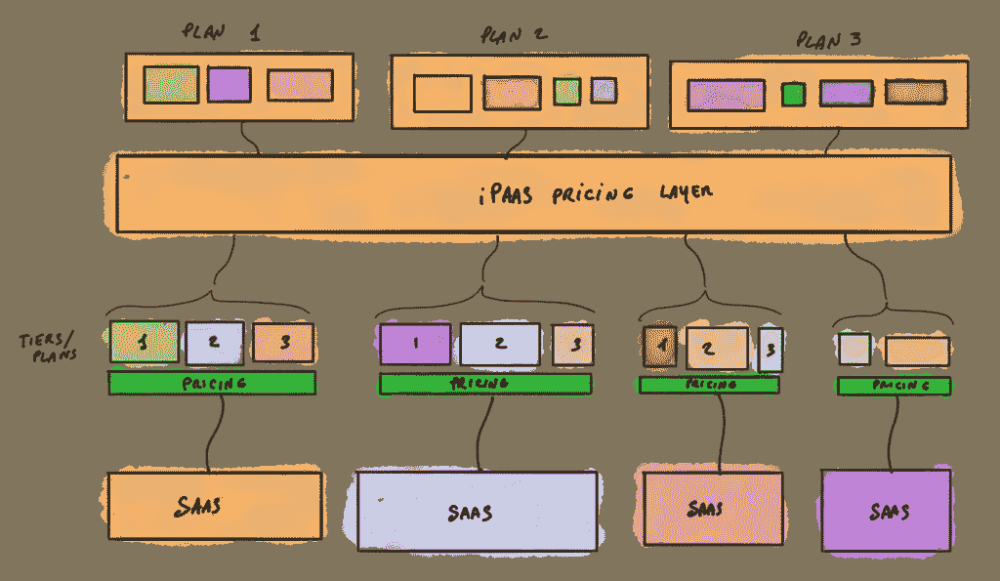
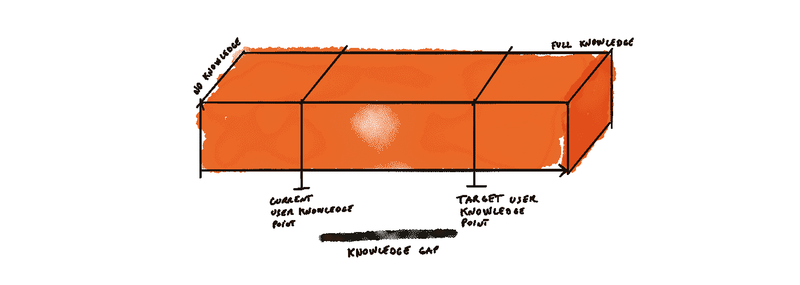
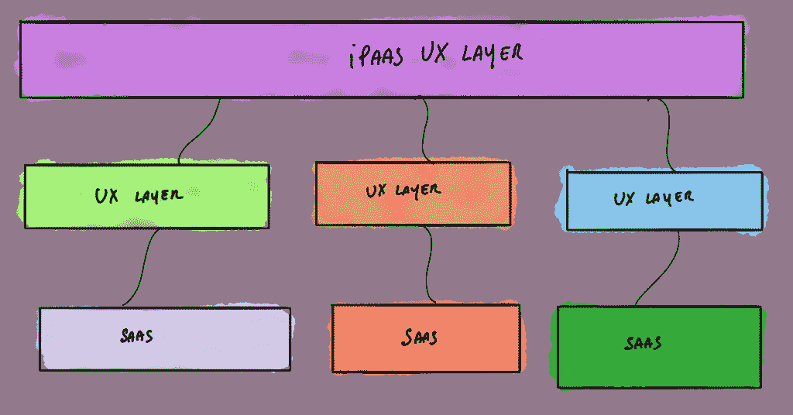
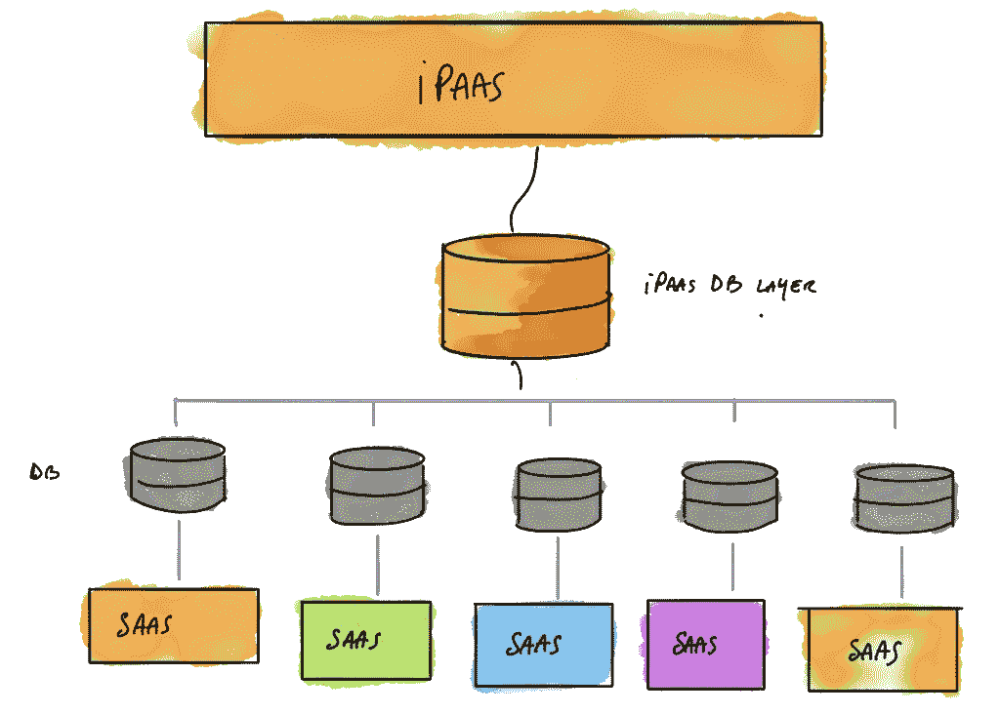

# iPaaS 将成为客户体验的抽象层

> 原文：<https://medium.com/hackernoon/ipaas-will-be-the-ipaas-for-customer-experience-da7040ad89b5>

营销就像一个巨大的钟摆。

一年前有效的方法今天可能不再有效。今天有效的可能一年后就不再有效了。在 SaaS 和数字产品的时代，机会变得饱和，最佳实践被过度使用，一切突然变得高度可测量、更加可预测和过度优化。随着时间的推移，我们所依赖的东西变得不那么有效，其效率也逐渐消失。

营销中的一切都是这个规律注定的。

在我的上一篇文章中，我概述了我们在过去 5 到 7 年中目睹的过程，本质上是营销栈的深度[去中心化。我们开始认为，由不同的垂直、松散耦合的高度专业化产品组成的群岛，将比传统的单一方法更好地服务于营销。](https://www.plainflow.com/blog/microservices-future-approach-marketing/)

虽然这种“微服务营销”方法相对较新，并且在行业中分布不均匀，但它已经被一些最优秀的[软件公司](http://grow.segment.com/the-modern-marketing-stack.pdf)广泛采用。

对于这些企业中的大多数来说，这是一个真正的游戏规则改变者。它允许这些组织设计更好和更相关的客户旅程，更有创造性和效率，并带来更多的收入。

使用微服务设计方法有明显的好处。这些优势包括成本效益、更大的灵活性而没有供应商锁定的风险，以及客户体验的总体优化。

但不是所有闪光的东西都是金子。

这种[大规模的分散化](http://chiefmartec.com/2017/07/marketing-technology-post-platform-era/)导致了许多弊端，将引发向部分市场重新集中的过渡。

以下是这些整合趋势将如何在营销技术领域体现出来:

# 面向客户体验的 iPaaS 抽象层

[iPaaS](https://hackernoon.com/tagged/ipaas) ( [集成平台即服务](http://searchcloudapplications.techtarget.com/definition/iPaaS-Integration-platform-as-a-service))将会出现在技术领域，它是高度专业于营销技术的系统协调者，能够通过 web APIs 无缝协调不同的产品。

[Segment](https://segment.com/) 是一款很早就理解这一点的软件，它帮助企业无缝集成不同的产品，而没有传统的工程爆发。

我们将要深入得多。

企业实际上不仅需要系统来集成，还需要系统来协调来自各种系统的输入和输出，这些系统包括在其堆栈中的。

iPaaS 将解决这个问题，并将自己确立为客户体验的抽象层，就像 Docker 容器已经成为 OS 之上的[抽象层一样。](https://www.docker.com/what-container)

# SaaS 定价冗余

当您使用以多种方式收费的多个 SaaS 产品时(按座位、按使用、按生成的结果、按 API 调用等)..)你的营销技术支出可能变得高度不可预测。

今天的 SaaS 系统的定价方法是极其相互关联的，并且依赖于大量的因变量。您拥有的销售线索越多，CRM 中可用的席位就越少，丰富这些潜在客户的 API 调用就越多，您需要发送的电子邮件就越多。

对于每个客户运营单位，您的定价可能会以非线性方式增加。在你的软件产品之间找到一个配置平衡完全是一团乱麻。

iPaaS 将通过制作捆绑包来抽象定价层的复杂性，捆绑包中包含了您组成堆栈所需的适量软件。

通过支付一个单一的价格等级，你将获得大量潜在的、无形的产品。

# iPaaS UX 共享层

工具的爆炸让公司变得更加灵活，但它也需要在应用程序之间来回移动来完成给定的任务(浪费的时间比你想象的要多)。

使用微服务设计方法，您仍然可以使用各种接口，这些接口以多种不同的方式运行。

他们每个人都有自己独特的方式，需要自己的学习曲线。

组织需要高度专业化的垂直产品，以获得最终的产出和对业务的相关影响，而不是因为他们喜欢使用多种界面。(他们希望在整个堆栈中使用“最佳”:最佳丰富产品、最佳预测分析产品、最佳电子邮件发送软件、最佳 NPL 文本解析工具等..)

SaaS 爆炸将我们“工作”的这些元素分散到十几个工作区，使我们无法专注于一个自我封闭的环境。从纯粹的常规角度来看，今天的转换成本比以往任何时候都高。

我们将会看到新一波[反活跃使用产品](https://www.plainflow.com/blog/next-generation-saas-user-engagement/)颠覆传统模式。

您不一定需要使用高级产品的接口来完成某件事情，您只需要使用输出。反活性使用产品在其价值链的任何层面都不需要人工交互。

在 iPaaS 方面将会有很多 UX 挑战，以使共享的 UX 基线足够灵活，可以建模并适应各种第三方产品。与此同时，这些低端产品[也将在如何向他们自己的客户传达和展示价值方面受到挑战](/@matttharp/interesting-topic-1893398b17e3)。

# iPaaS 客户数据无处不在

今天的客户数据是明天客户体验的燃料。[支离破碎或扭曲的数据](https://www.plainflow.com/blog/modern-saas-stack-unexploited-data/)导致支离破碎或扭曲的客户体验。

任何想要影响客户体验的人都需要利用共享的客户数据层，随时提供最透明和最新的客户环境。

无论您的“分散堆栈”多么有创造力和灵活性，如果您无法检索和利用您的所有 SaaS 数据以及其他第三方系统数据，它都不会有效。

[客户数据平台](https://conversionxl.com/blog/customer-data-platforms/)是这一方向的第一个解决方案尝试，但它们没有在数据所有者和决策者之间架起桥梁。

# 结论

今天的现代团队将继续使用世界一流、高度专业化的 SaaS 产品构建他们的堆栈，而明天的现代团队将开始在整合的工作空间中寻找更高级的编排功能，具有更可预测、更少冗余的定价系统以及共享和无处不在的客户数据层。

*原载于 2018 年 1 月 31 日*[*www.plainflow.com*](https://www.plainflow.com/blog/ipaas-customer-experience/)*。*