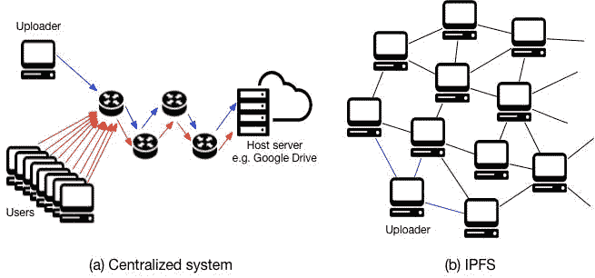
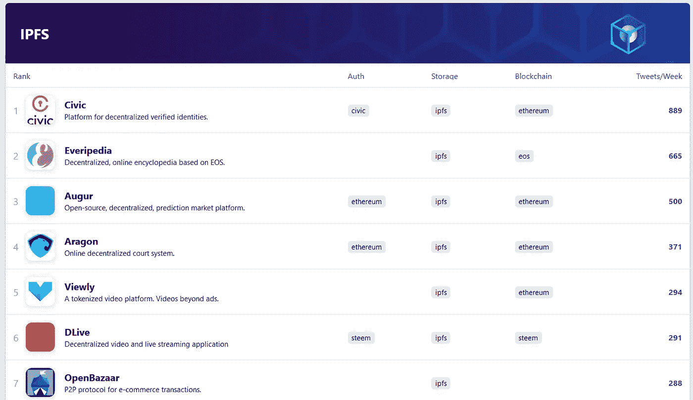
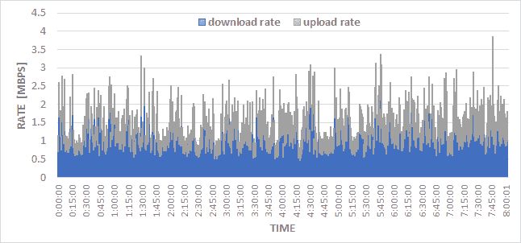

# IPFS:分布式网络的全面分析

> 原文：<https://medium.com/hackernoon/ipfs-a-complete-analysis-of-the-distributed-web-6465ff029b9b>

在我们最近的综合分析中，我们讨论星际文件系统(IPFS)。这篇文章总结了 IPFS 让我们兴奋的原因。我们还指出了一些需要进一步改进和发展的领域，以便 IPFS 实现主流采用。完整的分析可以在 **这里访问 [**。** *一旦你点击这个链接，恭喜你，你已经在使用 IPFS 了！*](https://ipfs.io/ipfs/QmRU1jJ1kNd9fTzjFwM4X9YtA2wfXN1W2eFK7mgTMJ8xgK)**

在这个分析中，我们从 IPFS 的概况开始，解释其背后的主要动机。目的是帮助我们的读者理解 IPFS 能够解决的当今互联网的主要问题。接下来，我们简单地探究一下 IPFS 的技术设计。在这里，我们的目标是帮助读者理解 IPFS 受到不同分布式系统的启发，以及它是如何扩展这些思想来实现一个单一而强大的内聚系统的。接下来，我们对网络动力学进行了自己的分析。我们努力反映运行 IPFS 的当前成本以及它对网络的益处。为了完整起见，我们还涉及一些挑战和可能的对策。最后，介绍一些关于在 IPFS 上运行的应用程序的讨论，以及这将如何允许新的商业模式发展。

# IPFS 为什么有趣

## IPFS 是对先前技术的重大改进

IPFS 已经从多种前身技术中受益匪浅，如分布式哈希表(DHT)、BitTorrent、git 和 SFS。它受到这些技术的启发，为超媒体数据共享提供了一个增强的解决方案。IPFS 是一个开放源码项目，接受世界范围内的研究和开发贡献，以增强系统。

Comparing the movement of data in IPFS to centralized client-server models.

## IPFS 是 Web 3.0 基础设施的重要组成部分

Web 3.0 是一个长期目标，旨在取代当前的互联网基础设施。因为去中心化是 Web 3.0 的本质。许多人认为分布式账本技术(DLT)，例如区块链，是 Web 3.0 的核心构件。区块链是存储网络状态的不可变且仅附加的分类帐。为了在网络节点之间扩展区块链和存储关键网络数据，需要所有网络节点之间的分布式一致性。因此，将任何其他类型的数据存储到区块链中可能会非常昂贵。对于多个用例，以接近区块链安全级别的安全方式存储其他非关键数据可能更有效。

IPFS 是最适合这类数据的存储介质。IPFS 允许分布式存储数据，这些数据不会被篡改和伪造。在不改变数据标识符的情况下，不能改变存储在 IPFS 网络上的数据。在 IPFS，标识符是数据的加密散列。这意味着非关键数据可以存储到 IPFS 系统，同时将此标识符存储到基础分布式分类帐。这将导致对分布式分类帐的操作不够彻底。

## IPFS 是分散应用的最佳存储平台

分散式应用程序(dApps)是一类利用分散化来实现前所未有的好处的应用程序。其中包括分散的交易所和市场，取消了集中的中介，因此消除/减少了任何交易费用。另一个例子是分散的社交媒体和视频平台，其中的内容不能按照运营公司的意愿进行审查。这种 dApps 需要存储大量的数据。IPFS 允许这些数据以分布式的方式存储，这种方式可以抵抗审查。由于这些原因，IPFS 正在成为 dApps 的首选存储平台。

[app.co](https://app.co/platforms/ipfs) shows a growing list of dApps that use IPFS as the storage platform.

## IPFS 可以提供更好的用户体验

IPFS 可以在多种情况下改善用户体验。例如，试图使用典型的客户机-服务器模型浏览或下载一些流行的内容可能会耗尽网络带宽并导致网络拥塞。由于较大的延迟，这可能导致不方便的用户体验。在 IPFS，内容从拥有内容副本的最接近的对等点交付，消除了单节点压力并改善了用户体验。此外，即使内容的所有者不再可用，IPFS 也允许连续平滑地浏览内容。

## IPFS 允许新的在线商业模式

在当今的互联网中，任何在线内容都需要托管在专用服务器上。对于内容发布者来说，确保内容的可用性和足够的带宽来满足所需的需求是至关重要的。IPFS 从根本上改变了这一模式。在 IPFS 中，数据以分布式方式共享，可以由拥有数据的任何节点提供服务，而不是由一台主机服务器为所有用户服务。因此，带宽需求显著降低，可靠性增强。也就是说，新的商业模式将开始演变。例如，使用一些像 Filecoin 这样的项目，内容发布者可能会向用户支付少量报酬来存储内容。这将改善内容分发并确保内容的可用性。

Many video sharing platforms, social media, and other applications are turning to IPFS to achieve better user experience and a better business model.

## IPFS 正获得越来越多的主流采用

由于 IPFS 的多种吸引人的特征，它正被越来越多的主流采用。在我们的报道中，我们讨论了 IPFS 帮助主流用户对抗审查的情况。除了最近的 cloud flare[公告](https://blog.cloudflare.com/distributed-web-gateway/)之外，现在可以在 IPFS 上托管网站，并使用简单的标准域名指向它们。IPFS 托管的网站是抵制审查的网站，现在它们可以很容易地被识别，并使用 HTTP 和 HTTPS 以及使用 Cloudfare 的 IPFS 网关安全地浏览。此外，Cloudflare 已经[实施了](https://blog.cloudflare.com/e2e-integrity/)技术，以保证用户不需要相信 Cloudflare 会为他们提供他们所要求的正确内容。

# IPFS 面临的挑战是什么

IPFS 是一项不断发展的新技术。然而，我们认识到，为了实现大规模采用，需要克服许多挑战。

## 带宽要求

运行一个 IPFS 节点目前需要使用大量的带宽，这对于许多用户来说是不可行的，尤其是在发展中国家。过度的带宽使用可能会损害 IPFS 在世界多个地区的采用。虽然关于如何处理这个问题有多种建议，但财政激励可能是正确的方向。在 IPFS 上托管内容获得经济回报有助于弥补运营节点的成本，并鼓励采用。

Bandwidth usage of our experimental IPFS node. In this test, the node was not used to browse or download any IPFS content. However, over a period of 8 hours, our node has downloaded/uploaded over 5 GB of data.

## 有效性

IPFS 目前的实施无法保证数据在被请求时的可用性。确保可用性的一个可能方法是*内容锁定*，这意味着在 IPFS 节点上不断保存已发布内容的副本。该 IPFS 节点需要始终在线，以满足可用性保证。像 Filecoin 这样的项目正在建立一个激励层，以鼓励节点保存内容来换取一些激励。

## 私人内容

发布到 IPFS 的内容是公开的。任何拥有内容散列的人都可以访问这样的内容。目前，IPFS 没有提供存储私人数据的内置解决方案。加密可用于通过 IPFS 存储和/或传输私人数据。另一种更复杂的方法是使用 IPFS 协议创建专用网络，其中节点只能连接到构成专用网络的指定节点列表。

# 结论

在本总结中，我们讨论了为什么我们认为 IPFS 是未来分布式互联网的关键技术。完整的分析包括 IPFS 技术、安全性、网络动态和不同应用的更多细节。总的来说，IPFS 已被证明是抵制审查和分布式数据存储的关键。随着不断发展，它可能成为未来的标准数据传输协议。

## 感谢

我们要感谢方案实验室团队，他们提供了有用的贡献、评论和反馈；特别是[马特·朱姆沃尔特](https://twitter.com/flyingzumwalt)、[杰罗米·约翰逊](https://twitter.com/Whyrusleeping)、[阿尔卡迪·库卡金](https://twitter.com/parkan)、拉尔斯·吉尔斯[、大卫·迪亚斯](https://twitter.com/daviddias)和[胡安·贝尼特](https://twitter.com/juanbenet)。

*免责声明:*

*本报告仅供参考。本报告不以任何方式构成购买或出售本文讨论的任何投资或加密货币的要约或要约邀请。投资者应对本报告中讨论的所有加密货币进行独立的尽职调查，并在做出任何投资决定之前对相关市场做出判断。任何作者、投稿人或任何与 zk Capital 有关的人，无论以何种方式，都不能对您使用本报告中包含的信息负责。*