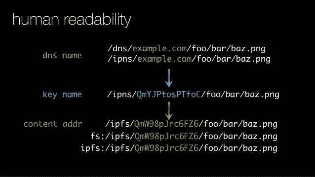
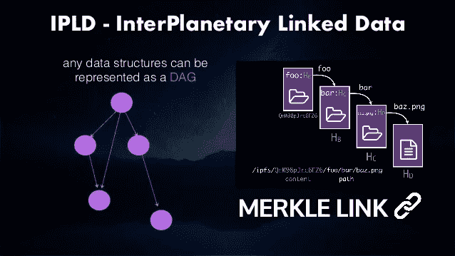
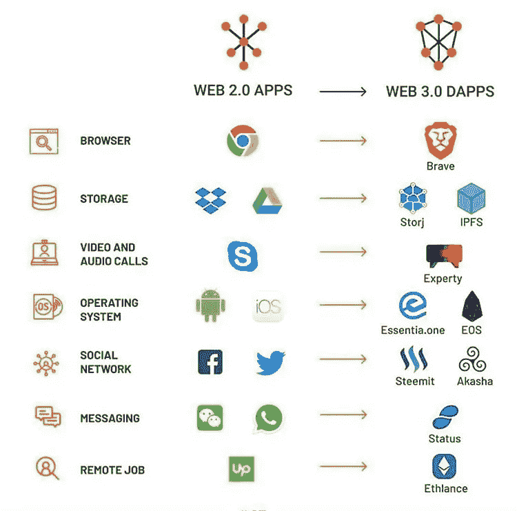

# IPFS👽和默克森林🌳

> 原文：<https://medium.com/hackernoon/ipfs-and-merkle-forest-a6b7f15f3537>


# 什么是 IPFS？

IPFS 是行星间文件系统的缩写。它是一个点对点的分布式文件系统，使网络更快、更安全、更开放。要从当前版本的 web 转移到分布式版本的 web，我们需要 IPFS。本质上，目标是取代 HTTP。

## **但是，嘿，为什么要替换 HTTP？**

1.  **疯狂的带宽成本:****现在的 Web 使用HTTP，基于单一的客户端-服务器模式。人们总是不得不接近中央服务器来下载任何类型的文件。想象一下，如果您可以从您附近的节点获得相同文件的片段，会怎么样？您可以使用更少的带宽更快地下载文件。[通过视频传输，P2P 方法可以节省 60%的带宽成本。](http://math.oregonstate.edu/~kovchegy/web/papers/p2p-vdn.pdf)**

> **IPFS 使高效分发大量数据成为可能。零重复意味着节省存储空间。**

**2. **404 太普通了**！一个网页的平均寿命是 100 天。在那之后，你会看到一条 404 消息。现在的网是如此脆弱。链接总是会断开。和焚书一样好。**

> **IPFS 提供了历史版本控制(如 git ),并简化了为数据镜像建立弹性网络的过程。**

**3.**集中式基础设施，呃**:我们数据的所有权力都掌握在主服务器上。如果失败了，我们就完了。如果推特瘫痪了，我们就不能再发推特了。如果脸书崩溃了，那么它已经崩溃了哈哈。**

> **IPFS 仍然忠于开放和扁平网络的最初愿景，但提供了使这一愿景成为现实的技术。**

**4.**线下是新线上**:在发展中国家，在自然灾害期间，临时网络不好，我们怎么办？只是坐着？我们使用的网络是 20 世纪的。我们可以做得更好。**

> **IPFS 推动了多样化弹性网络的创建，无论有无互联网主干连接，都能实现持续可用性。**

# **IPFS 是如何工作的？(简单来说)**

**因此，如果你想检索一个数据结构或者一个文件保存在网上使用 IPFS，你不会击中中央服务器。你会要求网络中的同伴给你一个文件的路径。你的同事会给你一个文件的“加密散列”。这是该文件的唯一指纹。**

**假设你想得到/foo/bar/baz.png，它的加密哈希是 wmxgtagwtx 1 uutfsb 2s bavarmevlk 4 qec 4g 5 bv 7 wwdz 1u。(这可以使用 SHA1、SHA2 或任何其他算法来生成)。你用这个链接上网。**

****

**维基百科已经开始使用 IPFS:**

**[](https://ipfs.io/ipfs/QmT5NvUtoM5nWFfrQdVrFtvGfKFmG7AHE8P34isapyhCxX/wiki/Anasayfa.html) [## 土耳其语维基百科

ipfs.io](https://ipfs.io/ipfs/QmT5NvUtoM5nWFfrQdVrFtvGfKFmG7AHE8P34isapyhCxX/wiki/Anasayfa.html) 

网址格式为:[**https://ipfs . io/ipfs/qmt 5 nvutom 5 nwffrqdvrftvgfkfmg 7 ahe 8 p 34 isapyhcxx/wiki/anasayfa . html**](https://ipfs.io/ipfs/QmT5NvUtoM5nWFfrQdVrFtvGfKFmG7AHE8P34isapyhCxX/wiki/Anasayfa.html)** 

# **关于 Merkle 树的一点信息**

***关于 Merkle link 的研究论文可以在这里找到*[](https://people.eecs.berkeley.edu/~raluca/cs261-f15/readings/merkle.pdf)**。Ralph Merkle 是 Merkle 数据结构背后的大脑。****

****一个美丽的插图什么是积少成多树可以在这里找到*[](https://media.consensys.net/ever-wonder-how-merkle-trees-work-c2f8b7100ed3)**。*****

****Merkle 树在 C++中的基本实现****

```
**#include <stdio.h>
#include <stdlib.h>
#include <iterator>
#include <vector>

using namespace std;

// Hashing functions.                                                                                                                                                                                                                                                                                                                                                
int multiplyThem(int a, int b) {
  return a*b;
}

int addThem(int a, int b) {
  return a+b;
}

class Merkle {
private:
  vector<int> values;
  int (*hasher)(int, int);

public:
  Merkle(int (*f)(int,int)) {
    this->hasher = f;
  }

  int size() {
    return values.size();
  }

  void add(int value) {
    values.push_back(value);
  }

  int root() {
    vector<int> current;

    current = getHashedParents(this->values);
    while (current.size() != 1) {
      current = getHashedParents(current);
    }
    return current[0];
  }

private:
  vector<int> getHashedParents(const vector<int> &children) {
    vector<int> result;

    for (int i=0; i < children.size(); ) {
      int a = children[i], b = children[i];
      if (++i < children.size()) {
        b = children[i++];
      }
      int hash = this->hasher(a,b);
      printf("hash(%d, %d)=>%d ", a, b, hash);
      result.push_back(hash);
    }
    printf("\n");
    return result;
  }
};

int main(int argc, char** argv) {
    Merkle merkle(multiplyThem);
    merkle.add(1);
    merkle.add(2);
    merkle.add(3);
    merkle.add(4);
    merkle.add(5);

    printf("Merkle Root = %d\n\n", merkle.root());

    merkle = Merkle(addThem);
    merkle.add(1);
    merkle.add(2);
    merkle.add(3);
    merkle.add(4);
    merkle.add(5);

    printf("Merkle Root = %d\n\n", merkle.root());
    return 0;
}**
```

# ****IPFS 的心脏是 IPLD。****

****IPLD 是行星间关联数据的缩写。文件/数据结构使用 Merkle 链接相互链接。****

********

*******(什么是默克尔达格？这是一个 Merkle 有向无环图。它类似于 Merkle 树。然而，Merkle DAG 不需要平衡，并且它的非叶节点被允许包含数据。)*******

****在 IPFS 中，两个节点之间的链接采用加密哈希的形式。由于 Merkle DAG 数据结构，这是可能的。Merkle DAGs 为 IPFS 提供了许多有用的属性，包括:****

1.  ******内容寻址**:所有内容都通过其加密哈希进行唯一标识，包括链接。****
2.  ******防篡改**:所有内容都通过其校验和进行验证。如果数据被篡改或损坏，IPFS 会检测到，因为哈希会改变。****
3.  ******无重复**:保存完全相同内容的所有对象都是相等的(即它们的哈希值相等)，并且只存储一次。****

****只要把 **merkle root** 交给某人，你就可以把大量的数据交给那个人。因为，merkle 根本质上持有其下所有块的签名。****

****系统的互操作性也可以在 merkle 森林中保持，其中每棵树代表一个单独的 merkle 树。在一个森林里，一棵树可以是[比特币](https://hackernoon.com/tagged/bitcoin)，一棵树可以是以太坊，一棵树可以是常规的 SQL 数据库。因此，为了在这些树之间交换信息，这些基于内容的加密散列函数是有效的。不是发送整个文件，而是只发送散列。想象使用以太坊进行一些交易，并在交易中添加一个 Git 页面。****

****目前使用这种系统的有:****

1.  ****比特币****
2.  ****以太坊****
3.  ****饭桶****
4.  ****比特洪流****

****还有更多，但这些是主要的。****

****现在就从 IPFS 开始吧！****

****[](https://ipfs.io/docs/getting-started/) [## 开始使用| IPFS 文档

### 如果您还没有这样做，安装 IPFS。安装 IPFS 现在在这个教程中，如果你有任何问题，随时…

ipfs.io](https://ipfs.io/docs/getting-started/) 

这又是一项突破性的技术，将网络从 Web2.0 推向 Web3.0

****