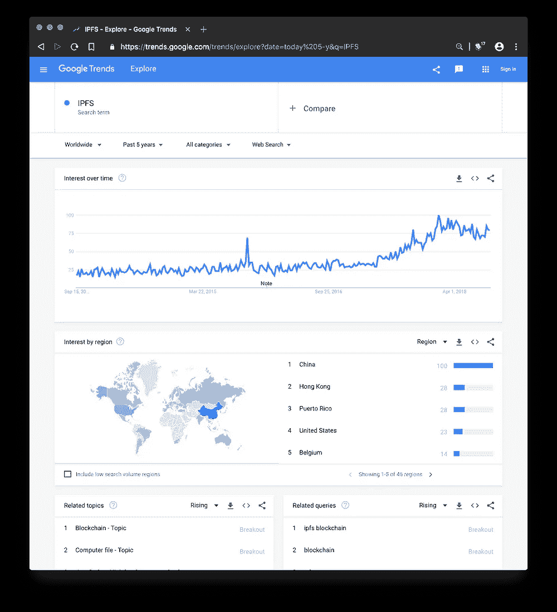
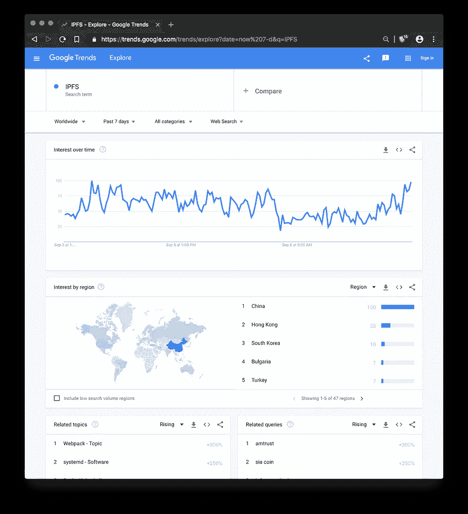
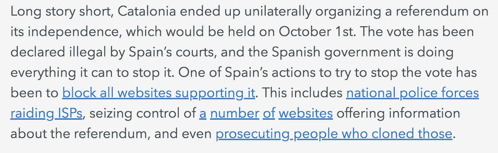
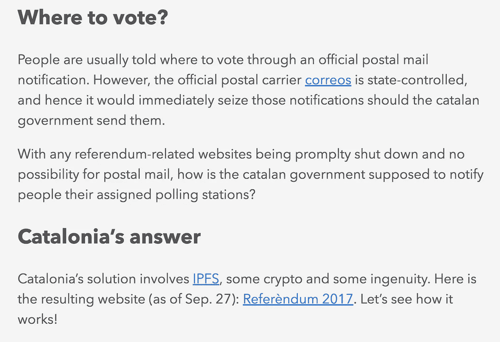
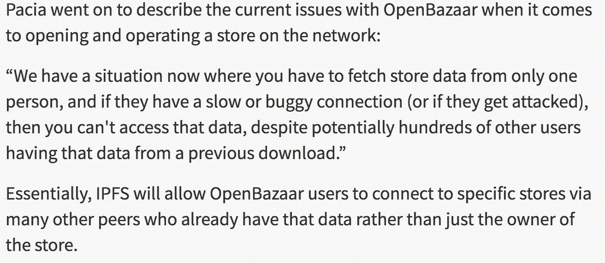
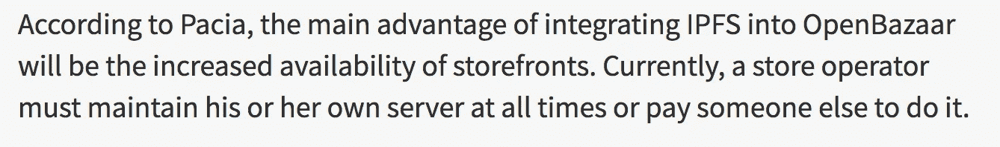

# IPFS 的详细情况

> 原文：<https://medium.com/hackernoon/ipfs-ed2952cb748b>

## 互联网的未来。

什么是 Web 3.0？谁在乎呢？
我为什么关心？
什么时候发生？

这是一份关于 IPFS 的观察性黄皮书，这一技术，它的含义，以及最重要的是摆在面前的挑战。

黄皮书是用于研究的正式文件。它是一种特定主题的论文或研究报告，没有任何法律或授权价值。

## 什么是 IPFS

IPFS 是一个有着宏伟目标的了不起的项目，并且有能力实现这些目标。

从最一般的定义到最具体的计算机定义

IPFS 是一个…

## 30 秒概述

一个新的互联网将跨越星球，避免审查，比目前的互联网大得多，更快，更便宜，更安全，能够在灾难发生时抵御大规模攻击。

## 半技术性的描述

一种类似于 HTTP(检查您的浏览器 URL)的新协议，允许您访问网站和来自许多并行来源而不是单一来源的数据。这就像 torrenting，一部电影可以从很多人那里一次下载一小部分，而不是从一台服务器上下载。这具有速度优势，禁用审查数据的能力，对丢失或损坏的数据更强。

## 基本的技术描述

基于 Merkle DAG 的存储和检索数据的概念模型

Merkle DAG 是 Merkle 有向非循环图。这是一种类似于 Merkle 树的数据结构，但没有那么严格:这种 DAG 不需要平衡，它的非叶节点允许包含数据。”—[Mithgol GitHub]([https://github.com/Mithgol](https://github.com/Mithgol))

## 更深入的技术描述和代码链接

一组工具、一个数据模型、一个命名服务、一个网络堆栈和一些主要用 Golang 和 Javascript 开发的各种 SDK。

# 谁在乎

让我们来看看一些主要群体——对计算机知识做一些不必要的假设，然后来看看谁关心这些。

## 大家

 [## IPFS 是分布式网络

### 一种对等超媒体协议，使网络更快、更安全、更开放。

ipfs.io](https://ipfs.io/) 

两个直接有用的功能

**用科技行话来说**

*   网络连接弹性和延迟

> “高延迟网络是进入发展中国家的真正障碍。IPFS 提供对数据的弹性访问，独立于低延迟或主干连接。”

*   有效的数据传输—更低的成本

> “如果您的公司向用户交付大量数据，点对点方法可以为您节省数百万的带宽。IPFS 可以提供安全的 P2P 内容交付。”

低成本、有弹性的网络，用于服务不稳定、不发达的网络，以及高速、非常发达的网络。

**英文**

对于那些几乎没有物理网络基础设施(手机信号塔、大型数据中心)的发展中国家来说，IPFS 是一个很好的解决方案

即使只连接几台计算机，它也能覆盖很远的距离，并提供稳定的网络。它更便宜，因为你不需要发送太多的数据，而且数据可以在附近的电脑上共享——页面加载速度更快。

# 专制国家的人民

IPFS 本质上是不受审查的，这是为了避开那些秘密警察和邪恶统治者。



5 YEAR ON LEFT — 7 DAY ON RIGHT

正如你在 7 天和 5 年图表中看到的，中国对 IPFS 最感兴趣。也注意到在这两个图表上都有上升的势头。

在有互联网审查和政府禁止公开交流的地方。IPFS 有更深层的目的。让所有人都能够通过互联网分享他们的想法，而不用担心审查。


Riot police aiming rubber bullets at crowds.

## 他们如何利用 IPFS

这里有一些关于这个话题的例外——下面的文章链接



“技术专家迄今为止对独立没有任何看法，但支持自由投票决定自决的权利，他们采用了一些最新技术，包括 IPFS，以保持全民投票网站的可访问性。

西班牙政府已经关闭了公投网站，ISP 有时会被勒令采取措施，但 IPFS 作为一种分布式技术，允许任何人访问它，正如一些伟大的技术深度解释的那样。"

[](https://www.trustnodes.com/2017/10/01/ipfs-distributed-technology-aids-catalonia-rubber-bullets-fired) [## IPFS 和分布式技术援助加泰罗尼亚作为发射橡胶子弹

### 可怕的场景从加泰罗尼亚首府巴塞罗那传出，巴塞罗那今天举行了西班牙公投…

www.trustnodes.com](https://www.trustnodes.com/2017/10/01/ipfs-distributed-technology-aids-catalonia-rubber-bullets-fired)  [## 加泰罗尼亚政府如何利用 IPFS 避开西班牙的法律封锁

### 以巴塞罗那为首都的加泰罗尼亚目前是西班牙十七个自治区之一。它有很长的…

la3.org](http://la3.org/~kilburn/blog/catalan-government-bypass-ipfs/) 

## 扶持新企业

抄自 OpenBazaar.com 的常见问题:

**什么是 OpenBazaar？**
OpenBazaar 是一种不同的在线商务方式。这是一个不需要中间人的点对点应用，这意味着没有费用&没有限制。

【OpenBazaar 是如何运作的？
OpenBazaar 通过点对点网络将人们直接联系起来。数据分布在整个网络中，而不是存储在中央数据库中。

**怎么没有费用和限制？OpenBazaar 不是一家公司，也不是一个组织；这是免费的开源软件。它的建立是为了给每个人提供自由买卖✌的能力**

谁控制着 OpenBazaar 网络？
没人对 OpenBazaar 有控制权。每个用户平等地为网络做出贡献，并控制自己的商店和私人数据世界表情符号

**比特币是唯一支持的支付方式吗？**
在 OpenBazaar 上用 50+加密货币支付:比特币、以太坊、莱特币、Zcash、Dash 等。卖家收到比特币、比特币现金或 Zcash 付款。他们的选择。

Chris Pacia 是 OpenBazaar 的首席后端开发人员

以下是他对 IPFS 的采访摘录:



```
Thanks for getting through this adventure with me. Please show support and 👏 (clap) for this article.Remember you can clap up to 50 times, and clapping for this article would be really helpful in the Medium algorithm.Any support is greatly appreciated ❤️Also, please answer the questions and add to the discussion below
```