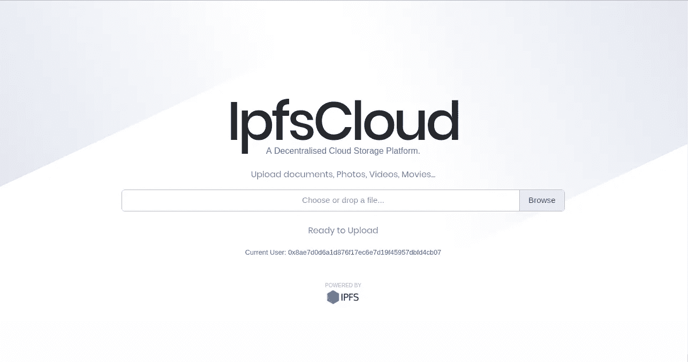
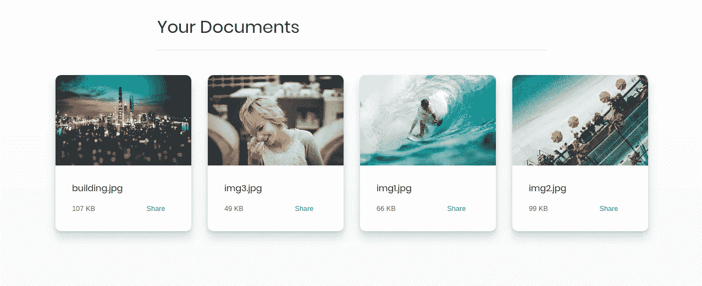
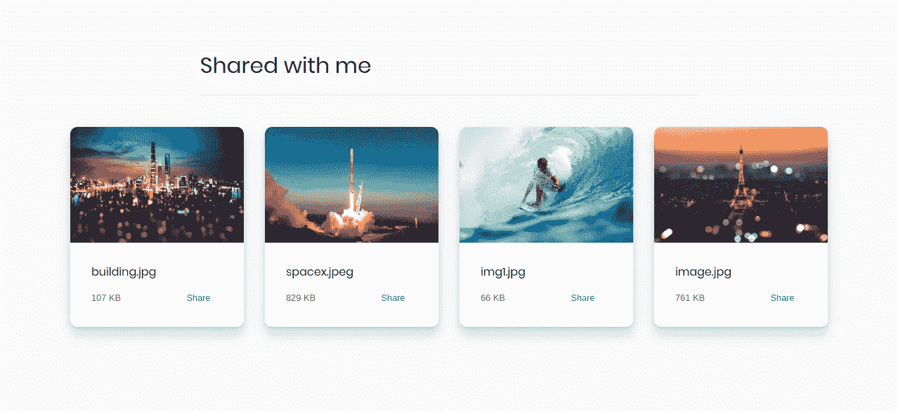
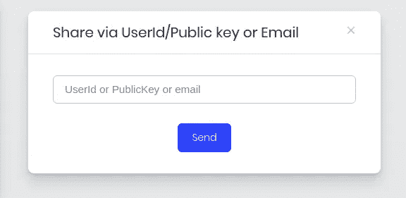

# IpfsCloud:一个去中心化的云存储平台

> 原文：<https://medium.com/hackernoon/ipfscloud-a-decentralised-cloud-storage-platform-12ed938a9307>

ipfscloud.store

每天通过 WhatsApp、Telegram、Discord 或电子邮件接收像这样的精选 Web 3.0 内容和摘要。

 [## SimpleAsWater 每日 Web 3.0 时事通讯

### SimpleAsWater 每日 Web 3.0 时事通讯:每天晚上在 WhatsApp 上收到 1 份精选的 Web 3.0 资源和摘要…

simpleaswater.com](https://simpleaswater.com/web3) 

随着世界走向去中心化革命，每天都有大量的应用程序(或 dapps)被开发出来。一个真正的 dapp 需要一个真正分散的基础设施，包括一个分散的内容分发网络。正如我们在下面的帖子中看到的，许多项目正在努力创建可持续的分散内容分发网络。

 [## Storage pedia:5 个区块链存储平台的百科全书

### 对所有主要分布式存储平台的深入比较

hackernoon.com](https://hackernoon.com/storagepedia-an-encyclopedia-of-5-blockchain-storage-platform-8aa13c630ace) 

其中之一是 IPFS。我使用它已经有一段时间了，最近我决定用它创建一个简单的 dapp。

给大家介绍一下[***ipfs cloud***](http://ipfscloud.store)***。*** 简而言之，就是 IPFS 上的 google drive。

# 如何使用

*   为您各自的浏览器安装 Metamask 扩展并创建一个帐户。
*   开始上传文件。

Documents Uploaded to IpfsCloud

Documents shared via IpfsCloud

# 特征

*   使用元掩码创建帐户，因此它允许比传统云平台更好的匿名性。
*   从本地存储上传文件。
*   无限存储(目前为*)。*
*   *免费存储。*
*   *通过电子邮件和公钥共享文件。*

**

*Share documents using Email/UserId/PublicKey*

# *即将推出的功能*

*   *支持添加文件夹。*
*   *支持从 URL 上传文件。*
*   *上传的进度条。*
*   *与您的移动设备同步。*
*   *更好的 UI。*
*   *你可以在评论中建议的任何功能。*

## *为项目做贡献*

*以下是 github 回购协议的链接:[https://github.com/vasa-develop/ipfscloud](https://github.com/vasa-develop/ipfscloud)*

*坦率地说，我不能决定我应该在这个项目中添加什么东西。我应该添加社交认证功能(通过谷歌，facebook，github 等登录)吗？在评论中加入你的建议…*

*感谢阅读；)*

**

***关于作者***

*[Vaibhav Saini](http://vaibhavsaini.com/) 是麻省理工学院剑桥创新中心孵化的初创公司***的联合创始人。****

**他是高级区块链开发人员，曾在多个区块链平台上工作，包括 Ethereum、Quorum、EOS、Nano、Hashgraph、IOTA 等。**

**他目前是 IIT 德里大学的二年级学生。**

## **学到了什么？按住👏说“谢谢！”并帮助他人找到这篇文章。**

***如果你喜欢内容，请按住鼓掌按钮！它帮助我获得曝光率。***

**想了解更多？检查我以前的文章。**

** [## 在 IPFS 上设置您的第一个分布式专用存储网络:第 1 部分

### IPFS 专用存储网络系列

medium.com](/coinmonks/setting-up-your-first-distributed-private-storage-network-on-ipfs-part-1-a6ff15222b90)  [## 在 IPFS 免费托管一个网站

### 这是一个简短的指南，通过它你可以在几分钟内免费运行你的网站！！那么，让我们开始吧

medium.com](/coinmonks/hosting-a-site-for-free-on-ipfs-1028748f2afd)  [## 深入以太坊:以太坊是如何存储数据的？

### 在本帖中，我们将看到状态和交易如何存储在以太坊中，以及它与比特币有何不同。

hackernoon.com](https://hackernoon.com/getting-deep-into-ethereum-how-data-is-stored-in-ethereum-e3f669d96033)  [## 深入 EVM:以太坊如何在后台运作

### 最终，深入解释了 EVM 是什么和 EVM 如何工作。

hackernoon.com](https://hackernoon.com/getting-deep-into-evm-how-ethereum-works-backstage-ac7efa1f0015) 

***鼓掌 50 次在推特上关注我:***[***@ vasa _ develop***](https://twitter.com/vasa_develop)**