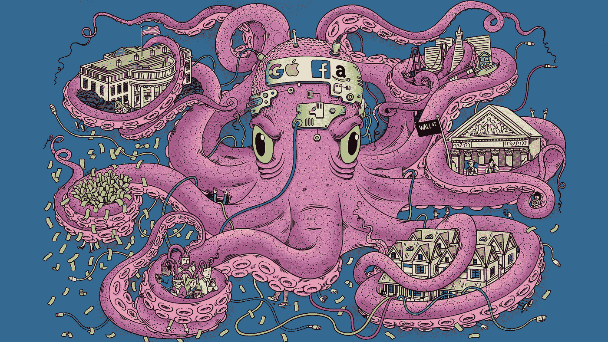

# 向联邦航空局说再见，向新的互联网问好

> 原文：<https://medium.com/hackernoon/ipfscloud-vision-changing-how-the-internet-works-20289a01af37>

## 打破脸书、苹果、谷歌、微软、亚马逊的统治地位

***Facebook, Apple, Google, Microsoft and Amazon have a Toxic Dominance on the World***

每天通过 WhatsApp、Telegram、Discord 或电子邮件接收像这样的精选 Web 3.0 内容和摘要。