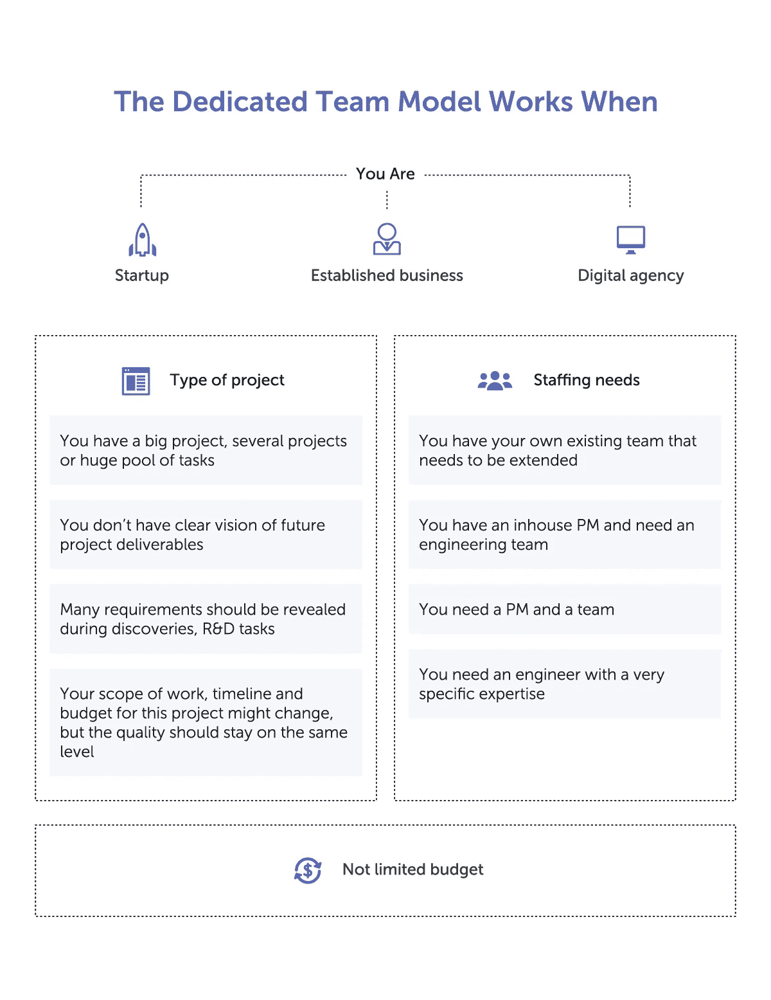
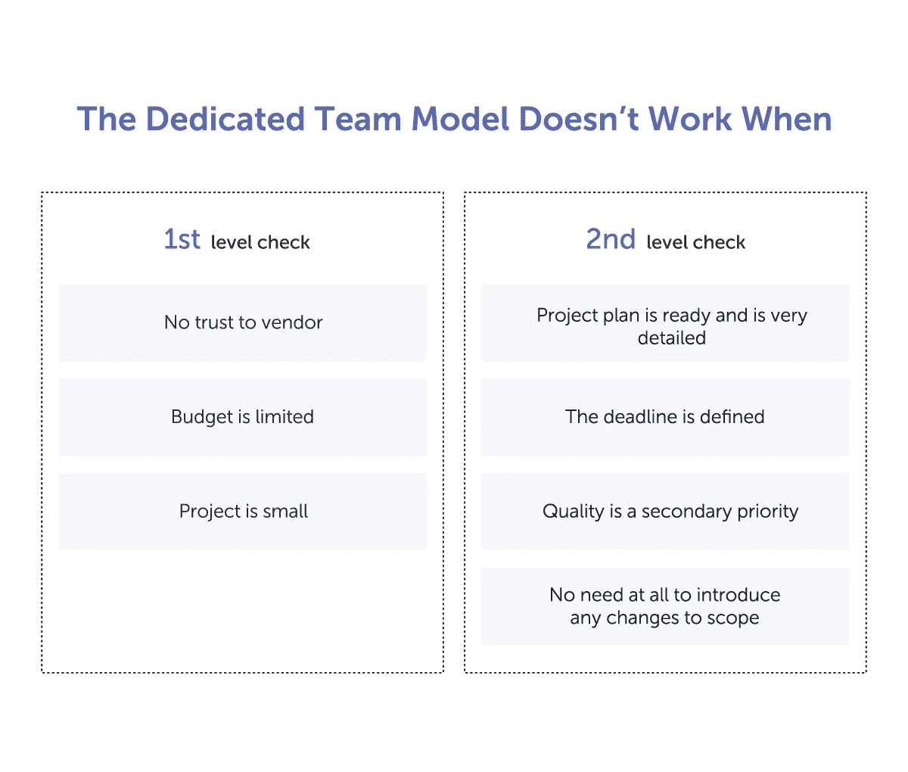
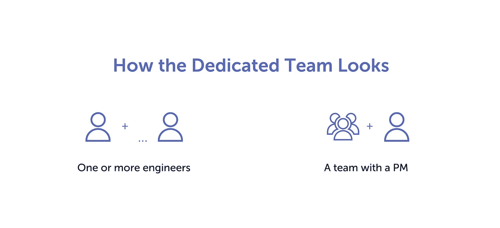
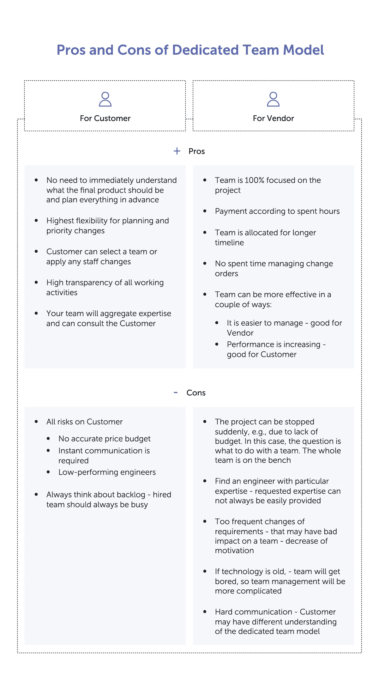
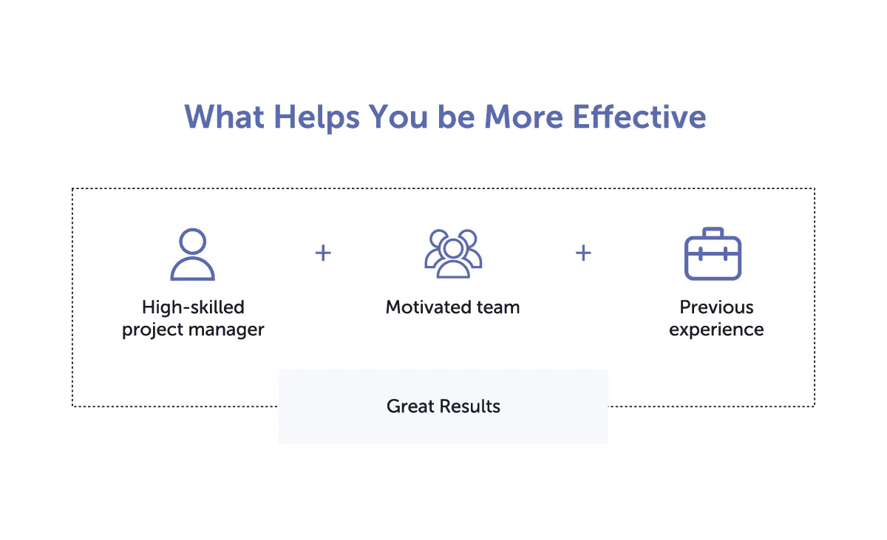
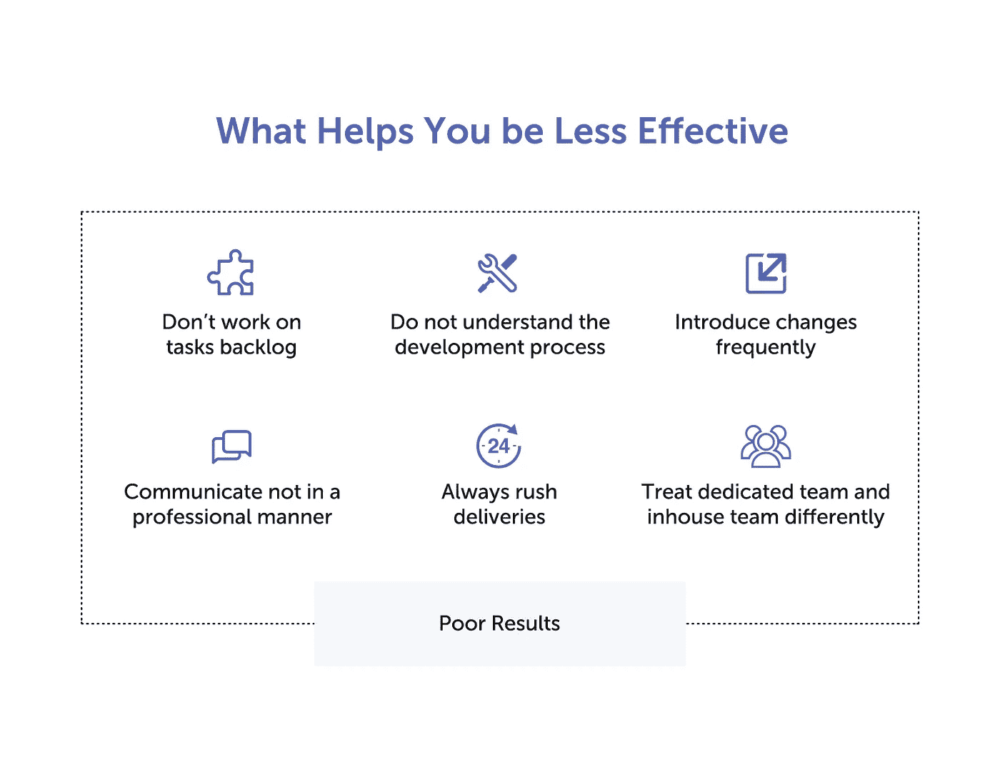

# 专门的团队模式适合你吗？

> 原文：<https://medium.com/hackernoon/is-a-dedicated-team-model-right-for-you-597db0f99e7a>

这里有两种与软件或 T2 硬件开发公司合作的主要方式:专门的团队或固定成本的项目。

*专用团队模型*表明你的范围和项目持续时间可能会改变。因此，项目的总成本将取决于您分配给团队的任务，并且您支付工程师完成这些任务所需的时间。

*固定成本项目*意味着在开始工作之前，你已经确定了所有的需求，并且你可以协商总成本，例如，开发一个产品。

在这篇文章中，我们将解释什么时候使用专门的团队模型更合理，它可能看起来如何，利弊，以及如何使这个模型更有效(或更无效)。

> 另请阅读[发现阶段:你的一小步，项目成功的一大步](https://lembergsolutions.com/blog/discovery-phase-one-small-step-you-one-giant-leap-your-project-success)。

# 你如何知道专用团队模式是否适合你？

你可能是一家初创公司、一家老牌企业或一家数字机构——这没什么区别；敬业的团队可能同样适合你。第一个更重要的标准是你有哪种类型的项目。

当你有一个大项目、几个项目或一大堆任务时，一个专门的团队是正确的选择；当您对未来的项目交付没有清晰的愿景时；而且当你知道很多需求会在[发现阶段](https://lembergsolutions.com/services/startups#discovery-workshops)和 [R & D 任务](https://lembergsolutions.com/services/innovative-businesses#new-products-development)的时候。您知道这个项目的范围和时间表可能会改变，但是质量应该保持在同一水平。

选择专门团队的第二个基准是你的**人员需求**。当你有你自己的开发团队，你有一个内部项目经理(PM ),你需要一个工程团队，你需要一个 PM 和一个团队，或者你需要一个有非常具体的专业知识的工程师时，这种类型是有效的。

第三点就是你的**预算**。不局限于严格的预算是非常重要的。

还有一种情况，你可能会考虑将**从一个固定成本的项目切换到一个专门的团队**。当你已经和一个供应商一起工作了一段时间，这是有意义的，所以你知道团队是如何工作的，并且估计不同的任务；成员们已经被证明符合承诺的时间表；并且您对质量水平感到满意并信任您的供应商。

另一方面，这不是一个放之四海而皆准的模式。当出现以下情况之一时，**专用团队不是正确的选择:您不信任您的供应商，您的预算有限，或者项目很小。当您的项目计划已经准备好并且非常详细，期限已经确定，质量对您来说是次要的，并且您知道范围可能不会发生变化时，这也不是一个很好的选择。**

# 你的敬业团队会是什么样子？

根据你对开发过程的了解程度和你的人员需求，你可以考虑只雇佣工程师或一个有项目经理的团队。

当你只雇佣一个或多个工程师时，

*   你应该清楚地了解开发过程，
*   您负责创建任务积压，
*   您将跟踪工作进度，并且
*   你应该保持适当的沟通。

当你雇佣一个有项目经理的团队时，

*   您可能对开发过程的理解非常少，
*   您将只与供应商的项目经理沟通，并且
*   供应商的项目经理将进行所有的团队管理，并跟踪团队的生命周期。

# 专用团队模式的利弊是什么？

无论选择哪种合作模式，总会有利弊。专用团队模式为您提供了更改计划和任务优先级的最大灵活性，但同时，您也要对沟通和风险负责。

供应商也面临有利和不利的一面，所以你们双方都应该协商以达成双赢的局面。

# 如何获得最有效和最不有效的协作

所以，当你决定组建一个专门的团队时，有几件事会帮助你在这次合作中**更加有效**。

第一件事是你以前在专门团队的经验或者你对软件开发过程的理解。这将大大改善项目管理。

如果你以前的软件开发经验是积极的，这是一个加分。负面的经验可能会导致对你的供应商缺乏信任，导致微观管理和应用上次帮助解决问题的过程，即使它不相关。

第二，特别是当它是一个硬件项目时，您将受益于一个高技能的项目经理，并且您可以预测您的工程决策的未来影响(例如，如果您现在削减开支，您将在以后以更高的成本结束)。

影响效率的其他因素包括面试技术人员的经验、将你的团队视为你的内部团队、拜访这个团队(最好在项目开始之前)以及激励团队。

动机对绩效影响很大，而且，有了更高的动机，你的团队可以比平时做得更好。所以，你可以做些什么来保持高水平:

*   建立开发流程，
*   分享清晰的职责矩阵，
*   确定目标，
*   不要使用过时的技术堆栈，
*   分配具有挑战性的工程任务，
*   要求非常高的质量标准，
*   不时地交换员工的职责，以减少“无聊”的情况。

> 另请阅读[管理远程产品开发团队指南【客户手册】](https://lembergsolutions.com/blog/guide-managing-your-remote-product-development-team-clients-handbook)。

你的一些行为也可能让你的团队**效率降低**，所以我们建议避免以下建议。

不要处理积压的任务。团队可能经常会被卸下来，过一段时间后，就会变得无聊。然后，团队成员可能会要求离开项目。

总是急着送货。团队会更快地筋疲力尽，尤其是如果每个人都明白这种匆忙没有目的，总是无缘无故地发生。

频繁引入完全取消先前工作的变更。团队可能会将新任务视为没有理由正确执行的事情，因为它们无论如何都会被更改或删除。

不专业地与工程师沟通，例如公开冲突、指责、欺凌。团队失去动力，任何与项目相关的活动都与不好的事情联系在一起。

不要试图理解开发过程。你应该对软件是如何创建的有一个基本的了解；否则项目管理会变得乱七八糟。

区别对待你的专职团队和内部团队。这可能会导致客户的内部团队没有责任感。任何问题都可能被记录在专门的团队中。

# 摘要

专门的团队是一种非常有效的合作模式，带来了很多好处，例如，你可以选择一个团队或应用任何人员变动，并灵活地处理你的项目。然而，在选择这个模型之前，您最好检查一下您的项目的目标和需求是否对应。

我们建议始终以与您的供应商实现双赢为目标。如果您有一个专业的项目经理，了解流程，维护积压，计划交付，适当沟通，并且您的供应商提供强大的团队，适当的专业知识和透明的报告，这就可以实现。

[如果你心中有一些项目想法，请联系我们](https://lembergsolutions.com/contact)。