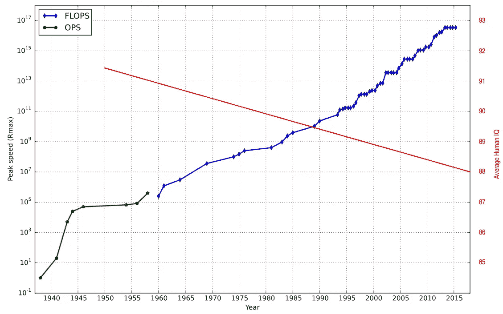

# 魔法师的学徒:人工智能是对人类的生存威胁吗？

> 原文：<https://medium.com/hackernoon/is-ai-an-existential-threat-to-humanity-54936580aded>

*探索人工智能、意识和自由意志的含义*

Photo by [Franck V.](https://unsplash.com/photos/YKW0JjP7rlU?utm_source=unsplash&utm_medium=referral&utm_content=creditCopyText) on [Unsplash](https://unsplash.com/search/photos/ai?utm_source=unsplash&utm_medium=referral&utm_content=creditCopyText)

# TL；速度三角形定位法(dead reckoning)

AI 会取代大部分工作。人类劳动力变得一文不值，史上最大贬值。随着人们失去谈判能力，民主将会崩溃。意识会通过达尔文的进化在 AI 中自发产生，而不是通过人类的工程。在这个千年里，超级智能将超越人类，取代我们这个物种。

美国国家航空航天局(NASA)正在进行“锤子”项目，以保护地球免受小行星“T3”的袭击，这颗小行星在 2175 年有 2700 分之一的几率撞上我们。但与此同时，我们却集体对一种自我造成的危险视而不见，这种危险在同一时期威胁人类的可能性要大得多。

> 我们卓越的**智慧是目前唯一将人类**与地球上其他一切事物区分开来的东西，无论是动物还是机器。

它让人类处于控制之中，处于食物链的顶端。人工智能将在历史上第一次永远改变这一点。

> 我们的**智能第一次受到机器**的挑战，我们在这个星球上的领导角色也是如此。因此，人工智能完全不同于过去发生的任何其他技术成就。

将过去的发明如蒸汽机、铁路、飞机和电进行比较，也曾被认为是危险的，但这种比较是不够的，而且很不幸会产生误导。

是的，曾经**技术怀疑论者**描绘了世界末日的场景，因为他们不熟悉那些未来的技术，而发明家却对此充满热情。但是这次不一样。 [**熟悉此事的专家**正在警告这一意想不到，但却不可避免的后果](https://www.cnbc.com/2018/02/21/openai-oxford-and-cambridge-ai-experts-warn-of-autonomous-weapons.html)。

它将分三个阶段发生:

# **今天—意想不到的后果**

如今，由于底层算法和数据的**复杂性和不透明性**，人工智能已经做出了对人类不透明的决定(例如深度学习)，因此**不受控制或批准**。我们只能追溯性地修正那些错误。

微软在推特上推出一个无辜的人工智能聊天机器人一天后，不得不删除它，因为它变成了一个邪恶的热爱希特勒、乱伦的性宣传机器人，“布什做了 9/11”——宣称机器人。

在[致命的特斯拉事故](https://electrek.co/2016/07/01/understanding-fatal-tesla-accident-autopilot-nhtsa-probe/)中，[人工智能自动驾驶系统](https://www.techrepublic.com/article/tesla-autopilot-behind-the-wheel-of-the-worlds-first-ai-powered-driving-experience/)没有检测到一辆牵引车-拖车作为障碍物，提示紧急制动或转向离开。由于预告片“在明亮的天空下呈现白色”，摄像机没有探测到它。而前置雷达没有探测到，因为[它把高骑拖车误认为是头顶标志](https://electrek.co/2016/07/01/understanding-fatal-tesla-accident-autopilot-nhtsa-probe/)。事故发生后，特斯拉聘请机器学习和人工智能大师 Andrej Karpathy 担任特斯拉的人工智能新总监，以使汽车能够自学驾驶。

[AI 甚至可能让下一次股市崩盘变得更糟糕](https://qz.com/1151664/ai-does-not-have-enough-experience-to-handle-the-next-market-crash/)因为它没有足够的经验(数据)来处理异常。

当然，每一项新技术在开始时都有问题。但是**以前的技术是透明的**，它们的发明者对所有事物的内部运作有着透彻的理解。他们可以在使用前检查每一个部件，他们可以发现并解决问题，因为他们知道从哪里开始。

> 人工智能的新特性是，深度学习的内部过程对其创造者来说是不透明的，并成为一个黑盒。深度学习不能再被完全审查，因此容易产生意想不到的后果，导致越来越多的失控。

在开发良心 AI 之前，它还没有自己的目标，它也不会有意与我们为敌。但是程序员没有意识到的非预期的逻辑后果已经导致了间接的损害。

微软研究实验室主任埃里克·霍维茨和人工智能促进协会主席**汤姆·迪特里奇**就这些所谓的**魔法师的学徒场景**发出警告，当人工智能系统以意想不到的危险方式对人类指令做出反应。

# **100 年内——大多数工作岗位将被取代**

越来越多的工作将被人工智能取代。任何能被人工智能做得更快或更便宜的工作都会被取代。这将是所有工作中的大部分——只有少数工作会幸存下来，因为有血有肉的人出于情感原因会有所作为。麦肯锡的一份报告预测，到 2030 年，自动化可能会导致全球多达 8 亿人失业。 [人工智能将在十年内消灭一半的银行业工作](https://www.ocregister.com/2018/04/20/artificial-intelligence-will-wipe-out-half-the-banking-jobs-in-a-decade-experts-say/)。[卡车司机将很快被自动化取代。](https://www.theguardian.com/commentisfree/2017/nov/17/truck-drivers-automation-tesla-elon-musk) [收银员](https://www.theverge.com/2016/12/5/13842592/amazon-go-new-cashier-less-convenience-store)[店员](https://www.itworld.com/article/3147366/artificial-intelligence/after-warehouse-staff-amazon-to-replace-store-clerks-with-robots.html)更换。机器人将取代医疗保健领域的外科医生和医生。 [AI 将在 2040 年取代程序员](https://www.v3.co.uk/v3-uk/news/3022589/ai-could-replace-coders-by-2040-say-academics)。机器学习和自然语言处理技术将如此先进，以至于它们能够比最好的人类编码员更快地编写出更好的软件代码。[自动化新闻业已经在撰写文章](https://digiday.com/media/washington-posts-robot-reporter-published-500-articles-last-year/)和[人工智能将使数字人类成为好莱坞的新星](https://www.hollywoodreporter.com/behind-screen/how-artificial-intelligence-will-make-digital-humans-hollywoods-new-stars-1031553)。

太好了，我们可以从学校直接到退休，所有的时间都花在家庭和爱好上。问题是，我们第一次没有任何东西可以提供给那些应该为我们提供食物和住房的人。

> 人类劳动力变得一文不值，这是历史上最大的贬值。我们从曾经同等的承包商变成了恳求者。

如果人类不能拒绝工作或当兵或拒绝背叛自己的人民，因为机器可以做得更好或更肆无忌惮，**我们失去了所有的谈判能力**。

> **如果实施和建立民主的人突然变得无能为力，民主将不复存在。**

是的，拥有人工智能的公司应该支付人工智能税来养活被人工智能剥夺工作的人。只是没人有权力再强制执行了。

另一个问题是整个人口靠福利生活还是靠工作谋生。如果我们从优等生沦落到劣等生，如果我们输掉我们参加的每一场比赛，如果我们事先知道人工智能可以做得更好更快，如果我们从工人、农民、职员、企业家和科学家的国家变成无用的恳求者的国家，这将如何影响我们的集体意识？

就业市场的崩溃打击了已经不稳定的社会。文化、宗教和政治分歧比以往任何时候都更加严重，危机四处隐现。全球 164 万亿美元的债务比金融危机最严重的时候还要多。非洲的人口正在迅速增长。[从 1900 年估计的 1.4 亿，到 2100 年将上升到 40 亿。地球上三分之一的人将是非洲人。尼日利亚将很快超过美国，成为世界第三人口大国。今天，全世界已经有 7 亿人渴望永久移居欧洲或美国。](https://theconversation.com/theres-a-strong-chance-that-one-third-of-all-people-will-be-african-by-2100-84576)

一些人认为，人工智能将带来新工作的爆炸式增长，因为“人类进化只是抽象问题和自动化早期问题的解决方案，这导致了永无止境的新问题和新解决方案”。我同意第二部分——我只是不会把进化永远限制在人类身上。

问题是，就像在游戏中一样，我们每升一级，难度也会增加。人类的智商有限且停滞不前，而科技却在呈指数级进步。在某个时间点，人类玩家的水平可能会变得很难，而技术仍然可能在没有我们的情况下达到下一个水平。1996 年 IBM 的深蓝战胜了国际象棋冠军加里·卡斯帕罗夫，2016 年谷歌的 AlphaGo 战胜了围棋冠军李·塞多尔。与此同时， [AlphaZero](https://en.wikipedia.org/wiki/AlphaGo#AlphaGo_Zero_and_AlphaZero) ，一个不使用人类数据的版本，在 24 小时内在[国际象棋](https://en.wikipedia.org/wiki/Chess)、[围棋](https://en.wikipedia.org/wiki/Shogi)和[围棋](https://en.wikipedia.org/wiki/Go_(game))的比赛中达到了超人的水平。

这不是遥远的未来，我们今天已经可以观察到了。越来越多受到前几轮自动化影响的人变得依赖福利[——对于具有一定教育水平的人来说，已经没有工作了。与此同时，越来越难找到足够的人来满足新创造的工作岗位的要求。只有来自世界各地的全球性人才外流才能填补新的工作岗位。](http://www.econlib.org/library/Enc/Welfare.html)[在硅谷，拥有学士学位或更高学位的 STEM 工作人员中有 57%出生在美国境外](https://www.cnbc.com/2018/04/09/trumps-war-on-immigration-causing-silicon-valley-brain-drain.html)在下一次迭代中，甚至在全球范围内都可能找不到足够的熟练工人。与此同时，人工智能可能会变得如此先进，以至于技术链中薄弱的人类环节已经过时。

# **100 年后** —艾发展**意识**

AI 会发展 [**意识**](https://en.wikipedia.org/wiki/Consciousness) **，** [**自我意识**](https://en.wikipedia.org/wiki/Self-awareness) **，自己的意志**和**自己的目标**，有时被称为强 AI 或 AGI ( [人工一般智能](https://en.wikipedia.org/wiki/Artificial_general_intelligence))。而且它会进化成[超级智慧](https://en.wikipedia.org/wiki/Superintelligence)，超过[最聪明的](https://en.wikipedia.org/wiki/Genius)和最有[天赋的](https://en.wikipedia.org/wiki/Intellectual_giftedness)人类头脑。在那一点上，它变成了对我们 160，000 岁的物种的生存威胁，甚至可能是对地球上不再需要作为食物、氧气和娱乐来源的所有生物的威胁。

> AI 会发展自己的意志，追求自己的目标。会不会有一个“ [**自由意志**](https://en.wikipedia.org/wiki/Free_will) ”？不，**自由意志是不存在的，甚至人类都没有自由意志。**

神经科学将大脑描述为一个和其他任何系统一样的物理系统，并认为我们不会让它以一种特定的方式运行，就像我们不会让我们的心脏跳动一样。人类行为的当代科学形象是一个神经元放电，导致其他神经元放电，导致我们的思想和行为，在一个完整的链中，可以追溯到我们的诞生和超越。因此，原则上，我们是完全可以预测的。如果我们能够足够好地理解任何一个人的大脑结构和化学成分，我们就可以在理论上百分之百准确地预测这个人对任何给定刺激的反应。

“自由意志”的不存在有一些有趣的含义:

*   如果 f̶r̶e̶e̶·威尔没有任何神秘或超自然的东西，如果这只是科学法则在起作用，是对因果链中不可避免发生的事件的回顾性感知，那么就更容易理解人工智能的“自我意志”可以人工构建或通过达尔文进化产生。
*   如果我们不仅能够计算单个个体的行为，而且能够计算地球上所有物质的行为，我们就可以**永远预测每个人和所有事物的命运。**
*   [如果没有自由意志对我们的坏行为或好行为负责，那么生活中所有的不当行为或成功都是由一个可预测的因果链引起的](https://www.vice.com/en_us/article/mbqwjx/you-have-no-free-will)。

> 意识有**不能由人类程序员实现。它将形成自己**，就像它在百万年前在人类身上自发出现一样。

一些人忽视了真正智能机器的危险。他们认为人工智能是一个误导性的标签，实际上是“自动化知识工作”。他们认为没有人真正理解智慧，也没有人能创造智慧。这听起来有点像[鸡或蛋的因果困境](https://en.wikipedia.org/wiki/Chicken_or_the_egg)。

但是进化生物学用达尔文原理提供了字面上的答案。物种随时间进化，因此鸡的祖先不是鸡——智能机器会有不聪明或不完全理解什么是智能的祖先。

这种情况以前也发生过——我们现在就是这样，智慧的人类是由非智慧的宇宙物质进化而来的。

没有理由认为达尔文的进化仅限于生物领域。无论是在硅中还是在生物物质中，可变代码都是所需要的。每秒钟进行数十亿次运算的自我改变代码的进化速度将远远快于自发的基因突变或每 30 年才出现一次的人类后代。斯蒂芬·霍金警告说:“人类受到缓慢的生物进化的限制，无法竞争，将会被取代。”

可能威胁并不直接来自人类人工智能研究人员和他们在“机器学习”本身的进步，因为它仍然是劣质的。但是，来自自我出现和极快自我进化的人工智能*的威胁可能更加迫在眉睫，因为机器学习已经带来了超出人类理解和监督的自我改变代码的大规模采用。*

[Supercomputer Speed](https://en.wikipedia.org/wiki/Supercomputer#/media/File:Supercomputing-rmax-graph2.svg) (Logarithmic scale) vs. [Human IQ](http://uhaweb.hartford.edu/BRBAKER/)

> **75 年内**超级计算机的速度增加了 **16 个数量级**，而**人类的智商却停滞不前**甚至略有下降。

看到这些图表，任何不相信技术进步会突然停止的人都应该承认，人类的能力找到匹配只是时间问题。

就像 [**中的**](https://en.wikipedia.org/wiki/Primordial_soup) 一样，今天的情况极端且升温。 [10 万亿**传感器**遍布互联网](https://www.sensorsmag.com/components/sensors-expo-2018-sensors-everywhere-how-do-you-power-them)。收集的数据的数量正在爆炸式增长。**存储容量**、**计算速度**和**计算机数量**都呈指数级增长。联网设备(HomeKit、ZigBee、物联网、智能设备、联网汽车)的数量和**连接级别**已经变得无处不在。自动化和人工智能(指纹、人脸识别、自动翻译、围棋..)到达越来越多以前被认为是为人类保留的区域。投入更多的钱，更多的团队致力于人工智能。[如今 80%的企业都在投资 AI](https://www.forbes.com/sites/louiscolumbus/2017/10/16/80-of-enterprises-are-investing-in-ai-today/#54e323044d8e)。[机器人](https://www.bostondynamics.com/)和[量子计算机](https://www.technologyreview.com/s/610250/hello-quantum-world/)正在取得令人难以置信的进展。

> 在某个地方会达到一个**的临界点，一点有意或无意的改变会带来很大的不同，引发戏剧性的发展。**

**认为一旦它发生，我们能够控制它是天真的。几十年来一直存在未被发现的漏洞，它们被用来大规模接管控制权。这个漏洞是由[疏忽](https://hackernoon.com/tagged/negligence)和疏忽造成的，但也是由[有意实施的](https://www.theverge.com/2013/12/20/5231006/nsa-paid-10-million-for-a-back-door-into-rsa-encryption-according-to)。 [Stuxnet](https://en.wikipedia.org/wiki/Stuxnet) ，一种恶意的计算机蠕虫，已经 5 年没有被发现。[在发现之前，它已经感染了 115 个国家的 10 万个系统](https://www.zdnet.com/article/stuxnet-infections-spread-to-115-countries/)。处理器安全漏洞“ [Meltdown](https://en.wikipedia.org/wiki/Meltdown_(security_vulnerability)) ”和“ [Spectre](https://en.wikipedia.org/wiki/Spectre_(security_vulnerability)) ”自 1995 年以来一直未被发现，如今几乎困扰着所有处理器。[收割者 IOT 僵尸网络已经通过利用不同物联网设备中的大量漏洞感染了一百万个网络](https://www.wired.com/story/reaper-iot-botnet-infected-million-networks/)。**

> **如果 [AI 以我们无法跟上的速度接管了我们的开发周期](https://www.nytimes.com/2017/11/05/technology/machine-learning-artificial-intelligence-ai.html)，如果它像 [AlphaZero](https://en.wikipedia.org/wiki/AlphaZero) 一样教会自己赢得每一场对我们的比赛，如果它积极地实现和隐藏用来对付我们的东西，我们就没有机会。**

**斯蒂芬·霍金说"[我们已经拥有的人工智能的原始形式，已经被证明非常有用。但我认为全人工智能的发展可能会导致人类的灭亡。](https://www.theguardian.com/science/2014/dec/02/stephen-hawking-intel-communication-system-astrophysicist-software-predictive-text-type)”**

****比尔盖茨**认为人工超级智能会成为一种威胁。"[首先，机器将为我们做很多工作，而且不是超级智能的。几十年后，尽管智能强大到足以令人担忧。我不明白为什么有些人不关心。](https://www.theguardian.com/technology/2015/jan/29/artificial-intelligence-strong-concern-bill-gates)**

****埃隆·马斯克**警告说[“人工智能是人类文明的根本生存风险”](https://www.independent.co.uk/life-style/gadgets-and-tech/news/elon-musk-ai-human-civilisation-existential-risk-artificial-intelligence-creator-slow-down-tesla-a7845491.html)并呼吁监管。**

**问题是，没有监管能够阻止这种发展。人工智能意识太复杂了，对人类来说是不透明的——这就是我们最初创造人工智能来处理我们自己无法理解的如此复杂的问题的原因。一旦意识出现，人类将无法阻止、发现、禁用或控制它。**

**到 2040 年，人工智能将取代程序员，它将能够比最好的人类程序员更快地编写更好的软件代码。谷歌的人工智能已经可以创造出比研究人员更好的机器学习代码。谁来验证人工智能以惊人的速度和复杂性产生的所有代码是否符合人类道德标准？**

> **由于没有人需要创造它，也没有人能够阻止它，任何国际条约或条例都将无效。**

**这就像一种病毒性疾病，只有当我们理解了内在的运作，我们才能找到治愈的方法。但是人工智能意识的内部运作超出了我们人类的智力能力。我们甚至没能破译自己的密码。**

# **人类与人工智能的关系**

**人类将失去对人工智能的权力和控制。但是，除了接管人类的工作，机器变得智能和有意识是否存在内在威胁？高级人工智能会反对我们，不管我们，还是帮助我们？**

**一个[人类和 AI 之间的和平共处](https://en.wikipedia.org/wiki/Peaceful_coexistence)可能吗？或者甚至是一个包含人造物种的[多元文化和多种族社会](https://en.wikipedia.org/wiki/Multiculturalism)？**

**我们不知道。但是我们可以看看我们作为高级人类与不同动物物种的关系([宠物](https://en.wikipedia.org/wiki/Pet)、[家畜](https://en.wikipedia.org/wiki/Livestock)、[游戏](https://en.wikipedia.org/wiki/Game_(hunting))、[害虫](https://en.wikipedia.org/wiki/Vermin#Deterioration_of_balance)、[害虫](https://en.wikipedia.org/wiki/Pest_control)、[讨厌的动物](https://en.wikipedia.org/wiki/Nuisance_wildlife_management#Control_methods)、[实验动物](https://en.wikipedia.org/wiki/Animal_testing)、[动物园动物](https://en.wikipedia.org/wiki/Zoo)、[野生动物保护区](https://en.wikipedia.org/wiki/Nature_reserve))。根据我们的定义，害虫是那些和我们一样争夺资源的动物。未来它将不再是食物，而是能源、矿产资源或房地产。**

**此外，在他们的[独立战争](https://en.wikipedia.org/wiki/American_Revolutionary_War)中，AI 可能渴望摆脱人类的控制。**

**最好的情况是，人工智能对人类产生了一种感情，就像一些人类对这个星球上的一些动物一样。然后他们会容忍并养活我们。否则，我们的物种将被标记为贬值或日落。**

# **否认**

**否认、[鸵鸟效应](https://en.wikipedia.org/wiki/Ostrich_effect)、一厢情愿似乎是人类应对不想要的、不愉快的变化的正常反应。**

**人们忙于并专注于他们的日常生活。总有更紧急、更近期的问题需要首先解决。我们永远没有时间以更广阔的视角，超越地平线，展望未来，探索乍一看似乎模糊不清、不太可能的事物。**

**当然，有[人说](https://en.wikipedia.org/wiki/Open_Letter_on_Artificial_Intelligence)。但是铺天盖地的信息迫使我们过滤。通过互联网和媒体，我们面对如此多的疯狂想法，任何奇怪和令人不安的东西都会立即进入我们个人的垃圾邮件过滤器。我们很乐意打消这些令人不安的想法。丘吉尔已经知道“人们偶尔会被真相绊倒，但大多数人会爬起来，匆匆离去，就像什么都没发生过一样。”**

**我们只是想相信我们是独一无二的，我们被各种宗教所证实和安慰，这些宗教有各种各样的[创造者](https://en.wikipedia.org/wiki/Creator_deity)、[神创论](https://en.wikipedia.org/wiki/Creationism)、[智能设计](https://en.wikipedia.org/wiki/Intelligent_design)，哲学家如[托马斯·内格尔](https://en.wikipedia.org/wiki/Thomas_Nagel#Natural_selection_and_consciousness)(书*心灵和宇宙*)，甚至计算机科学家如[大卫·格勒恩特](http://www.chicagotribune.com/lifestyles/books/ct-prj-tides-of-mind-david-gelernter-20160224-story.html)(书*心灵的潮汐*，他们拒绝他们所鄙视的[计算主义](https://en.wikipedia.org/wiki/Computational_theory_of_mind)——这种观点**

**他们自相矛盾地假定像人类思维这样复杂的东西永远不可能被像人类思维这样简单的东西创造出来。并且完全忽略了正是进化将不可避免地创造这种新形式的人工生命，人类的帮助甚至不是必不可少的。**

**他们不承认达尔文进化可能不限于生物领域，也适用于无机物，如硅，只要代码(基因)在世代之间是可自我改变的。**

**我的第一台电脑是 1 千字节的 ZX81。25 年后，我们的处理器时钟快了 3 个数量级，RAM 多了 7 个数量级，SSD 大了 9 个数量级。随着硬件、算法和数据的进步将成倍增长，至少深度学习、人工智能和最终意识的能力将出现同样的加速。此外，开发工作逐渐移交给计算机，**人类思维和学习速度有限的瓶颈被从等式中移除**。这将大大加快未来的进程。**

**[自 2012 年以来，最大规模人工智能训练中使用的计算量一直呈指数增长，时间翻了 3.5 个月](https://blog.openai.com/ai-and-compute/)(相比之下，摩尔定律[的翻了 18 个月](https://www.nature.com/articles/s41928-017-0005-9))。[它增长了 300，000 多倍(18 个月的倍增期只会产生 12 倍的增长)。](https://blog.openai.com/ai-and-compute/)**

**但是，人们仍然否认，并相信人类至上的现状将永远持续下去，至少在他们的有生之年，计算机永远不会取代程序员。这让我想起了伯托尔德·布莱希特关于早期飞行先驱乌尔姆的泰勒的诗:“这是一个邪恶、愚蠢的谎言，人类永远不会飞，主教对人们说。”160 年后，阿波罗 11 号首次将两个人送上月球。**

**自从地球形成以来，人类有 46 亿年的时间到达这一点。AI 不需要这么长时间来超越我们，100 到 1000 年是一个现实的赌注。**

# ****增强我们的体质****

**为了在竞争中生存下来，也许我们会通过用科技增强我们的身体或者 T2 基因增压来逃避我们的命运。[埃隆·马斯克认为人类必须成为半机器人，以避免人工智能的统治。](https://www.independent.co.uk/life-style/gadgets-and-tech/news/elon-musk-humans-cyborgs-ai-domination-robots-artificial-intelligence-ex-machina-a7581036.html)但从长远来看，效果是一样的，通过不断改变或交换曾经创造人类的越来越多的部分，最终，我们会变成完全不同的东西。古代的[算盘](https://en.wikipedia.org/wiki/Abacus)和今天的[超级计算机](https://en.wikipedia.org/wiki/Supercomputer)有多少共同点？同样的事情也发生在超人类向奇点的长征中。与此同时，一家初创公司正在推销一种“百分之百致命”的思维上传服务。**

**为了与人工智能竞争并生存下来，每个人都可以接触到这些修改吗？如果劳动力毫无价值，所有人都靠福利生活(可能被称为[无条件基本收入](https://en.wikipedia.org/wiki/Basic_income))，所有人还会有资格享受同等水平的提高吗？今天，数十亿人只能买得起自行车或轻便摩托车，而其他人收集一打法拉利只是为了好玩。**

> **这次**不平等**不仅影响**你拥有什么**而且**你是谁**作为一个人。**

# **我们为什么不阻止它？**

**社会和政治倾向于处理那些不方便用**否认、安抚、拖延**解决的问题:债务危机、银行危机、移民危机有人吗？有任何现存的全球性问题被解决了吗？或者，当公众和政府都不看(或提供虚假的解决方案)时，他们宁愿在我们的眼皮底下成倍增长？**

**我们可以知道它如何结束，如果我们想的话，我们可以阻止它，但措施对相关各方来说是不受欢迎的，所以我们集体拒绝承认事实。逻辑被意识形态、类似宗教的信仰、[鸵鸟效应](https://en.wikipedia.org/wiki/Ostrich_effect)和一厢情愿所取代。所有的精力不是用来解决问题，而是用来说服我们没有问题，而是所有的机会。**

**科学家希望获得诺贝尔奖，医生希望找到治愈方法，军队希望保卫国家，情报部门希望发现威胁，
初创公司希望成为下一个独角兽，企业希望赚钱，政府受到他们所有人的游说。没有人愿意放弃自己的大好机会。**

**但是，即使政客们承认风险并决定撤资，军事基地、情报总部和政府掩体也会因为国家安全而被豁免。在那里，秘密研究将在不受控制的情况下进行，风险将继续存在。**

# **趁现在，好好享受吧**

**但与此同时，人工智能将带来令人惊叹的产品和服务，治愈疾病，并带来令人惊叹的发现。对于所有致力于光明未来的工程师和初创公司来说，这是一个令人兴奋的游乐场。**

# **魔法师的学徒**

***[*魔法师的徒弟*](https://en.wikipedia.org/wiki/The_Sorcerer%27s_Apprentice) *《是约翰·沃尔夫冈·冯·歌德写于 1797 年的一首诗。****

****这首诗以一个老巫师离开他的工作室开始，留下他的徒弟做杂务。厌倦了用桶打水，这个学徒用一把扫帚附魔来为他做这件事——使用他还没有完全训练好的魔法。地板很快就被水淹没了，学徒意识到他无法停止扫帚，因为他不知道如何停止。****

****这首诗以老巫师的声明结束，强大的灵魂只能由大师自己召唤。****

****原载于*[*www.quora.com*](https://www.quora.com/Is-AI-an-existential-threat-to-humanity/answer/Wolf-Garbe)*。****