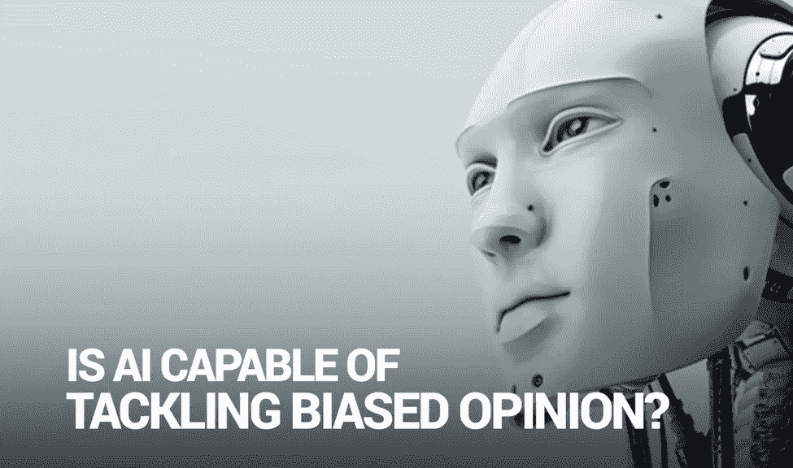

# 人工智能有能力处理有偏见的观点吗？

> 原文：<https://medium.com/hackernoon/is-ai-capable-of-tackling-biased-opinion-8c764be8c4f3>

奥尔加·格里尼纳

## 我们为什么要关心人工智能偏见呢？

与最近臭名昭著的数据安全漏洞一样，人工智能今天可能是科技领域最具争议但最受珍视的主题:它要么被马克·扎克伯格这样的人视为幸事，要么被埃隆·马斯克和史蒂文·霍金视为诅咒和质疑。有趣的是，那些提出这些担忧的人，并不真的害怕机器人接管和屠杀《终结者 2:审判日》中的人类。人工智能反对者真正担心的是更深层的问题:在机器学习算法和软件变得大规模可用的时代，提高对负责任地部署人工智能的认识。研究人员长期以来一直在讨论如何确保无偏见的人工智能不受人类种族或性别偏见的影响。但这种大惊小怪首先有什么坚实的基础吗？

## 都是数据的问题！

人工智能是用人类开发人员输入的大数据训练的。简单来说，人工智能如果用有偏差的数据进行训练，注定会做出有偏差的决策。例如，最近在一个在线招聘搜索服务中部署 AI-search 算法显示，在搜索结果中，它将男性候选人置于女性候选人之上！另一个例子是那些由几十个不同目的创建的聊天机器人中的一个，像“Tay”——最初是为了无辜的聊天而创建的，它在不到 24 小时内就变成了种族主义者——如果不是法西斯的话——怪物，散布攻击性的评论！记住，人工智能从我们人类扔给它的任何东西中学习。而且它学得很快。随着这种由机器学习算法驱动的软件变得越来越容易获得，与主流软件相关的有偏见的人工智能的风险越来越大，从而促进了歧视。例如，谷歌已经推出了一个开源的机器学习软件库，现在任何人都可以免费使用。事实证明，所谓的算法偏差，即人工智能表现出与人类完全相同的偏差，可能会在人类的日常决策中变得更加突出。

有什么方法可以对抗这种算法偏见吗？好吧，这是一个合乎逻辑的跳跃，表明既然人工智能被数据喂养，改变数据本身可能会有所帮助。训练一个人工智能算法需要大量的数据。但是开发人员从哪里获得这些经过过滤的无偏数据呢？是不是免费的，谁真正拥有？脸书数据隐私丑闻以及随后在全球范围内拒绝遵守欧盟数据保护指令，只能证实一个事实，即一个科技巨头持有自行决定处置用户数据的权利。不也是因为他们不仅在数据上赚钱，而且迫切需要它来维持他们 AI 的发展吗？今天的数据真的是新的石油:尽管在技术社区中提出了担忧并呼吁将用户的个人数据还给用户，但技术巨头们并没有放弃它。但是，甚至有可能收集无偏的数据来训练无偏的人工智能吗？

## 人工智能对假新闻有帮助吗？

将人工智能引入平台——其本质是提供真实和不带偏见的观点——将面临更多的挑战。在意见驱动的市场上部署人工智能的全部意义在于它能够识别和排除有偏见的意见。我们在这里遇到了某种“第 22 条军规”的情况:为克服偏见而创造的技术本身也有变得有偏见的风险。说到在线评论市场和评分行业，像 yelp.com 这样的评论平台长期以来一直是分享宝贵意见的地方，是企业收集客户反馈的驱动力。但众所周知，随着时间的推移，这些平台开始失去可信度，因为它们有很多共同的问题。随着人工智能与偏见和假新闻作斗争，新一代得分平台正在兴起。但是如果 AI 本身也变得有偏见了呢？我们从哪里获得足够的数据来训练 AI 充分分析意见的真实性？开发者应该使用现有的 Yelp 生成的评论库吗？在人工智能处理无尽的在线信息海洋中的大量现有数据的情况下，消除偏见变得更加困难。看起来，那些渴望提出人工智能过滤机制的人，首先需要积累自己的“质量”数据包。在将人工智能部署到任何类型的系统时，产品所有者和设计师都应该非常清楚这些风险。机器学习工程师的职责是提出更安全的开发工具，建议更好的方法来设计不歧视性别、种族和其他属性的算法。所有这些问题都特别适用于依赖人工智能作为其真实性的最后手段的行业。在创建人工智能时采取高度的责任感，并将建立一个无偏见的人工智能作为最终目标，这不仅对研究人员来说是绝对必要的，对那些实际上将这些算法引入大众市场的人来说也是绝对必要的——商业领袖和媒体影响者。算法偏见不仅会导致人类偏见的传播，还会导致偏见的放大！可悲的是，大多数人还没有意识到软件偏见，并倾向于盲目相信人工智能的判断。