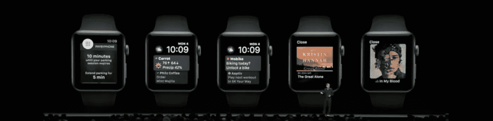

# 苹果是否通过 WatchOS 5 进一步推动了智能手机的解体？

> 原文：<https://medium.com/hackernoon/is-apple-furthering-the-smartphone-disintegration-with-watchos-5-3a2e9dfaf70b>

## 新的特性为开发者提供了拥抱设备的机会，但是现有的限制仍然存在

在[之前的帖子](https://hackernoon.com/the-lte-apple-watch-virtuous-cycle-for-a-new-ecosystem-a9211c608f54)中，我谈到过[苹果](https://hackernoon.com/tagged/apple)如何需要进入 iPhone 之外的新设备周期(不是因为 iPhone 表现不佳，而是因为他们了解【this 曲线模型，他们希望在处于领先地位时跳跃)，这一领域的一个可能赌注是推动独立(无手机)使用苹果[手表](https://hackernoon.com/tagged/watch)和 AirPods 等新设备。我将这种趋势称为[“智能手机解体”](/@jorge.serna/apple-airpods-and-the-disintegration-of-the-smartphone-cb8e29efc8e3)，因为它将分离手机中现有的功能(并创建新的功能)，并将它们分布在多个协同工作的设备上。

尽管 Apple Watch 取得了不可否认的成功，但它成为独立生态系统的能力非常有限，正如大型开发商实际上放弃对手表专用应用程序的支持所表明的那样。

上周，苹果发布了新版本的手表操作系统(WatchOS 5)，所以让我们看看他们是否解决了阻碍其作为一个新生态系统取得成功的一些限制。

# 启用 Spotify

在 WWDC 的主题演讲中，WatchOS 部分的最后简要提到了一点，即新的操作系统将支持提供[背景音频](https://developer.apple.com/documentation/watchkit/playing_background_audio)的应用。需要说明的是，这不允许 Spotify 在手表中播放，但允许同步一些播放列表，然后直接从手表离线播放到一些 AirPods。这将为人们提供一个“电池友好”的解决方案，让他们不用带手机就能使用 Spotify 音乐进行锻炼。

这是对更多无手机使用的激励，但它的提供方式仍然给了 Apple Music 一个优势(它确实支持手表中的蜂窝流媒体)，并强调了蜂窝连接的电池使用仍然是苹果需要解决的问题。

# 步话机

对讲机功能是 Apple Watch 独有的新通信选项。我在之前的帖子中已经[报道过这一点，所以我不会在这里重复，但主要的一点是，这是一种设计用于无连接 iPhone 的体验。通过](https://hackernoon.com/personal-communications-are-still-critical-for-apple-73c3d1e8be04)[将普通语音通话设为可选，这甚至可能成为简化与运营商整合以提供手机版手表的借口。](https://hackernoon.com/why-most-apple-watch-users-will-not-get-lte-calls-on-it-and-why-some-will-2e7a39aad379)

# 将通知作为正确的应用模型

大多数开发人员不提供手表专用应用程序，甚至关闭他们过去创建的应用程序的主要原因之一是因为应用程序模型不是手表中的正确体验。

无论是滚动应用列表还是在“蜂巢”屏幕中寻找图标，在手表中打开应用程序都是缓慢而复杂的。在那个小小的屏幕上，你不愿意仅仅拿出手机就能和那么多东西互动。当然，这造成了一个恶性循环，因为你知道如果你想使用这些应用程序，你就不能不带手机离开家。缺乏正确的应用程序模型，这反过来又造成了应用程序的缺乏，限制了手表成为完全独立体验的能力。

但是有一个例外:通知。你不需要搜索一个应用程序来与通知交互，通知会自动出现在你面前。然后你可以忽略它，或者回复它，如果它是一条消息。与通知交互是手表中应用程序的最佳体验。同样的原因也是开发者不开发手表专用应用的一个很好的借口:因为普通的手机通知在 Apple Watch 中可以无缝地工作。

但 WatchOS 5 将通过引入交互式通知来改变这种情况。

使用交互式通知，开发人员可以提供与通知相关的更丰富的体验，允许用户使用它们做更多的事情。预订提醒允许实际更改预订，或者提醒可以提供触发进一步操作的借口。这样，通知实际上可以成为完整的应用程序。但是为了获得这种好处，开发人员需要创建特定的扩展。为了创建这种扩展，他们需要构建一个手表专用的应用程序。而开发这款应用将反过来迫使他们思考，当手表在没有 iPhone 的情况下工作时，它的行为应该是什么。

**在手表中创造丰富的互动以增加通知的参与度的动机，将促使开发人员也考虑无手机使用，同时在你的手腕上创造更有意义的体验。**

# 你手腕上的蹼。

不仅仅是通知，因为现在可以从手表上访问“信息”和“邮件”中共享的链接。

当然，这不会是一个完整的浏览体验，而是一个基于网页设计响应的简单视图。但不管怎样，这将带来一种开发手表体验的简单方法:只需通过网络。

在 AppStore 出现之前，iPhone 中的应用程序就是这样开始的。这种体验，结合无手机数据访问，可以开始为 Apple Watch 创造新的用例。

# Siri 的改进意味着你的手腕上有更多的应用

虽然这不是 WatchOS 的一部分，但 Siri 的新功能似乎也有可能应用于 Apple Watch。

例如，“Siri Shortcuts”为应用程序开发人员提供了一种方式来展示他们应用程序的部分功能:

1.  通过语音调用
2.  集成在 Apple Watch 的 Siri 界面中
3.  成为通过 Siri 快捷方式应用程序创建的附加自动化的一部分

最后一个方面是一个高级特性，我可能会在以后的文章中讨论，但我现在的重点是前两个。通过语音或通过手表上的快捷点击来触发应用功能，这意味着 Apple Watch 上将有更多的应用可用，而开发者不必创建专门的体验。

事实上，这一特性意味着**你将能够直接从 Apple Watch 或 AirPods** 与更多应用程序互动(根据主题演讲，也来自 HomePod)。这种模式仍然依赖于 iPhone 上运行的应用程序，我认为这比亚马逊为 Alexa 提供的技能更有限。但是**这可能是未来可能出现的“Siri iCloud 应用”的一种中间方法，这将使 iPhone 成为可选的(并因此解体)**。

# Mac 上的 iOS 应用——瓦解之路

最后，主题演讲涵盖了允许开发者在 Mac 上运行 iOS 应用的计划。

这听起来可能与作为独立设备的 Apple Watch 无关，但有趣的是，这正促使 iOS 开发者将他们的应用程序视为可以通过“点击”交互(Mac 触摸板)使用的软件，而不仅仅是触摸。这一举措的目标不仅是增加 Mac 商店中可用的应用数量，还准备让 iOS 开发者将他们的体验输出到新的交互模式中。

如果我们考虑到这一点，以及 Apple Watch 被设计为与 iOS 设备相关联的事实，**这可能是苹果未来的 AR 眼镜将为开发者提供的模型的暗示吗？**