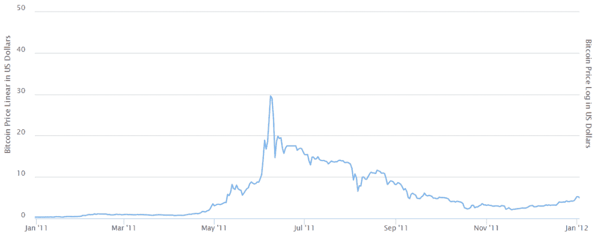
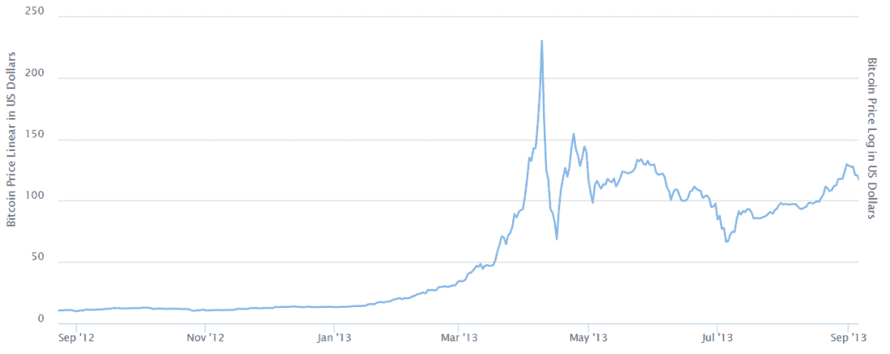
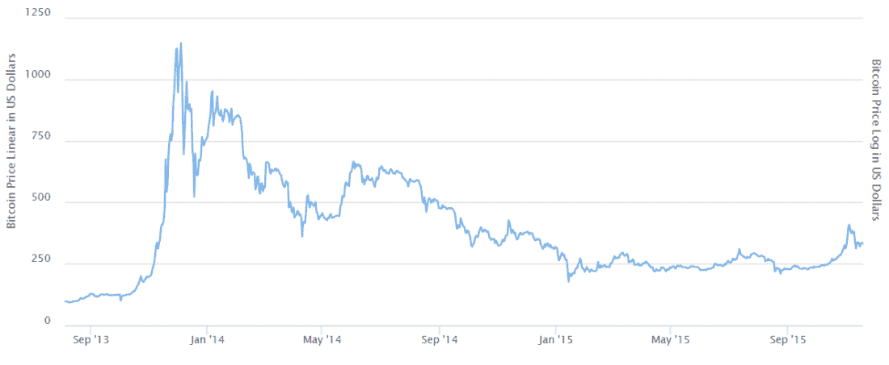
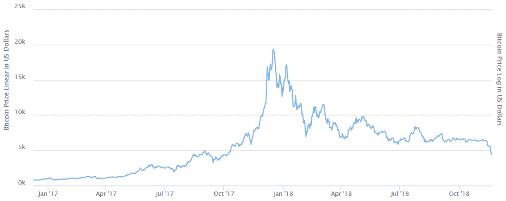
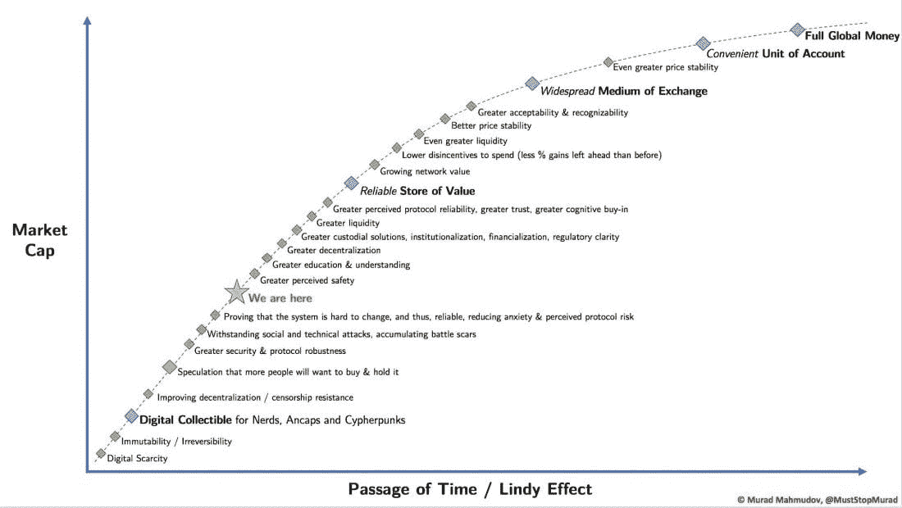

# 比特币死了吗？

> 原文：<https://medium.com/hackernoon/is-bitcoin-dead-9a9ba231b35b>

## 是的，就像它在 2011 年死去一样。

## 2011 年 1 月至 2012 年 1 月

在 2012 年。

## 2012 年 9 月至 2013 年 9 月

而在 2014 年。

## 2013 年 9 月至 2015 年 9 月

而现在 2017 年。

## 2017 年 1 月—2018 年 11 月

虽然有点好笑的是，每次比特币死亡，我们用来测量它的 T2 Y 轴上的刻度就会上升一到两个数量级。

# 比特币感恩节晚餐推介

## 1 缸套

*比特币是一种无国界、中立、不受审查、对所有参与者开放的货币，尽管缺乏中央治理，但它是一个值得信赖的网络。*

## 1 分钟

对于这一分钟的演讲，我将使用穆拉德在接受 Pomp 采访时的演讲(为了清晰起见，这是从播客转录而来的)。[来源](/@apompliano/murad-mahmudov-the-ultimate-bitcoin-argument-b205a1987408)

*比特币是人类文明史上发明的最稳健、最坚硬的货币。它的反通货膨胀是首屈一指的。它的货币政策几年前就为人所知，并且变得越来越可信。这也将对银行和国家控制的货币构成越来越大的威胁。我认为，在未来十年，先于大多数其他央行、大多数其他主权财富基金和大多数其他富人入市，将被证明是人类历史上最明智的投资决策之一。*

# **** * *然后你拿出下面的图表，指向“我们在这里。”******

[Source](https://twitter.com/MustStopMurad/status/1022169639386836992)

## 任何长于 1 分钟的音高

你竟敢认为他们真的想听。

我很惊讶他们一直邀请你去感恩节晚餐。

如果你真的认为他们在乎，那就等到光明节或圣诞节，给他们一份由 Saifedean Ammous 制定的比特币标准。