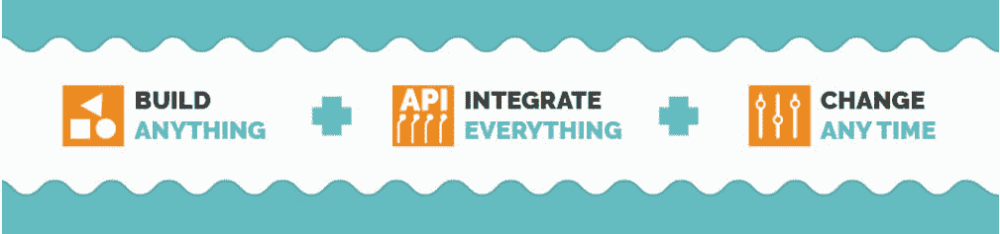
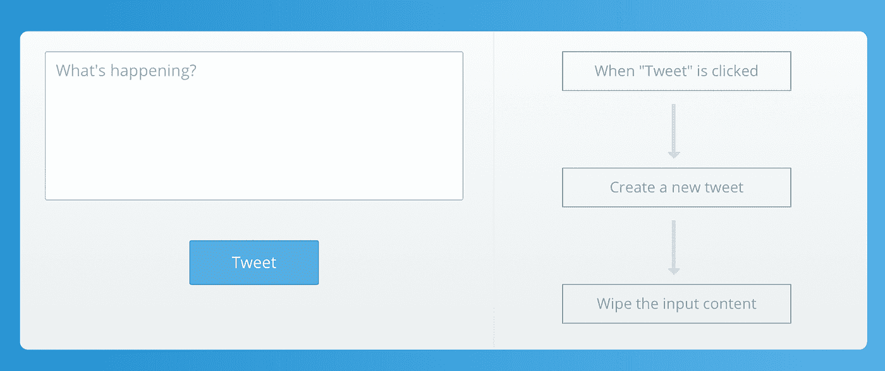

# 编码变得过时了吗？(第一部分)

> 原文：<https://medium.com/hackernoon/is-coding-becoming-obsolete-part-i-54e65781acf1>

让我们面对现实吧，以目前科技世界的发展速度，很难预测编码艺术将会如何发展。我们知道的是，代码是所有技术的基础。

当我们思考编码是否变得过时时，观点各不相同。有人说机器[学习](https://hackernoon.com/tagged/learning)将取代手工编写代码的需要，因为计算机将被训练自己编码。其他人认为，因为编码可能是乏味的，开发人员将能够以比编写代码更令人愉快的方式使用他们的分析技能。

我们相信编码艺术仍然是必要的，然而**网络开发和编程作为一个整体正面临一场革命。**通过使用非常强大但简单的工具，普通人也能构建网站或应用程序，而不仅仅是编码大师。这将很快改变商业、技术和文化的面貌。请阅读“[我如何在 2 年内花了 50K 美元，然后在 2 周内以 0 美元的价格转向”中这一变化的影响。](https://blog.zeroqode.com/how-i-spent-50k-and-2-years-building-a-meditation-app-and-then-pivoted-to-a-telegram-bot-in-2-6a8204f257ab?utm_source=BlogPost&utm_medium=Blog&utm_campaign=IsCodingObsolete)

**历史&概述**

在我们开始讨论无代码革命以及它将如何影响开发之前，让我们停下来反思一下历史。具体来说，让我们看看今天的软件工程师和 19 世纪的电报员的相似之处。

当塞缪尔·莫尔斯在 19 世纪 30 年代发明电报时，他的发明彻底改变了通信。莫尔斯电码被开发出来，它允许通过基本的输入来传输复杂的信息。然而，为了发送或接收信息，你必须有一个熟练的电报员在两端。

电报不再被用作主要的通信工具，但它仍然是 21 世纪出现的其他发明的根源，如电话、传真机、互联网和智能手机。

在 19 世纪，为了以电子方式发送信息，你要么必须会写莫尔斯电码，要么雇佣一名电报员来帮助你发送和接收信息。如果我们做一个比较，它与今天的 web 开发有关。

如果你想构建一个 web 或本地应用程序，你必须能够编写代码或者雇佣一个开发人员来帮你。当时的电报操作员和现在的网络开发人员都拥有罕见的技能和丰厚的收入。然而，对于电报员来说，一旦下一次技术发展使他们的技能过时，这种舒适和幸运就都结束了。类似的变化会很快降临到网络开发者身上吗？

当进一步考虑这个问题时，同样的类比也适用于技术史上的其他事件。

泡泡公司的创始人 Emmanuel Straschnov 将可视化编程对社会的影响与文字处理软件的影响进行了比较。坐在电脑前的普通人——见鬼，普通 7 岁的孩子——现在可以在几分钟内编写并发送一份电子文档。在文字处理器出现之前，这需要特定的技能和更多的时间。(阅读这篇[文章](http://www.nocode.tech/blogpage/meet-emmanuel-founder-of-bubble-and-his-goal-to-make-coding-obsolete/?ref=Zeroqode)中关于这个主题的更多内容)

同样，可视化编程将使大众能够接触到数字创作。许多人多年来一直抱着想法不放，但觉得自己为梦想融资的能力有限。视觉编程将为这些人提供一个强大的社会和经济平台，使他们保持在线存在的能力民主化。我们正在进入一个新时代，这将是一个美好的时代。

**个人电脑的崛起**

早在 1880 年，美国人口增长如此之快，以至于花了 7 年多的时间来统计美国人口普查数据。政府找到了一种更快捷的方法，那就是利用基于穿孔卡的计算机，这些计算机占据了整个房间。1941 年，计算机开始在主存中存储信息。1946 年，计算机被出售用于商业和政府应用，然后在 1953 年发明了第一种编程语言，现在被称为 COBOL。1964 年，第一台个人电脑的原型被展示出来，1974 年大量的个人电脑投放市场。然而，直到 1977 年，那些不会写代码的人才第一次能够使用个人电脑。

这个时间表为我们提供了对 web 开发未来的展望。直到最近，只有编码大师能够构建 web 或本地应用程序。现在，任何能上网的人都可以进行网络开发。很快，技术的进步将使普通用户能够应对最复杂的开发挑战。

**无代码革命**

无代码革命始于第一种可视化编程语言的日益流行。用户无需编写代码、雇佣代理或管理自由职业者就可以建立网站。只有通过拖放“代码块”到适当的位置，一个简单而实用的网站才能建立起来。

但是，在我们进入无代码革命的细节之前，这里有一些定义。

无代码开发平台是可视化的集成开发环境，允许用户拖放他们希望包含在其应用程序中的组件，按照逻辑顺序连接它们，并启动移动或 web 应用程序。这种平台释放了任何用户的想象力和创造力——不管他们以前是否了解传统编程语言。用户友好的可视化界面允许组件和第三方应用程序进行集成和测试，以使应用程序的外观和功能符合计划。

无代码平台的发展最初来自于企业家对熟练的、负担得起的 web 开发人员的有限接触。类似地，一些开发公司认为需要减少项目周转时间，并更快地发布或迭代产品。这一运动正在逐渐发展，Forrester Research 的分析师估计，到 2020 年，无代码/低代码市场将达到 150 亿美元。

随着 Bubble 在 2012 年的诞生，不仅可以构建简单的登录页面或博客，还可以构建具有复杂逻辑和功能的 web 应用。传统上，无代码开发平台在前端和后端允许较小的灵活性。然而，Bubble 可以对像素进行微调，并可以定义应用程序对任何输入的反应。让我们看一个例子。

假设您打算构建一个功能类似于 Airbnb 或 Indiegogo 的 web 应用程序。由于传统的无代码开发平台缺乏基本的功能，构建复杂的 web 应用程序几乎是不可能的。在 Bubble 上，有了清晰的想法和时间，几乎任何事情都是可能的。定义数据结构，构建可视化部分，并通过将这些部分与强大的工作流互连来实现可视化！了解[一家初创公司如何使用无代码](https://blog.zeroqode.com/how-to-build-your-mvp-without-a-technical-co-founder-and-without-code-cba2ccc206b?utm_source=BlogPost&utm_medium=Blog&utm_campaign=IsCodingObsolete)创建 MVP。

由于无代码开发平台的增长和发展，以及该技术颠覆市场的巨大潜力，支持无代码革命的企业应运而生。

一家这样的公司是 Zeroqode，这是一家一站式的无代码创作公司。Zeroqode 提供复杂的 web 应用程序模板，这些模板都建立在 Bubble 的高级可视化编程平台上。凭借其健壮、实用和漂亮的模板，Zeroqode 正引领我们进入无代码革命(阅读 [TechCrunch 对这个](https://techcrunch.com/2018/01/11/zeroqode-will-usher-us-into-a-codeless-future/?ref=Zeroqode)的评论)。

**总之**

随着企业经历数字化转型，它们将成为软件驱动的组织。雇佣软件开发人才的需求已经成为一个不幸的瓶颈，阻碍了全球大、中、小型公司的发展。

无代码平台有能力颠覆整个行业，因为以前无法释放自己想法的创业个人或小企业现在正以创造力的爆炸淹没世界。正如 BP Logix 的首席战略官 E. Scott Menter 所解释的，“没有代码在这里，它不关心如何使您的 it 组织更高效，它的唯一目的是将您的业务变成数字集成的、不受审计约束的、不受客户需求限制的孤岛对象。"

在可预见的未来，Web 开发人员仍然有用。然而，很明显，无代码革命已经到来，使得应用程序和 web 开发对普通人来说都是可行的。

**附:喜欢这篇文章吗？继续阅读** [**中关于无代码的影响以及我们对代码未来的最终结论:编码会过时吗？第二部**](https://blog.zeroqode.com/is-coding-becoming-obsolete-part-ii-edab66a0be14?utm_source=BlogPost&utm_medium=Blog&utm_campaign=IsCodingObsolete) **！**

