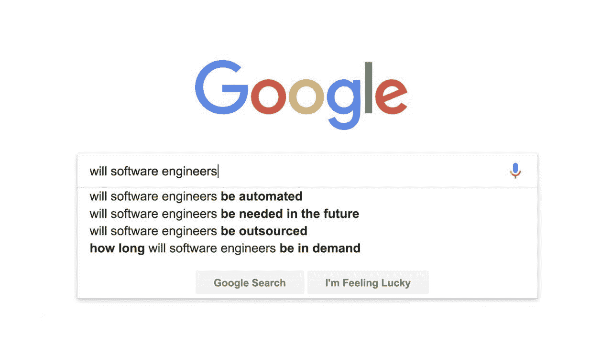
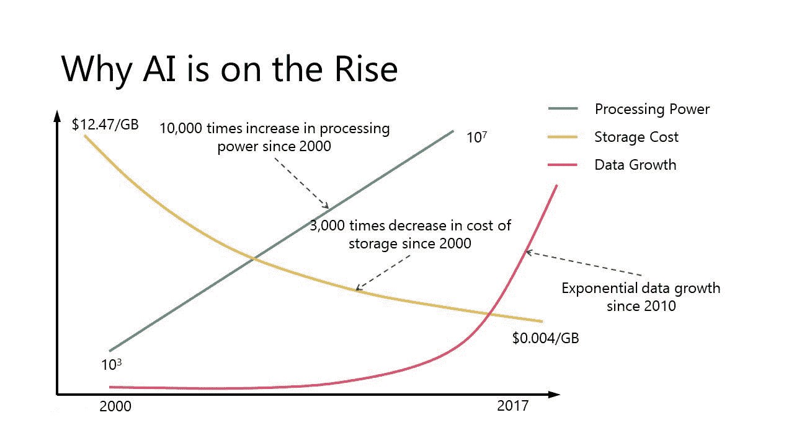
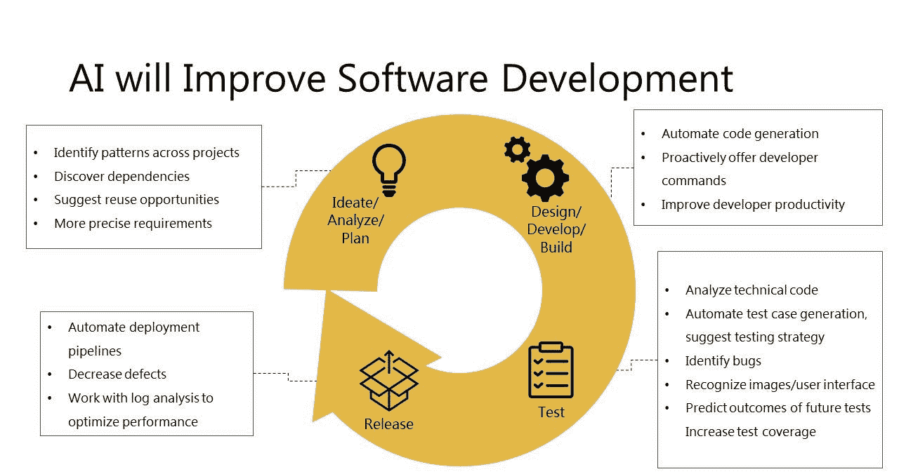

# 计算机工程真的要自动化了吗？

> 原文：<https://medium.com/hackernoon/is-computer-engineering-really-going-to-be-automated-e6111412432e>

现在还不是开发人员等待人工智能末日的时候。事实上，机器学习最终将成为程序员工具箱的一部分，而不是人类程序员的替代品。

尽管如此，对人工智能作为一种敌对力量伺机取代开发者的担忧，是我们许多科技行业人士都面临的问题。快速浏览一下谷歌搜索就会发现，我不是唯一一个问这个问题的人。

难怪每个人都在谈论人工智能，Gartner 将其列为最热门的话题。随着人工智能和机器学习从饮水机聊天到晚间新闻中随处可见，人们开始担心这对他们的未来意味着什么。这已经变得如此严重，以至于 29%的开发人员将[被人工智能取代列为他们主要的职业恐惧](https://evansdata.com/press/viewRelease.php?pressID=231)。

在我们正面解决这个怪物之前，让我们回顾一下人工智能的历史和围绕它的炒作。

# **老派编程和早期 AI**

人工智能的首次出现始于 20 世纪 50 年代，当时电脑会下跳棋。赌注不断加大:计算机在跳棋、西洋双陆棋、国际象棋上打败了人类，并最终在围棋上打败了人类。在第一波人工智能浪潮中，计算机使用简单的规则，在游戏中以有限的移动次数和明确的结果击败人类。

就目前而言，这很好，但开发者几乎不会面临来自擅长下棋的计算机的生存威胁。在每种特定的情况下，写一套规则和步骤来做决定很快就会在野外遇到限制。现实生活中很少有像象棋这样简单的场景。

# **传统编码非常复杂**

在传统编程中，代码是嵌套在日益复杂的条件中的一系列基于规则的决策。这在简单、可预测的情况下确实很有效，但是项目越大，这种方法的局限性就越明显。

测试传统代码必须预测每一种可能的情况，这个过程呈指数增长。即使相对简单的程序也需要大量的测试来发现错误。这给代码带来了真正的可伸缩性问题；在某一点上，向原始代码库添加越来越多的代码变得太难了。重构或从头开始是一个昂贵且耗时的选择，最终会遇到同样的问题。

大型程序的脆弱性是传统编码面临的另一个严重问题。添加一行代码会破坏其他看似不相关的东西。传统的非人工智能程序的规模有一个硬性限制。

# **机器学习正在教你的狗捡东西**

你不能通过写一套包含所有可能发生的情况的详细说明来教你的狗去捡东西。取而代之的是，你扔出一根棍子，也许演示抓取，然后重复这个过程几次。在几分钟内，你的狗将或多或少成为一个抓取专家，而你从来没有告诉你的狗如何抓取。欢迎来到机器学习！

我们的狗朋友和通过机器学习算法运算的超级计算机之间的区别在于，计算机使用大量数据，而没有一套特定的规则。计算机使用这些训练数据来“学习”。 *Ecce 玛奇纳！*

# ****黑匣子****

**机器学习的方法是查看数据并进行学习，而不是编写大量的规则。这消除了与基于规则的编程相关的可伸缩性和测试问题。**

**最大的缺点是机器学习是一个黑箱。即使是构建机器学习算法的工程师也不知道决策是如何做出的。**

# **翻译:基于规则的编程和人工智能的比较**

**机器翻译始于对自然语言的复杂规则进行编程的努力。更困难的是，常规语音的词汇丰富性需要几十本专门的词典。即便如此，一个不认识的单词，不管是俚语、方言还是专业术语，都会使句子无法解析。这导致笨拙和不可靠翻译。**

**基于机器学习的翻译者更擅长猜测不熟悉单词的意思，并产生可理解的翻译。从数百万网页中以任何给定语言提取数据，以训练支持谷歌翻译的人工智能。**

**让我们来看看一个短语，它对人类来说很容易解析，但对基于规则的翻译器来说却很难处理:**

***brain ware 组织的未来工作活动***

**online-translator.com 把我们的短语翻译成俄语:**

***будущеесобытияработы***

**谷歌翻译给了我们这个:**

***событие工作的未来***

**第一个翻译对于一个说俄语的人来说确实是不可理解的，然而机器学习驱动的结果是可以理解的。谷歌翻译发现未来的工作是一个事件的名称，所以没有翻译它，并在俄语中使用正确的词序。**

# ****为什么艾现在成年了****

**当前人工智能崛起背后的一个值得注意的事情是，我们用于机器学习的许多算法来自 80 年代和 90 年代。对于一个迷恋最新事物的行业来说，人工智能的基本逻辑已经非常古老了。**

**三个因素将机器学习从象牙塔中解放出来:存储数据变得廉价，可访问的数据量呈指数级增长，计算机处理能力增强。**

****

# ****自动化技术工作****

**看看关于工作自动化的原始数据，这是不祥之兆。我理解为什么我的同事们坐立不安。网络开发人员很有可能被自动化，而计算机支持专家面临着 72%的自动化机会。如果没有一些背景，这些数字会引发一场没有根据的技术灾难。**

**人工智能在工程领域的真正未来是利用技术，让人类工程师更有效、更快、更少地工作。因此，人工智能将把人类开发人员变成更健壮的程序员，而不是完全取代人类。**

# ****人工智能将如何帮助开发者****

****

**软件旅程的每个阶段都将被人工智能所增强。在计划阶段，一个项目将会看到更好的分析、技术选择和重用其他项目代码的机会。随着人工智能生成大量代码，人类开发人员将能够更快地工作。随着人工智能协助 QA 工程师，测试将更加全面和严格。当人工智能可以协助时，自动化部署也将更不容易出错，速度更快。**

**看看演示埃森哲 myWizard 的视频就知道了，这是一个托管智能虚拟代理的平台，这些代理使用机器学习来与人类同事合作。根据《哈佛商业评论》的报道，人工智能项目经理已经在帮助埃森哲交付项目，80%的时间都能正确预测危险信号。**

# ****人工智能已经在帮助开发者****

**所有这些都不是遥不可及的白日梦。 [DeepCode](https://www.deepcode.ai/) 已经在使用机器学习来分析和清理现有代码。它被誉为代码的语法。就像拼写和语法检查器没有淘汰校对和编辑一样，人工智能正在努力帮助开发人员。**

**其他创业公司正在将人工智能推进一步。 [Logojoy](https://logojoy.com) 利用机器学习生成 logos 和简单的设计。[UIzard](https://betalist.com/startups/uizard)**将手写设计转换成 HTML 和 CSS。****

# **软件工程师会自动化吗？**

**让我们回到我们最初的问题，软件工程是否会自动化。答案既是肯定的，也是否定的。当然，开发的许多方面将会自动化。不过，这并不一定意味着工作岗位会减少。**

**自动化降低了软件开发公司的成本。这反过来意味着可以在更短的时间内生产更多的软件。对软件的需求正在增加，随着自动化降低生产成本，商业机会只会增加。**

**如果你是一名软件工程师，现在还没有必要去爬山。虽然这个领域在不断变化，我们的工作流在未来将包含更多的自动化，但开发人员不太可能很快就完全失业。**

# ****成为更好的人类****

**由此得出的结论是，我们没有理由害怕即将到来的替代者。相反，我们需要关注自动化程度最低的人类技能。**

**传统编程采取了理性主义的方法，机器学习是终极的经验主义。作为人类，我们需要研究这两者，并知道什么时候哪种方法更适合特定的工程问题。**

**未来每个程序员都需要对算法和数据结构有更深入的理解。当然，这只是开始，但我们很可能会看到一个新的计算机科学课程，训练工程师与人工智能协同工作。**

**不容易自动化的非技术性技能将成为区别程序员的因素。领域专长和创造力将变得更加重要。更好的软技能和情商也会让工程师脱颖而出。**

**有时候甚至连艾都认输了。当我让 Siri 给我讲个笑话时，她不知该说什么好。**

****

**因此，我给开发者的建议是继续学习。磨练你的非技术技能，为将来从事数据结构、机器学习和人工智能工作做好更充分的准备。**

***如果你不愿意学习，没人能帮你。如果你决心学习，没有人能阻止你。***