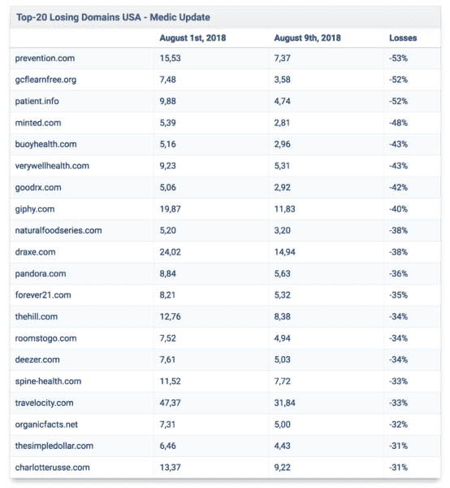
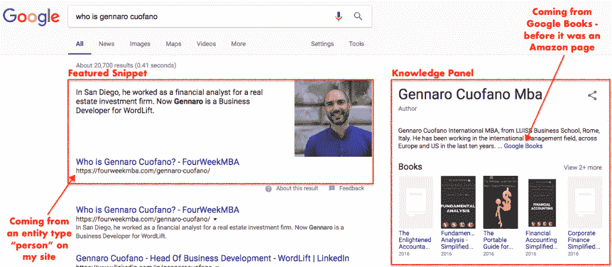

# 内容到底是不是 SEO 中的王道？

> 原文：<https://medium.com/hackernoon/is-content-king-in-seo-after-all-a4f08341aca2>


> 互联网令人兴奋的一点是，任何人只要有一台个人电脑和一个调制解调器，就可以发布他们能创作的任何内容。从某种意义上说，互联网是复印机的多媒体等价物。它允许以低成本复制素材，不管观众的规模有多大。

这是比尔·盖茨在他的文章“内容为王”中写的一些话从那时起，这就成了内容制作者的预言。SEO 社区是最能感受到这种讨论的社区之一。这是一个由专家组成的社区，他们试图通过主要的商业搜索引擎对网络内容进行排名。

在 SEO 社区中，到处都在讨论内容是否仍然是王道，或者被其他东西所取代。

毫无疑问，内容很重要。然而，内容取决于上下文、用户的意图和作者的权威性。在一场龙卷风卷走了许多网站的流量后，这些因素变得更加明显。

# 没有上下文和意图的内容就像没有调味汁的比萨饼

2018 年 8 月的第一周，一场被 SEO 社区称为“医疗更新”的龙卷风重创了许多网站。这是对谷歌算法核心的更新，它将数百万甚至数十亿的访问从一些网站转移到另一些网站。按照谷歌的规定:

> *本周，我们发布了一个广泛的核心算法更新，就像我们每年都会做几次的那样。我们对这些更新的指导和三月份的一样，正如我们在这里提到的:*[*【https://t.co/uPlEdSLHoX】*](https://t.co/uPlEdSLHoX)
> 
> *—Google search liaison(@ search liaison)*[*2018 年 8 月 1 日*](https://twitter.com/searchliaison/status/1024691872025833472?ref_src=twsrc%5Etfw)

Google 的搜索联络员负责与外界(尤其是 SEO 从业者)的沟通，他给出了算法变化的更多细节，具体说明如下:

> *每天，谷歌通常会发布一个或多个旨在改善我们搜索结果的变化。有些关注具体的改进。有些是广泛的变化。上周，我们发布了一个广泛的核心算法更新。我们每年都会例行公事地做几次…*
> 
> *—Google search liaison(@ search liaison)*[*2018 年 3 月 12 日*](https://twitter.com/searchliaison/status/973241540486164480?ref_src=twsrc%5Etfw)

这次更新的最大输家似乎是 YMYL(你的钱或你的生活类网站)。简而言之，一个为你提供可以影响你生活(无论是物质生活还是经济生活)的指导的网站已经从这种算法变化中转变了。据搜索引擎 Land 报道，一个列表中的网站在一周内丢失了 30-50%的流量。



```
**Source**: [searchengineland.com](https://searchengineland.com/googles-august-first-core-algorithm-update-who-did-it-impact-and-how-much-303538)
```

正如比尔·斯劳斯基指出的:

> *网络上内容不是王道；满足搜索者的意图。当有人在午餐时间搜索比萨饼时，他们可能不是在寻找比萨饼的历史，而是一两片。*[*# SEO*](https://twitter.com/hashtag/SEO?src=hash&ref_src=twsrc%5Etfw)*[*#意图*](https://twitter.com/hashtag/Intent?src=hash&ref_src=twsrc%5Etfw)*[*#上下文*](https://twitter.com/hashtag/Context?src=hash&ref_src=twsrc%5Etfw)**
> 
> ***—比尔·斯劳斯基⚓(@比尔 _ 斯劳斯基)*[*2018 年 8 月 9 日*](https://twitter.com/bill_slawski/status/1027588704229945349?ref_src=twsrc%5Etfw)**

**看似微不足道的事情其实并非如此。事实上，在 SEO 社区中，围绕完美内容长度的讨论一直在进行。但是，内容不是重点。谷歌是一个工具，可以找到哲学或非常实际的问题的答案。**

**因此，当我根据一天中的时间搜索“比萨饼”时，我可能是在寻找吃的东西。或者，如果我只是好奇，我可能会寻找比萨饼的历史。这些案例显示了两种完全不同的意图。一个极其实用(我现在就要吃饭！).另一个是信息性的(我想知道披萨的历史脉络)。**

**如果你听了“内容为王”的老话，你可能会浪费时间整理一篇 2000 字的文章，涵盖比萨饼的历史以及用户可能有的所有其他不同问题。**

**然而，同一个用户可能只是在寻找特定的信息，而这些信息也可以用描述如何制作比萨饼的 300 字食谱来回答。在这种情况下，考虑“内容为王”可能会扼杀你的生意。**

# **谷歌正在成为语义网**

**多年来，关于谷歌何时会变得语义化的猜测一直在持续。简而言之，对于那些不知道谷歌是如何运作的，以及现在是如何运作的人来说。在过去，谷歌主要依靠两个方面进行搜索:反向链接和关键词。因此，每次用户在搜索框中插入该关键字时，都会通过将该关键字与网页进行匹配来给出结果。就这么简单。**

**虽然这种机制听起来很简单，但谷歌确实在几年内成功地索引和抓取了数十亿个页面。此外，谷歌的第一个算法 PageRank 代表了商业领域令人难以置信的创新。当谷歌推出时，搜索行业是一个过多的引擎，不仅仅提供相关结果，还会提供垃圾内容和大量的横幅。**

**谷歌改变了这一点。然而，当谷歌开始高速增长时，没有人会想到(即使是拉里·佩奇)。多年来最重要的问题是通过避免公司崩溃来管理这种超高速增长。谷歌能够挺过它的高速增长，成为世界上最大的搜索引擎。它最终控制了网络。**

**然而，SEO 行业的诞生也对谷歌提出了挑战，谷歌必须想出一种方法来克服其算法的“操纵”。虽然，一般来说，SEO 从业者按照 Google 的指导方针操作(所谓的白帽 SEO ),但是许多其他人操作系统来玩游戏(所谓的黑帽 SEO)。因此，谷歌对其算法进行了几次更新，如熊猫或企鹅，以清除那些试图利用系统的人。**

**谷歌正在走向的另一个方向是整合其语义引擎，建立在其核心算法之上，作为搜索的主要推进器。早在 2013 年和 2015 年，谷歌已经用蜂鸟更新了它的核心算法，然后用它的一个组件，叫做 RankBrain。简而言之，这些变化主要是为了让谷歌通过查看它创建的大量知识图表来阅读网络上的信息。这是一种语义技术，允许搜索引擎存储数十亿个简单的逻辑短语(如“我是 Gennaro”和“Gennaro 认识 John”)，这些短语通过逻辑关系连接起来，将使该图呈指数级增长。**

**今天，谷歌的知识图谱为谷歌的大部分查询提供了动力。因此，谷歌终于能够根据直接的问题为用户提供答案。**

# **语音搜索之战仍将继续**

**截至目前，谷歌还能够对一个问题提供多种观点。例如，如果你在谷歌上问“谁是 Gennaro Cuofano ”,你可能会看到这个:**

****

**Google 使用两种不同的功能(特色片段和知识面板)从两个不同的角度回答同一个问题。然而，有一点值得注意。知识面板是谷歌搜索结果中最稳定的功能。**

**虽然特色片段可能来来去去，但知识面板通常不会消失。这是因为知识面板信息来自谷歌专有的知识图表。而特色片段信息来自网页。因此，如果另一个网页有更好的方法来回答这个问题(和更好的 SEO 策略),你可能会丢失这个片段。**

**这也是为什么与特色片段相比，知识面板在谷歌助手中更受欢迎。因此，知识面板现在是、将来也将是谷歌白色页面上的一个重要空间。**

**这个空间已经价值数十亿。以前来自知识面板的信息来自我过去创建的亚马逊页面。正如你从图片中注意到的，同样的信息来自谷歌图书的一个页面，这个页面不是我创建的。这是谷歌夺回搜索结果控制权的一种方式。**

**这也是直接进入语音搜索的途径。在谷歌数字助理中，知识面板通常被作为答案。然而，出版商也担心那些旨在给用户直接答案的功能甚至会扼杀他们的业务。**

# **我们接下来要去哪里？**

**在文章**[**Ok Google，你在寻找语音的商业模式吗？**](https://fourweekmba.com/new-business-models-voice-search/)**我假设了四种可能走向语音搜索的商业模式。在这个阶段，虽然有一件事变得很清楚；脱离上下文或者不能抓住用户意图的好的、有深度的内容可能一文不值。在这个时代，多种设备将能够通过越来越准确地挖掘我们的意图来吸引我们的注意力，我们需要重新思考我们传递内容的方式。******

******例如，虽然一篇文章可能永远是最好的写作格式，以满足用户对哲学问题的意图。想想有人在搜索“生命的意义”(显然每个月在谷歌上有超过 20 万次搜索)。在其他情况下，如果意图具有非常实际和交易的意图(我只是在晚餐时间在搜索框中键入“Pizza ”,我得到的是餐馆),理解上下文是至关重要的！******

# ******总结和结论******

******早在 1996 年，比尔·盖茨就写过一篇著名的文章:“内容为王。”从那时起，关于这种说法是否正确的讨论就一直在进行(你可能会找到题为《1997 年内容为王？往前走)。虽然内容仍然至关重要，但记住今天的大部分网络流量都是通过谷歌(根据 Alexa 的说法，这是最受欢迎的网站)进行的，这一点也很重要。******

******然而，通过谷歌搜索的人可能会有哲学问题。但大多数情况下，那些都是实用的。事实上，[截至 2017 年，谷歌 86%的收入仍然来自广告](https://fourweekmba.com/how-does-google-make-money/)，尽管你仍然可以向寻找其生活意义的人出售某些东西。把东西卖给甚至懒得问的人要容易得多。******

******基于此，在商业层面，能够捕捉到查询的上下文并理解其意图(促使他们采取行动或反行动的深层关注)的内容制作者将会胜出！******

> *******为网站上的搜索者规划可用的任务，并使这些任务对访问者可用，就是预测访问背后的意图(如何做、购买、预订、观看等)。)*******
> 
> *******—比尔·斯劳斯基⚓(@比尔 _ 斯劳斯基)*[*2018 年 9 月 20 日*](https://twitter.com/bill_slawski/status/1042905123238764545?ref_src=twsrc%5Etfw)******

*******原载于 2018 年 9 月 20 日*[*fourweekmba.com*](https://fourweekmba.com/is-content-king/)*。*******