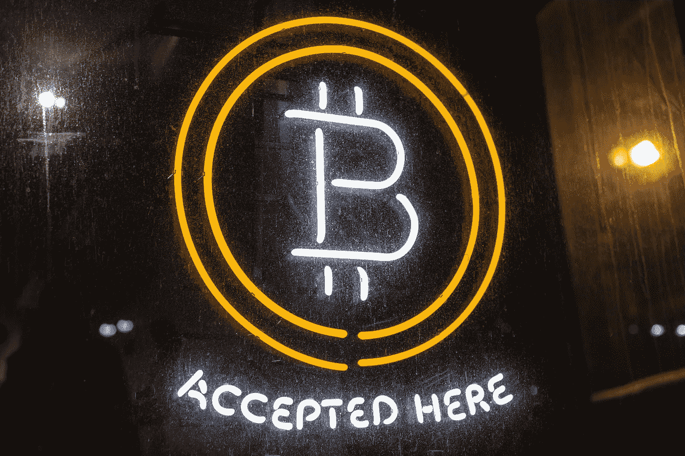

# 对于主流应用来说，Crypto 成熟了吗？

> 原文：<https://medium.com/hackernoon/is-crypto-mature-yet-for-mainstream-use-a18641f60dcb>

比特币的价格像钟摆一样波动。它随着炒作而上升，随着监管而下降。

本质上，任何“交易”都是基于这样一个事实，即双方都“重视”正在交易的东西。想起来了；如果所有人都突然开始认为美元是无用的纸张，那么美元还有什么价值？

当然，这不太可能发生在现金上，但加密货币却经常受到困扰。密码的流动性很差；它们很难转换成现金，最终价格可能比预期高 1%到 10%。有时你必须等待几个小时才能得到交易确认，交易所甚至可能用完各自的密码。

加密霍德尔对系统进行了两次打击；第一，他们等待自己的资产达到一定的利润水平(这会影响流动性)，第二，当这种情况发生时，他们就会涌入市场。

考虑这样一个事实:在有人在 GDAX 交易所下了数百万美元的市场卖单后，乙醚的价值在一秒钟内下跌了 99.9%以上，跌至 0.10 美元。最初的卖单将价格降至 224.48 美元，但像雪崩一样，它进一步引发了来自拥有止损单和保证金头寸的客户的额外卖单。

微软和 Steam 因比特币的“高费用和波动性”而停止接受比特币，许多公司只通过中介服务接受比特币。

总之，这是一个现实问题。随着每天越来越多的区块链解决方案上市，围绕密码的问题必须得到解决。我们需要稳定、易于兑换的代币以及硬币的广泛接受。

# **关于流动性的说明**

“流动性”是指你交易某种资产的难易程度。现金流动性最强，房地产、葡萄酒和收藏品流动性较差。要卖掉你的房子，你通常需要雇佣一个代理人，然后等上几个月才能找到合适的买家——否则你可能会被迫以巨大的折扣卖掉它。

流动性最差的是风险资本、私募股权和对冲基金。在出现流动性事件(如你投资的公司上市或被另一家公司收购)之前，你很少能在这些类型的投资中获得资金。

尽管有些人认为投资非流动性资产是件好事，但传统上这只是富人的专利。然而，当谈到加密货币时，人们的预期是，它们更多地被视为货币，而不是房地产。密码必须在现实世界中可用——否则它们只能服务于难以转化为有用东西的投资目的。

# **区块链拯救区块链**

在撰写本文时，加密货币的总市值超过 4300 亿美元。这是任何人都不能忽视的，许多公司都试图解决这个问题，每个公司都从不同的角度来解决这个问题。

华尔街的做法是[比特币期货](https://seekingalpha.com/article/4139249-bitcoin-futures-work)，允许市场参与者对冲其头寸的波动性。这使得比特币价值交易成为可能，而不会受到几乎不受监管的比特币交易所的不确定性的影响。虽然有非常高的保证金要求，但比特币期货为交易者提供了经过时间考验的交易所，不太容易受到黑客攻击、盗窃和意外停机的影响。

然而，华尔街只针对比特币，我们知道已经有数千种其他加密货币存在。

[Bancor](https://www.bancor.network) 专注于解决不同加密货币之间的流动性问题。通过创建中间令牌，他们开发了一个系统，可以潜在地将任何加密货币转换为另一种加密货币。这对于小令牌尤其有用。

[MoxyOne 的方法](https://moxy.one/)是通过使用借记卡的 ATM 机将任何密码立即转换成现金。它允许任何公司从他们的系统中创建他们自己的白色标签借记卡，并让他们的令牌在现实世界中使用。

摩纳哥也允许消费密码。他们不提供像 MoxyOne 这样贴有白色标签的解决方案，但他们与 Visa 合作，Visa 已经批准新加坡居民使用这种解决方案，其他国家也可以效仿。

Nexo 的解决方案对霍德尔来说尤其聪明:它允许透支。你可以把密码发送到他们的钱包里，然后收到现金作为回报——没有交换费或税。你将不得不偿还透支和一定的利率，但好的一面是，当所有这一切发生时，你的密码将留在你的手中。

# **结论**

许多人都在等待比特币泡沫破裂，但区块链会留下来。哪些解决方案会成功，哪些会失败，还有待观察。2018 年可能是这些解决方案成为主流的一年。