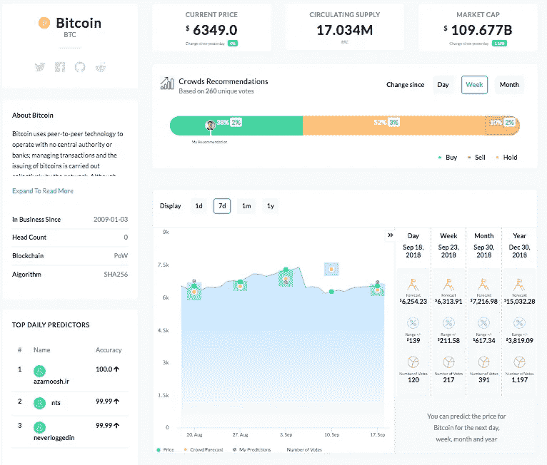

# 加密是可预测的吗？

> 原文：<https://medium.com/hackernoon/is-crypto-predictable-9ed681a03d40>

传统的预测模型不适用于[比特币](https://hackernoon.com/tagged/bitcoin)，它是一群退化但非常有前途的兄弟姐妹。

他们怎么会呢？没有现金流，没有资产负债表，没有收入，而且对于许多另类投资者来说，没有产品可供审查。

传统的预测模型不适用于 [crypto](https://hackernoon.com/tagged/crypto) 并在许多情况下像玻璃锤一样无用，这并不奇怪。

Leverage the Future at [KryptoLoop.com](http://www.kryptoloop.com) (sorry for the plug)

## 那怎么办呢？

好吧，有可供选择的模型可供参考，为了本文的目的，让我们只关注其中一个。

[**群体智慧**](http://www.kryptoloop.com) 模型似乎是一个很好的替代方案，因为它为预测者提供了一种衡量市场情绪并了解“众所周知的市场风”吹向何方的方法。

但是，在我们决定这个模型是进入水晶球并利用这个球预见的预测的最佳可能方式之前，让我们做科学家做的事情，并尝试反驳这个论点。

> *为什么***群体的智慧模型不是预测隐秘价格变动的好工具？**

**

# *移动目标。*

*群体智慧模型长期以来被用于预测某些具有可证实结果的事件(那些对影响没有反应的事件)。想想在游戏节目中，玩家可以要求观众帮助找到正确的答案。*

*这些事情很适合由观众来回答，因为答案是固定的，玩家所做的就是调查观众，看看大多数观众支持哪个答案。然而，将群体智慧模型应用于预测金融市场需要更多的耐心。*

## *金融市场是一个二阶混沌系统。*

*如果你读过尤瓦尔·赫拉利的书《智人》,你就会知道副标题暗示的是什么，至于其他，第二层混沌系统，用最简单的定义来说，就是一个对预测做出反应的系统(就像股票市场一样)。*

*换句话说，当一个预测被做出并发布到公共领域时，根据其权重，它将对股票轨迹产生影响(即，它可能导致预测价格发生变化)。*

*这里有一个你可以效仿的简单例子。*

*如果我是市场上的一个主要影响者(像**高盛烂**这样的人)，我发布了一个预测，说[比特币](https://www.kryptoloop.com/ProfileCompany/1182)到 2018 年底将交易在 20，000 美元，而与此同时[比特币](https://hackernoon.com/tagged/bitcoin)今天(2018 年 9 月)徘徊在 6，200 美元左右，你会不会现在就入场，骑着牛市的**上涨 217%** 。*

*你们中的一些人可能不会那么容易受到影响，然而，考虑到许多人会受到影响，假设比特币的价格会相应上涨也不会太荒谬。*

*更奇怪的是，从某种意义上说，这个预测变成了自我实现的预言，因此市场对我的预测做出了反应。*

*在我们继续讨论**群体智慧模型如何适用于预测加密经济中的价格变动**之前，最后一个警告。*

*在上面的例子中，我已经在九月陈述了我对年底的预测。假设我的预测足以推动现在的价格上涨，那么接下来的三个月会发生什么谁也说不准。*

# *[人群的预测能力](https://www.kryptoloop.com/ProfileCompany/1182)*

*人群擅长的一个领域是识别情绪。换句话说，让人们提交一份预测，就相当于让他们把自己对某个令牌以及市场状况的所有知识提取出来，并将其提炼为一个单一的价格预测。*

*当你把所有的预测综合起来并平均后，你就能看到人群是高于还是低于当前价格。这是最纯粹的情绪，虽然预测(或平均价格)可能不准确，但总的方向是正确的。*

**

*[Leverage the Future at KryptoLoop.com](https://www.kryptoloop.com/ProfileCompany/1182)*

*我将留给你几个著名的句子(见下文),它们让我们开发了 [KryptoLoop](http://www.kryptoloop.com) 并利用大众的智慧来帮助交易者识别最真实的市场情绪。*

> *“市场效率的一个核心假设是，证券价格包含了历史价格中包含的所有价格敏感信息。通常不言而喻的推论是，价格变动不会为未来价格提供任何指引，因此市场没有预测能力。*
> 
> *然而，对这一假设的一个隐含挑战是正式承认**市场具有动量**:也就是说，价格在一个方向上的运动往往会持续。*
> 
> *这通常归因于行为因素，即投资者决策中的非理性偏差，包括从众和短视趋势，以及对新信息重要性的低估或高估。*
> 
> *通过解开常见的金融假设，很明显，任何证券的价格都会随着市场对风险和回报的预期而变动。换句话说，证券回报是由对未来现金流、价格和风险的事前(基于预测)预期决定的。*
> 
> *[预测市场](https://www.kryptoloop.com/ProfileCompany/1182) —莱斯·科尔曼*

*好了，伙计们，我得走了。*

*我爱你，*

*免疫球蛋白超基因族*

*在推特上用 [@iggsloop](https://twitter.com/IggsLoop) 找到我*

*伊戈尔是一个情人，也是一个斗士。他碰巧喜欢在加密推特上发帖，和朋友喝啤酒。他的最新项目旨在通过一个名为 [**KryptoLoop**](http://www.kryptoLoop.com) 的**人群驱动价格预测平台，帮助交易者提高投资回报率。他们使用的群体智慧模型减轻了大多数交易者的偏见，并把他们的集体知识浓缩成一个单一的价格预测。这是秘密交易者能够找到的最好的情绪指标，他们的预测与实际价格相差很小。***