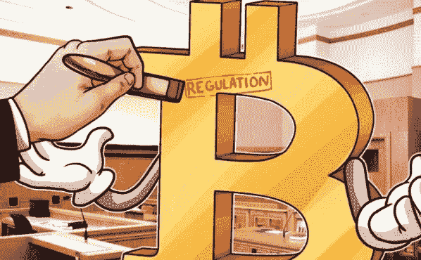

# 加密货币监管是好事还是坏事？

> 原文：<https://medium.com/hackernoon/is-cryptocurrency-regulation-a-good-thing-or-a-bad-thing-6aa8b808d2e5>

**加密货币监管是好事还是坏事？**

在加密货币社区，监管通常被视为一个模糊的词，特别是当人们考虑中本聪的霍尔马克比特币白皮书中概述的富有远见的原则时。意识形态目标是创建一个不依赖第三方、也不受政府或央行等外部行为者支配的金融体系。因此，比特币爱好者要求一个不受外界干扰的平台。

然而，自那以后，该行业以多种方式发展——特别是在数十亿美元的市值、全球知名度和媒体兴趣方面。不出所料，这引起了国家和地区监管机构的注意。另一方面，许多人认为，如果区块链现象要获得主流采纳，就需要一个严格的监管框架，以确保消费者获得与现实世界中预期的相同的保障。关键问题是——这能在不阻碍创新的情况下实现吗？

**第一个过去——日本接受加密货币**

一个相关的切入点是，看看日本当局是如何成为首个承认比特币和其他加密货币为现实世界货币的国家的。导致政府采取“亲力亲为”态度的事件，是对臭名昭著的 M.T. Gox 案的回应。

该交易所是第一个用法定货币促进比特币买卖的平台。尽管购买过程非常低效——有时一个账户需要一个月的时间才能获得资金，但在高峰期，该平台负责全球近 70%的比特币交易。

这个故事没有好的结局，该交易所随后让其持有的绝大多数比特币遭到黑客攻击——这让加密货币社区思考 MT. Gox 是犯罪的受害者还是内部渎职的肇事者。然而，日本政府并没有完全禁止加密货币，而是在 2017 年决定在监管框架下接受这项技术。

简而言之，加密货币现在受到与国家金融服务部门完全相同的监管——这意味着一系列控制措施已经到位，以防止令人讨厌的做法。这包括严格的反洗钱(AML)计划，确保任何希望进入该行业的人都必须首先通过适当的了解客户(KYC)程序来确定自己的身份，这是早期采用者最担心的事情。

然而，许多人会认为日本可能是现代世界中对密码最友好的国家。例如，日本现在负责全球最大的比特币交易活动，BTC/JPN 交易对通常占日交易量的 50%以上。此外，日本金融服务厅(FSA)最近公布的数据显示，现在有超过 350 万公民从事加密货币交易。

那么在交易领域之外呢？嗯，就现实世界的使用而言，现在只需刷一下手机条形码，就可以在超过 26 万家商店消费比特币。如果这是监管框架的结果，我们会说，日本政权绝对说对了。

**其他地方的比赛状态**

尽管日本在加密货币监管方面处于领先地位，但他们并不是唯一一个考虑对该行业采取更实际做法的司法管辖区。事实上，如果不首先通过 KYC 程序，购买区块链资产以换取法定货币是非常困难的，甚至几乎是不可能的。无论是美国的比特币基地、欧洲的北海巨妖还是以色列的 Coinmama，程序都是一样的。

用户不仅必须首先向服务商提供个人信息，例如他们的法定全名、地址和居住国，还必须以政府颁发的文档形式验证这些信息。处理法定货币的实体没有出路，因为如果他们不遵守国家法规，他们就有可能失去与银行业的关系。最终，可以说，尽管从法定到加密的监管仍然是在管辖区到管辖区的基础上确定的，但关于客户尽职调查的全球标准仍然存在，就像银行业一样。

那么，对于首次公开募股(ICO ),我们该何去何从？嗯，重要的是要记住，加密货币仍未接近十周年，这意味着该行业的其他领域需要一段时间才能获得第三方交易所的同等关注。然而，也许用不了多久，我们就会看到对 ICO 的更大范围的打击。

特别是，美国证券交易委员会(SEC)已经显示出强烈的迹象，表明他们正在寻求制定一个更严格的框架。ICO 去年取得了巨大的成功，数百个新的加密货币项目筹集了超过 50 亿美元的资金。尽管这为项目提供了一个将他们的密码梦想变成现实的途径，但许多项目还是没能存活下来。更令人担忧的是不正当行为者的崛起，他们没有成功的欲望，相反，他们的唯一目标是在消失之前欺骗尽可能多的投资者。

加密货币项目如此容易从事数百万美元的 ICO 的原因是缺乏监管。项目白皮书将他们的令牌作为一种实用工具进行营销，这意味着它没有实际价值，令牌持有者也没有任何权利。虽然有些费力，但手动查看市值最高的 100 个令牌会表明，每个令牌都声称是一个公用事业公司，这使得项目负责人可以在没有任何监管监督的情况下运营。

这并没有被忽视，一种新的令牌化开始浮出水面。与它们的公用事业对应物不同，安全令牌在高度管制的领域中运行。从本质上讲，那些持有安全令牌的人得到了与现实世界金融市场相同的保护。他们实际上在他们所支持的组织中持有股份，有时还可以分享公司利润。

总之，加密货币社区不应该害怕监管。在 SURGE Technologies，我们正在密切关注监管和令牌化的安全空间，同时继续开发我们的算法交易机器人。只要政府机构能够在消费者保护和创新自由之间取得平衡，这个行业就有潜力向更广泛的基础敞开大门。