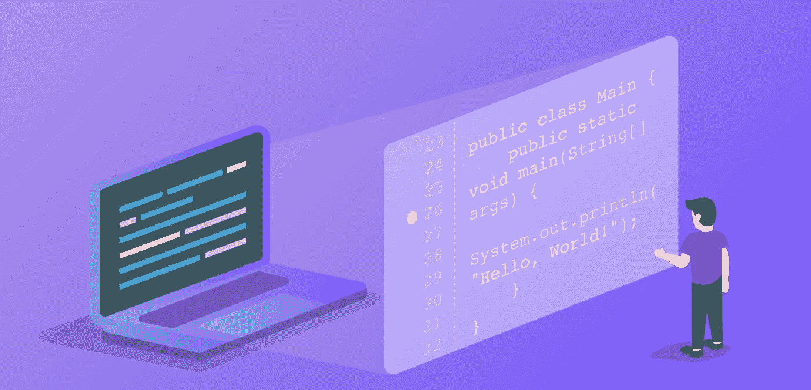
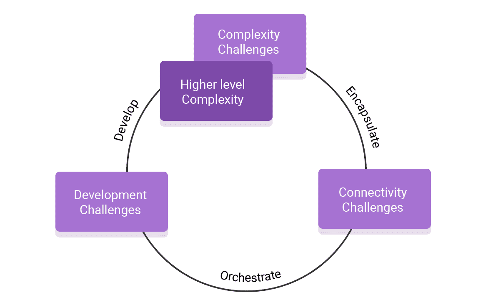

# DevOps 是不是把开发者甩在后面了？

> 原文：<https://medium.com/hackernoon/is-devops-leaving-developers-behind-3a40e5dd99fc>

毫无疑问:DevOps 和它所支持的软件的绝对规模已经真正革新了软件开发的世界。二十年前，它从简陋的单服务器开始发展，最终达到了我们可以大规模构建弹性软件的地步，这要感谢云和编排层，如 IaaS、containers、Kubernetes 和无服务器(FaaS)。

新的发展带来新的挑战。当开发人员试图跟上他们软件不断增长的复杂性、速度和规模时，他们意识到*他们*是新的瓶颈，仍然停留在简单时代的相同开发和调试工具上。

# 新挑战的洪流

现代软件最受欢迎的特征，以及那些使它如此强大的特征——规模、速度、极度模块化和高度分布——也是使开发和维护它如此困难的品质。这些新的挑战可以大致分为三类或三个层次:**复杂性**、**连通性**和**开发**。

这些类别密切相关；通常，一个类别中的挑战通过将问题转化到下一个级别来解决。这个“挑战流”不是一个直截了当的垂直瀑布，而是一个瀑布式的螺旋。正如复杂性和连接性刺激开发一样，开发挑战导致更大程度的复杂性，等等。

# 复杂性挑战

复杂性挑战是软件解决方案处理更复杂问题的直接结果，使它们成为最明显的挑战。它们包括:

*   开发分布式模块化系统(又名微服务)，需要工程师花时间规划如何分解、部署和连接软件。
*   开发可扩展的软件。工程师必须考虑解决方案需要支持的规模。(曾经发生过“这个服务器最多支持 X 个用户？”)
*   处理传输中和静态数据的复杂性(通常伴随着“大数据”)。现代软件要求工程师为吞吐量(高流量、工作负载)、快速处理(实时)、存储和搜索的极端情况做好计划。仅仅几年前还是一个独特的技能组合，现在是每个全栈工程师的期望(“你知道 Hadoop / Redis / Mongo / Kafka…对吗？”)，提高了大多数软件项目的门槛。将数据保存为. csv 文件甚至本地 SQL 数据库已经不再是一种选择。

开发人员应对这些挑战所需的技能不断增加，同时他们开始工作所需的时间和精力也在不断增加——以了解问题空间并评估可用工具的最佳应用方式。

通常，当复杂性问题变得太大而无法管理时，问题会升级为下一级**连接性**挑战，复杂性被封装在新的解决方案或方法中。添加封装的软件解决方案，如数据库、memcache、消息队列和 ML 引擎，实际上是通过我们编织和编排整体解决方案的方式来“委派”要解决的问题。一旦复杂性到连接性升级的特定模式开始频繁重复，它通常会转化为新的标准开发方法或解决方案。

# 连接挑战

连通性挑战源于现代软件的编织方式。至少有三个平行的连接链:

*   **互连** —软件解决方案内的连接，例如微服务或模块之间的连接
*   **外部连接** —与其他软件解决方案的连接，包括第三方服务器、SDK 和 SaaS
*   **元连接—** 用于构建、部署和操作软件解决方案的配置和编排层。

即使在最简单的布局中，每个连接层都包括几十个元素，以及层与层之间的多个连接。仅仅跟踪所有的连接和数据流就是一项巨大的——甚至是永无止境的——管理和架构工作。

现在，考虑由于不断变化的需求或者作为架构本身的一部分，连接不断变化，例如负载平衡。系统很快就达到了这样一个程度，开发人员必须投入很多时间——在某些情况下甚至是几周——来理解他们正在开发的软件解决方案中有什么联系。*“那个盒子连着那个盒子，那就是连接它们的电线”*的日子早就过去了。

我们已经在连接“蛋糕”上列出了许多“糖霜”，但我们不要忘记最上面的樱桃:**安全性和合规性。**工程师不仅要了解连接的所有方面，还要设计、构建、监控和维护它们，以确保整体解决方案安全并符合所有要求的标准。这是难以想象的困难，因为即使是最小的元素中最小的缺陷也能拖垮整个房子。这就像对工程师说，**“你知道你要堆的那个巨大的干草堆吗？确保所有的干草都连接好，同时也检查一下有没有针。**

随着时间的推移(无论是在项目中还是在一般情况下)，连接布局的增长超出了人类思维的跟踪能力，开发人员转向元连接层，并尝试自动化和编排连接(例如，Puppet/Chef/Ansible、Kubernetes、Istio、Helm……)。 ***“你喜欢代码，对吧？因此，在您编写代码时，这里有更多的代码来编排您的代码”。***

当这种通常被描述为“配置即代码”的工作方式接近成熟时，它就转移到下一个挑战层次——**开发。**并将每个挑战的解决提升到软件解决方案本身。

# 发展挑战

开发挑战是在一个框架内生产功能性软件的经典难题。这些问题产生于现代软件的能力和开发人员的能力(或缺乏能力)之间日益增长的差距。此外，由于前面级别的所有挑战逐渐传播到这一级别，这里的挑战处于 dev/devops 体验的最前沿。其中包括:

## **开发环境挑战**

开发环境挑战要求开发人员集合、学习和管理为正在开发的软件解决方案选择的所有工具和工作流:

*   即使在过去十年的巨大增长之后，工具和方法的数量仍在不断增加，仅举几个例子:ide、源代码控制、编译器、传输器、DBA 工具、云控制台、开发服务器、调试器、编排器、监控代理、任务/票证管理、警报解决方案。
*   上下文切换让事情变得更糟。这一堆不敬的工具不只一次打击开发者，而是持续轰炸他们。开发人员必须随时准备应对不同的情况。(**“昨天还在下雨，但今天我已经等了好几个小时，等着集装箱开始下雪……哦，等等，这实际上是一场有可能被追踪的门票台风。”)**
*   今天，对于开发人员来说，“进入状态”不再是效率的问题；这是基本生产力的基础。这还是在我们用人工智能、量子计算、生物计算和其他奇迹将堆栈复杂化之前。(“如果你认为多线程编程很难，我有一些坏消息要告诉你…”)

## **复制 bug**

了解一个 bug 的第一步通常是观察它。最基本的观察方法是在受控的(通常是本地的)环境中复制 bug。可悲的是，有了现代软件，复制已经成为一项艰巨的任务。上面提到的许多挑战和因素相互作用，创造了如此复杂和相互关联的案例，以至于任何模拟它们的尝试都注定要失败，或者打破尝试的预算。(**“我们认为这个问题是西班牙下雨的结果，一只蝴蝶拍打着翅膀……好吧，让我们从建立一个西班牙的实物大小的模型开始，我会在亚马逊上查找大量蝴蝶发货。”)**

随着体外细菌复制变得越来越不可行，体内的可观察性变得必不可少。不幸的是，开发人员经常发现他们古老的工具箱不适合这项任务。旧的工具在现代软件环境中根本不起作用；原因通常可以归结为无法访问。

*   你不能访问短暂的:多层封装，将复杂性挑战转化为连通性的结果，使访问成为一个问题，因为像容器、Kubernetes 和无服务器这样的层占据了软件环境的所有权。这个问题对于无服务器/ FaaS 来说是最明显的。开发者不仅无法访问服务器，而且据他们所知，T2 没有服务器。即使通过某种技巧或黑客手段获得了通过所有层访问底层服务器的权限，实际上也不可能精确定位特定的服务器/应用程序，因为这些服务器/应用程序会受编排层的控制而波动，编排层会不断地动态删除和添加服务器。
*   在 K8S 枪战中带上一把宋承宪刀:由于失去了访问权限，现有的工具已经过时了。SSH 提供了一个非常强大的直接命令行控制台，但在大多数情况下已经变得不可用，充其量是一个巨大的稳定性风险。
*   传统调试器(与快速生产调试器相比)没有任何东西可以连接*。*更重要的是，在生产环境中破坏(设置断点)服务器的想法是不可接受的风险，因为它很可能真的会破坏生产，或者充其量使微服务和功能失去同步，从而消除了在分布式系统中复制或调试重大问题的任何机会。
*   ide 用来表示开发人员对系统的完整视图，从代码到编译，再到构建和运行。它们使开发人员能够将他们的观点和方法同步到他们共享的软件中。ide 从来没有非常接近实时系统，但是它们之间的差距已经变得如此之大，以至于它们不再能够创建共享的视图。虽然集成到现代源代码控制(例如 Git)和 CI/CD 解决方案有所帮助，但差距仍然很大。

## CI/CD 瓶颈

由于失去了访问权限，并且几乎没有其他选择，开发人员转而将部署代码作为实现访问权限的主要方式。任何与软件交互的需求都意味着编写更多的代码、合并代码、测试代码、批准代码，当然还有最终部署代码。这种方法用于添加/删除特性、获得可观察性(监控和调查)以及应用修复和补丁。

这种对代码部署的过度依赖造成了一个瓶颈，因为所有这些部署都在争夺管道中的空间和维护者的注意力。

随着挑战的不断涌现，它的势头越来越大。今天的洪流只是未来挑战的一个缩影。

一旦现代软件开发的这些挑战成为焦点，现代软件的能力和开发人员跟上它的能力之间的巨大差距就会清晰地显现出来。我们在开发挑战中最常看到这种**可观察性差距**，但在其他挑战级别中也是如此。弥合这一差距是我们从现代开发和 devops 工具中需要的关键能力。

# 浑水上的桥

目前，面对这些挑战的开发者只有少数解决方案可用。大多数开发工具已经停滞多年。**20 年前的工程师可能会被云中的现代服务器完全难倒，但会在几秒钟内认出当前的 IDE 或调试器**。也就是说，现代开发者工具箱*的确有一些新的解决方案。这些解决方案包括旨在提高关注度的解决方案、试图用有限的可用数据做更多事情的解决方案，以及试图通过改进部署周期来缩小可观察性差距的解决方案。*

## “像手套一样”——定制的可观察性视图

随着许多现代软件挑战开始重复并整合到已知的形式和格式中(如 Docker、K8S、无服务器函数)，一种新的工具出现了，它可以识别这些模式，并利用它们的知识来定制特定的解决方案。

在这一类别中有下一代 APM 解决方案，如 [DataDog](https://www.datadoghq.com/) ，它在现有 APM 产品的基础上提供了专门为[容器和 Kubernetes](https://docs.datadoghq.com/graphing/infrastructure/livecontainers/) 构建的视图。事实上，你会发现大多数 APM 为微服务世界调整和提供能力，尽管不总是作为一等公民。

在一种更加现代的定制方法中，我们发现解决方案在结构化数据和具体的[跟踪](https://en.wikipedia.org/wiki/Tracing_(software))上加倍，如 [HoneyComb.io](https://www.honeycomb.io/) (以及开源项目如 [Zipkin](https://zipkin.io/) 和 [Jager](https://github.com/jaegertracing/jaeger) )。这些识别了重构分布式系统行为的特定痛苦，就像侦探重构犯罪现场一样，并且源于微服务架构的本质。

对于无服务器，我们找到了像 [Epsagon](https://epsagon.com/) 和 [Lumigo](https://www.lumigo.io) 这样的解决方案，它们是专门针对 FaaS 的使用情形定制的，并针对特定的棘手问题，如发现、管理和定价。当然，这些问题以前也存在，但在无服务器的情况下变得更加严重。

## “两个玛奇纳”——高级分析

随着软件变得庞大，大数据不仅是一种挑战，也是解决问题的一种手段。多种解决方案利用机器学习的优势来获得可观测性，有些将它作为主要方法。示例包括像 [Coralogix](https://coralogix.com/) 和 [Anodot](http://anodot.com) 这样的解决方案。

## “全世界的开发者，联合起来！”—高级工作流程

利用机器来解决机器问题是一个开端，但它不是灵丹妙药。

因此，许多解决方案侧重于在解决方案的自动化部分提供的视图和警报之上构建更好的开发人员工作流。 [Sentry.io](https://sentry.io/) 是一个很好的例子，特别是他们最近发布的 Sentry 9，在现有的异常管理平台上改进了协作工作流。

## “品尝真正的东西”——金丝雀部署

到目前为止，本文讨论的大多数解决方案以及 devops 领域的大多数解决方案都是通过从系统中存在的数据中获取值来工作的，或者是通过关注特定模式(比如跟踪)预先收集的数据。

虽然这是一个重要的进步，但我们仍然高度依赖 CI/CD 通道来迭代，通过更新日志行或 SDK 调用从生产中交付新数据，以向上游系统提供数据。

减轻管道压力的一种方法是使用金丝雀部署，这是绿蓝部署的一种变体。它们使开发人员能够将新代码(在这种情况下，必要的可观察性变化)暴露给有限的生产百分比，而不影响所有的生产。它还允许更快的回滚。

金丝雀部署的方法可以在大多数领先的 CI/CD 工具中找到，例如 [GitLab](https://docs.gitlab.com/ee/user/project/canary_deployments.html) 和 [CodeFresh](https://codefresh.io/kubernetes-tutorial/simple-canary-codefresh-k8s-2/) 。

然而，一个巨大的差距仍然存在:如果需要的数据不在有限的金丝雀百分比内呢？

虽然金丝雀部署减少了观察生产的摩擦和风险，但它们仍然将大部分生产留在桌面上，使其成为大多数人负担不起的昂贵而危险的工作。

## “通过敏捷性弥合差距”——快速数据收集

尽管上面有许多解决方案，但是在开发人员需要从实际系统中获得的可观察性数据和他们迭代收集数据并交付给各种解决方案(包括这里列出的一些)的速度之间仍然存在差距。一组新的解决方案试图通过将数据收集与 CI/CD 管道完全分离来弥合这一差距，从而消除造成这一差距的摩擦、风险和瓶颈。

这些快速解决方案在没有事先规划的情况下按需收集和驱动数据，根据需要创建短暂的桥梁，而不是试图为可预测的情况预测特定的桥梁。这种短暂的访问方法符合现代软件短暂的本质。Rookout 快速生产调试解决方案就是一个例子，它利用工具和操作码操作功能，使开发人员能够从实时环境中收集数据，并将其传输到他们需要的任何平台。(完全披露:作者是 Rookout 的联合创始人)

# 未来的一瞥

我们已经走了很长一段路。过去的开发人员肯定会羡慕现代软件架构所取得的惊人成就。但是说到我们提供给开发者的工具，我们还没有做到。Devops 以惊人的速度推动了软件世界的发展，但是随之而来的**复杂性、连接性和开发挑战阻碍了开发人员**跟上他们自己软件的步伐。

现在是时候通过快速接受新的解决方案并积极努力弥合可观察性差距来向前迈出另一大步了。**通过更有效地将工具相互连接，在它们之上创建更好的工作流，并在数据收集和可观察性方面找到真正的灵活性，我们可以弥合差距**等等。在不太遥远的将来，我们可以达到这样一个点，软件进化的速度与软件的可观察性相匹配，创建一个反馈循环，无休止地提高创作的速度。一个没有人掉队的未来。

## 关于或威斯:

或者韦斯是 [Rookout](http://www.rookout.com) 的首席执行官和联合创始人，这是一个针对实时系统的快速调试和可观测性解决方案。

Rookout 设置了不间断的断点，可以收集您想要的任何数据，并在您需要的时候随时随地即时交付。无需编写更多代码、重新部署或重启。