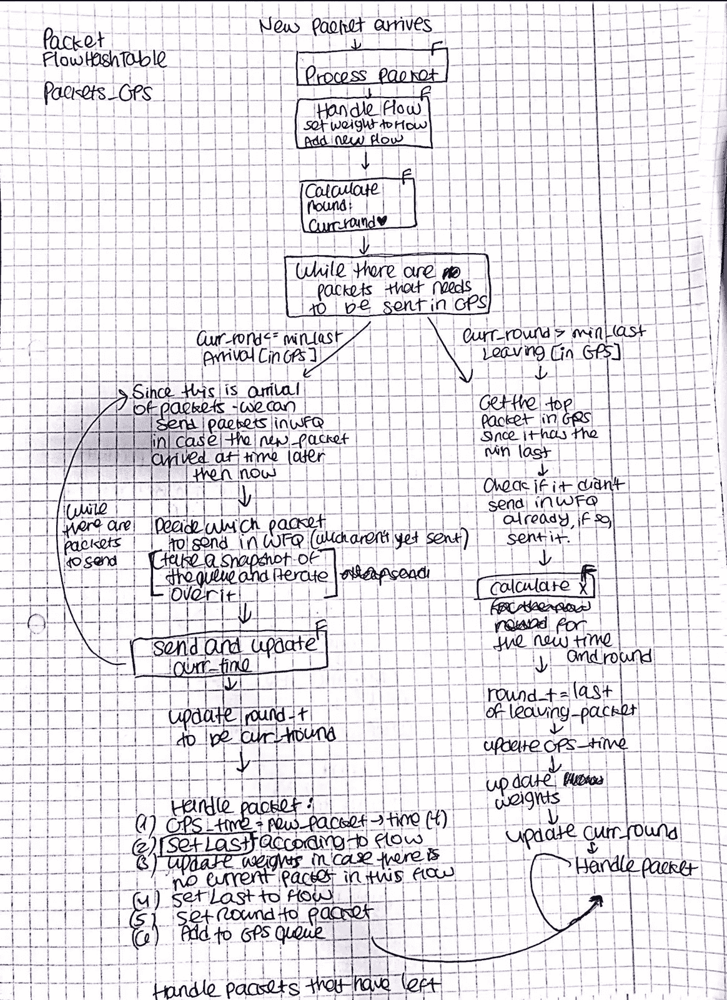

# 做得比完美更好吗？—第二部分

> 原文：<https://medium.com/hackernoon/is-done-better-than-perfect-part-2-3d05ca67a937>

关于找到上述问题正确答案的更多见解和想法。

[第 1 部分](/@lironkreiss/is-done-better-than-perfect-part-1-2500e616ce16)以我的代码工作结束，但只是部分工作(3 个输入中的 2 个)。在一个广泛的重构过程中，我能够修复一部分，但破坏另一部分，我明白我必须放弃自我，怀疑我的算法实现，从零开始。这并不容易，但必须要做。

反思和挑战我自己的工作，被证明是我能做的最好的事情。我又一次问自己——我忠于算法的快乐流吗？我看到更大的画面了吗？我真的需要等待两个不同的队列吗？我是否将数据包“发送”到了正确的位置？回答这些问题让我意识到我的一些实现需要改变，无论是主要的还是次要的。进行这个回滚阶段给了我信心，并准确地指出了我需要修复和重构的地方。我甚至喜欢调试过程(这是我通常害怕的)。

最后，所有 3 个输入都是正确的，原始项目的运行时间大大加快，内存使用也减少了。

在概括之前，我想分享一些从争取最佳实践(又名完美)中学到的具体经验，而不仅仅是从这个项目的工作中获得的经验。

## 一个对象/方法/数据结构不存在，你需要它？创造它。

STL 的队列是我决定用 C++而不是 C 实现这个项目的主要原因，它们提供了我需要的确切功能。嗯，几乎完全正确。在流程的某个阶段，我需要迭代队列，这不是我们对队列做的事情。当在网上寻找解决方案时，我看到的大多数答案是“如果你需要迭代，你不需要队列，使用列表”，但是列表并不能给我所有的队列好处。我决定创建一个将队列的“快照”作为列表的函数，以便在不影响原始队列的情况下对其进行迭代:

## 拉伊

当检查我的代码中的内存分配，并确保我自己“清理”后，我的(伟大的)导师向我介绍了 [RAII 设计模式](https://en.cppreference.com/w/cpp/language/raii)和 shared_ptr 的用法。我决定使用它，并接受这种思维方式——当一个资源当前没有被使用时，它应该从内存中释放出来。这也需要重构和另一组测试，但这也是我一直在寻找的，学习新方法，尽可能完美地做事。

## 编译“党”

为了保持最佳实践，我决定分割文件，为代码中的每个对象分配不同的文件(和头文件)。你可能会想——这有什么大不了的？这就是编译器的用武之地。我几乎停止了与向我抛出不明错误的编译器的斗争，但我处于一种“完美”的精神状态。多亏了我的导师，我一步一步地进行了这个过程，以便消除问题并理解真正困扰编译器的是什么。这需要时间，但我学到了很多关于编译过程的知识，我可以自信地说，编译错误再也不会吓到我了:)

## 我的画

我经常提到它们，我想分享我一直看到终点线的最后一幅建筑图:

Code Architecture, Drawing: me

## 我说完了吗？等等，我想要“完美”！

我的项目完美吗？可能不会，有很多其他的事情可以让它变得更好(更明智的数据结构，编译优化，测试和文档丢失，等等)。)但是我达到了我的目标，就完成了。我认为，作为一名软件工程师，我应该采取始终以实现“完美”为目标的方法。然而，这个项目让我明白这需要时间和努力，而在现实生活中，我们并不总是这样。做得比完美更好吗？不，但你定义了完美的含义。

你可以在这里找到我的代码，希望听到你的建议和意见，因为这将帮助我成为一名更好的软件工程师。