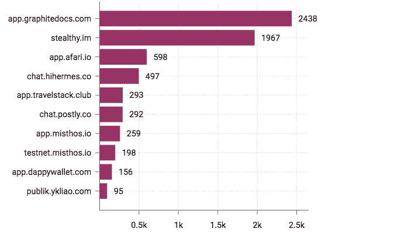
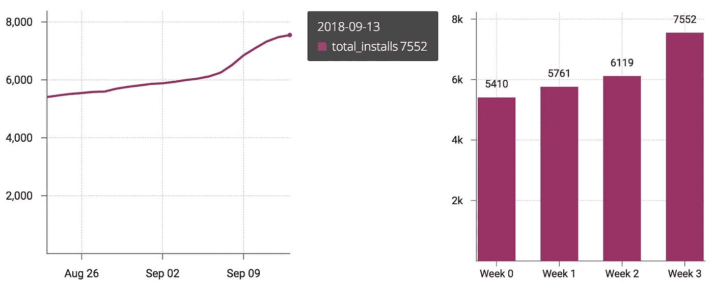

# DWeb 要起飞了吗？Blockstack 成长一瞥。

> 原文：<https://medium.com/hackernoon/is-dweb-taking-off-a-glimpse-into-blockstacks-growth-88114b089818>

“twom white flying rockets during daytime” by [SpaceX](https://unsplash.com/@spacex?utm_source=medium&utm_medium=referral) on [Unsplash](https://unsplash.com?utm_source=medium&utm_medium=referral)

没有人真正知道去中心化的应用增长在未来会如何发展。我认为去中心化网络(或称 d web)的未来既不是确定的，也不是由 T2、区块链、T4 和 T5 的技术质量预先决定的。它的未来取决于像 [Blockstack](https://blockstack.org/) 、 [Ethereum](https://www.ethereum.org/) 、 [ConsenSys](https://new.consensys.net/) 这样的组织将如何执行他们的愿景，成长，吸引人才并围绕他们建立社区。

总的来说，有些人认为去中心化的应用程序将在未来几年大幅增长，而另一方面，有些人则认为区块链唯一真正的用例是数字货币。这些观点在这个非常有趣的[播客第](https://unconfirmed.libsyn.com/joe-lubin-and-jimmy-song-work-on-the-terms-of-their-bet-on-dapps-and-trash-talk-the-others-coin-ep034)集[劳拉·申](https://twitter.com/laurashin)的讨论中得到了很好的说明，其中[乔·卢宾](https://twitter.com/ethereumJoseph)和[吉米·宋](https://twitter.com/jimmysong)试图就去中心化应用的未来进行谈判。

幸运的是，像 Blockstack 这样的区块链项目往往有很多开放数据。我收集了一些数据，试图一窥 Blockstack 应用的现状，并对未来的增长做出一些预测。

## 十大块堆栈应用

这里有一个图表，按安装应用程序的用户数量排名前 10 位 ****** 。一旦您有了 Blockstack id，当您第一次打开该应用程序时，它会自动“安装”到您的用户配置文件中。

Blockstack apps by number of users that have ever opened it. 2018/09/13\. Data: [theblockstats.com](https://theblockstats.com)

到目前为止，最受欢迎的两个应用程序是[Graphite docs](https://www.graphitedocs.com/)——一种谷歌文档，但你所有的数据都被加密并在用户的控制之下，以及[隐身](https://www.stealthy.im/)——[希望成为分散应用程序微信的分散交流平台](https://techcrunch.com/2018/09/05/stealthy-wants-to-become-the-wechat-of-blockchain-apps/?guccounter=1)。

这些数字可能看起来很不起眼。最重要的是，app #8 是一个测试网，而#10 是一个块堆栈教程。然而，特定日期的用户数量可能并不能说明全部情况。

## 增长率

让我们来看看从 8 月 23 日到 9 月 13 日的 3 周时间里，安装的应用总数是如何变化的。

Total number of Blockstack apps installed over the period of 3 weeks from August 23 to September 13 2018\. Data: [theblockstats.com](https://theblockstats.com)

即使数字很低，增长模式也很明显。app 安装量在 3 周内从 5410 上升到 7552。这几乎是 12%的周增长率——一点也不差。

我们看到增长的很大一部分发生在第 3 周——可能是因为那一周发生了多个事件和黑客马拉松。如果我们将第 3 周视为异常值，只关注前两周，我们会得到 6%的周增长率。

现在 6%到 12%的周增长率真的很棒。原因如下。比如 Blockstack 应用用户以每周 10%的速度安装应用。也就是说，1 年内安装 100 万次，2 年内安装 1.52 亿次！

更悲观的 5%的增长率将导致 1 年内接近 10 万用户，2 年内达到 120 万——也不算太坏。

## 最后的想法

即使总数很低，尝试 Blockstack 应用的用户数量的增长率也令人印象深刻。如果 Blockstack 背后的团队能够保持这种增长，他们就有很大的机会在未来 2-5 年内将[去中心化网络](https://www.theguardian.com/technology/2018/sep/08/decentralisation-next-big-step-for-the-world-wide-web-dweb-data-internet-censorship-brewster-kahle)的愿景变成现实。

不过，有几个警告。首先，3 周是一段很短的时间，可能不代表长期趋势。其次，所讨论的统计数据包括，例如，打开过一次 Blockstack 应用程序且从未返回过的用户。因此，这个统计数据实际上代表了有多少用户达到了用户旅程漏斗的顶端，即决定打开应用程序。虽然这是一个重要的指标，但决定产品生死的指标是用户回头率。换句话说:有多少打开应用的用户成为活跃的回头客。

现在自信地说 DWeb 正在腾飞还为时过早。今天的 Dweb 是微小的，但它也是活跃的，活跃的，成长的。

****统计数据仅包括多人应用，即用户可以与其他用户共享数据的应用。Blockstack 上的一些热门 app，比如** [**币**](https://coinsapp.co/) **，都是单人游戏。**

> 有反馈或想法要分享吗？我们聊聊吧！在 [Twitter](https://twitter.com/vrepsys) 或 [LinkedIn](https://www.linkedin.com/in/vrepsys) 上与我联系