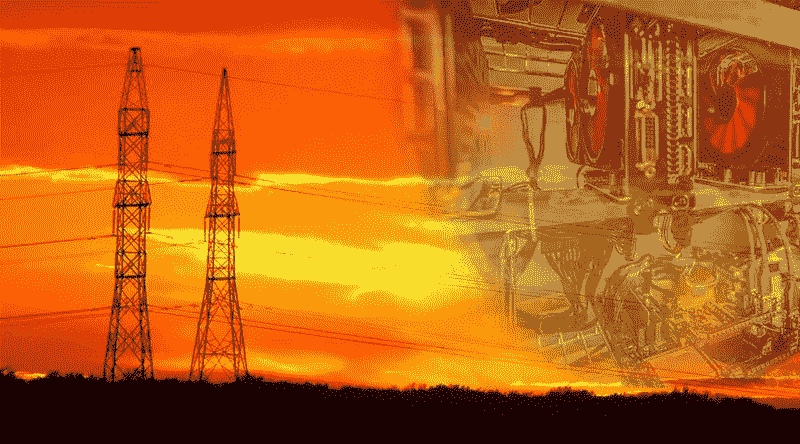

# 电是比特币前途的限制因素吗？

> 原文：<https://medium.com/hackernoon/is-electricity-a-limiting-factor-to-bitcoins-promise-86e457cf27ae>

虽然批评者指出比特币的能源消耗对地球有害，但很少有人问电力短缺是否会成为比特币前景的限制因素。

On July 31, 2018 one bitcoin transaction consumed as much power as thirty-one US households per day

任何人都对区块链技术将彻底改变经济和社会生活的可能性感到兴奋。与此同时，许多人对当前技术状态的问题同样充满热情。一个特别紧迫的问题与区块链技术的巨大能源消耗有关。尽管批评者指出这是环境的可持续性，但人们对电力短缺是否会成为加密货币推广的限制因素这一问题关注较少。

**比特币的大量耗能**

比特币的目的是保持一个透明、防篡改、分散的账本，这取决于工作证明(PoW)验证步骤。电力和计算时间的成本随着记录在分类账中的价值而增加。要了解比特币目前的能源消耗规模，请考虑以下几点。现在，[每笔比特币交易消耗的能量足以运行一栋中等价位的房子，以及房子里的一切，持续近一周](https://motherboard.vice.com/en_us/article/ywbbpm/bitcoin-mining-electricity-consumption-ethereum-energy-climate-change)。[2017 年 12 月 31 日，一笔比特币交易每天消耗的电量相当于 11 个美国家庭。2018 年 7 月 31 日，一笔比特币交易每天消耗的电力相当于 31 个美国家庭。目前，比特币开采的能源消耗相当于奥地利这个国家的能源消耗。](https://digiconomist.net/bitcoin-energy-consumption)而且，随着开采难度的增加，能源消耗也会增加。到 2019 年，[比特币挖矿消耗的能源相当于世界能源消耗第 20 位的国家。](https://www.newsweek.com/bitcoin-mining-track-consume-worlds-energy-2020-744036)

虽然许多人谴责这种能源使用对环境的影响，但很少有人考虑电力如何成为比特币前景的限制因素。根据设计，电力需要大量计算和电力支出，包括废热的去除。此外，多个矿工或矿池必须合作解决一个算法，即使只有第一个解决它的人才能获得比特币。这种计算能力的浪费是每个事务的一部分。

**比特币承诺的极限**

批评家指出比特币在环境上的不可持续性。然而，很少有人注意到[比特币的安全性如何依赖于增加交易块(即采矿)的成本与比特币价值的增加](https://link.springer.com/article/10.1007/s00146-018-0808-x)的趋同。换句话说，这个过程中使用的能量会随着比特币的价值上升而上升。如果比特币在当前 PoW 模式下继续增长，它将开始对世界煤炭和石油供应产生重大影响。这可能会导致全球每千瓦的成本上升，随着能源成本的增加，采矿成本也会增加。这个周期在什么时候会导致采矿只对极少数超级富豪可行，或者根本没有人可行？

**一个潜在的解决方案**

[4 新](https://4new.io/)区块链平台旨在解决加密货币的可持续性问题。通过这样做，它也为实现比特币的承诺提供了一个模式。实际上，4NEW 提议在一个“生态友好”的区块链上进行象征性的电力交易，该由将废物转化为能源的发电厂供电。将废物提炼为水和有机物质的过程产生的能量既可以卖给国家电网，也可以用于经营现场采矿场。采矿场将为新区块链供电，在这里任何行业的演员都可以使用克瓦特硬币进行交易。发电厂还将因其处理的废物和废物处理的副产品，如肥料和清洁水而获得报酬。这些副产品可以在市场上出售，进一步确保了区块链的生存能力。

**记号组学**

KWATT 目前是基于 ERC20 以太坊的令牌。然而，当区块链完成时，代币将被换成夸特币，夸特币将与区块链互动。硬币是智能合约，它在交易双方之间建立了绑定关系，并为每笔交易提供了价值。区块链将为所有交易提供一个不可变的可审计的日记账，每笔交易的各方都能够看到相同的分类账条目和对账成本。

**大胆的愿景和监管现实**

4NEW 的计划雄心勃勃。然而，困难在于如何在实践中实现它。在许多国家，发电厂不仅仅是任何人都可以建造的自由市场企业。它们受到政府的严格监管，有时由政府和国有企业部分或全部拥有。很难想象 4NEW 的计划如何适应这种复杂的监管环境。面对以区块链技术为前提的新的社会进程和制度的需要，也许这只是想象力的失败。尽管“垃圾发电模式”听起来可能有些激进，但随着加密货币和区块链技术的不断普及，它可能代表着社会发展的一个方向。

***披露*** *:我没有* KWATT *代币，也没有参加 4 新 ICO。这篇文章不打算作为投资建议。你应该总是做自己的研究。*

如果你喜欢我的文章并想了解区块链和加密货币项目，请订阅我的频道 [Medium](/@minadown) 和 [Twitter](https://twitter.com/minad21) 。也可以看我在 [LinkedIn](https://www.linkedin.com/in/mina-down-768559158/) 上的文章。

如果你对本文有任何疑问，请在下方评论区评论。
谢谢！