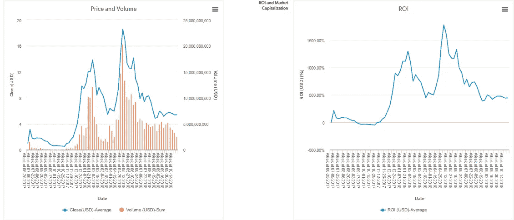

# EOS ICO 是骗局吗？

> 原文：<https://medium.com/hackernoon/is-eos-a-scam-eos-ico-suffers-collusion-allegations-complete-analysis-e21e68a2a5c7>

## 顶级筹款人 EOS ICO 面临串通指控

自从火币员工石飞飞泄露了一份电子表格后，收入最高的项目 EOS 现在面临着骗局的猜测。

## 关于 EOS 的一切

EOS 是区块链领域的一个分散项目，旨在从根本上改善市场上已经存在的产品。分散式操作系统旨在为所有开发人员设计 dApp 提供一个简单的选择。

EOS 一推出他们的 ICO 就成了热门话题，他们宣布将在一整年的时间里筹集资金，而大多数其他 ICO 的目标是尽快完成销售。这一战略背后的目标是(根据 EOS)

1.  稳定价格。
2.  通过定期发布关于项目的更新、信息和新闻来获得投资者的信心。
3.  以获得尽可能多的认可。

这被证明是 EOS 的营销妙招，因为他们最终为他们的项目筹集了 40 亿美元(迄今为止最高的)。

## EOS 和火币骗局背后的真实故事

EOS 是一个基于区块链的项目，而火币是一个交换平台。如果区块链的项目与交易所串通，可能会导致不利的结论。

EOS 对这些串通指控的软弱官方回应并没有灌输太多建立对该项目的信心。此外，Huobi 否认与其他 EOS 节点有财务往来的声明不够好，因为它没有明确排除泄露的电子表格的真实性。

据 TrustNodes 报道，一份电子表格被泄露，据称作者是火币网员工石飞飞。这份名为“Huobi Pool Node Account Data 2018 09 11”的文件据称显示，Huobi 投票给了 20 家区块生产商(BP)，作为回报，16 家投票给了 Huobi。

火币也被指控制五个节点。下表以灰色显示了其中的四个节点(eoshuobipool 是第五个)。

Leaked spreadsheet

## 愤怒是怎么回事？

当加密投资者对集中化失去信心，比特币蓬勃发展时，EOS 通过利用去中心化的价值观筹集资金。现在，自从 EOS 网络在 6 月份上线，并开始为大宗生产商投票以来，围绕交易所可能产生的集中影响的猜测变得非常重要。

EOS 强烈声称是去中心化的，但事实是，只有 21 个超级节点 BP 来验证 EOS 的委托利益证明(dpo)中的块，这说明了一个不同的故事。将信息集中在 21 个节点上构成了一个集中的区块链，这与项目背后的意识形态完全矛盾。

EOS 一次又一次错失良机，因为它无法建立一个有意义的投票系统，也无法在投资者中建立信任。

当然，当 EOS 的总共 21 个加密平台(节点)中的 12 个位于中国时。在这种情况下，投资者对该系统可能存在的诚信问题产生怀疑是公平的。

区块链和加密货币的发展是对传统银行系统失去信心的结果，如果 EOS 最终被证明是一个骗局，这对整个加密行业可能是一个巨大的打击，因为人们也将开始对区块链技术失去信心。

如果 EOS 是一个骗局也没关系，因为使用区块链技术和创建去中心化平台的想法应该能够实现新的信任水平，在这种情况下，这是一个可怕的失败。

## 投资回报概述

EOS 在 2018 年 4 月的最后一周创下历史新高，达到 1775.90%。在 2017 年 10 月的第三周，它的投资回报率也创下了历史新低，为-44%。然而，自那以后，投资回报率趋势在过去的 6 个月里一直面临熊市。

[Source: InWara’s database](http://www.inwara.com/?utm_source=eoshacker&utm_medium=eoshacker&utm_campaign=eoshacker)

与 2018 年 4 月的上一个峰值相比，EOS 的跌幅相对较小，其总投资回报率下降了 82%，而同期区块链大盘下降了 94%。

就总市值而言，EOS 仍然是前五大加密货币之一，价值超过 28 亿美元，投资回报率超过 300%(截至 2018 年 11 月 27 日)。

Average RoI of Blockchain sector [(source: InWara’s database)](http://www.inwara.com/?utm_source=eoshacker&utm_medium=eoshacker&utm_campaign=eoshacker)

## 总结一下

EOS 项目中的这一事件转变在每个寻求投资加密货币的个人和机构中产生了怀疑和意识。

这是另一个证明投资组合分析过程甚至在投资后也没有完成的经典例子。及时了解项目进展和市场波动是至关重要的。

[***InWara***](http://www.inwara.com/?utm_source=eoshacker&utm_medium=eoshacker&utm_campaign=eoshacker) 就是这样一个致力于 ico 的专业平台。InWara 的数据库允许您访问 ICOs 背后公司的真实故事。让您了解 ICO 行业的最新发展。

这不是财务建议。本信息或其他媒体中的观点、陈述、估计和预测仅属于作者个人。它们不一定反映 Inwara 或其任何附属公司(“Inwara”)的意见。Inwara 没有义务更新、修改或修正此消息或其他媒体，或以其他方式通知其接收者，如果此处陈述的任何事项或此处陈述的任何意见、预测、预测或估计发生变化或随后变得不准确。本邮件或其他媒体中提供的任何内容、信息和材料均按“原样”提供。Inwara 对其准确性、完整性或及时性，或收件人获得的结果不做任何明示或暗示的保证，并且不对任何收件人在此的任何不准确、错误或遗漏承担任何责任。在不限制上述规定的情况下，Inwara 对任何消息或媒体的接收方不承担任何责任，无论是在合同、侵权行为(包括疏忽)、担保、法规或其他方面，对于此类接收方因其或任何第三方决定的任何行动、意见、建议、预测、判决或任何其他结论或任何行动过程而遭受的任何损失或损害，无论是否基于此处包含的内容、信息或材料。**