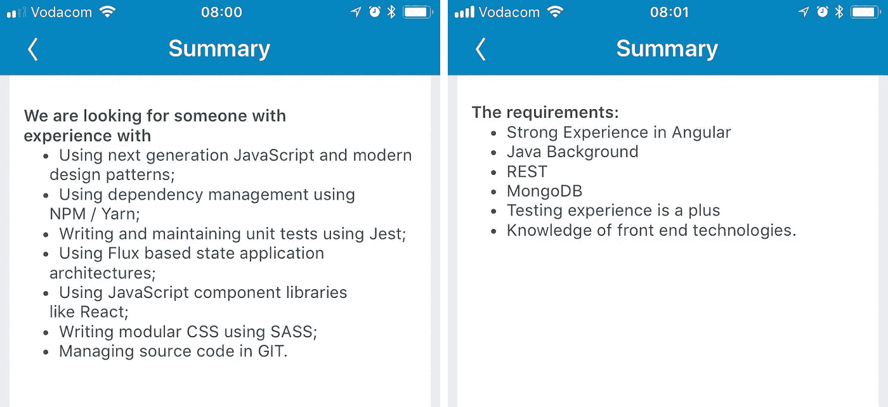
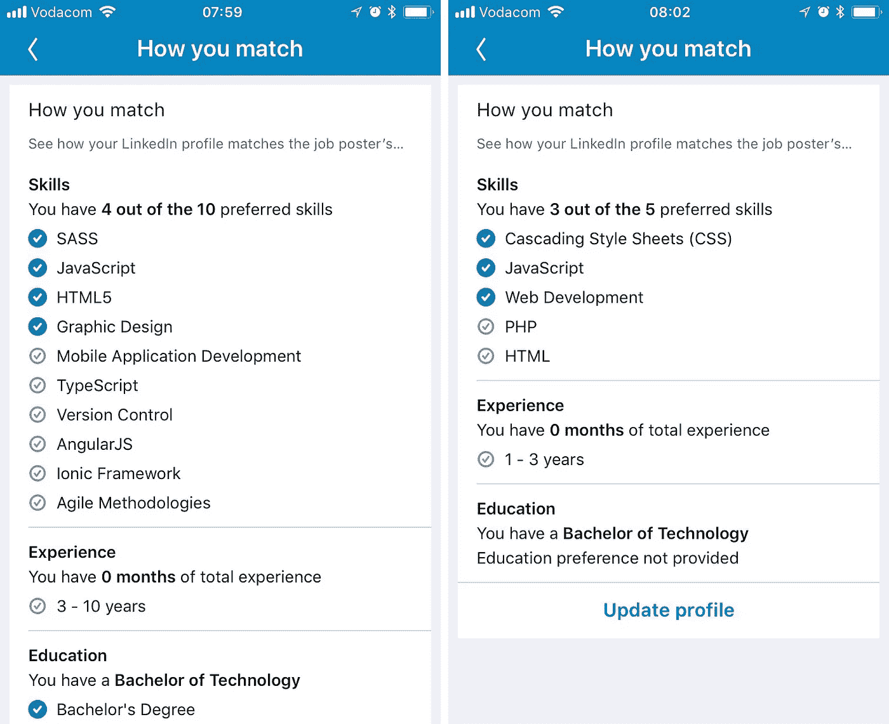

# 前端开发是否有身份危机？

> 原文：<https://medium.com/hackernoon/is-front-end-development-having-an-identity-crisis-2dfcc5951192>

Courtesy Adobe Stock

前端[开发](https://hackernoon.com/tagged/development)作为一个我们知道的它还存在吗；还是这个角色已经演变成了我们不再认识的东西？正如自然界的进化一样,“前端”的进化导致了几种不同的味道——在我看来——身份危机。

# 前端开发者到底是什么？

传统上来说，前端可以定义为一个[应用](https://hackernoon.com/tagged/application)的 UI，也就是面向客户端的东西。然而，这种情况近年来似乎有所改变，因为雇主希望你有更多的经验，懂更多的语言，部署到更多的平台，并且通常拥有“相关的计算机科学或工程学位”。

像 Angular 和 React 这样的语言要求开发者对编程概念有更深刻的理解；历史上可能只与后端相关的概念。MVC，函数式编程，高阶函数，提升…如果你的背景是 HTML，CSS 和基本的交互式 JavaScript，这些概念很难掌握。

这给开发者带来了不公平的压力。他们往往会退出或者觉得只懂 CSS 和 HTML 没有价值。是的，技术已经发展，也许知道 CSS 和 HTML 已经不够了；但是我们要停下来问问自己，做一个前端开发者到底意味着什么。

作为一名设计师，我经常觉得我的技术知识不够。在一次前端职位的技术面试中，当被问及 SSL 证书是什么时，“它保护 HTTP 请求和响应”并不被认为是一个充分的答案。不要误解我，这些话题很重要，但是这些非常技术性的细节与角色相关吗？

**从这里开始我会偶尔把前端开发称为***。**

# *问题是*

*这种身份危机是由所有各方造成的:组织、招聘人员和开发商。随着职责层次的不同、薪资水平的波动以及行业内缺乏标准化的工作规范，这一角色变得模糊不清。*

*在寻找就业市场时，你可能会发现，企业希望员工成为独角兽，填补多个空缺。招聘人员也可能对人力资源部门提供的角色抱有不切实际的期望，而人力资源部门往往对他们招聘的目的知之甚少。最后，开发人员自己加剧了这个问题:他们接受技术面试，如果我们得到这份工作，我们会让自己承受不必要的压力，去学习缺失的技能，而不是向招聘人员和组织挑战，询问作为一名前端开发人员到底意味着什么。*

*比较 LinkedIn 上的以下职位，标题都是“前端开发人员”。角色是非常不同的:一方面，开发人员被期望了解 Flux 架构和单元测试，而另一方面，他们被期望了解 Java 和 MongoDB。*

**

*Comparing two roles on LinkedIn, both labelled “Front-end developer”*

*这两种角色是非常不同的；并且明显缺乏明确的范围或角色。*

# *为什么标准化角色很重要*

1.  *平衡薪酬等级:前端工程师不会得到联邦政府官员应该得到的薪酬，反之亦然。*
2.  *缓解压力；允许开发人员专注于工程产品或创建丰富的交互式 web 体验*
3.  *它创造专家；真正擅长 CSS、HTML 和交互式 JavaScript 的开发人员*
4.  *当涉及到技术面试和工作规范时，减少求职压力*

# *关注点分离*

*为了定义这个角色，我们必须剔除所有被认为超出了*美联储*范围的角色。例如，web 开发人员的角色不应该与*美联储*的角色混淆，因为一个人构建应用程序，另一个人构建体验。其他例子包括前端设计师、web 工程师、后端 web 开发人员等。*

*为了区分这些角色，我们可以看看四个标准:*

## *开发者的画布*

*如果我们假设前端的主要环境是浏览器——那么 PHP 或 C#开发人员会处于什么位置呢？PHP 就是一个很好的例子；是的，它运行在服务器上，但最终仍然向用户界面(即浏览器)传送数据。JavaScript 和 PHP 都是不需要编译的脚本语言。那么 PHP 开发人员是前端开发人员还是后端开发人员呢？*

*像 Github 的 Electron 这样的工具允许开发者从 HTML、CSS 和 JavaScript 构建跨平台的桌面应用。类似地，像 Adobe Phonegap 这样的工具使得用 JavaScript 为本地移动应用程序编译 HTML 页面成为可能。这实质上使中级前端开发人员能够构建和发布移动或桌面应用程序。那么应用程序开发可以被添加到前端开发人员的职责范围吗？*

*在 JQuery 和 Node 之间，后端和前端之间的界限变得模糊，从那时起，前端开发人员经常被期望了解 Node 和像 Express 这样的附带包。这些显然是后端技术，那么我们为什么要将它们添加到联邦政府的工作规范中呢？*

*在我们标准化角色之前，我们必须就前端开发人员的职责达成一致。在我看来，这仅限于应用程序的 UI，并且主要在浏览器中运行——这个角色不应该参与构建任何服务器端功能。*

## *选择的语言*

*要考虑的第二个标准可能是开发人员选择的编程语言。用 Python 和 C#这样的语言来构建网站基础设施是可能的，这回避了和以前一样的问题——Python、PHP 和 C#能被认为是前端语言吗？*

*下面的例子要求将 PHP 作为一项必备技能，而另一方希望开发人员了解 TypeScript。*

**

*Comparing the skills required for two roles on LinkedIn, both labelled “Front-end developer”*

*JavaScript 现在可以做 PHP 和 Python 能做的很多事情；JS 开发人员可以使用 TensorFlow 等流行的库。另一个例子包括 TypeScript(如上)，它将静态类型从 Java 等语言引入 JavaScript。那么，就什么被认为是前端语言或框架而言，我们在哪里划定界限呢？*

*如果我们排除 PHP、C#、Java 等，那么哪些框架或库应该是角色范围的一部分？例如，JQuery 是为 web 构建交互性的完美工具，而大多数前端开发人员可能会认为学习 Vue 更好。*

*另一方面，像 React 这样的库需要开发人员学习传统上与前端无关的概念:设置 webpack 和 transpilation、部署过程、理解高阶组件，并且只是为了好玩，您可以使用 Redux 进行状态管理。列表增长很快；尽管这些都使用 JavaScript 作为一种语言，但随之而来的理解往往是非常不同的。*

*许多后端开发人员告诉我，他们发现 CSS 非常难，我同意——CSS 很难！我们原谅后端开发者不懂 CSS 和交互式 JavaScript 那么，为什么会期望前端开发人员了解后端技术呢？*

*我们最终应该问的问题是，前端开发人员到底应该处理功能组件还是数据驱动组件。在我看来，角色的语言选择应该仅仅是 HTML、CSS 和 JavaScript(仅限于前端库)，主要用于构建在必要时从服务中消费数据的交互式组件或 web 项目。*

## *技能水平*

*前端开发者什么时候过渡到全栈开发者或者 web 开发者？*

*当考虑到*画布*以及*选择的语言时，区分这一点变得非常容易。*全栈开发人员是既了解前端又了解后端的开发人员(即处理不止一个*画布)。*web 开发人员是指能够在多种*框架、库和语言*中工作以构建丰富的数据驱动应用的开发人员。大多数*联邦官员*很可能会从中级*联邦官员*职位晋升为高级官员、工程师等。角色。*

*那么考虑到我们到目前为止的角色定义，有没有可能成为一名*高级前端开发人员*？我的论点是肯定的。只要看看 [Awwwards](https://www.awwwards.com/websites/) 上的任何获奖网站，你很快就会同意，这种程度的交互性需要对 DOM 和通过 JavaScript 的 DOM 操作有很好的理解。*美联储*也有机会专注于构建交互功能的学习库(例如 HTML canvas、WebGL ),而不是后端库或框架，这些库或框架会让他们远离最初让他们成为美联储*的东西。**

## *其他专业*

*最后要考虑的因素是前端角色带来的所有附加要求。我认为这是一个“包袱”,主要是因为这些需求经常以一种特别的方式被抛入其中。*

*一个很好的例子是 MongoDB(这是前面提到的清单中的一个需求)。以前，数据库管理或架构本身就是一个角色，那么为什么现在我们期望*联邦官员*在其他一切之上拥有这个技能呢？*

*之前截图的另一个例子是列出的*图形设计*需求。就我个人而言，我非常支持开发人员理解设计，但是希望他们在掌握其他技能的基础上掌握这一技能会改变角色(可能是前端设计师或全栈设计师)。*

*当考虑到拥有所有这些知识所带来的额外责任时，我们必须问自己，将它们加入到组合中是否只会使情况变得复杂。如果今天我决定将 React 引入我的组织，他们选择取代我的开发人员也必须了解 React。如果新的开发者决定加入 Redux，那么你会明白这是怎么回事。更糟糕的是，不管使用什么技术，他们都会继续雇佣前端开发人员，因为这是部门需要的角色。*

*所以随着强大的力量而来的是巨大的责任，最终取决于我们作为开发者负责任地使用技术。考虑技术堆栈变化的操作影响，并理解您可能会使现有问题永久化。*

# *定义角色*

*既然我们已经了解了前端开发人员意味着什么，我们可以编写以下工作描述:*

> *前端开发人员负责使用 HTML、CSS 和 JavaScript 为 web 构建交互式用户界面或体验。*

*让事情简单一些——一个 *FED* 不需要理解函数式编程或者 SSL 在微观技术层面上是如何工作的。这并不是说他们不应该学习这些概念；但最起码不应该是一种期待。*

*我认为，通过帮助下一代前端开发人员理解成为**美联储**意味着什么，我们共同解决围绕开发社区中角色的困惑是很重要的。*

> *这篇文章纯粹基于我的个人经历和偏见——我希望在评论中听到你的观点。*
> 
> ***弗农·乔伊丝，一只全栈独角兽。***