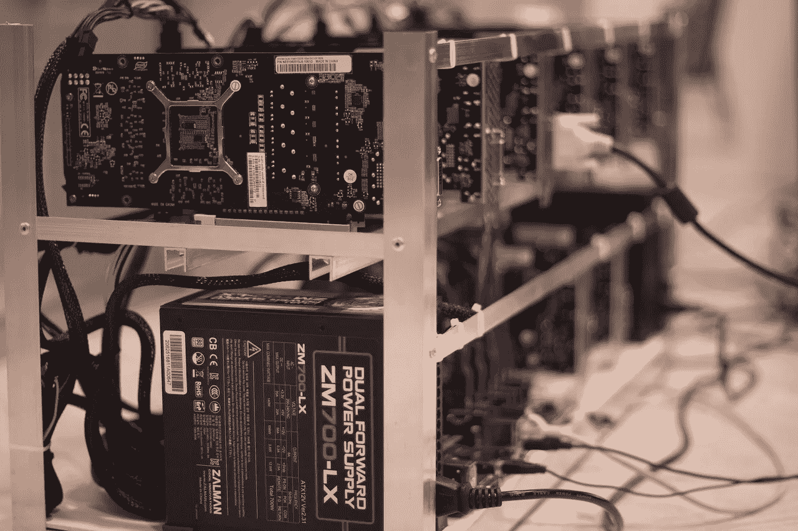

# 做加密币矿工容易吗？我该如何开始？

> 原文：<https://medium.com/hackernoon/is-it-easy-to-be-a-crypto-coin-miner-how-can-i-get-started-af9b526e10da>

Source: Pixabay

在这一点上，这是绝对不可避免的——加密货币革命即将来临。似乎就在一年前，比特币(BTC)还是一种大多数普通人都不关心的模糊技术。人们被动地知道[加密货币](https://cryptodigestnews.com/cryptocurrency-how-does-it-work-e5bd0769c861)是什么，但它并没有像今天一样真正成为主流。

如今，你看手机、平板电脑或电脑，都会看到一篇标题为“比特币”的文章。而且，特别是在过去几个月，替代加密货币(被称为*替代硬币*)也引起了全国的关注。谁没听说过以太坊(ETH)和瑞波(XRP)带来的巨大增长？

随着数字硬币投资的功能和效用——更不用说盈利能力——成为家喻户晓的话题，越来越多的人想知道加密货币来自哪里。

你可能听说过*比特币挖掘*的概念，或者只是挖掘一般的加密货币。但是一个数字价值单位怎么能被“挖掘”出来呢？加密货币开采到底是为了什么？它有利可图吗，它是普通人甚至可以开始做的事情吗？

## **什么是加密货币挖矿？**

比特币等加密货币的功能与现金非常相似。它是一种价值交换，与其他货币相比，它的价格随着时间的推移而上下波动，你可以在双方之间转移资金。数字货币以同样的方式工作，但与现金不同，加密硬币可以被开采——更像黄金或白银。

并不是所有的加密货币都可以或者需要被挖掘——但是很多大的加密货币都被挖掘了。比特币(BTC)、以太坊(ETH)和 Monero (XMR)都是很受欢迎的挖矿币。

采矿并不意味着每种加密货币都有源源不断的流量，可以永远通过采矿来创造。绝大多数加密硬币都有一个存在的最大数量——可以开采的数量上限。例如，比特币将永远只有 2100 万单位在流通。在写这篇文章的时候，剩下不到 500 万个可供开采，然后就会被耗尽。

## **为什么有人开始挖掘加密币？**

所以，多年来，人们每天都在挖掘加密货币，这导致了每种硬币的总供应量增长。但是这样做有什么意义呢？为什么世界各地都有人参与这项全球性的采矿活动？对他们有什么好处？

这个问题的答案是更多的加密货币。例如，比特币挖矿用更多的比特币奖励其参与者。采矿一直是有利可图的，也可能是有利可图的——但时代已经变了。

对于早期开始挖掘比特币的人来说，他们有更高的机会经营利润丰厚的采矿业务。但比特币成立于 2009 年，如今的挖矿游戏看起来有很大不同。

首先，这更难。这枚硬币最初被编码是为了让开采变得更加困难，因为剩下的可开采的越来越少。但更重要的是，当涉及到某些硬币时，比特币挖掘变得更加昂贵，也更加拥挤。

## **加密货币挖掘是如何工作的？**

矿工对于加密货币交易的有效和安全执行是必要的。传统上，大型银行机构会负责交易的交付和验证，但加密货币的全部意义在于摆脱银行作为中间人的角色。有了加密货币，社区负责验证。

比方说，我给邻居寄了 0.000066 BTC，从她那里买了一辆二手自行车——在我写这篇文章的时候，这大约是 125 美元。为了让她收到这些硬币，并确保它们是真正的比特币，交易必须经过验证。

交易的验证可能是加密货币最重要的方面，尤其是因为一切都记录在公共账本上。在我们信任或投资支付系统之前，我们需要信任它们。

这就是矿工的用武之地。

我寄给邻居的付款会和一堆需要核实的其他 BTC 交易一起放在一个“盒子”里。这个盒子在密码世界中被称为“块”——用数字锁虚拟密封的交易集合。

矿工们运行软件来寻找能打开那个盒子的钥匙。一旦他们的电脑软件找到了钥匙，整个盒子就被打开了——验证里面的所有交易。这是矿工得到报酬的时候，也是我的邻居最终获得 BTC 奖的时候。

理论上听起来很容易，但他们的计算机实际上可以说是大海捞针。他们的软件进行了数十亿次尝试，只为了找到一个密钥。但是矿工的工资是 12.5 新 BTC——这是一个很大的奖励。

## **但是有人能开采加密货币吗？你需要成为技术专家吗？**

挖矿需要大量的时间和初始投资来设置硬件，但对于大多数可以使用流行应用的人来说，这并不复杂。事实上，一个计算机新手可能会处理它。你不需要成为一个数字天才就能掌握基本知识。您将需要什么:

**一个钱包:**你需要有一个钱包地址，你通过采矿获得的加密货币可以被发送到这个地址。它们本质上是加密的在线银行账户，它们有一个唯一的地址——一般来说，你发送加密货币真正需要的唯一信息是钱包地址。

有很多在线加密货币钱包可供选择，但有些钱包比其他钱包更稳定、更安全。确保你选择了一个可靠的、不易被黑客攻击的、用户评价良好的在线钱包——做好你的调查。

**挖矿软件:**挖矿加密币所需的软件免费下载使用。比如比特币挖矿，BTCMiner，CGMiner 都是比特币挖矿的热门。Linux、微软 Windows 和 Mac OS X 有不同的软件选项。

采矿硬件:这是棘手的地方。你看，比特币挖矿刚开始的时候，一台普通的 PC 足够强大，可以应付。然而，如今开采 BTC 要困难得多，而且人们正在使用被称为专用集成电路(ASIC)的更复杂的硬件。这些机器是专为采矿设计的，而且功能强大。

但是能够发现新比特币的硬件可以让你多花 10，000 美元到 15，000 美元。这对于我们大多数人来说简直是遥不可及的——而且需要一段时间来重新产生这种投资。谁会有那么多钱去投资采矿硬件呢？

但是，幸运的是，有一种方法可以解决这个问题。你可以不花成千上万的钱去买硬件就能开矿。这叫做采矿池——它们非常受欢迎。人们只是把他们的计算机能力集中在一起，作为一个团体，共同挖掘硬币。然后他们会得到他们应得的利润份额，这个份额是根据你的个人设备对采矿活动的贡献大小来划分的。

加入采矿池也意味着更少的初始投资，一旦开始采矿，几百美元的硬件每天就能产生几美元。

## **做好你的调查，小心点**

如果你有开始挖掘一种特定加密货币的冲动，那么恭喜你——你可能会因此获得一些固定收入。只是要小心，因为如果你不花时间做研究，你也可能会失去你的时间和投资。

> 查看采矿池选项，通读留言板，并简单地确保您想要加入的采矿池是符合您的需求的。

__
*想了解更多关于 FundYourselfNow 的信息吗？在我们的*[*Telegram*](https://t.me/fundyourselfnow)*群上加入我们的众筹革命对话，或者在* [*Twitter 上关注我们。*](https://twitter.com/fundyourselfnow)