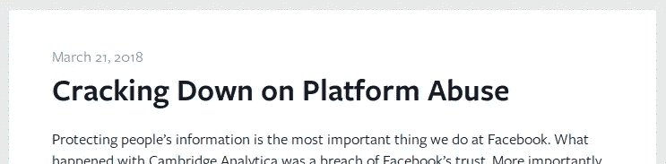
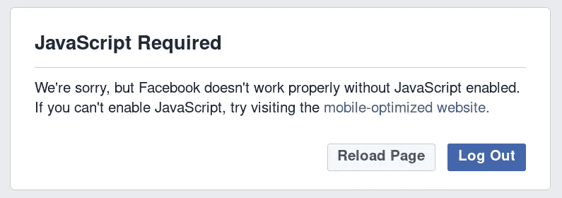

# 还有可能收集脸书的数据吗？是的。确实是！

> 原文：<https://medium.com/hackernoon/is-it-still-possible-to-scrape-facebook-data-yes-it-is-fb4255ba792b>

这篇文章不包含任何代码，仅仅是我最近遇到的一个经历。

鉴于脸书承诺保护他们的用户数据，作为剑桥分析公司崩溃的后果，脸书在暂停访问全部端点约一个月后，修改了其 Graph API，并最终在 2018 年 5 月 1 日发布了 Graph API v3.0。

Facebook Media Release

与此同时，一位企业主找到我，问我是否能帮他创建一个废品回收渠道。基本上，他想要的是对他的团队工作方式的流程改进，一个从选定的来源收集数据、处理它们并将它们集成到现有系统中的自动化管道。所以，我评估了他的要求，确保我能够完成，然后接受了这个任务。在技术方面没有太多挑战。困扰我的是脸书数据的获取。尽管被抓取的数据是面向公众的“公共可访问”数据，但脸书实际上删除了这个特定资源上的 Graph API 端点。

> 没有图形 API 访问权==根本没有访问权！？不完全是。

首先，我不理解，我想永远也不会理解脸书决定关闭公共信息端点背后的理由，你没看错吧！公共信息，它们是给公众看的。

我使用的工具是 Scrapy，这是一个相当全面且易于使用的 Python 数据抓取库。我首先做的是尝试抓取 www.facebook.com 的 T2，但是我很快意识到大多数数据是使用 AJAX 异步获取的。所以，第一次尝试失败了。

然后，我试图通过模仿用户使用 Selenium 的行为来收集数据。如果您对此不熟悉，Selenium 本质上是一个自动化浏览器的工具，允许您像人类一样控制和使用浏览器。我的 Selenium 所做的是:进入 Facebook.com->登录->搜索关键词->向下滚动时开始抓取。嗯，这很快引起了脸书的注意，并拒绝从他们的服务器访问更多的数据。是的，脸书擅长检测机器人。

我开始思考如果脸书不继续发送我的浏览行为会怎么样？脸书会不会检测不出我是机器人还是人类？所以我打开浏览器设置，禁用了 JavaScript，看看脸书是如何在这种限制下工作的。

Facebook shows this when Js is disable.

脸书建议我试试“移动优化网站”，它实际上是 mobile.facebook.com 的老派，不使用任何 AJAX。这当然让我想起了我的高中时代，那时智能手机是相当现代的东西，我们大多数人仍然依赖于紧凑型手机。我又做了同样的事情，去脸书- >登录- >搜索关键词- >开始刮，现在成功了！

是啊！脸书现在更难检测我的浏览行为，他们无法知道我停在哪一行，读了哪一行，或者我在那一页上滚动了多少次，等等。移动脸书适合我的使用案例！

我的最后和工作的手段是刮上经典的脸书。这招很管用，虽然我不知道这招能持续多久。

这只是最近发生在我身上的一件事。如果你正面临类似的问题，我希望这有所帮助。

谢谢你的热烈回应，恐怕我现在抽不出时间来完成任何任务。但是，你的拍手肯定会让我走得更远。如果你喜欢这个帖子，请随意给我鼓掌。