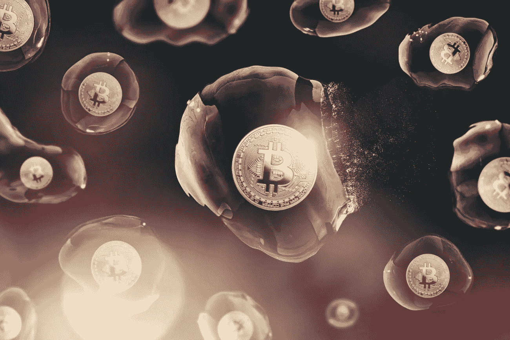

# 现在投资比特币还来得及吗？仅仅是泡沫吗？

> 原文：<https://medium.com/hackernoon/is-it-too-late-to-invest-in-bitcoin-is-it-just-a-bubble-704ba4f69d9d>

## “比特币泡沫”真的要破灭了吗？还是说比特币还有机会？

在一年内，比特币的价值增长了 28 倍，价格下跌了 60%，这一事件引发了许多关于市场是否存在泡沫的讨论。

在确定我们是否处于泡沫之前，我们需要看看比特币的历史。

**2011 年的比特币泡沫**

比特币在 2011 年开始时的价格为 30 美分(0.30 美元)，在 2 月份左右涨到 1 美元，6 月份飙升到 10 美元，然后在不到一周的时间里涨了两倍，达到 30 美元。

几天后的 6 月 11 日,“泡沫”破裂，价格跌至 15 美元(跌了 50%,听起来熟悉吗？)，比特币在跌至 5 美元之前再次升至 20 美元。这是目前比特币最大的“泡沫”。

**增长:**超 100 倍，高于 2017 年的“泡沫”

**2013 年的比特币泡沫**

比特币今年年初约为 15 美元，到 3 月中旬达到 50 美元，到 4 月份一个比特币价值 100 美元，在不到两周的时间里，它的价格翻了一倍，使一个比特币价值约 230 美元。

就在第二天，油价跌至 160 美元，一周后又跌至 70 美元，4 月底又回升至 100 美元。

**增长:**超过 2017 年“泡沫”规模的 17 倍、60%

**2013 年第二次比特币泡沫**

在稳定在 100 美元后，比特币在 11 月升至 250 美元，一个月内价格翻了两番多，达到 1100 美元。

这在不到一个月的时间里增长了 4 倍多。

“泡沫”再次破裂，比特币跌至 700 美元。

**增长:** 11x，2017 年“泡沫”规模的 39%

**2017 年的比特币泡沫**

所有人都在谈论的“泡沫”，比特币今年开始时为 900 美元，年底时为 2 万美元，然后降至 15000 美元，然后在 2018 年降至 8000 美元。

**增长:**28 倍或 2，800%增长，比特币第二大“泡沫”

那么，我们是在泡沫中吗？现在投资还来得及吗？

媒体之所以对比特币“处于泡沫中”感到疯狂，主要是因为其高昂的价格。

在 2011 年，当一个比特币的价格在不到 7 天内翻了三倍时，没有人在意，但在 2017 年，比特币的价值用了 4 个月的时间从 2000 美元翻了一倍到 4000 美元，这确实是比特币狂热开始的时候。

如果比特币曾经存在泡沫，那它已经被戳破无数次了，我认为人们把媒体炒作和高价混淆为存在泡沫。

例如，还有其他加密货币在不到一年的时间里增长了 100 倍以上，但没有人谈论这些货币，因为它们的成本仍然不到几美元，如果它们达到类似于比特币的价格水平，那么这些硬币的泡沫也将开始。

想想看，不到一年的 100 倍增长比比特币最大的“泡沫”高出 3 倍多，但由于这些硬币的价格低廉，甚至没有人关注它们。

我认为人们关注的是错误的数字，而不是关注价格，我们应该关注增长率。

那么现在投资比特币还来得及吗？

不到 0.3%的世界人口拥有比特币，加上区块链技术(比特币的先驱)正在全球范围内引起兴趣，大学开设了相关课程，大公司也在研究这项技术。

另一件需要注意的事情是，与比特币的大幅增长相比，价格的下降简直是小巫见大巫，特别是如果你看的是百分比而不是价格。

例如，2017 年比特币增长了 28 倍，即 2800%，到 2018 年仅下降了 60%。如果你在早期买入，你仍然有很多利润。

我知道投资比特币时，价格是人们首先会注意到的东西，但在投资时，价格不是唯一可以用来判断资产增长的指标。

你需要查看百分比收益以及高点和低点出现的时间段。

**最终想法:**

比特币在这段时间里经历了多次涨跌，现在一些投资者甚至预计到了这一点，去年我们看到比特币从 900 美元增长到 20，000 美元，现在价格徘徊在 6000 美元左右。

如果你在比特币价值 6000 美元之前进入，那么这还不算太糟糕，但我相信我们很快就会触及价格底部，从那里开始，唯一的出路就是上涨。在我看来还不算太晚，我相信我们并没有陷入真正的泡沫。

## **我希望你喜欢我的故事，欢迎查看下面这些有用的资源:**

您可以使用 [**Ledger Nano S 硬件钱包**](https://www.ledgerwallet.com/r/4c54) **来确保加密货币的安全。**

您可以使用 [**CEX**](https://cex.io/r/0/up106280379/0/) 在世界任何地方购买比特币、以太坊、Ripple、比特币现金、Dash、比特币黄金、恒星流明等

您可以使用 [**BitPanda**](https://www.bitpanda.com/?ref=3127933809251797450) 在欧洲任何地方购买比特币、以太坊、IOTA、OmiseGo、EOS、比特币现金、莱特币等。

你也可以在 [**Twitter**](https://twitter.com/CryptoniteTweet) **上关注我。**