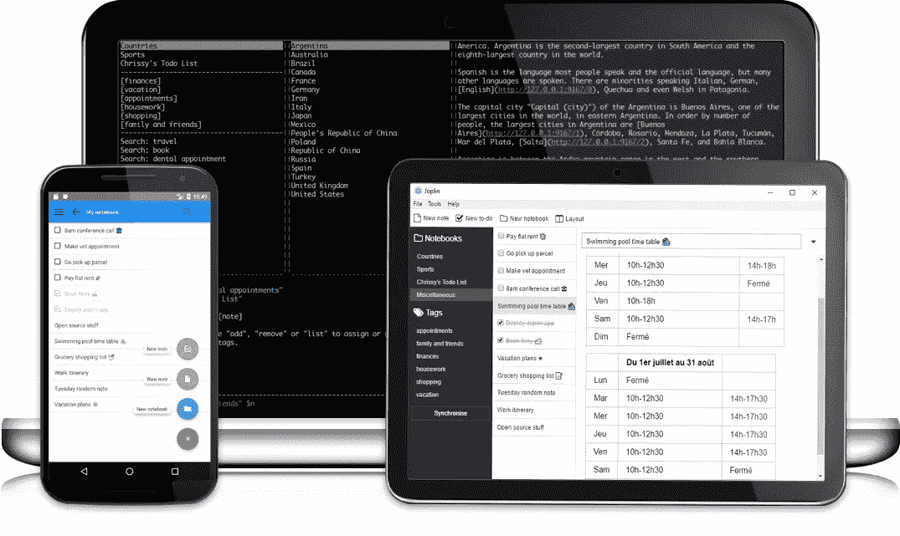
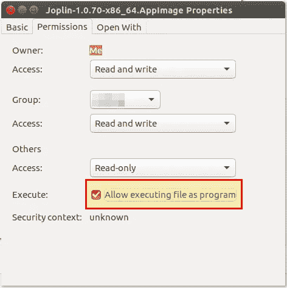
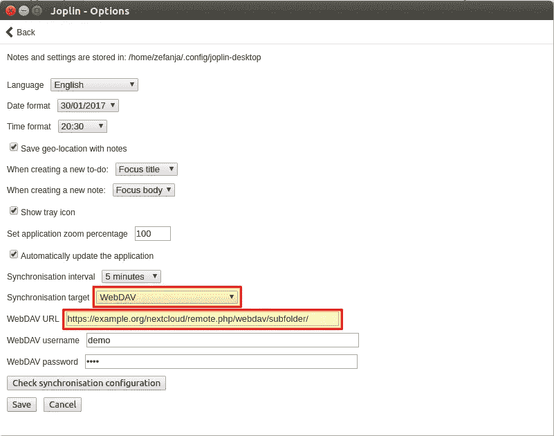
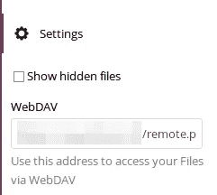

# Joplin 是认真的开源 Evernote 替代品吗？

> 原文：<https://medium.com/hackernoon/is-joplin-a-serious-open-source-evernote-alternative-989944b1aa69>

许多人可能知道 Evernote 或 OneNote——这两个复杂的笔记管理应用程序有许多很棒的功能。一个优势是——尤其是 Evernote——它可以在许多平台上使用。即使是 Ubuntu，也有一些非官方的程序可以用来同步和编辑你的 Evernote 笔记。然而，OneNote 和 Evernote 的缺点是它们不是开源软件，人们不知道数据到底发生了什么，也不知道它们是如何处理的。此外，免费的 Evernote 版本只允许在 2 台设备上同步。因此，今天我想介绍 Joplin 作为 Evernote 的替代品。

[http://joplin.cozic.net/](http://joplin.cozic.net/)

# 特征

Joplin 提供了许多笔记软件的功能。以下是摘录:

*   适用于 Linux/MAC OS/Windows/Android/iOS 和终端的应用程序(是的，还有 CLI 版本:)
*   端到端加密
*   与各种服务同步，包括 NextCloud、WebDAV 和 OneDrive。Dropbox 是计划中的。
*   导入 Enex 文件(Evernote 导出格式)和 markdown 文件。
*   导出 JEX 文件(Joplin 导出格式)和 raw 文件。
*   支持说明、待办事项、标签和笔记本。
*   根据几个标准(标题、更新时间等)对笔记进行分类。
*   支持移动和桌面应用中的警报(通知)。
*   离线模式下，即使没有互联网连接，设备上的所有数据也始终可用
*   降价支持，桌面和移动应用程序渲染图像和格式。支持额外的功能，如数学符号和复选框。
*   文件附件支持—渲染图像，链接其他文件，并可以在各自的应用程序中打开。
*   搜索功能
*   地理位置支持
*   支持多种语言

我个人喜欢的是同步加密笔记的可能性，并且可以在我使用的所有设备上离线使用。此外，对 Markdown 的支持是一个很好的特性！

# 安装 Joplin

Joplin 的开发者开发 app 非常积极。你可以从[项目的网站](http://joplin.cozic.net/)下载最新版本。在那里，您可以找到所有平台应用程序的链接。对于 Linux，有一个 AppImage。要安装该应用程序，您必须在下载后调整权限。为此，通过上下文菜单(“右键单击”)打开文件属性，并激活权限下的“允许将此文件作为程序执行”。

最后，双击安装应用程序。

# 设置同步

在*工具→通用选项*打开同步设置。在这里，您可以定义同步间隔、应该使用的服务以及用户名和密码。对于与 Nextcloud 的同步，我选择了 WebDav，因为我无法使用选项“Nextcloud”同步到我的云中的子文件夹。也许我做错了什么…

通过点击“检查同步配置”，您可以检查设置是否正确。你可以在 Nextcloud web 界面找到正确的 WebDav URL(见图片，点击左下角的齿轮):

网址将会是这样的:【https://example.org/nextcloud/remote.php/webdav/subfolder/ 

# 在 Joplin 中启用端到端加密

默认情况下，Joplin 存储所有未加密的笔记和笔记本。因此，您应该在 Joplin 中激活加密，这样就没有人(云提供商等。)可以读取数据。为此，请执行以下步骤:

1.  打开加密设置(*工具→加密选项*)
2.  激活加密并输入主密码
3.  在应用程序中点击同步，等待同步完成(不要中止)。如果您有很多笔记，同步可能需要一段时间。我说过了，不要流产。
4.  同步完成后，拿起下一台设备并开始同步。你必须输入主密码。之后再同步。加密现在处于活动状态。
5.  对所有其他设备重复步骤 4。

# 结论

我已经使用 Joplin 几个星期了，到目前为止我对它非常满意。同步的可能性(包括加密)，离线和降价支持对我来说是这个应用程序的杀手级功能。Joplin 是另一个伟大的开源应用的例子[。当然，Joplin 并不是唯一适用于 Linux 的 notes 应用程序，但它提供了许多其他应用程序没有的功能。](https://openschoolsolutions.org/5-great-open-source-apps-we-use-in-our-school/)

**你用什么应用程序来管理你的笔记？**

*原载于*[*openschoolsolutions.org*](https://openschoolsolutions.org/joplin-open-source-evernote-alternative/)*。* ***注册*** *订阅我们的时事通讯，获取免费的 PDF 格式的开源应用程序，供您的课堂使用，或者在 Twitter 上关注*[*@ OpenSchoolZ*](https://twitter.com/OpenSchoolZ)*。*