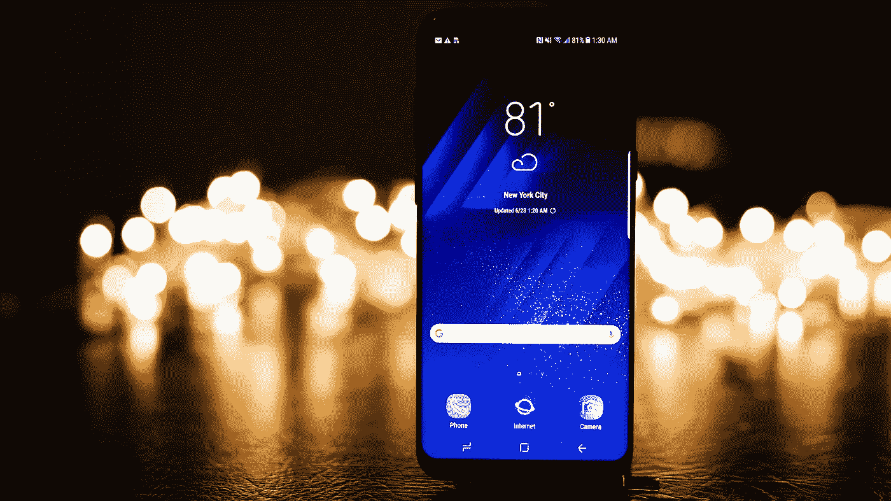

# 手机创新搁置了吗？

> 原文：<https://medium.com/hackernoon/is-mobile-phone-innovation-on-hold-9e8609fd0243>

## 一篇随笔

[https://www.pexels.com/photo/android-phone-blur-cellular-telephone-close-up-454699/](https://www.pexels.com/photo/android-phone-blur-cellular-telephone-close-up-454699/)

我不知道你怎么想，但是我对我的手机很满意。

事实上，我很久没有升级我的手机了。这是一部 iPhone 5S，但它满足了我的大部分需求——我可以用我的小手高效地浏览网页、听音乐、使用流行的应用程序和发送短信。

我将不可避免地需要更换我的手机。它快报废了——它的屏幕有裂缝，我已经买了好几年了。然而，到了买新手机的时候，我想我会再买一部 5S。

几年前，发现一部新手机能提供什么是令人兴奋的。公众想要的功能太多了——科技公司竞相满足我们的每一个愿望。新手机的发布成为一个奇观。

然而，移动技术现在满足了我们的大部分需求和愿望。我很少听到有人对他们希望科技公司提供的功能或创新发表评论，你更可能听到的是对升级到新设备的成本的抱怨。

这与几年前不同，当时你会听到用户热情地讨论改进相机技术或 4G 流媒体服务的梦想，他们几乎会出卖灵魂来获得最新功能。

当然——我现在的手机有一些地方可以做得更好。我想要一个改进的相机和更多的存储空间来存放我的音乐和照片。但我也有一个 DSLR 和苹果音乐账户，所以这些改进也正在通过现有的服务来实现。

新一代手机合约价格在 30- 40 英镑左右。如果你只对手机的小改进感兴趣，比如摄像头。你能在多长时间内证明，为一项你实际上可以用你拥有的另一项服务来实现的改进支付相当高的成本是合理的？尤其是当您可以在第二代或第三代设备上以完全相同的方式使用所有其他功能时。

当然，总会有人想走在科技的前沿，购买最新款的手机。然而，观察未来几年移动电话的使用率是否会下降将是一件有趣的事情。我仍然需要赶上 WWDC 苹果事件，但是在简单看了一下 twitter 之后，似乎很多人都认为现在成本超过了收益。与几年前相比语气的转变。

手机似乎已经达到了摇钱树的状态。毫无疑问，大型科技公司将继续尽其所能地榨取现金。

然而，我想知道，是否是时候让宣布事件和大幅提价停止，直到更广泛的技术创新或挑战者扰乱这个行业。

跟着已经不刺激了。

感觉手机创新暂停了一段时间。观察新一代手机的采用率是否会反映这种想法将会很有趣。