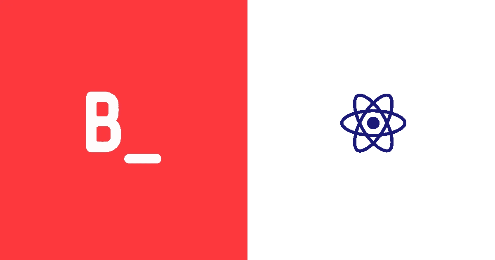
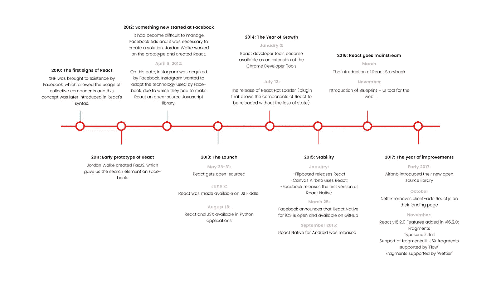

# React.js 是 2018 年最好的 Javascript 框架吗？

> 原文：<https://medium.com/hackernoon/is-react-js-the-best-javascript-framework-in-2018-264a0eb373c8>



Bejamas Blog Post — Is React The Best Javascript Framework in 2018?

[React.js](https://reactjs.org/) 是一个灵活高效的前端 [javascript](https://hackernoon.com/tagged/javascript) 库，用于构建 UI，被认为是 2018 年就业市场上最受欢迎的。它也被认为是目前最流行的 javascript 框架之一。尽管我们知道学习 [React](https://hackernoon.com/tagged/react) 会有一个陡峭的学习曲线，但这是值得的，因为它使开发应用程序更有效&有趣。考虑到以上所有因素，我们可以说，今年被认为是 React.js 成为市场上最好的 javascript 框架的一年。

# 什么是反应？

说白了，React 被认为是模型视图控制器(MVC)模型中的视图‘V’。视图是由“控制器”控制的无逻辑文件。React 并没有取代视图，而是通过创建高度可重用的组件(弹出模式、列表、可排序的表格等)使视图更加模块化。).

React 背后的主要思想是让你自己的元素类似于 HTML 元素。在 React 中，一个页面是更小部分的集合，这些小部分被称为组件。开发人员可以利用这些组件有效地创建大型 web 应用程序，无需重新加载页面就可以更改显示的元素或数据。一个简单的例子就是脸书喜欢。喜欢的数量可以增加或减少，而不必重新加载页面。这种方法使得构建现代复杂的用户界面变得非常容易。

# 反应的演变

2011 年，脸书开发者开始面临一些代码维护的问题。随着脸书广告应用开始呈指数级增长，团队需要更多的人来保持其完美运行。随着时间的推移，他们的应用变得难以处理，因为他们面临着大量的更新。他们的代码需要紧急升级以提高效率。

他们的模型是正确的，但他们需要在用户体验方面做些事情。脸书的软件工程师 Jordan Walke 建立了一个初始模型，使这个过程更加系统化，这就是 React.js 诞生的时候。

# 反应时间线



React Timeline by Bejamas.io

# React 开发商的市场需求

React.js 在 2018 年 6 月创下新高，在最受欢迎的语言中，超过 28%的招聘职位都提到了它。Angular 和 React 之间的巨大差距变得更大，Angular 的受欢迎程度持续下降。

Data from [https://www.hntrends.com/2018/jun-no-signs-of-slowing-for-react.html?compare1=React&compare2=AngularJS&compare3=Angular+2&compare4=Vue](https://www.hntrends.com/2018/jun-no-signs-of-slowing-for-react.html?compare1=React&compare2=AngularJS&compare3=Angular+2&compare4=Vue)

React 不仅在就业市场上胜出，还在 npm 下载量方面领先:

Enjoy this article? Subscribe for more.

# React 的重要特性

## JSX

JSX 基本上是 javascript 的语法扩展，它描述了我们的用户界面应该是什么样子。它是通用的，允许您将任何 javascript 表达式放在花括号内。可以是(2+9)这样的逻辑表达式，调用函数或者访问对象。一旦编译完成，这些 JSX 表达式就变成了返回 javascript 对象的 javascript 函数调用。JSX 也可以用在循环和条件语句中。以下是 JSX 电码的一个例子:

```
const person = {
  f_Name: 'John',
  l_Name: 'Doe',
};
function returnName(person) {
  return person.f_Name + ' ' + person.l_Name;
}
const elementJSX = <h3><i>Hello, {returnName(person)}!</i></h3>;

ReactDOM.render(elementJSX, document.getElementById('root'));
```

在上面的例子中，我们将 JavaScript 函数 returnName(person)的结果嵌入到`<h1>`和`<i>`元素中。

这段代码的结果如下:

***你好，无名氏！***

## 虚拟 DOM

React 创建一个内存中的数据结构缓存，它计算所做的更改，然后更新浏览器。该功能只允许更新那些已经更改的组件，而不是重新加载整个页面。

## 单向数据流

在 React 中，不允许组件直接编辑任何属性。相反，它们必须传递一个回调函数，借助该函数可以修改属性。这种数据流更好地被称为“单向数据流”

## 反应自然

React 拥有脸书在 2015 年宣布的本地库。这些本地库为本地 iOS 和 android 应用程序提供了架构。

# 一言以蔽之

## React 中的组件

react 组件是一段代码，代表每个页面的构建块。每个组件本身都是一个 javascript 函数。为了构建一个页面，我们按照一定的顺序调用这些函数；如果我们不能按照正确的顺序排列组件，页面的最终布局将不会是我们想要的样子。

## 类别组件

如上所述，编写组件的一种方式是 javascript 函数。编写组件的另一种方式是将它们编写为类，即 javascript 类。这些 javascript 类被称为类组件。一个类组件必须包含一个名为 *render()* 的函数。这个渲染函数应该返回组件的 JSX。这些类组件可以像功能组件一样使用`(<ClassComponent/>`最好使用功能组件而不是类组件，因为它们可读性更好。

## 基于状态更改组件

状态是基于`events`改变我们 UI 外观的方式。当用户点击一个按钮时(按钮点击- >事件)，状态将会更新，导致 UI 的变化。我们可以用`this.state`看到组件的状态。在`render()`功能中,“this”总是指它所在的组件。

```
const comp = this.state.isMoviePlaying ? ‘playing’ : ‘Not playing’;
```

上面的表达式检查电影是否正在播放，并相应地更改组件。

## 组件之间的交互

我们的组件之间应该有一种交互方式。我们需要能够传递数据或者告诉一个组件它是否在使用。我们通过使用道具来做这件事。属性是父组件与子组件共享的信息。JSX 道具看起来就像 HTML 属性。当容器的状态改变时，我们的道具也会改变。

# 作为道具的事件

道具不仅限于只是信息标签，还可以是功能(事件)。如果道具是一个事件，那么(例如)“点击”事件也会改变放置道具的容器的状态。因此，它将更新使用该容器的相关页面、数据或组件。

# setState 的缺点

用 setState 直接改变状态不是一个好的模式。React 等待一段时间，看看是否有更多的变化，然后更新状态。setState 提供了一个您应该使用的回调。

# 什么是裁判？

在典型的流程中，props 是父组件和子组件之间交互的唯一方式。在某些情况下，您可能需要修改典型数据流之外的子数据流；在这种情况下，使用参考文献。参照是为已创建的构件创建控制柄，并返回对元素的参照的一种方式。对于任何可以通过声明来完成的事情，避免使用 refs 是一个很好的做法。

# 让我们跳出 index.html

幸运的是，像 Create React App 这样的工具会为您处理所有这些事情。安装它来创建您自己的 React 项目。遵循他们的简短教程，开始编辑 src 目录中的 JavaScript，应用您学到的所有 React 知识。 *React 里面不需要住一个* `*<script>*` *的标记！*

# 使用 React 制作的顶级网站

以下是使用 React.js 前端 javascript 框架制作的 10 个网站的列表。

1.  脸谱网
2.  优步
3.  照片墙
4.  WhatsApp
5.  可汗学院
6.  爱彼迎（美国短租平台）
7.  Dropbox
8.  翻页板
9.  网飞
10.  贝宝

# React 是我的正确选择吗？

React 是目前为止使用最多的 javascript 框架之一，也是 2018 年最受欢迎的前端 javascript 框架之一。我们真诚地认为 React 应该是构建高级 UI 的首选。总而言之，我们认为 React 的 5 大优势是:

一、易学易用

二。可重用组件

三。虚拟 DOM(无需重新加载整个页面)

四。伟大的开发工具

动词 （verb 的缩写）和 JSX 一起写作更容易

不及物动词一个乐于助人的大社区

*本帖最初发布于:* [*https://bejamas . io/blog/react-best-JavaScript-framework-2018/*](https://bejamas.io/blog/react-best-javascript-framework-2018/)

Enjoyed the article? Subscribe to receive more:)

# 脚注

1.  [https://reactjs.org/](https://reactjs.org/)
2.  [https://www . telerik . com/blogs/5-react js-benefits-to-brighten-a-cloud-day](https://www.telerik.com/blogs/5-benefits-of-reactjs-to-brighten-a-cloudy-day)
3.  [https://medium . freecodecamp . org/all-the-fundamental-react-js-concepts-dugged-into-this-single-medium-article-c 83 F9 b 53 EAC 2](https://medium.freecodecamp.org/all-the-fundamental-react-js-concepts-jammed-into-this-single-medium-article-c83f9b53eac2)
4.  [https://medium . freecodecamp . org/everything-you-need-know-on-react-eaedf 53238 C4](https://medium.freecodecamp.org/everything-you-need-to-know-about-react-eaedf53238c4)
5.  [https://JavaScript report . com/whats-new-in-JavaScript-frameworks-March-2018/](https://javascriptreport.com/whats-new-in-javascript-frameworks-march-2018/)
6.  [https://www . HN trends . com/2018/jun-no-signs-of-slowing-for-react . html？compare 1 = React&compare 2 = Angular js&compare 3 = Angular+2&compare 4 = Vue](https://www.hntrends.com/2018/jun-no-signs-of-slowing-for-react.html?compare1=React&compare2=AngularJS&compare3=Angular+2&compare4=Vue)