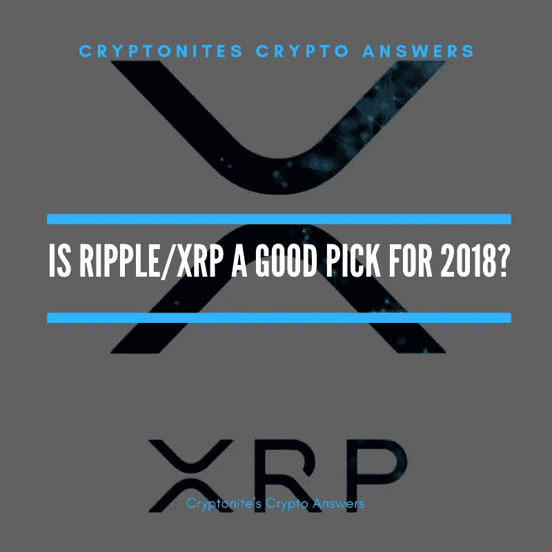

# 瑞波/XRP 是 2018 年秋季的好选择吗？

> 原文：<https://medium.com/hackernoon/is-ripple-xrp-a-good-pick-for-fall-2018-b9820b52d69d>

## XRP 在 2017 年表现良好，在 2018 年它仍然是一个好的选择吗？

9 月份有很多潜力不错的加密货币可以买。然而，今天我将重点放在纹波/XRP，目前坐在 0.56 美元

> **更新:**当我写这个故事的时候，价格是 0.28 美元，当我的故事等待出版的时候，价格涨到了 0.50 美元！
> 
> 我已经更新了这个故事，以反映出版时 XRP 的价格。密码移动很快！

Ripple/XRP 是一种值得购买和持有的加密货币的原因有很多，我将在下面列出其中的一些:

**快速交易和非常低的费用**

XRP 交易平均耗时约 3 秒，比大多数加密货币都要快。只有即时交易的 Nano 和 2-4 秒交易的 Stellar/XLM 能够在速度上竞争。

除了交易速度快之外，XRP 交易的成本还不到 1 美分。

这意味着你可以转账 5000 美元给世界另一端的某个人，基本上什么都不用，而且只需 3 秒钟就能到达。如果你尝试使用你的银行，这将花费至少 25 美元，并需要 1 -5 个工作日。

**战略合作伙伴**

Ripple 与 100 多家银行合作，包括桑坦德银行、美国运通和瑞银银行。你可能想知道为什么 Ripple 与这么多银行合作，这一切都要回到 XRP。

由于 XRP 速度极快，而且使用成本低廉，Ripple 计划让银行使用 XRP 在全球范围内转账，以节省时间和金钱。

如果银行选择使用 XRP，这将永远改变银行业，你可以告别昂贵的国际转账和漫长的等待时间。

**XRP 的表现**

XRP 目前是第三大最有价值的加密货币，2017 年增长了 35，000%以上，在其高峰期，一个 XRP 的价格达到 3.65 美元。

尽管价格有所下降(与所有加密货币一样)，但与去年的增长相比，它仍然很强劲。如果你在 2017 年 1 月买入 XRP，尽管价格有所调整，你仍将获得约 46 倍的利润。

想象一下，如果你当时投资 1000 美元，你现在会有 46000 美元，在 XRP 的最高点你会有 350000 美元。如果你投资 5000 美元，今天你会有 23 万美元，在 XRP 的最高点你会有 175 万美元。

当 Ripple 恢复时，我希望看到至少 10 倍的收益，这将使它回到每 XRP 2.8 美元左右。接下来，XRP 极有可能反弹至更高的价值，这在价格回升后很常见。

如果 XRP 股价达到 28 美元，那将是今天的 100 倍回报。

**XRP 的表演还在继续**

Ripple 的市值一度超过以太坊，XRP 的市值在最高点达到 1410 亿美元。

以太坊紧随其后，市值最高时达到 1340 亿美元。

以太坊作为第二大最有价值的加密货币的位置被 XRP 短暂取代，这不是一个小壮举。

如果 XRP 能继续以类似的方式表现，我可以看到它在 2019 年是一个强有力的竞争对手。

**最终想法**

目前看来，XRP 正进入积累阶段，这是买入的好时机。7 日图显示，在 1 个月的稳定下跌后，价格稳定运行，价格底部可能就在附近。

Ripple 已经加入了一些基于现金的交易所，如 [**CEX。**](https://goo.gl/5PLnV9) 这降低了新投资者的准入门槛，使 XRP 的价值增长更多。

如果一个以现金为基础的交易所决定上市替代硬币，这也说明了很多问题，因为这不是经常发生的事情。

如果 Ripple 能够被大规模采用，我可以预见它将超过历史最高水平。我们会让银行使用疯狂数量的 XRP 跨境转移资金。

我们还将有大量的民用和投资用途，进一步推动对 XRP 的需求。