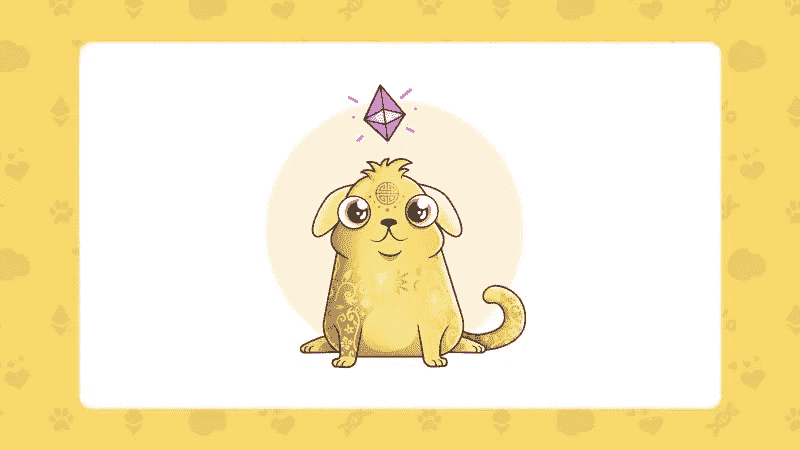

# Satoshi 是 Cryptokitty 吗？

> 原文：<https://medium.com/hackernoon/is-satoshi-a-cryptokitty-ad6b1c917e11>

*稀有的数字资产如何改变游戏，哪些资产将长期保持其价值*

 [## 秘密小猫抽奖

### 参与赢取这只专属狗(猫)Cryptokitty！100%的收益将用于救助真正需要帮助的流浪猫。

www.kittyraffle.org](https://www.kittyraffle.org/) 

**简短公告:**

CryptoKitties 正在 www.kittyraffle.org抽奖一只独家狗(猫)cryptokitty，以拯救真正猫的生命。彩票可以在 BTC 的 ETH 购买，或者通过捐赠或收养 cryptokitties 购买。

根据钱包总数，您的中奖几率非常高，但是抽奖活动将于明天，即 10 月 31 日 11:59PST 结束**。**

Dog(Cat) — “Kitty for a Cause”

CryptoKitties，听起来很傻，代表了密码产业的未来。在 2018 年 Money20/20 峰会上，Interstellar(Chain 和 stellar 的合并)的联合创始人杰德·麦卡勒(Jed McCaleb)和亚当·路丁(Adam Ludwin)正式宣布，他们将从一家平台公司转向一家产品公司。

因此，代替传统的模式:

a)搭建平台，然后；

b)向任何傻瓜愿意听的人宣传那个平台，然后；

c)等待(并且经常支付)最少审查的加密项目在你越来越不相关的平台上构建(可能)低于平均水平的区块链用例，

Interstellar 决定投入资源进行内部开发，并尽可能慎重地将产品和服务投放到他们的平台上。

你猜怎么着？这就是 CryptoKitties 一直在做的事情。

CryptoKitties 是一家从一开始就痴迷于产品的公司，它通过创造一个实际的(并且受欢迎的)产品打破了区块链初创公司的模式。)产品*之前*筹集资金，并使用区块链解决一个没有它就无法解决的问题(具有可证明来源和监管链的独特数字资产)。因此，它们是第一个获得关注的分散式应用程序。

此外，CryptoKitties 在流行之前就开始使用 ERC-721 不可替换令牌，并且还创建了一个有趣的游戏和功能齐全的市场。

Consensys 2018 年最受期待的产品之一 GamerToken 希望建立一个不可替代的 ERC-721 代币交易所。GamerToken 的流行反映了加密爱好者的情绪，即游戏和数字资产令牌将是下一个前沿。

**从长远来看，隐猫会保值吗？**

这当然值得讨论——没有人能预测未来。有人认为，隐猫是一种愚蠢的时尚，会像豆豆娃一样，但其他人认为隐猫和其他短暂的流行文化时尚是有区别的。

CryptoKitties 长寿的支持者认为，该公司对行动的偏好以及有效创新和引领趋势的能力，使它们在被垃圾和欺诈破坏的加密领域中独一无二。因此，这些数码小猫的价值不仅仅在于它们是什么，还在于它们代表了什么；区块链革命的重要历史遗迹。

**但是……区块链革命死了吗？**

区块链革命似乎已经停滞不前——大规模采用似乎难以想象，革命性技术与世界其他地区之间存在巨大差距。在 Money20/20，银行渴望介入，管理加密货币，并标记他们现有的产品和服务——但是，他们可能会接受技术，放弃革命。

现在是区块链和加密初创公司与区块链以外的真正创新者建立联盟的时候了，这些创新者希望赋予最弱势群体权力，并打破当前的权力结构。

然而，绝大多数为社会影响兜售密码的项目要么缺乏行动偏见，要么更糟的是，提出了一个盈利影响模型，这在实践中可能是剥削性的。还没有任何真正的、可持续的、基于社区的开发是由 crypto 驱动的。这就是为什么 CryptoKitties 已经形成的合作关系实际上值得注意。

**隐猫和社会影响**

在整个熊市中，CryptoKitties 不仅成功避免了其他地方出现的戏剧性内爆，还通过创建“Kitties for Good”项目，开始以真实而有意义的方式回馈社区。到目前为止，他们已经捐赠了小猫来支持艺术和海洋的非营利组织，现在，在互联网历史上可能是最完美的婚姻中，他们捐赠了一只数字小猫来拯救真正的猫。

CryptoKitties 和 Sp8de(一家数字游戏和赌博初创公司)首次与 Cat Town 合作，Cat Town 是一家总部位于奥克兰的小型非营利组织，其采用的模式与加密货币和区块链一样具有颠覆性和创新性。猫镇采用了一种已经存在了几个世纪的模式，完全颠倒了剧本，并将安乐死的比例降低了 70%——迄今为止，他们已经拯救了近 2000 只猫。每个人，甚至是最有经验的专家，都告诉他们这不可能，他们证明他们错了。聪会很骄傲的。

猫镇现在正致力于将他们的工作推广到其他地区，他们的学徒计划已经在教导其他城市采用他们的救生方法。像区块链一样，猫镇的模式是开源的、分散的和公式化的，这使得其他城市和自治市很容易复制。他们可以教给我们这些区块链社区的人很多东西，如何在一片反对和反对声中有效地实现一个激进的愿景。

虽然这看起来像是小小的第一步，但正是像这样的合作伙伴关系将使区块链革命永久化，并以可持续、健康、不依赖或被大型银行机构吸收的方式将加密货币带出熊市。

**抽奖活动**

CryptoKitties 和 Sp8de 认识到了 Cat Town 工作的重要影响，这两家区块链初创公司合作举办了一次国际抽奖活动，以使 Cat Town 受益(www.kittyraffle.org)。

它代表着 Sp8de 基于区块链技术的可证明公平随机数生成(RNG)的正式推出。因为这是抽奖而不是拍卖，所以你不一定要非常富有才能拥有一只价值不菲的 cryptokitty。任何人都可以通过使用 BTC 联邦理工学院，或者通过捐赠或收养密码猫来赢得比赛。

**那么……什么是最有价值的小猫？**

从长远来看，什么是最有价值的密码猫？

当回顾过去技术革命的其他有价值的遗物时，我们看到代表最具历史意义的第一次并对社区和流行文化产生影响的资产是最令人垂涎的。

对于 CryptoKitties 来说，三只猫是数字资产革命的象征。

首先，创世纪小猫。独一无二的。第一只在区块链诞生的数字小猫，也是第一件被拍卖的数字资产。

二、天界赛博次元 Kitty。首次涉足社会影响，并在有史以来第一次以加密货币为主题的艺术品现场拍卖中售出。收益将捐给艺术与区块链基金会。

三、狗(猫)Kitty #1812。虽然总共有 16 只狗(猫)，但#1812 确实是独一无二。这是两家截然不同的区块链创业公司之间的首次合作。第一只拯救猫生命的数码猫。第一个在线抽奖的数字资产，收集加密货币和数字资产作为支付，第一个在 RNG 使用区块链技术。