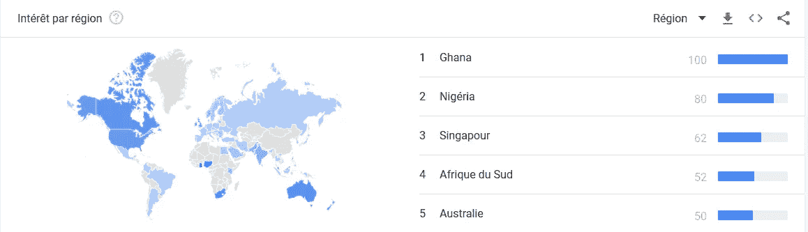

# 稳定是加密货币主流采用的必要条件吗？

> 原文：<https://medium.com/hackernoon/is-stability-a-necessity-for-cryptocurrencies-mainstream-adoption-c2c083a97dc9>

当你与不熟悉加密货币的人谈论加密货币时，波动性是最先出现的问题之一。通常，这是一种轻而易举的方式来摒弃整个加密货币世界以及最近在去中心化方面取得的进展。波动性不会影响所有的加密货币:其中一些是稳定的(价格方面)——我们称之为“稳定货币”

这是法语原文。

在我们进入正题之前，让我们陈述一些必要的事实来理解这篇文章:

1.  **加密货币不仅仅是比特币**。CoinMarketCap 上列出了 1500 多种代币，这只是冰山一角:实际上，有成千上万种加密货币在流通。代币的绝对数量可能会令人害怕，但从长远来看是积极的。这意味着，对于加密货币可以解决的每一个问题，你都有几十个不同的团队在探索许多不同的方法——不遗余力。
2.  无论聪最初的愿景是什么，**比特币不适合成为主流货币**。它的技术限制，如低交易速度或采矿问题(能源消耗、集中化等。)使得它不适合这个用例。然而它的坚持([比特币](https://hackernoon.com/tagged/bitcoin)快 10 年了！)以及它的可靠性使它成为一种很好的“价值储存手段”，就像黄金一样。
3.  尽管如此，仍有许多项目雄心勃勃，希望成为未来的主流货币。**他们回答了将比特币视为一种货币时提出的基本问题:它的波动性。这些项目被称为 stablecoins，它们将是这篇文章的主题。**

波动性问题凸显了一种货币的一个重要特征:价格稳定是人们有信心使用这种货币的必要条件。事实上，创造一种新货币需要彻底理解技术机制和社会动态。为了成为一种货币，一件商品必须被它的用户认可并获得他们的信任。

# 菲亚特在往南走吗？

我们观察到加密货币的采用与给定国家的国家货币(称为法定货币)的“疲软”之间有很强的相关性。很难衡量加密货币的采用情况，但我们可以使用谷歌趋势轻松获得有多少人有兴趣购买加密货币的数字:

Geographical distribution of the query “How to buy bitcoin” using Google Trends

加纳货币(塞地——GHS)从 2008 年的大约 1 美元涨到现在的大约 20 美分。与此同时，尼日利亚货币(奈拉-NGN)贬值了大约一半(相对于美元)。

The exchange rate of the dollar against the Cedi (left) and Naira (right) over the last ten years. Source: [TradingEconomics](https://tradingeconomics.com/).

贬值发生得如此之快，以至于生活在这些国家的人们都感受到了它的影响。这可以解释我们在加纳和尼日利亚观察到的对加密货币的强烈兴趣。然而，确定一种货币的价值比简单地用美元衡量它要复杂得多。如果用美元作为我们的参照点，我们必须质疑它的稳定性:**美元本身甚至稳定吗？**

想都没想，回答“是”似乎就成了最佳答案。在过去的 50 年里，美元没有变化——1968 年发行的 1 美元纸币今天仍然被认为是 1 美元。但是，它的价值呢？它一直在变化。那么，1968 年的 1 美元还值 1 美元吗？答案是否定的——它将提供相当于现在大约 7 美元的购买力。

Evolution of the buying power of the equivalent a 1968 dollar from this date until now. Source: [TradingEconomics](https://tradingeconomics.com/).

利差的主要驱动力当然是通胀。这个主题足够复杂，可以写论文了，所以我们把它留给其他人。现在我们有了一些背景知识，让我们回到 stablecoins。

# 什么是稳定币？

stablecoin 背后的想法很简单，挑战在于执行。**稳定币是一种加密货币，以固定价格与商品(如黄金)或普通货币(最常见的是美元)进行交易。**

稳定的硬币价值不稳定；仅仅是它的价值与一种相对稳定的资产挂钩**。创造一种可靠的稳定货币已经是一个真正的挑战，所以创造一种固定价值的货币是一个疯狂的梦想。**

然而，有一个稳定值的问题值得考虑。会是什么样子？给定货币的一个单位总是值一个单位？那是 DOGE 的专长！

The DOGE is a parodical currency created out of a meme which is now taken more and more seriously as cryptocurrencies develop

让我们回到更严肃的问题上来:货币的稳定性可以定义为这样一个事实，即它的一个单位总是允许获得相同的价值。这个定义与前一篇文章中提出的货币定义是一致的。

> 金钱不是价值的储存手段，而是对价值的要求。

从理论上讲，保持货币和它所代表的实际价值之间的联系是一种优雅的做法。然而，在现实世界中，几乎不可能准确衡量一种货币的购买力。这就是为什么我们将稳定定义为一种货币相对于其他具有相对稳定价值的商品或货币保持不变的价格。在讨论不同的 stablecoin 项目之前，让我们先来看看它们的效用。

# 稳定的硬币有什么用？

我们已经有了活的和可用的稳定的硬币，如 USDT。它们主要被加密交易所和交易员使用，因为它们提供了一种避免回归法定货币、避免遵守随之而来的所有法律框架的方式。此外，由于它们的价格相对于美元是固定的，它们在某种程度上是交易员的避风港:有了它们，他们可以在不真正退出市场的情况下退出市场。

目前，稳定币主要是交易者的花招，用来进出市场，而不把钱带回到他们的银行账户。因此，在短期内，它们主要是一种投机工具。然而，从长远来看，它们可以提供真正的效用。

由于加密货币与法定货币相比具有较高的波动性，因此它们并没有真正被用作货币。几乎没有人选择用加密货币支付工资，或者用它们来购买食品杂货。

将稳定的加密货币与生态系统的其他部分很好地集成在一起，将为解决这些需求提供一个可靠的解决方案。起初，stablecoins 将成为菲亚特和密码世界之间的门户。从长远来看，他们自己也可能成为“加密货币的法定货币”:**他们将成为足够稳定的加密货币，成为首选的支付方式**。它将为其他(不稳定的)加密货币提供更广泛、更可靠的服务。

# 如何稳定加密货币:活生生的例子

为了实现他们对特定法定货币稳定汇率的承诺，稳定银行必须提供**抵押品**。因此，根据它们使用的附属机制，出现了几种类型的稳定硬币:

## 菲亚特抵押债券

这是制造稳定硬币最直接、最简单的方法，也是最集中的方法。简而言之，有一个铸造稳定硬币的中央实体，它拥有与投入流通的数量相应的美元储备。这种美元储备为硬币的可解性提供了保证，并允许在任何时候将稳定的硬币兑换回美元。

即便如此，这种方法也有几个问题。首先，它是**完全集中的**，因为一个单独的实体正在发行稳定币并支持它。除了相信它，别无选择。此外，这种方法在经济上效率低下，尤其是在大规模使用时，因为它需要“冻结”与流通中稳定货币数量相等的货币。

**USDT**

这种机制被最广泛使用的稳定硬币 USDT 使用。尽管采用了 USDT，但它因缺乏透明度而受到广泛谴责——没有可靠的方法允许其用户验证 Tether(发行 USDT 的机构)在其储备中实际拥有与流通中的 USDT 数量相对应的美元存量:目前约为 28 亿美元。然而，Tether 和 Bitfinex(交易量排名第四的加密货币交易所)之间的关系引发了关于其允许的市场操纵潜力的问题。

**TrueUSD**

TrueUSD 是为了应对 USDT 缺乏透明度而创建的，它使用相同的机制，但提供了更多的担保。TrustToken(发行 TrueUSD 的机构)并不拥有令牌本身，而是与银行和金融机构网络合作，为它们保管资金。其中一家公司 Cohen&Company 每月两次发布一份[独立审计](https://blog.trusttoken.com/trueusd-attestation-reports-86f693b90a4?gi=749091358366)，以确认 TrustToken 的金融合作伙伴确实托管了相当于 TUSD 流通量的美元。

提供的保证似乎比 USDT 更可靠，但问题是相似的:这个系统要求其用户信任 TrustToken 及其合作伙伴，老实说，尤其是 Cohen&Company。它一直工作，直到它不工作。

## 加密抵押债券

尽管法定抵押稳定货币正在兑现(到目前为止)它们的稳定承诺，但它们正在从整体上损害加密货币，加密货币的目标是为传统金融和货币网络提供一种去中心化的替代方案。为了解决这个问题，另一种稳定的硬币出现了。他们使用其他加密货币作为抵押品，并通过智能合约网络将其汇率与基础资产挂钩。

然而，这种类型的稳定货币也面临着问题，主要是用作抵押品的加密货币的波动性。为了解决这些问题，他们需要**一种优于稳定二氧化碳排放量的抵押品**，这阻碍了其潜在的大规模使用。

**马克尔道—戴**

戴是另一种与美元挂钩的稳定货币(1 戴= 1 美元)。它有一些有趣的特点，主要是它是完全分散的。事实上，发布 Dai 的机构是 MakerDAO，一个分散的自治组织。这是一个**组织，其治理规则通过可公开审计的智能合同**自动执行，使其透明且不可更改。

戴和是一对搭档。MKR 的所有者可以投票决定用来稳定戴的机制。这个系统非常复杂，可能需要几篇文章来讨论。戴经过三年的发展，于 2017 年 12 月 17 日上线。自推出以来，其价格与菲亚特抵押稳定债券的价格稳定在同一范围内(+/-10%)。

## 无抵押稳定债券

从长远来看，这些 stablecoins 是最有希望的，因为它们解决了前两种类型提出的主要问题:它们提出了一种可以大规模使用的分散式解决方案。这些项目仍处于开发阶段。

他们中的大多数使用算法来减少或增加流通中的稳定硬币的数量，以稳定其价格。如果价格超过美元，流通供给增加；如果跌破，供应就会减少。这一类别中最突出的两个项目是 Basis 和 Carbon。

**基础**

Basis 希望创建一个“算法央行”来稳定其价格。他们的系统使用三种不同类型的令牌，这使得它非常复杂。目标是在增加投资者的情况下，复制一个简化版的美联储系统。

**碳**

另一方面，Carbon 正试图执行罗伯特·萨姆斯(Robert Sams)在 2014 年提出的一种称为[铸币税份额](https://github.com/rmsams/stablecoins/blob/master/paper.pdf)的方法。这个解决方案目前主要是理论上的，还没有看到一个可行的实现。

# Stablecoins:加密货币的礼物还是诅咒？

Stablecoins 是最近的一项引人入胜的创新。目前有许多使用不同方法的项目正在开发中([非详尽列表](https://stablecoinindex.com/projects/))。上面提出的类型是简化的:一些项目混合几种类型的抵押品，而其他项目使用完全不同的机制。

今天，稳定货币更多的是投机工具，但从长远来看，它们可能成为加密货币主流采用的关键因素之一。从交易量来看，USDT 目前正在消灭其竞争对手，这给整个加密货币市场带来了系统性风险。如果 USDT 失败，可能会导致大范围的恐慌。因此，投机将市场推向了一个缺乏任何真正透明度的高度集中的工具:这是对去中心化未来的一个温和的讽刺。

如果你喜欢这篇文章，请告诉我，并查看我的维基以获得更多类似的内容。 **别忘了拍拍它** **帮它传播:**可以一直按👏高达 50 次鼓掌。

本文是[一个原创(法语)EcoCrypto.fr 故事的翻译。](https://ecocrypto.fr/vulgarisation/tokens-non-fongibles-expliques-par-tortank-et-dracaufeu/)

## 来源/深潜

*   [警告信号？Tether 和 Bitfinex 事件的时间表](https://bitcoinmagazine.com/articles/warning-signs-timeline-tether-and-bitfinex-events/) — Amy Castor 在比特币杂志上，2018 年 7 月 2 日。
*   [stable coins 的崛起](https://coinjournal.net/the-rise-of-stablecoins/) — Alex T. on CoinJournal，2018 年 4 月 8 日。
*   [stable coins——承载着通往加密货币应许之地的道路](https://hackernoon.com/stablecoins-carrying-the-way-to-the-crypto-promised-land-c124b2db8ea3)——2018 年 7 月 4 日 Hackernoon 上的 Brian Quinlivan。
*   [Stablecoins:设计一种价格稳定的货币](https://hackernoon.com/stablecoins-designing-a-price-stable-cryptocurrency-6bf24e2689e5)—Haseeb quere Shi on hacker noon，2017 年 12 月 12 日
*   [Stablecoins 注定失败](https://prestonbyrne.com/2017/12/10/stablecoins-are-doomed-to-fail/) — Preston Byrne 在其个人博客上，2017 年 12 月 10 日。
*   什么是 MKR？ —马克尔道的博客，2015 年 9 月 10 日。

文章中提到的 Stablecoin 项目:

1.  [USDT](https://tether.to/)
2.  [真实美元](https://www.trusttoken.com/trueusd/)
3.  [马克尔道](https://makerdao.com/)
4.  [依据](https://www.basis.io/)
5.  [碳](https://www.carbon.money/)