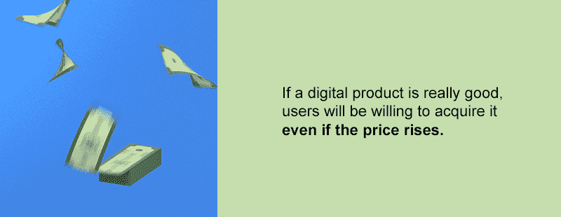
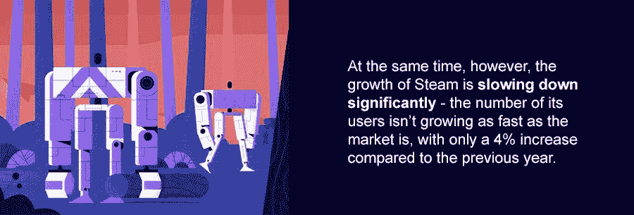
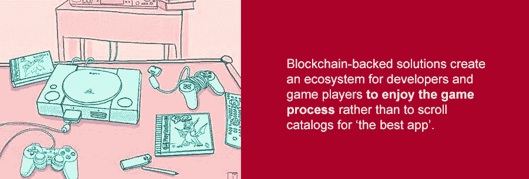

# 在游戏行业走向区块链的同时，Steam 是否落后了？

> 原文：<https://medium.com/hackernoon/is-steam-lagging-behind-while-the-game-industry-moves-towards-the-blockchain-4963edc7da29>

游戏产业像吃了类固醇一样在增长。它的收入从 2011 年的 650 亿美元跃升至 2018 年的 1370 亿美元(T2)。人们喜欢在娱乐上花钱，使用我们负担得起但功能强大的移动设备只会助长这种趋势——今年超过一半的收入来自移动平台。很明显有一个增长的趋势，每天都有更多的人进入这个市场。

然而，与此同时，Steam(世界领先的个人电脑视频游戏平台)的增长明显放缓——其用户数量的增长没有市场的增长快，与去年相比[仅增长了 4%](https://www.statista.com/statistics/823944/steam-new-users/)。看起来好像撞到天花板了。移动平台会超越这个市场并取代 Steam 吗？问题是，真正的英雄，游戏开发商，开始寻求其他发行模式，因为中间发行商(如 Steam)从他们的收入中削减了太多。在这种情况下，开发者可能会跳过创新阶梯，直接去找区块链游戏发行解决方案，以解决这种不平等。现代游戏产业面临的问题有多严重，对于游戏开发者来说，Steam 的替代品是什么？

*感谢*[*agency.howtotoken.com*](http://agency.howtotoken.com/)*对创建本主题的支持(第一个拥有成熟 ICO 承包商的平台)*

# 人们玩的游戏

根据[全球游戏市场报告](https://newzoo.com/insights/articles/global-games-market-reaches-137-9-billion-in-2018-mobile-games-take-half/)，预计 2018 年全球将有 23 亿手机游戏玩家在游戏上花费 1379 亿美元。根据互动广告局(IAB)的消息，随着手机游戏玩家关注游戏叙事并分享游戏中的得分结果，到 2021 年，这一数字将达到 26 亿用户，[预计全球活跃的视频游戏玩家人数将从 18 亿(2018 年)上升到 27 亿(2021 年)。](https://www.statista.com/statistics/748044/number-video-gamers-world/)

**移动游戏市场将为游戏行业创造 51%的收入**如果分开计算，这几乎是 PC 游戏市场(24%)和主机游戏市场(25%)的两倍。

目前，亚太地区超过 71%的互联网用户每天都在玩手机游戏，这定义了他们思考、生活和交流的方式。这些强大的游戏玩家社区甚至创造了他们自己的语言，将虚拟世界带入现实生活。手机游戏变得越来越受欢迎，因为它们可以让日常生活变得有趣。因此，在交互式应用程序中跟踪预算贷款可能会鼓励人们存更多的钱。开发手机游戏是为了用一个新的强大引擎加速传统世界，该引擎为完成日常游戏任务打分。

# 游戏货币的汇率

现在市场上充斥着设计用来让用户花钱而不是享受过程的应用程序。因此，根据德勤进行的一项调查显示，玩家对下载新应用的兴趣正在下降。Steam 已经开始失去**游戏市场是** [**在**](https://datapath.io/resources/blog/the-history-of-online-gaming/)**[互联网](https://www.theguardian.com/technology/2016/jul/15/how-the-internet-was-invented-1976-arpa-kahn-cerf)发明后，第一个开始将存储在算法**中的知识产权货币化的行业 **。**

[https://giphy.com/gifs/animation-art-design-xT0xeAqBxu7wd3Ie0o](https://giphy.com/gifs/animation-art-design-xT0xeAqBxu7wd3Ie0o)

每个游戏开发者都是从独立开发开始的，他们的动机是为人们开发最好的游戏。如果玩家不被市场隐藏在以创收为目的的推荐算法下，一群爱好者就能开发出“最好的应用”。然而，众所周知，传统市场存在信息不对称，这给了中介机构从中获利的空间。

一款游戏从开发者和充满激情的创作者到用户，经历了一个漫长的过程:

*   投资人和基金从年收益中分一杯羹；
*   发行商推广一款游戏是要收费的；
*   Market places 收取游戏费用或从总收入中提成。

中介的数量越多，开发者和用户之间的联系就越不明显。这条路被转售数字而不是创造数字的出版社穿过。这些公司的目标是赚钱，而不是提高产品质量。然而，这不是开发人员想要。根据国际游戏开发协会(IGDA)进行的开发者满意度调查[，游戏开发者认为“游戏设计的进步”是行业发展的最重要因素(62%)，而“货币化”是最不重要的因素之一(21%) 。这是从](https://cdn.ymaws.com/www.igda.org/resource/resmgr/2017_DSS_/!IGDA_DSS_2017_SummaryReport.pdf)[经济理论](https://www.khanacademy.org/economics-finance-domain/microeconomics/elasticity-tutorial/price-elasticity-tutorial/a/elasticity-in-areas-other-than-price-cnx)得出的，该理论认为媒体和艺术产品的需求弹性较低，这意味着如果一个数字产品真的很好，即使价格上涨，用户也会愿意购买它。

# 中介蓬勃发展，而游戏开发商只能勉强生存

加拿大(ESAC)娱乐软件协会[报告](http://theesa.ca/wp-content/uploads/2017/10/ESAC2017_Booklet_13_Digital.pdf)**游戏产业每年为加拿大 GDP 增加 37 亿美元**。从 2015 年开始，这一 GDP 贡献对加拿大经济的总体影响增加了 24%。视频游戏行业的增长速度明显快于其他经济领域。随着游戏产业开始对国家的经济做出重要贡献，传统的市场代理人制定了他们的规则来分配和分一杯羹。

2017 年，苹果报告称，通过其市场产生了 114 亿美元的。一个[苹果开发者许可证](https://developer.apple.com/programs/)允许在**应用商店**发布一个应用程序，费用为每年 99 美元。开发者可以免费发布付费应用，但需要支付 30%的平台使用费。 **Google Play** 提交一个应用程序每年收费 25 美元。AppStore 和 GooglePlay 从它们被设计的市场变成了从开发过程中获取收入的中介。

发布平台 **Steam** 在 2017 年产生了 43 亿美元的销售收入，对使用该平台收取 30%的费用。Steam 为开发者提供数字版权管理(DRM)、匹配服务器、视频流和社交网络服务，为游戏开发流程配备现成的解决方案。这拉近了开发者和用户之间的距离，这种差距仍然存在，因为他们在游戏开发过程中没有互动。

[https://www.behance.net/gallery/45069485/The-Atlantic-Future-of-Work](https://www.behance.net/gallery/45069485/The-Atlantic-Future-of-Work)

Kickstarter 通过在游戏开发开始前提供一个融资平台，用一个更优雅的解决方案解决了这个问题。开发者可以直接接触到他们的潜在玩家，尽管他们在开发过程中并不与他们互动。2017 年，在 Kickstarter [上成功资助游戏项目的承诺资金总额相当于](https://www.statista.com/statistics/260126/amount-of-dollars-pledged-towards-games-on-kickstarter/)1.63 亿美元。这是 2012 年游戏项目资金总额(7400 万美元)的两倍多。游戏行业共有 40，334 个项目筹集了资金，但其中一些项目没有推出产品。Kickstarter 从每个发布的项目中获得佣金，而不会对游戏开发过程产生直接影响，让玩家等待发布。

传统市场阻碍、破坏并[扼杀创造力](https://www.thestar.com.my/tech/tech-news/2018/09/03/are-youtubes-algorithms-fueling-creator-burnout/)，因为它们收回了与评级算法斗争的努力。有多少漂亮的游戏是用失去的资源创造出来的？

# 用新规则制定新规则

由区块链驱动的数字生态系统给了创作者一个机会，在没有任何中介的情况下为玩家开发一个新的现实。在这个新的现实中，中介没有权力，因为他们不是这个过程的一部分。根据 ICO 上市网站最近发布的[报告](https://icobench.com/reports/ICO%20Market%20Weekly%20Review%2025%20(September%2021,%202018).pdf)，在过去的 12 个月里，娱乐行业的 337 个 ICO 筹集了 12 亿美元，平均投资额为 300 万美元。该行业正在努力实现数字化，因为生成的数据量超出了人工分析的能力。

软件开发公司 Hyperbridge Technology 成立于 2017 年，旨在解决区块链、物联网和人工智能领域的最大挑战。在一年的时间里，他们建立了一个区块链驱动的平台 [BlockHub](https://medium.com/hyperbridge) ，通过协议驱动的平台连接开发者和消费者，为开发者提供一个开箱即用的解决方案来筹集资金和发布游戏。这种开箱即用的解决方案通过筹款机制促进了开发过程，该机制最大限度地利用智力资源来创建独特的游戏体验。

BlockHub 旨在为用户浏览游戏和开发者在创作过程中与用户互动提供一个无噪音的环境。在一个由 Hyperbridge 协议支持的数字平台内，一种以以太坊为后盾的新形式的分散微观经济得以建立。作为一个生态系统，BlockHub 计划从代币交易中获得收入，最大限度地提高开发者和玩家之间的合作流程，消除中介，旨在增强游戏体验技术。这种新的互动形式不会与其他平台竞争，因为它有望将开发者和游戏玩家带到一个新的合作水平。

一些其他项目试图通过网络解决方案来解决开发者和游戏玩家之间的协作问题。因此，[金恩](https://blog.enjincoin.io/enjin-coin-manifesto-8caae08b50a1) game network 在其宣言中表示要与腐败作斗争，通过给游戏带来公平的财富分配来“帮助游戏开发者利用道德的货币化模式”。另一个项目[深渊](https://medium.com/theabyss)正在开发一个加密奖励生态系统，为游戏玩家提供一个推荐系统，从社交活动和游戏内购买中获利。

# 现实世界中的硬币

随着游戏行业在新的现实中吸引用户的同时促进了传统行业的发展，预计中介将被挤出开发者与玩家的互动。通过区块链支持的平台向游戏开发者提供其他行业数据的机会，为重新计算市场并开始按照新的升级规则进行游戏提供了坚实的理由。

[https://www.pinterest.ru/pin/573434965036320846/](https://www.pinterest.ru/pin/573434965036320846/)

区块链驱动的平台已经开始重组市场。因此， [BlockHub](https://medium.com/hyperbridge) 设定的目标是在 3 年内拥有 200 万月活跃用户群。凭借 25%的月增长率，BlockHub 有可能从传统平台获得用户。因此，与 2016 年的+26%和 2015 年的+29%相比，2017 年 Steam 新用户数量的增长[下降](https://www.statista.com/statistics/823944/steam-new-users/)至+4%。这种趋势得到了开发商对游戏内容多样性的关注(58%)而不是专注于盈利的支持。如果他们能够直接访问游戏玩家生成的数据，以探索见解并实时实施最佳实践，这是可能的。在这种环境下，BlockHub 预计 30%的用户将参与付费会员计划。

区块链支持的解决方案为开发者和游戏玩家创造了一个生态系统，让他们享受游戏过程，而不是滚动目录寻找“最佳应用”。这种新型的合作可能会改变规则，并释放该行业在未来创造新成绩的潜力。

## 关于作者:

基里尔·希洛夫——geek forge . io 和 Howtotoken.com 的创始人。采访全球 10，000 名顶尖专家，他们揭示了通往技术奇点的道路上最大的问题。加入我的**# 10k QA challenge:**[geek forge 公式](https://formula.geekforge.io/)。