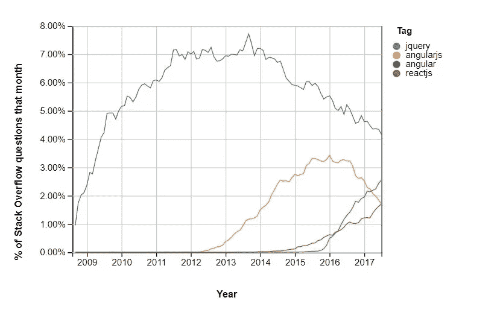

# 角度下降是神话吗？

> 原文：<https://medium.com/hackernoon/is-the-angular-decline-a-myth-e4cf563b72d6>

Photo by [Wes Hicks](https://unsplash.com/photos/4-EeTnaC1S4?utm_source=unsplash&utm_medium=referral&utm_content=creditCopyText) on [Unsplash](https://unsplash.com/?utm_source=unsplash&utm_medium=referral&utm_content=creditCopyText)

在过去的二十年里，前端开发的发展可谓引人注目。在 20 世纪 90 年代早期，前端开发人员主要关注功能，而布局是事后才想到的。这是因为当时没有太多的工具和技术可以使用，而且我们知道今天还不存在的 CSS 和 T2 JavaScript。

在一个由 Internet Explorer、Opera 和 Netscape 主导的环境中，前端开发集中于构建表格，以使内容具有广泛的吸引力。开发人员也在不断努力解决浏览器漏洞，但性能问题和浏览器兼容性并不是重中之重。

这一切在 1995 年发生了改变，当时布伦丹·艾希受 Java、Self 和 Scheme 的启发，[在网景通信](/@benastontweet/lesson-1a-the-history-of-javascript-8c1ce3bffb17)公司工作时创造了 JavaScript。这项新技术的出现产生了第一个框架和库，并消除了浏览器的不兼容性。

十多年后，MooTools、jQuery、HTML5 和 AngularJS 等框架为前端技术注入了新的活力。从那以后，大约每六个月就有一个新的 JavaScript 框架库发布。

[Stack Overflow 最近的一项研究发现，从 2009 年到 2015 年，jQuery 相当受欢迎](https://stackoverflow.blog/2018/01/11/brutal-lifecycle-javascript-frameworks/)，占该平台新问题的 8%。然而，AngularJS(以及后来的 ReactJS)的出现占据了主导地位，并占据了堆栈溢出社区的思想份额。

2016 年，出现了从 AngularJS 到 Angular(也代表了 Angular 2+等后续版本)的转变，开发人员竞相迁移到谷歌提供的最新流行框架。

Stack Overflow 的发现表明，Angular 和 React 在前端开发方面明显领先，Angular 在 C#、Java 和 PHP 开发人员中产生了更多流量，脸书的 React 吸引了更多的 NodeJS、Python 和 Rails 开发人员。

# Angular 今天站在哪里？

如果你看看 JavaScript 2017 报告的[状态，React 遥遥领先，有 13669 名受访开发者表示他们会再次使用它。Angular 1 排名第三，有 4707 名开发者愿意再次使用它，Angular 2 排名第五，有 4449 名开发者愿意在未来使用该框架。](https://stateofjs.com/)

Javascript Frameworks over Time (Stack Overflow)

该研究还发现，多达 12，175 名开发人员对学习 VueJS 感兴趣，而 6，072 名开发人员对学习 Angular 2 感兴趣。然而，9615 名开发者表示他们不会再使用 Angular 1，而另外 10657 名开发者听说过 Angular 2，但对使用它丝毫不感兴趣。

在澳大利亚，大约有[8143 个经过验证的商业网站](https://trends.builtwith.com/javascript/Angular-JS/Australia)(新南威尔士州和维多利亚州的集中度最高)是使用 Angular 构建的。在美国，Angular 的市场份额要大得多，T2 有多达 451，330 个商业网站利用这项技术。

如果你按行业来看这些数字，零售和媒体行业倾向于使用 Angular，反应比其他任何行业都更强烈。这是有意义的，因为他们的业务模式专注于提供丰富的客户端体验，以创造更具吸引力的用户体验。

相比之下，政府、医疗和教育等其他部门似乎不太需要这些类型的框架。这可能归结于这样一个事实，即他们的主要关注点是数据库管理和分析，而不是前端 web 开发。

# 社区在说什么？

在[获胜小组](https://www.themartec.com/employers/winning-group)的前端开发负责人 James Ferguson 认为 Angular 现在已经变得更加稳定，并且可以独占使用(使用像 [rxjs](https://github.com/Reactive-Extensions/RxJS) 、 [lodash](https://github.com/topics/lodash?l=typescript&o=desc&s=stars) 和 [ngrx](https://github.com/topics/ngrx?l=typescript) 这样的库和框架)。“随着最近对 Angular 5 的升级，我们使用提前编译器来节省包的大小并提高性能。随着生态系统的成熟，我们发现自己必须编写更少的定制 web 包代码，并且能够更接近 Angular 客户端团队提供的默认设置。”

然而，交付经理 Adam Korczynski 更喜欢将聚合物用于日常前端开发。“2015 年末，当它推出 0.4 版本时，我们决定走这条路。我们接受了采用一个不成熟但符合我们全球战略目标的平台的风险。聚合物具有内置的元件隔离功能，并且是基于标准的，这两点都吸引了我们。”

对于像 ING 这样的企业来说，“Angular 并不合适。我们的目标是整合集团内使用的许多不同的框架，以支持单一的库。Angular 是“固执己见”的，像所有的观点一样，只需极少的咨询就可以改变。在决定采取哪个方向时，我们看到了 Angular 2 漫长而有争议的发展。它强调了固执己见的框架的缺陷。另一方面，聚合物包装了 web 组件标准，我们相信它是一种更安全的选择，不太可能随着时间的推移而过时。”

# 有角度的例子

Angular 由 Google 和一个由个人和公司组成的支持社区维护，已经有效地解决了许多与单页面应用程序相关的开发挑战。通过为客户端模型-视图-控制器(MVC)和模型-视图-视图-模型(MVVM)架构提供一个框架，它们也使得应用程序的开发和测试变得更加容易。

虽然一些前端开发人员可能不同意，但 Angular 的关键优势是它的双向数据绑定特性。在这种情况下，模型和视图是同步的。因此，当模型发生变化时，视图也会发生变化，从而启用双向数据绑定，这可以显著减少开发时间(因为您不必编写任何额外的代码)。

另一个好处是 Angular 的依赖注入特性。这定义了不同的代码片段如何相互交互。依赖性还决定了一个组件的变化将如何影响其他组件。通常，这些依赖关系是在组件本身中直接定义的，因此任何依赖关系的改变都需要您改变代码。但是使用 Angular，您可以使用将依赖关系定义为外部元素的注入器来将组件从它们的依赖关系中分离出来。因此，依赖注入使得组件高度可重用，并且更容易测试和管理。

Angular 的指令特性还允许 HTML 扩展来帮助将行为分配给文档对象模型。这使得开发人员能够用 HTML 构建丰富的动态内容。由于 Angular 仍然非常受欢迎，前端开发人员也可以享受到强大的工程师社区的支持，他们将帮助您为几乎所有可以想象的问题找到一个健壮的解决方案。

# 反对 Angular 的理由

采用角度的障碍之一是其陡峭的学习曲线。由于这种技术是高度通用的，有不止一种方法来做事情，这一直是一个混乱的来源。然而，有了社区的大力支持和数百个教程，任何冲突都可以很快得到解决。前端开发人员在使用 Angular 之前还需要学习 TypeScript，这也将增加他们的学习曲线。

新版本的 Angular 也完全重建了，所以虽然它们可能仍然拥有相同的功能，但与旧版本没有向后兼容性。众所周知，在运行复杂的 spa 和其他动态应用程序时，由于它们的大小，它的性能并不好。

James Ferguson 同意，“与其他框架相比，Angular 的主要弱点是捆绑包大小和开发过程中的社区信任。捆绑包的大小大于 React 和 Vue，因为它是一个旨在提供更完整解决方案的框架。然而，Angular 团队现在正在改进这一点，新版本减小了包的大小，改进了模块化和树抖动。Angular 团队在 AngularJS 和 Angular 2 之间引入了根本性的突破性变化后，也失去了社区的信任。从 2 到 4 和 5 的过渡已经有了很大的改进，但仍然没有恢复早先的声誉。不过，与较小的框架相比，开发人员可以重拾信心，因为他们知道这个由谷歌支持的项目应该在未来保留一定程度的维护。”

# 你应该改变吗？

Angular、React 和 Vue 等框架都是非常出色的工具，有助于增强用户体验和增加前端开发的价值。每一个都有自己的 USPs 来推动流行，并承诺在未来几年发挥重要作用。尽管 React 的受欢迎程度在最近几个月可能会飙升，但这并不意味着 Angular 很快就会过时。

在我看来，Angular 的潜在衰落只是一个神话。

脸书最近将其 [React JavaScript 库和 GraphQL 查询](https://www.theregister.co.uk/2017/09/26/facebook_license_surgery_on_react/)从其有争议的 BSD 和专利许可证中解放出来，并用更受欢迎的 MIT 许可证取而代之。这一开创性的事件应该会让更多的初创公司加入 React。然而，谷歌对[渐进式网络应用的日益关注将确保 Angular 在未来几年内保持优势。](https://jaxenter.com/angular-progressive-web-apps-2018-139076.html)

在不久的将来，您是否应该从 Angular 转向 React 或 Vue，甚至是 Polymer？

这个问题的正确答案与您的项目和业务目标相关。Adam Korczynski 建议你问自己以下问题。“替代框架是否解决了您离开当前框架的原因？重新培训或雇佣开发人员会很难吗？你的代码库是大的还是单一的？如果是这样，Angular 和 React 这样的框架可能更有吸引力；如果不是，错误的代价会小一些，但探索的好处是无价的。”