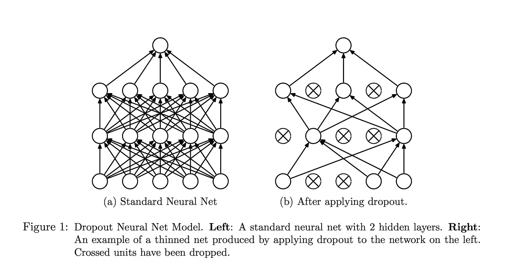
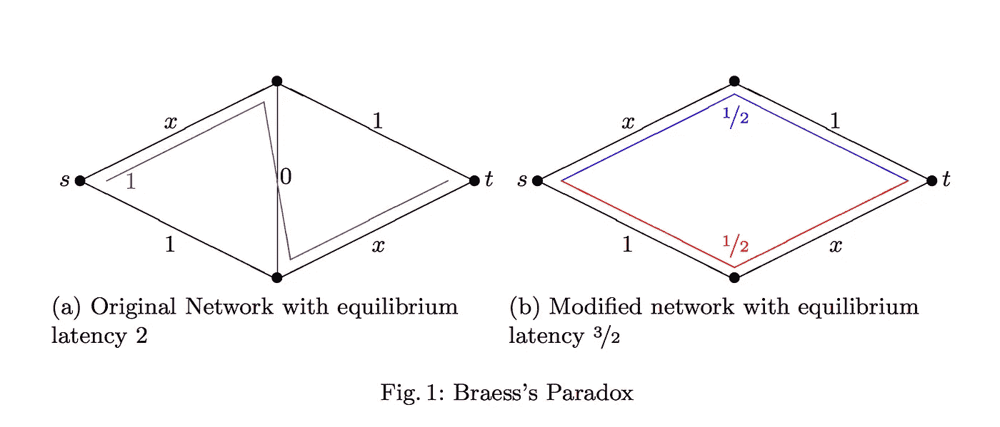

# Braess 悖论与神经网络中的辍学有关吗？

> 原文：<https://medium.com/hackernoon/is-the-braess-paradox-related-to-dropout-in-neural-nets-270ecb97cdeb>

有时我们会遇到一些奢侈的想法，但最终却没有结果。我花了最后一天的大部分时间试图确定神经网络中的辍学正则化技术，以从博弈论拥塞游戏中的 Braess 悖论中导出。对于我的学术机器学习生涯来说，不幸的是，这似乎不成立。

我将很快解释什么是辍学，什么是布雷斯悖论，为什么他们会有联系，我发现什么实验。

[Dropout](https://www.cs.toronto.edu/~hinton/absps/JMLRdropout.pdf) 是训练神经网络防止过拟合时的标准正则化技术。不是一次训练所有完全连接的层，而是以概率 p 对网络路径进行采样，训练在此过程中创建的子神经网络，然后稍后将它们组合到最终的神经网络中，在该网络上测试并执行实际预测。在研究论文和该技术的许多后来的使用中表明，它实际上提高了测试精度并防止了过拟合。

布拉斯悖论是拥挤博弈理论中的一个悖论。像其他现象一样，如[公地悲剧](http://science.sciencemag.org/content/162/3859/1243.full)和[囚徒困境](https://en.wikipedia.org/wiki/Prisoner%27s_dilemma)，它显示了在玩家以最大化他们的收益为目标的多人游戏中事情是如何出错的。然而，布雷斯悖论的奇怪之处在于，通过给交通网络增加更多的边，大概是“改善基础设施”，拥堵可能会增加 4/3。

在插图的例子中，我很感激地从文章[中摘录了这个例子](http://www.math.louisville.edu/~syoung/research/papers/BraessParadoxLNCS.pdf)，比如说标有 x 的边对于一个玩家来说构成了一个小时的延迟，但是如果两个玩家都使用它们的话就构成了一个小时的延迟。你可以看到，在右边的例子中，两个玩家使用不同颜色的路径，一个用红色，一个用蓝色，会达到平衡。不过，在左边的例子中，在移除对角连接边之前，实际上让两个玩家使用相同的路线，以 2 小时的延迟结束。这是均衡，没有玩家会切换到不同的路线。

布雷斯悖论已经被彻底研究过了，因为它可能具有现实生活中的含义。如果在公共高速公路系统中增加道路实际上会加剧交通拥堵，那么这又有什么用呢？建设新的基础设施不再是一个线性直接的资源分配问题，而是变得令人担忧。布莱斯悖论也可能出现在任何网络中——通信网络、数字货币汇率，甚至有一堆关于它的文章出现在[物理](https://arxiv.org/pdf/1312.1885.pdf)的中。

尤其是物理例子让我注意到这个问题

Braess 悖论会出现在神经网络中吗？

正如在物理学中，很难声称存在自私的代理人，他们的行为导致了非最优均衡的出现。结合这一点和神经网络中的事实:

*   标准的操作方式是分层排列神经元，而不是一个完整的网状网络
*   我们有前面提到的丢弃技术，其中移除网络边有助于优化
*   我们有 CNN 和其他结构，其中局部性和减少的连通性有助于优化

我突然灵光一现:啊哈！这两者一定有关系。

正如我之前所说的，并非所有的灵光一现都是生来平等的，这一次被证明是肤浅而非深刻的。谁知道呢，也许有人读这篇文章会找到缺失的一环。

为了验证这一假设，我编写了以下代码:

我基本上做的是建立一个 Braess 网络形状的小神经网络，通过玩不同的正则化，学习率，特别是**初始权重**，找到当对角线边缘被移除时网络优化得更好或更快的例子。虽然我确实找到了很多例子，但是在麻烦的来源是 Braess 悖论的情况下，预期的行为是对角线链接会将所有的重量吸引到它自己身上。因此，在某种程度上，当优化神经网络权重和偏差以适应数据时，延迟的模拟将会丢失，并且在正确(或者更确切地说不正确)的权重集的情况下，优化过程将忽略所有其他路径，除了涉及对角线路径的路径。

可悲的是，检查 100K 个不同的初始权重，我没有发现在神经网络优化结束时权重表现如此的例子。当缩减边网络比密集网络表现得更好时，对角线路径上的权重实际上非常低，比网络中的其他权重低一个或两个数量级。

仔细想想，神经网络并不真的容易受到布雷斯悖论的影响，这有两个主要原因:

*   边上的函数表现得不那么线性和美好。但这并不立即意味着布拉斯悖论不会出现，在更复杂的函数中也有布拉斯悖论的例子。
*   在反向传播中完成的神经网络的优化是一次完成的。所有的权重都是根据一个损失函数来更新的，该损失函数会向回传播，而不是自己传播到每条路径。虽然我不是物理专家，但我相信这甚至不同于布拉斯悖论的物理设置，在布拉斯悖论中，不同的弹簧、弦或电子的行为方式就像独立的代理优化他们自己的路径。如果神经网络是由某种贪婪算法优化的，那么布拉斯悖论可能会显式地出现。

无论如何，尝试和深入思考神经网络应该如何构建是很有趣的。

有关布拉斯悖论的更多信息，请访问:

[https://homepage.ruhr-uni-bochum.de/Dietrich.Braess/#eng](https://homepage.ruhr-uni-bochum.de/Dietrich.Braess/#eng)