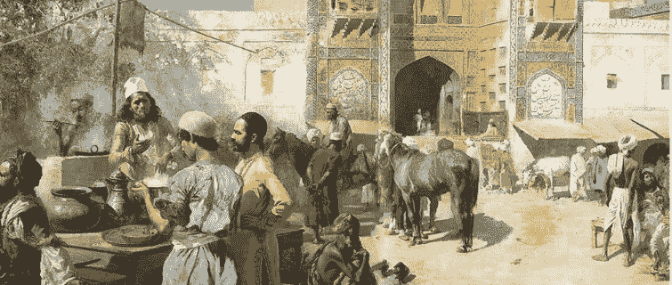
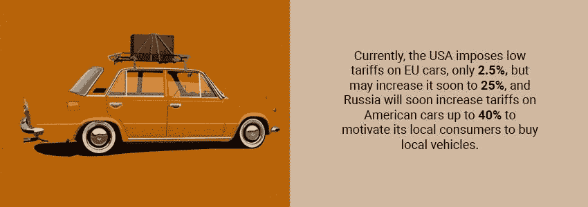
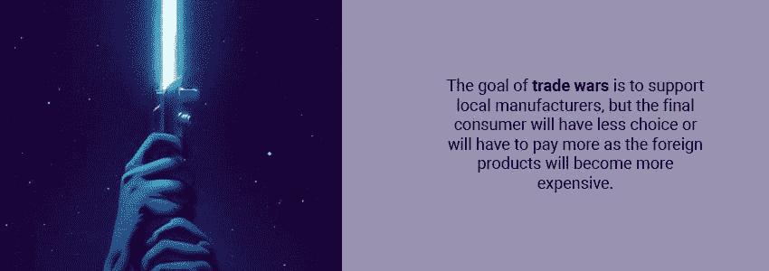

# 区块链驱动的经济可能实现自由市场吗？

> 原文：<https://medium.com/hackernoon/is-the-free-market-possible-with-a-blockchain-powered-economy-ae259cfd3eb9>

谁决定你应该为食物、汽油或药品支付多少钱？在当今世界，有各种各样的因素决定了产品的价格:关税、通货膨胀率、利率等等。政府基本上是通过从供应链上的每个供应商和制造商那里收取增值税来决定你的汽车的价格，从 1%到 27%不等，这取决于 T2 国家 T3。如果这辆车是从其他国家进口的，他们也会征收关税。目前，美国对欧盟汽车征收很低的 T4 关税，只有 2.5%，但可能很快会提高到 25%。俄罗斯将很快把美国汽车的关税提高到 40%,以激励当地消费者购买当地汽车。

这对你不好吗？

*   修建的壁垒越多，这个国家就变得越封闭。
*   每一项关税和税收都会加剧价格不平等。
*   与此同时，全球化使这些壁垒变得过时，因为征收更高的关税意味着你的国家将获得比以前更少的进口。我们可以从唐纳德·特朗普发起的贸易战中看到这种情况，他确信“贸易战是好的，容易赢。”
*   这些战争的目标是支持当地制造商，但最终消费者的选择将会减少，或者将不得不支付更多的费用，因为外国产品将变得更加昂贵。

当被问及消费者是否会面临贸易战的后果时，前美国贸易代表副助理马特·戈尔德回答说:“当然，你会看到更高的价格转嫁到消费者身上……几乎是立即的。”他继续说道，“因此，无论是走进沃尔玛的人还是制造商，都将支付更高的价格，为他们的制造流程购买进口材料。”

如果你想购买外国产品，根据关税不同，你要付更多的钱(多付 10-25%)。这就是 T2 保护主义的运作方式。如果你想买一种 [CBD 产品](https://hightimes.com/health/cannabidiol-cbd/)，而你住在美国，你必须支付每毫克 5 到 60 美分的[价格](https://www.leafly.com/news/industry/leafly-investigation-cbd-prices-confusing)。这是为什么呢？因为美国对这个市场有限制，刺激不平等并制造混乱。然而，我们正在缓慢地走向自由的全球市场，而区块链的技术可以帮助我们实现这一目标。

# 没有限制的市场

从一开始，区块链和密码市场就是开放自由市场的完美范例。自由市场的主要特征是不受政府的任何操纵或干预，自由市场的价格只受供求关系的调节。

英国前首相大卫·卡梅伦曾经说过:“我相信，开放市场和自由企业是改善人类财富和幸福的最强大的力量。它们是进步的引擎，产生企业和创新，使人们摆脱贫困，并给人们机会。我想更进一步:在它们运转正常的地方，开放市场和自由企业实际上可以促进道德。”

通过激励自由贸易，竞争就产生了。大家一视同仁，只有优质的产品才能在这里胜出。这就是为什么许多国家用高关税关闭边境——他们根本无法与做得更好或更便宜的更好的经济体竞争。但区块链和加密货币有助于避免这些限制。

自 2009 年[发布以来，比特币是第一种没有任何边界的自由交易资产。第一批 5000 辆 BTC 售价 5 美元。](https://en.bitcoin.it/wiki/Bitcoin_Firsts)

自那以后，它的价格攀升，因为正如我们已经知道的，当没有限制时，公开市场上的资产价格往往会变化，直到它达到供需平衡。同样的故事也适用于 BTC 之后出现的区块链项目的各种代用币和代币。加密市场资本随着采用而增长，人们知道的越多，他们就越想买。有人可能会称之为“[害怕错过](https://en.oxforddictionaries.com/definition/fomo)”，但我们更愿意说这是当下的需求。

当我们说“没有界限”时，它就是这个意思。如果你想在意大利买比特币，然后把一部分换成另一个 altcoin 卖给中国的人，再把一部分作为礼物送给朝鲜的朋友也可以。没有人能在自由市场上限制你。由于政府的规定，中国和朝鲜的人在获取他们的比特币时会有问题，但他们的钱会在区块链。这就是它如此伟大的原因。

维塔利克·布特林[解释了这个概念:“所有的参与者都是匿名的，这意味着在实践中你不能把人们的效用降到零以下。如果我有 70 个乙醚，我把 70 个乙醚放入一个机械装置中，你能对我做的最糟糕的事情就是你能拿走 70 个乙醚。](/conversations-with-tyler/vitalik-buterin-tyler-cowen-cryptocurrency-blockchain-tech-3a2b20c12c97)

你不能把我扔进监狱。你不能在社交上排斥我，这样我就不能再挣钱了，因为我可以随时变换身份。"

是不是意味着不会有什么规定？绝对不行！世界各地的政府都试图想出办法来解决这个问题。他们中的一些人刚刚禁止了所有的众筹项目和密码交易，像 2017 年 9 月的[中国](https://www.forbes.com/sites/kenrapoza/2017/09/28/china-ico-ban-bitcoin-crypto-currency-market-cap-returns/#2753c0c56c21)，密码市场随后损失了 50%的资本。一些人试图通过法律来规范它，像美国的 T7 和俄罗斯的 T9。

法律能规范自由市场和加密市场吗？著名的无政府主义者 Wendy McElroy 在她的文章中写道:“法律不应该成为一种情况的进入边缘，因为它是一种组织原则；这假定有一些事情要组织，它应该遵循正在进行的安排。但是，每隔一段时间，一个范例就会爆发并破坏这个范例。加密货币爆炸了。从那以后，法律一直在努力追赶。法律应该迎头赶上。”

此外，当写关于立法的话题时，她说:“人类社会习惯于政客和其他暴徒，他们让规则的讨论转移到以牺牲他人为代价使一些人受益。”

对，就是这样。政府通过制定法律来决定谁在市场上受益。在理想状态下，它应该由自由市场决定，主要是通过供求关系。相反，我们看到了救助，就像 2008 年对 T2 银行的救助，当时花费了 7000 亿美元来支持他们，或者 1979 年对 T4 克莱斯勒的救助，当时给了 15 亿美元来拯救公司。这个列表一直延续下去。

# 观点，观点

许多无政府主义者和自由主义者相信比特币。让我们看看他们的想法。

罗恩·保罗是自由市场的长期支持者，他认为比特币有一天可能会取代美元。这是他在 [2016](https://schiffgold.com/interviews/ron-paul-what-america-has-today-is-not-free-market-capitalism-video/) 中对美国经济的评价:“如果你把自由市场和资本主义放在一起说，我们没有那个。我们有干预主义。我们有计划经济。我们有一个福利国家。我们有通货膨胀主义。我们有中央银行的中央经济计划。我们相信赤字财政。它与自由市场资本主义相去甚远，人们给它贴上自由市场的标签是愚蠢的……”

以下是他关于比特币的声明:“会有替代美元的货币，这可能是其中之一。如果人们开始大规模使用比特币，它将作为美元的破坏者载入史册。”

康拉德·格拉夫(Konrad Graf)是一名经济学家，撰写自由市场和货币政策方面的文章。在他的文章《论比特币的起源:货币进化的阶段》中，他写道:“比特币是作为一种新方法的发明/发现被提出来的，这种新方法可以做一些非常古老的事情——将购买力的控制权从一方转移到另一方。这种方法免费提供给所有人。每个人都有完全的自由去忽略它或者以某种方式使用它，并且只限于每个人自愿参与的确切程度。”

美国经济研究所编辑主任杰弗里·塔克也支持比特币。他在他的[文章](https://bitcoinmagazine.com/articles/op-ed-there-future-banking-cryptocurrency-dominated-world/)中写道:“加密货币的出现给现状带来了巨大的挑战。新的世界将是金融健康、稳定、彻底去中介化、去中心化和民主化的，因为任何人，无论拥有何种金融手段和金融机构，都可以参与其中。”

当然，有很多人不支持比特币及其提供的机会。一些人甚至称之为“历史上最壮观的私人庞氏骗局”，[加里·诺斯](https://www.lewrockwell.com/2013/11/gary-north/is-bitcoin-a-ponzi-scheme/)说。但是，只要有一些自愿的参与者，自由市场就存在，并且随着[日交易量](https://coinmarketcap.com/currencies/volume/24-hour/)价值 140 亿美元，区块链行业显然不缺少新的进入者和新的想法。

# 更深入

让我们看看实施区块链如何帮助我们在现实世界中为产品建立更公平的价格。在本文的开始，我们谈到了 CBD。由于缺乏供应商和高客户需求，这个市场就像是狂野的西部。

你已经可以找到促进 CBD 自由市场的区块链解决方案。像[CBDoken](https://cbdoken.com/)——它通过引入基于以太坊的代币——代金券，让市场决定想要为 CBD 产品支付多少钱。每张代金券都有存储在公司仓库中的产品作为支持。它如何帮助设定市场价格？所有代币都以低于平均价格 80%的价格出售。所有代币都可以兑换成实际产品。买家可以购买更便宜的 CBD，零售商和转售商可以购买它，然后在其他地方出售，获得利润。取消中间商让购买者大大节省了成本——在打了 350%的折扣后，制造商仍然有利润，因为它跳过了分销链的很大一部分，直接到达消费者手中。无论如何，CBD 是一个快速增长的行业，CBDoken 有机会通过独特的分销模式来颠覆它。这就是自由市场的运作方式——你有所贡献，你有更好的提议，你就赢了。数百万人将能够直接购买它。如果你必须在花 20 美元和 100 美元购买同样质量的产品之间做出选择，你会选择什么？

我们可以想象一套公寓或一辆汽车以同样的方式被标记，然后在自由市场上出售。 [NEM](https://nem.io/) ，一个著名的区块链项目，旨在将真实世界的资产令牌化，正在扰乱整个市场。除了 CBDoken，以太坊也有一些项目提供实物资产支持的代币，如 [Digix Gold](https://coinsutra.com/digixdao-digixgold-dgd-dgx/) ，其代币相当于 1 克真金。让我们不要忘记稳定的硬币。 [Tether](https://tether.to/) ，一个发行美元支持的 USDT 代币的项目，以及它的竞争对手 [TrueUSD](https://www.trusttoken.com/trueusd/) ，拥有 256 万亿美元的审计资金，或者 [DAI](https://makerdao.com/) ，一种分散的抵押品支持的稳定加密货币，也与美元挂钩。这些都是自由市场的完美例子。你可以使用它们中的任何一个，它们是一样的，这是信任的问题:它们中的一些可能从你那里得到它，一些没有。应该是这样的。你选择什么更好。
前阵子，[优步](https://www.uber.com/)来到拼车市场，排挤传统出租车司机。有十年的斗争，旧的商业模式无法竞争，试图在政府的帮助下压制优步。但都是徒劳。这就是自由市场。

# 结论

主要的问题是，随着区块链的发展，自由市场是正在成为现实，还是只是一个自由主义的童话，非常令人愉快，但不适用于现实生活？正如我们所见，政府试图保护自己，尽可能控制一切。他们希望保持目前的现状，让事情保持目前的状态。但区块链技术、加密货币和新经济模式比旧系统更有效，颠覆了现有系统。等待政府方面的变化可能是无用的，但我们可以期待另一方，即分权的一方的变化。每个系统都试图平衡自己，在这样一个开放的全球世界里，抵制变化是不可能的。最终，我们会看到它发生。

## 关于作者:

基里尔·希洛夫——geek forge . io 和 Howtotoken.com 的创始人。采访全球 10，000 名顶尖专家，他们揭示了通往技术奇点的道路上最大的问题。加入我的**# 10k QA challenge:**[geek forge 公式](https://formula.geekforge.io/)。