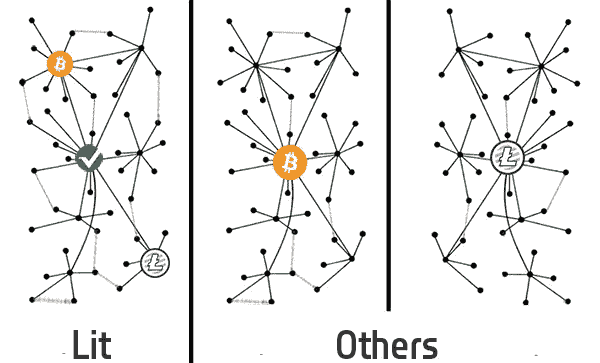
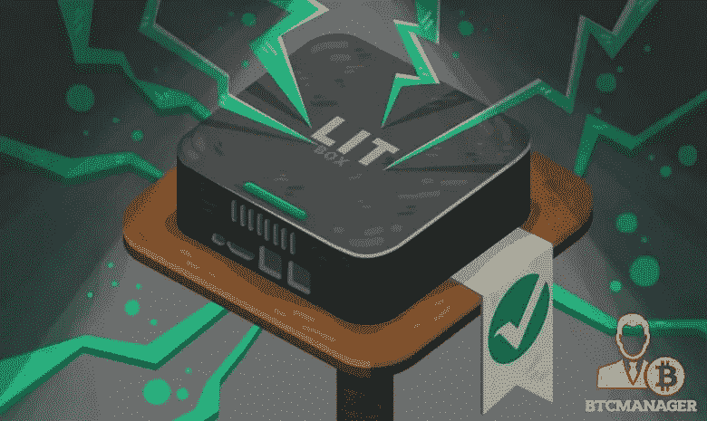

# 商人的梦想是海市蜃楼吗？

> 原文：<https://medium.com/hackernoon/is-the-merchants-dream-a-mirage-c44e5574815e>

## 自从加密货币出现以来，它就一直渴望成为商家的梦想货币。低费用、安全和快捷是保持这一梦想的条件。然而，他们没有达到预期。梦想现在终于变成现实了吗？

> 闪电会让梦想成真吗？

大约在 2017 年 12 月底，随着新用户的涌入，比特币作为全球货币的有限能力变得更加明显。交通拥挤和收费高是常见的问题。许多新用户因此对加密货币产生了负面体验，严重影响了加密货币市场的形象。在所有的[大块噪音](https://en.bitcoin.it/wiki/Block_size_limit_controversy)背后，各种各样的开发者已经为一个解决方案工作了很长时间。

[闪电网络白皮书](https://lightning.network/lightning-network-paper.pdf)由 Thaddeus Dryja 和 Joseph Poon 在 2016 年发布。这篇论文的发表是解决加密货币规模问题的第一大步。在共同开始之后，他们的工作向不同的方向发展。Lightning Network 现在知道 s [几个不同的实现](https://www.youtube.com/watch?v=6ZU_qbA1gyE)，所有这些都接近于提供一个可行的扩展解决方案。

尽管[闪电网络](https://en.wikipedia.org/wiki/Lightning_Network)似乎是加密货币规模化的唯一可行解决方案。有几个问题，它应该清楚地解决，以成为真正的商人的梦想。

*   商家只想卖他们的产品，而不是担心技术。
*   商家不希望被限制在可以接受哪些货币。
*   商人需要一种简单的方法来管理他们的收入。

# 点燃，闪电失败者

[点燃闪电网络](https://github.com/mit-dci/lit)是闪电网络的一个实现，它在某种程度上是背景。它由麻省理工学院 DCI 分校开发，并有一个支持比特币的工作实现。

当你仔细观察 Lit 时，很奇怪它在背景上出现了这么多。也许由于其纯粹的学术背景(而不是以利润为中心的选择)，它一直留在背景中，但在我看来，Lit 真的有潜力将最初的商人梦想带回来。像其他闪电网络实现一样，它提供近乎即时的支付和极低的费用。然而，Lit 通过提供**硬币不可知**支付从其他闪电网络实现中脱颖而出。

硬币不可知支付解决了商家的一个主要问题。这意味着，作为一个商家，你可以收到付款，而不必担心该人想用哪种货币支付给你(只要该硬币已实现 Lit)。没有利润激励，这可能导致较少的商业力量影响实施的发展方向。

Source: original lines thanks to the beloved BCH & Lightning fan “Jonald Fyookball”.

就像我说的，一枚硬币需要将自己添加到 Lit 中，以便能够成为硬币不可知支付系统的一部分。对于许多本地 Segwit 货币来说，这种实现可能非常简单(就像向 Lit 添加一个配置一样简单)，这意味着 Lit 可以帮助许多不同的货币进行伸缩。

投入大量时间实现 Lit 的加密货币之一是 [Vertcoin](https://vertcoin.org) 。他们目前正在开发第一个已知的闪电网络钱包，其中直接内置了多硬币支持，有可能允许所有本地 Segwit 加密货币的交易。

## 解决商家问题的想法

并非每个店主都有时间或意愿设置复杂的支付方式、担心安全性并配置销售点解决方案。老实说，这就是闪电网络目前的残酷现实。大多数商家只是想收到付款。

然而，闪电社区并没有坐以待毙。我们已经看到诸如 [Zap](http://zap.jackmallers.com/) 和酷炫[闪电网贴](https://store.blockstream.com/product-category/stickers/)等人性化的闪电钱包出现。许多商人似乎非常渴望接受闪电这种方式。但是我提到的其他障碍呢？有两个概念已经开始具体解决商家的一些问题；灯箱和灯箱解决方案。

**灯箱**

闪电网络提出了一个有趣的挑战。为了发送或接收交易，用户需要一直在线。这不太实际，让商人梦想仅此而已。

为了解决这个问题，用户和商家有两种选择。要么他们可以将资金控制权交给第三方；让他们替他们管理。这将给闪电网络带来一些信任问题、中介机构、更高的费用，以及最终与当前银行体系极其相似的东西。

或者，用户可以拥有一个类似于小型家用路由器的设备，来管理所有的闪电交易。这是让用户完全控制他们的资金的唯一选择。这种概念设备是由 Vertcoin deveoper & MIT DCI 研究员 [James Lovejoy](https://github.com/metalicjames) 在 2018 年初构想出来的，他将其命名为“Lit-Box”。

Source: BTCmanager.com

**销售点**

对于解决商户问题的 Lightning network，功能强大且易于使用的销售点(PoS)解决方案至关重要。Lit 销售点解决方案的工作取得了一些良好的进展，最近 Lit 承诺支持卡支付和名为 Lit-PoS 的想法。

Lit-PoS 应该是一种相当简单的设备，它伴随着商家的 Lit-Box，并允许通过 Lit 钱包进行快速扫描支付。这个想法是，这个系统将提供一个非常即插即用的解决方案，以接受闪电网络上的加密货币支付。

这些概念大多是公共领域，因为活跃的开发人员在各种场合表示，虽然有些人计划开发解决方案(如 Vertcoin)，但他们欢迎公司将这些概念转化为业务努力。

# 实现承诺

Lit 的方法展示了闪电网络如何将商家的梦想变成现实。我毫不怀疑，更多的开发者和企业将会跟进并改进当前的实现和愿景。随着更多的硬币加入 Lit 网络，该网络将变得更有弹性、更高效。越多的公司看到这些想法的价值，他们就越会专注于开发有趣的 PoS 硬件。最终，Lit 可以兑现比特币向商家做出的承诺，并帮助创建一个更可持续的加密货币生态系统。